# 干旱预报系统的数据

> 原文：<https://towardsdatascience.com/data-for-good-somalia-drought-management-e882355a98e0?source=collection_archive---------17----------------------->

## [变更数据](https://towardsdatascience.com/tagged/data-for-change)

## 应用数据科学和分析应对全球变暖引发的环境挑战。具有真实世界降雨数据的端到端项目

> **“数据为善是一场运动，在这场运动中，人们和组织超越边界，使用数据科学和人工智能来应对当今紧迫的挑战，以改善社会。”**

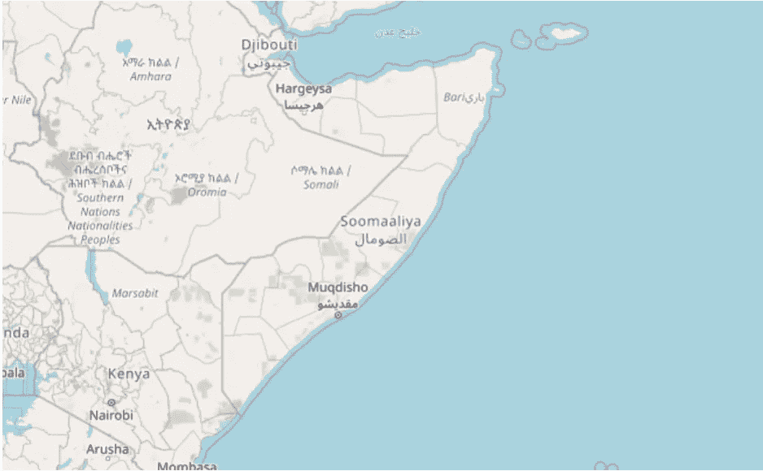

作者照片。

# 目录

1.  介绍性故事
2.  输入数据准备
3.  探索性数据分析
4.  特征工程
5.  型号选择
6.  政策建议
7.  参考

# 介绍性故事

花点时间想象以下场景。有一天，你被任命为索马里人道主义和灾害管理部的高级顾问，该政府机构负责处理全国范围的紧急情况。你被纯粹的快乐所感动，并且想要更新你的 LinkedIn 个人资料、Twitter 时间表和你的其他平台。即使你不知道你是怎么被选中的。

你注意到录取通知书附带了几十份令人印象深刻的文件。转眼间，当你阅读非政府组织的报告、评估和以前 PDF 简报中的咨询文件时，你意识到你正坐在职业地雷上。因为挑战不可能变得更难了。

尽管被宣布为失败的国家，索马里几十年来一直试图重新站立起来。内战高峰期出现的恐怖组织“青年党”正在发动持续的叛乱。迄今为止，它们几乎每周都在继续肆虐。此外，索马里面临着重要的体制和国家建设任务。健康的经济、政治气候和利益相关者之间的普遍信任水平都依赖于它们的充分解决。这些只是近年来这个饱受战争蹂躏的国家面临的众多挑战中的几个。根据您询问的对象和他们认为的优先事项，挑战列表可能会有所不同。

回到我们假设的例子，记住给你工作的部门希望你解决其中一个问题:即索马里的干旱问题。

我在这篇文章中的目标是帮助你找到这些解决方案，以便索马里的干旱情况在未来可以得到更好的处理。利用数据科学，我们将设计一个干旱预警系统。它意味着分析相关数据，形成建模方法，并根据收集的数据提出管理方案。

# 输入数据准备

那么，我们从哪里开始？像往常一样，谷歌来拯救我们。幸运的是，寻找索马里的降雨量数据并不难，尽管这并不令人愉快。在经历了一些挫折之后，我发现 http://www.tamsat.org.uk/的 TAMSAT [似乎是唯一一致的、容易获取的、免费的索马里降雨数据来源。它实际上为整个非洲提供了基于卫星的降雨量估计——可配置到每日粒度和 4 公里半径分辨率。在指定地理位置、所需的粒度和分析时间段后，您将收到一个下载链接，其中包含一个 CSV 或 NETCDF 文件。让我们在使用熊猫图书馆中读到它。](http://www.tamsat.org.uk/)

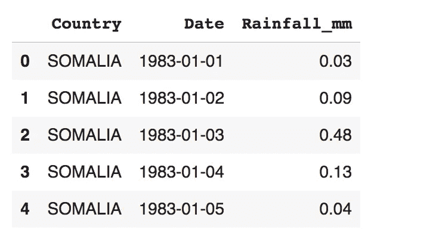

表 1:索马里 1983 年至 2021 年的 TAMSAT 每日粒度数据。作者照片。

观察粒度为每日，度量单位为毫米(缩写为 mm)。一毫米的降雨量相当于每平方米一升水。

我们端到端项目的下一步涉及编写一个数据处理函数。我们的目标是将每日数据向上采样(提升一个粒度级别)到每周一次，并生成一些可能有用的时间序列特征。“我们为什么要这么做？”你可能会想。在数据建模阶段，从我们的原始输入数据中提取这些特征迟早会派上用场。

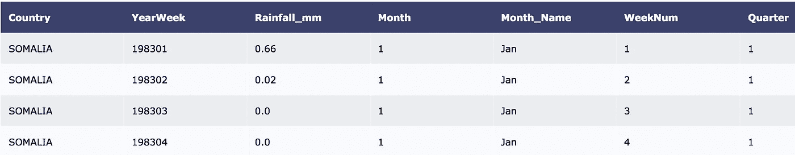

表 2:基本时间特征。作者照片。

# 探索性数据分析

必须记住的是，任何严肃的数据项目都是从探索性分析开始的。说实话，这是一个人跳到任何造型形式之前的踏脚石。在这方面，我们可以从备受尊敬的统计学先驱约翰·图基那里汲取深刻的智慧，他曾经创造了一个恰当的短语。作为他 1977 年的开创性著作《探索性数据分析》的一部分，他写道:“探索性数据分析永远不可能是故事的全部，但其他任何东西都不能作为基石。”这就是为什么我们首先只研究索马里的降雨量数据。

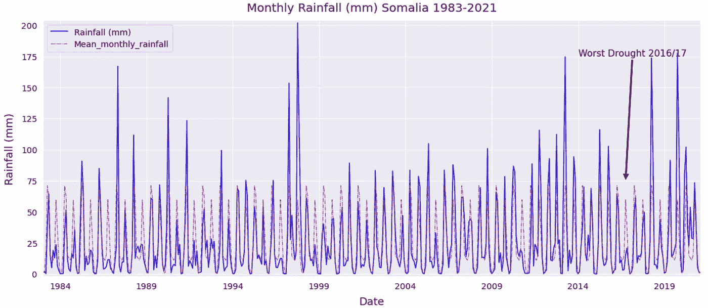

图 1:1983-2021 年月降雨量的时间序列可视化。作者照片。

当雨季没有到来时，我们就说发生了干旱。毫无疑问，这是一种以极度匮乏为特征的局面。从上面的时间序列图中可以看出，索马里一直是，而不是不由自主地，最受欢迎的目的地之一。事实上，从 1983 年开始一直到 2021 年的图表中可以明显看出，索马里遭受了频繁的干旱。

此外，为了给可视化技术提供更多的背景信息，值得一提的是蓝线——在零点和 200 毫米最大值之间摆动——代表索马里的月降雨量。而红色虚线表示为分析目的而生成的聚合度量。这是整个研究期间的平均月降雨量，纯粹是识别蓝线间隙的直观助手。参见下面的代码:

查看这段代码，您会发现两个值得注意的地方:1)我使用了 Pandas transform 将聚合数据与分类数据结合起来，2)我创建了一个名为“干旱”的新变量。让我解释一下我的理由。

任何分析索马里干旱问题的人都会面临的第一个问题是:“在索马里的气候和地理背景下，什么是真正的干旱？”根据科彭气候分类，索马里分为两类。第一种是沙漠气候，第二种是温暖的半干旱气候。总共有四个季节，其中两个通常是雨季。

如果不是气候变化带来了更频繁的极端天气状况和干旱，索马里将定期享受 4 月至 6 月的 Gu(春季)雨季和 10 月至 12 月的 Deyr(秋季)雨季。

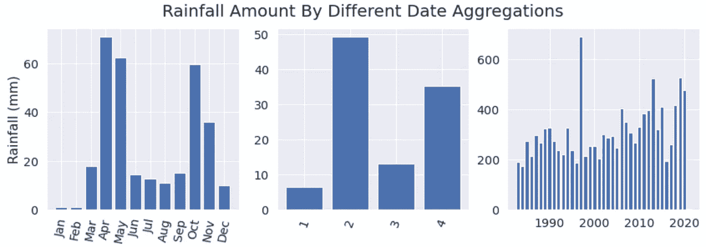

图 2:按月份、季度和年份划分的平均/累计降雨量的水平条形图。作者照片。

如上图所示，我们可以清楚地看到这些图案。平均而言，4 月/5 月和 10 月/11 月的降雨量比一年中的其他时间要多得多。但这并不是人们可以推断的全部。特别令人吃惊的是第三个也是最后一个条形图中的 1997 年，这是整个 38 年期间的最高峰。它的特点是降雨量超过 600 毫米。

在丰年，索马里通常会有 400-600 毫米的降雨量。然而，这似乎已经成为一种相当罕见的现象:38 年中只有 7 年拥有这样的数量！另一个引人注目的现象是 2017 年的下降，这是索马里历史上最糟糕的一年，最终导致人道主义危机和饥荒。幸运的是，它获得了足够的国际关注和救济资金，防止了急性营养不良升级为大范围的饥饿和死亡。

考虑到长时间的雨水不足会造成如此多的困难，人们不禁要问各国能对此做些什么。这就是为什么我创造了布尔变量“干旱”,以建立一个预测干旱发生的模型。我使用的逻辑非常简单，从最后一段代码中可以明显看出。

我首先生成了一个名为“Rain_Season”的中间列，当日期列显示为四月、五月、六月或十月、十一月、十二月时，根据正常情况下应该发生的两个雨季，该列的值为 1。然后，每次降雨量低于平均水平且“Rain_Season”为 1 时，“干旱”列将为 1，这是干旱发生的布尔代码。虽然这听起来很有道理，但我想承认，如果我的决定是由气象专家提供的话，那会好得多，因为他们确切知道阈值应该是多少毫米的降雨量。理想情况下位于地区级别。

但无论如何，现在让我们转向探索性分析的另一个重要角度。回答我提出的关于国家可以做什么的问题，我们最好使用统计学的概念。其中一个概念是自相关:过去的模式如何解释现在的现实。为此，我们从统计 Python 库 Statsmodels 导入了两个方便的函数。

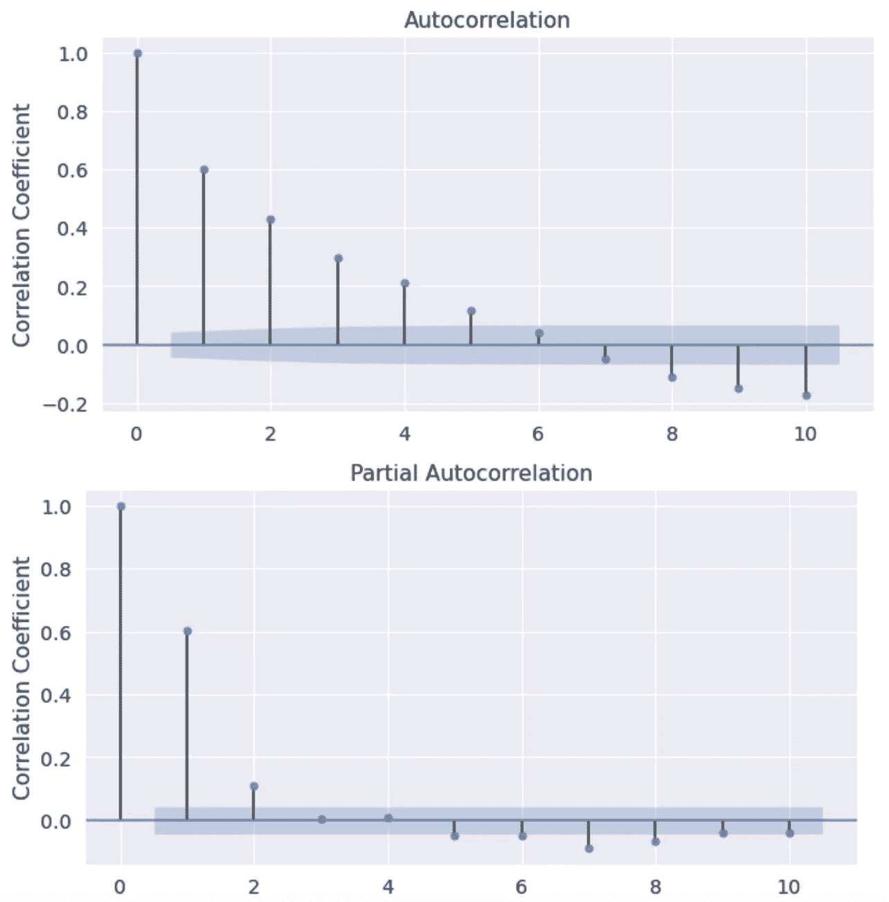

图 3:自相关图。作者照片。

直观地观察索马里每周降雨量的自相关函数是有用的，因为它使我们能够理解过去和现在是如何交织在一起的。在这种情况下，它的形状以一条反指数曲线为特征，这意味着降雨量的未来值与其过去值适度相关，而相关性的强度随着我们考虑的滞后次数而降低。

然而，检查偏自相关函数，我们只看到降雨量与第一和第二滞后有很强的相关性。对于那些不熟悉时间序列计量经济学概念的人来说，这只是意味着过去的趋势在很大程度上解释了目前观察到的现实。这也意味着未来的降雨量取决于现在的降雨量。

# 特征工程

现在进入端到端项目的下一阶段，我们将把精力转向特性工程的主题。尽管有时被淡化为一项高强度低产出的活动，但对这一极其关键的步骤的普遍定义是:“从原始输入数据中准备、转换和提取有用的信息。”事实上，我们应该清楚地记得，这个领域的一位圣人曾经用语言描述了下面的话，强烈地强调了特征工程的重要性。

> 你使用的特性比其他任何东西都更能影响结果。据我所知，没有任何算法可以单独补充正确的特征工程所提供的信息增益。
> 
> —卢卡·马萨隆

所以，让我们按照这个聪明的金玉良言行动吧。基于我们从自相关分析中获得的过去解释未来的知识，现在让我们提取一些额外的时间序列特征。我决定提取的降雨滞后值代表前几周的降雨量，存储在每个时间点 t 的单独列中。这肯定会提高我们在后期建模阶段的干旱预测准确性。

我们的决赛表如下所示:

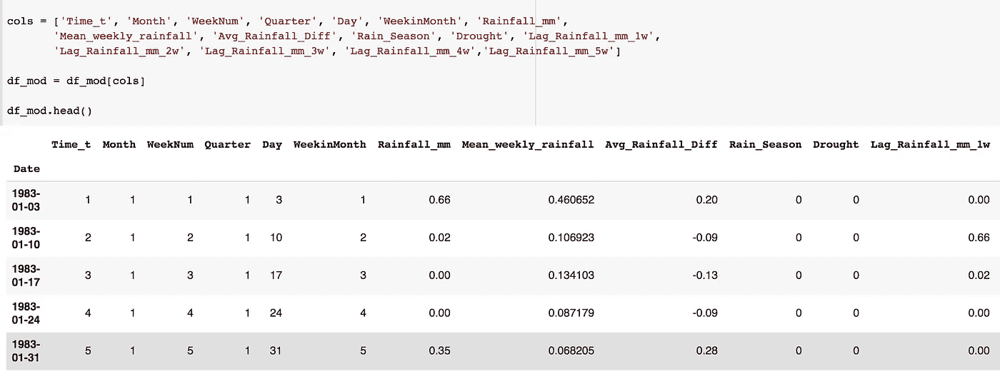

表 3:高级时间序列特性。作者照片。

明眼人无疑会注意到，我们的数据表看起来与我们开始时的原始数据有些不同。不过请放心，我没有诉诸一些非法的黑魔法，现在会给我想要的结果(许多数据怀疑论者会对你提出指控)。

我刚刚将原始的时间序列数据转换成一种适合监督机器学习的形式。换句话说，假设一个时间序列只不过是一系列具有时间维度的数据点，那么算法预测所需要确保的就是我们有一个时间变量来捕捉这个序列的节奏。

在我们的例子中，它是每周节奏，因此在日期时间索引的背景下，查看变量“Time_t”就足以让我们知道我们仍然在查看相同的每周时间序列数据。然而，在这个阶段，我们在数字和布尔变量的组合中捕获了更多的细节。“这对干旱紧急预测有什么帮助？”你可能在想。看看下面的特性重要性图会让事情变得更清楚。

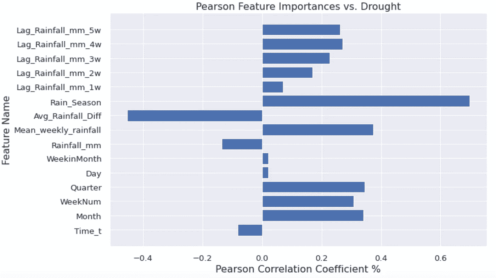

图 4:皮尔逊特征重要度图。作者照片。

为了指出从情节中可以推断出什么，我们可以宣布几件毫不奇怪的事情。首先，春季或秋季的季节性，正如人们明显预料的那样，与干旱的发生或不发生高度相关。因此，当布尔雨季变量等于 1 时，我们很有可能观测不到降雨。这是因为索马里最近的天气历史倾向于突出干旱。其次，当在一个正常的雨季中观察到的平均降雨量(之前的红色虚线)低于实际记录的量(即，“Avg _ rain _ Diff”为正)时，我们很可能会遇到相反的情况:降雨！这就是为什么那个变量有接近 50%的负相关系数。相当直观。

由此得出的结论是，这些特征与我们想要预测的目标在令人满意的程度上相关。这里还有一件重要的事情。看看我们的滞后自相关特征。根据他们的说法，干旱迫在眉睫的最有指示性的迹象是雨季开始后 4 周过去了，还没有降雨记录。虽然有趣的是，我们注意到，4 周的滞后是与干旱最密切相关的，但我们必须记住，这种相关性并不意味着因果关系。

除此之外，不仅要检查特征和目标之间的相关性，还要检查特征本身之间的相关性，这是一个很好的实践。因为在有些情况下，变量之间强烈的负相关或正相关会妨碍模型的预测能力。在下面的图表中，让我们尝试确定我们是否受到这种现象的影响，这种现象在统计学领域被称为多重共线性。任何高于 80%的皮尔逊相关都是有问题的。

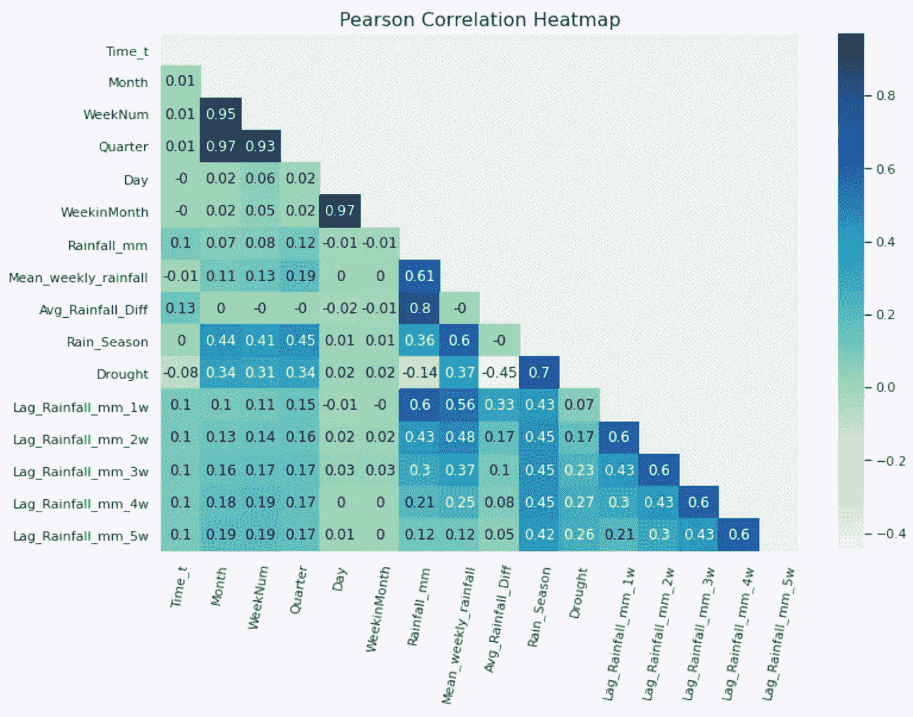

图 5:皮尔逊相关热图。作者照片。

与之前的垂直条形图不同，这张图有点难以阅读。但幸运的是，我们有颜色编码，这使我们能够很容易地发现强烈相关的特征。与第一列相邻，左上角的象限看起来很可疑。在那里，我们可以识别出表现出强相互相关性的变量对。它们是“Weeknum”、“Quarter”和“Month”。

从我们的输入数据中删除其中两个不会损害我们预测干旱的能力，因为它们的信息增益相当微不足道，因为它们包含相同的季节性信息。这就好像你在同一层级的会议中有两个人，他们拥有相同数量的信息。其中一个在会议中并不真正需要，因为另一个足以报告他们所拥有的信息。

# 型号选择

在最终开始我们预测干旱和选择数据科学模型的最初目标之前，我们必须将数据分成训练集和测试集。请记住，我们还必须删除我们在上一步中确定的冗余功能。从截图中可以看出，我选择了 2015-21 年的动荡期作为测试集，以确定该模型是否能准确预测关键时间段。在测试集中，干旱的发生稍微少一些，纯粹是因为时间范围比训练时间周期短得多。

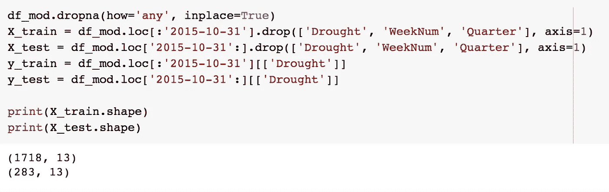

作者照片。

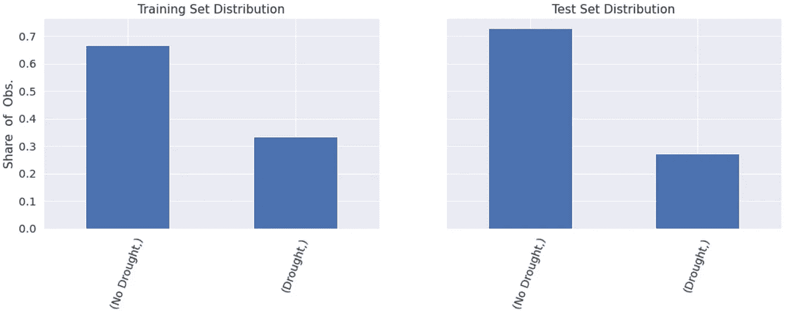

图 6:训练与测试分布图。作者照片。

# 逻辑回归

鉴于我们的探索性分析揭示了特征-目标关系中的强线性，采用逻辑回归方法来预测索马里的干旱是明智的。下面的代码片段和结果说明了一个简单的逻辑模型足以让我们获得好的结果。

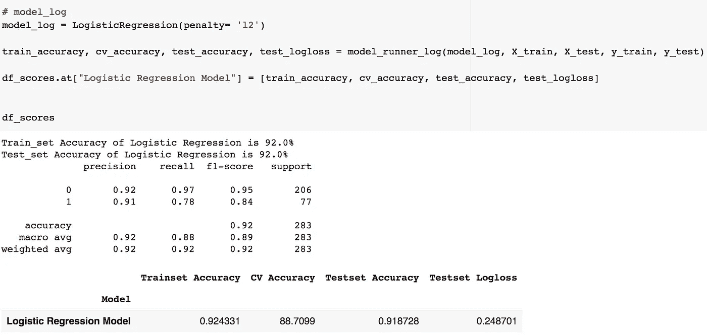

作者照片。

从各方面考虑，结果看起来很有希望。我们在测试集上取得了 92%的预测准确率。这意味着历史降雨量数据足以让任何国家设计一个基于数据科学的干旱管理系统。此外，想象一下我们有更详细、更可靠的地理信息数据，如经度、纬度、降雨区等。我知道我提到过 TAMSAT 有非洲的数据，但是我发现索马里的数据在地理信息方面并不可靠。有些坐标实际上位于邻国肯尼亚和埃塞俄比亚。

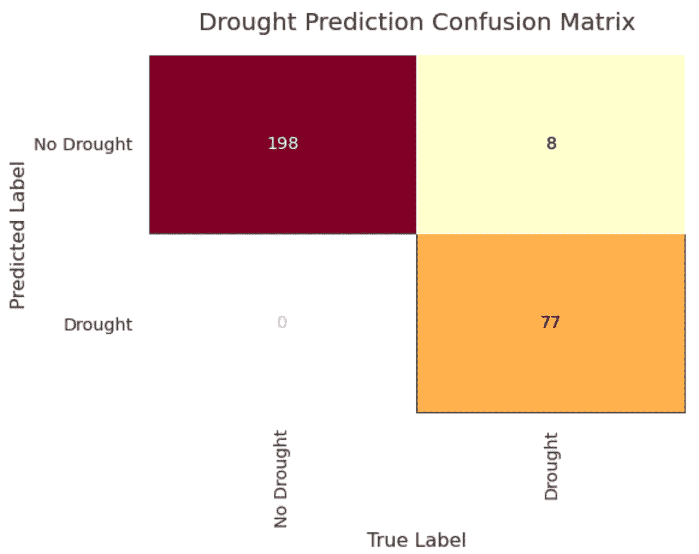

图 7:混淆矩阵图。作者照片。

但是，等等，准确性应该是唯一要报告的性能指标吗？不，实际上，你应该始终怀疑那些只交流准确性的数据科学家，尤其是当目标变量不平衡时(一个类别远远超过另一个类别)。对于这个特殊的用例，逻辑回归模型实际上犯了一些严重的错误:假阴性。看右上象限，你可以看到有 8 个实例，大约测试集中 3%的数据点，模型预测没有干旱，即使那些周是干旱的。一般来说，假阴性在许多应用中是相当危险的，例如新冠肺炎预测。相当于宣布一个病人没有病毒，而实际上他们是病毒携带者。不管是哪种情况，我认为我们已经尽了最大的努力来处理现有的数据。

# 政策建议

技术世界的当前趋势一次又一次地证明了一件事。他们证明了数据具有改变的力量。因此，无论是发达国家还是发展中国家的政府，都必须善用数据。不过，提醒一句。为了不使这篇文章比现在更长，我将简明扼要地总结这些政策建议。

*   a)索马里需要建立一个拥有最新设备的气象研究所，以观察干旱周期等天气现象。这将丰富全球组织基于卫星的数据，并使数据驱动的干旱预测任务变得容易得多。最终，这样的努力将最终形成一个干旱管理系统，当某些地区处于人道主义灾难的边缘时，该系统将发出黄色或红色警报。
*   b)索马里需要利用其强大的口头传统和人民的集体记忆来记录干旱的历史、地点、生命和牲畜损失方面的影响及其持续时间。通过根据频率、严重程度和持续时间将干旱分为不同级别来提升数据质量是非常重要的。
*   c)索马里必须尽一切可能解决极端天气状况的原因。非法木炭生产、过度放牧、商业卡特尔不负责任的用水，所有这些发展都需要受到抑制。事实上，除非目前的森林砍伐速度被遏制，否则情况不会很快好转——即使有数据科学的能力。
*   d)索马里应该与国际水技术专家合作，这些专家目前在开发雨水收集和保护系统方面处于世界领先地位。落下的少量雨水往往会在山洪暴发和无人看管的乡村景观中消失。在与饥荒的斗争中，可以做更多的事情来利用这一点。

非常感谢阅读。

# 参考

1.  如何在 Python 中将一个时间序列转化为一个监督学习问题？[https://machine learning mastery . com/convert-time-series-supervised-learning-problem-python/](https://machinelearningmastery.com/convert-time-series-supervised-learning-problem-python/)
2.  数据为善:一场新的社会运动[https://www . apexofinnovation . com/data-for-Good-A-New-Social-Movement/](https://www.apexofinnovation.com/data-for-good-a-new-social-movement/)
3.  罗伯特李哈登 2007 年索马里地质。
4.  以色列水务专家帮助世界的 10 种方式[https://www . Israel 21 c . org/10-ways-Israel-water-expertise-is-help-the-world/](https://www.israel21c.org/10-ways-israels-water-expertise-is-helping-the-world/)
5.  机器学习的特征工程基础技术[https://towards data science . com/Feature-Engineering-for-Machine-Learning-3a5e 293 a 5114](/feature-engineering-for-machine-learning-3a5e293a5114)
6.  快速实时审查 2018 年索马里干旱反应，马克·杜布瓦、保罗·哈维和格林·泰勒。
7.  使用卫星图像时间序列对陆地生态系统的近实时干扰探测:2011 年索马里的干旱探测。
8.  基于 SPEI 的《2020 年索马里干旱的时空评估》, Sylus Kipnegeno，Justine Muhoro Nyaga，Abdi Zeila Dubow。
9.  约翰·图基探索性数据分析，1977 年。