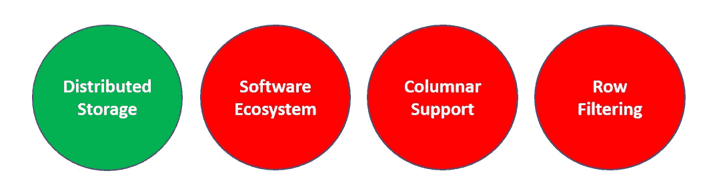
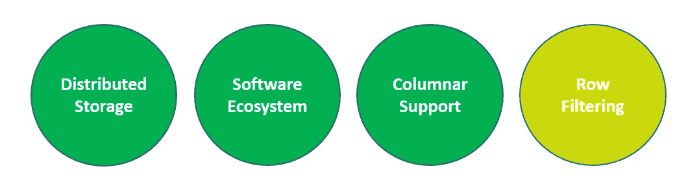
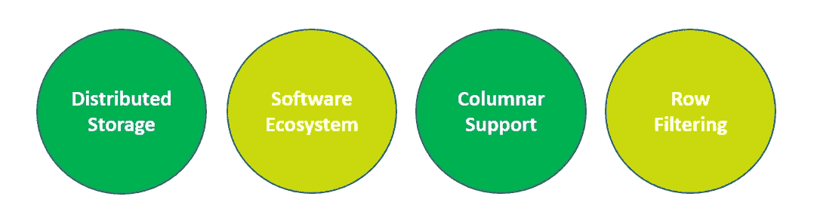
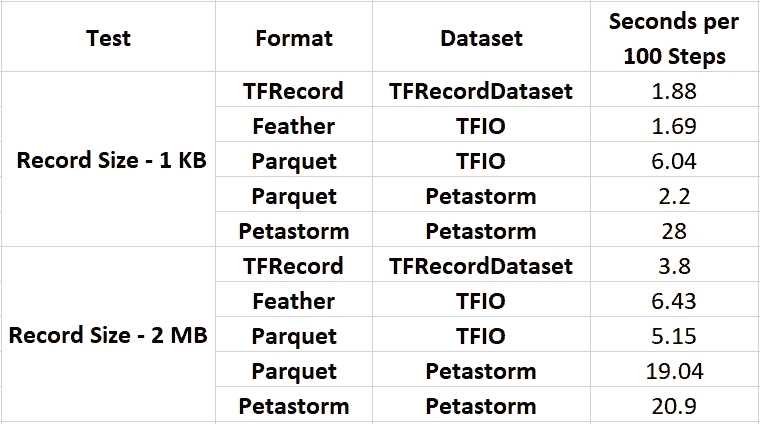
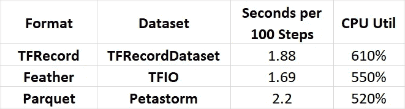

# TensorFlow 中用于训练的数据格式:拼花地板、Petastorm、羽毛等

> 原文：<https://towardsdatascience.com/data-formats-for-training-in-tensorflow-parquet-petastorm-feather-and-more-e55179eeeb72?source=collection_archive---------11----------------------->

## [理解大数据](https://towardsdatascience.com/tagged/making-sense-of-big-data)

## 通过统一不同类型的机器学习工作负载的文件格式来简化数据管理


由[马克西姆·舒托夫](https://unsplash.com/@maksimshutov?utm_source=medium&utm_medium=referral)在 [Unsplash](https://unsplash.com?utm_source=medium&utm_medium=referral) 上拍摄

机器学习是关于数据的。为了成功训练一个复杂的模型，你需要一个*高质量的*训练数据集；一个足够大、标注准确并正确表示现实世界中数据样本分布的数据集。然而，适当的数据管理同样重要。通过*数据管理*，我们指的是数据存储的方式和位置、数据访问的方式以及数据在开发生命周期中经历的转换。这篇文章的重点是用于存储训练数据的*文件格式*以及它对模型训练的影响。在定义机器学习项目时，选择文件格式是您需要做出的许多重要决定之一。

这个职位由四个部分组成。在第一部分中，我们将确定一些我们希望文件格式具有的属性。在第二部分中，我们将回顾潜在的文件格式，并根据我们发现的所需属性对它们进行评估。接下来，我们将调查将这些格式流式传输到 TensorFlow 培训课程的不同选项。在最后一节中，我们将描述我们运行的一些实验，以测试其中的一些选项。

在我们开始之前，让我们先做好准备。在本帖中，我们将假设我们的训练数据集的大小需要将其存储在分布式存储系统中，例如数百 TB。在下面的例子中，我们将使用亚马逊 S3 进行数据存储，但是原则同样适用于任何其他分布式存储系统。在开发周期中，数据可能会被几个消费者访问，用于各种目的，包括数据创建、数据分析、模型训练等等。我们的重点将是 TensorFlow 中的培训，尽管我们要说的大部分内容也适用于其他培训框架。

这篇文章的基本假设是我们的数据需要一种文件格式，即我们需要一个或多个文件用于:1。将单个数据样本的所有元素/列/特征组合在一起，以及 2。将多个数据样本分组在一起。当然，人们可以设想这样的场景，其中人们可以选择将所有样本的所有元素保存在单独的文件中，并以它们的原始格式保存。然而，在许多情况下，特别是如果文件很小(例如几千字节)，这种策略可能会严重降低数据访问的运行时性能。

这篇文章的目的是强调选择文件格式时一些重要的考虑因素，并讨论一些目前可用的不同选项。我们将提到许多格式以及许多软件开发框架和工具。这些提及应该*而不是*被解释为认可。适合您的选择可能基于广泛的考虑，其中一些可能超出了本讨论的范围。这篇文章将包括一些简单的代码片段。这些仅用于演示目的，不应视为最佳实施。

机器学习工具的前景是极其动态的。我们将提到的一些格式和工具将继续发展，我们将做出的一些评论可能在您阅读本文时已经过时。注意跟踪新版本和新工具的发布，并确保根据最新的可用信息做出设计决策。

请不要犹豫，与我联系，提出任何意见或纠正。

# 文件格式的期望属性

为了便于讨论，让我们来看看 TensorFlow 中用于培训的一种常见文件格式，即 *TFRecord* 格式。

## TFRecord 格式

[*TFRecord*](https://www.tensorflow.org/tutorials/load_data/tfrecord) 是一种基于[协议缓冲区](https://developers.google.com/protocol-buffers/)的格式，专门设计用于 TensorFlow。一个 *TFRecord* 文件由序列化的二进制样本序列组成。每个样本代表一个 [tf.train.Example](https://www.tensorflow.org/api_docs/python/tf/train/Example?version=nightly) ，它又代表一个字符串到值映射的字典。 *TFRecord* 格式的顺序特性有助于提高数据流吞吐量。特别是，不需要下载并打开一个完整的文件来开始遍历其内容。此外， [TensorFlow tf.data](https://www.tensorflow.org/guide/data#consuming_tfrecord_data) 模块包括高度优化的 [TFRecordDataset](https://www.tensorflow.org/api_docs/python/tf/data/TFRecordDataset) 类，用于基于 *TFRecord* 文件中存储的数据构建输入管道。然而， *TFRecord* 格式并非没有缺点。这里我们列举几个:

**单一目的**:TF record*格式不太可能满足开发管道上任何其他数据消费者的需求。开发团队通常以不同的格式维护他们的数据，并专门为培训目的以 *TFRecord* 格式创建数据的派生。存储数据的多个副本并不理想，尤其是当数据集很大时。除了数据存储的额外成本，这意味着每次核心数据集发生变化时，都需要生成一个新的 *TFRecord* 副本。我们可能希望根据培训课程的发现更新核心数据记录，在这种情况下，我们还需要维护生成的 *TFRecord* 记录与核心数据格式中相应条目之间的映射。*

**提取部分记录数据**:当我们的训练模型只需要 *TFRecord* 元素的子集时， *TFRecord* 格式出现了另一个问题。例如，假设我们有一个多头模型，它对输入图像执行不同类型的像素级分割。数据集中的每个记录包含对应于模型的多个头部的多个地面实况图像。现在我们决定训练一个只有一个头部的模型。简单的解决方案是输入完整的 *TFRecord* ，忽略不必要的字段。然而，提取和解析无关数据的需求会严重影响我们输入管道的吞吐量，从而影响我们训练的速度。为了降低管道中的瓶颈风险，我们需要创建一个额外的数据副本，其中只包含与当前特定培训相关的内容。这进一步加剧了我们上面讨论的数据重复问题。

**记录过滤**:有时我们对遍历具有特定条目值的记录感兴趣。简单的方法是遍历所有数据，简单地删除任何不匹配我们的过滤器的记录(例如，使用 [tf.filter](https://www.tensorflow.org/api_docs/python/tf/data/Dataset?version=nightly#filter) )。和以前一样，这会给数据输入管道带来相当大的开销，并导致训练循环严重不足。在之前的帖子中(这里是[这里是](https://medium.com/@julsimon/making-amazon-sagemaker-and-tensorflow-work-for-you-893365184233)和[这里是](https://medium.com/@julsimon/deep-dive-on-tensorflow-training-with-amazon-sagemaker-and-amazon-s3-12038828075c)，我们展示了根据输入图像是否包含粉色汽车来过滤输入图像的需求。我们提出的解决方案是将不同的数据类存储在不同的文件中。每当需要过滤时，我们可以只遍历与过滤器相关的文件。然而，这个解决方案要求我们能够预测我们将需要应用的过滤器，这并不总是可能的。如果我们需要应用一个我们没有预料到的过滤器，我们可以用一个额外的分区重新创建数据，或者使用丢弃不匹配样本的简单方法。这两个选项都不是最优的。

**数据转换**:典型的输入数据管道可能包括对输入数据的多种操作，包括数据扭曲、扩充、批处理等等。TensorFlow 提供了一组内置的数据处理操作，可以通过 [tf.data.Dataset.map](https://www.tensorflow.org/api_docs/python/tf/data/Dataset#map) 函数添加到输入数据管道计算图中。但是，您可能会发现，使用 TensorFlow 无法高效地实现所需的数据处理。一种选择是使用 [tf.py_function](https://www.tensorflow.org/api_docs/python/tf/py_function) 应用原生 python 代码块，但是由于 [Python 全局解释器锁](https://wiki.python.org/moin/GlobalInterpreterLock) (GIL)，这可能会限制您的数据吞吐量性能。许多用例要求在进入张量流计算图之前，使用一种能够在原生 python 中应用操作的格式。

## 格式要求

基于上面的讨论，让我们在我们的文件格式中编译一些我们正在寻找的属性的列表。考虑到存储我们数据的多个副本会增加成本和复杂性，我们将从现在开始限制自己只存储一个数据副本，也就是说，我们必须选择一种能够满足所有数据消费者需求的格式。该列表并不打算包含所有内容。应考虑基于特定用例的附加要求。

*   **分布式存储**:文件格式和支持库必须支持在分布式存储设置中存储大型数据集的选项，如亚马逊 S3、HDFS 等。
*   **软件生态系统**:我们需要一个强大的图书馆生态系统，为分析和操作数据提供一系列工具。
*   **列支持**:文件格式和支持库必须支持有效提取每个数据样本的特征子集。
*   **行过滤**:文件格式和支持库应支持对样本特征值的高效过滤。
*   **TensorFlow 集成**:格式必须有助于数据从存储器高效地流入 TensorFlow 培训课程。

我们在讨论中忽略的一个培训需求是**数据洗牌**。通常的做法是在每次遍历(历元)之前混洗训练数据。如果我们能够随机访问数据集中的任何样本，数据重组就很容易了。然而，这种对单个样本的随机访问是以牺牲性能为代价的，尤其是在分布式存储环境中。取而代之的是，人们必须求助于用于混洗的其他机制，包括以下各项的组合:在数据创建期间混洗样本、在构成完整数据集的文件列表上混洗、在多个数据集之间进行[交错](https://www.tensorflow.org/api_docs/python/tf/data/Dataset#interleave)，以及在训练期间使用适当大的混洗缓冲区(例如，参见 [tf.data.Dataset.shuffle](https://www.tensorflow.org/api_docs/python/tf/data/Dataset#shuffle) )。我们选择不将混排作为文件格式的要求，因为在我们看来，在我们提出的培训场景中，这一挑战将存在于任何文件格式选择中。

在下一节中，我们将评估几种用于培训的文件格式的兼容性。在下一节中，我们将讨论将它们流式传输到 TensorFlow 的选项。

# 文件格式调查:镶木地板、花瓣和羽毛

对深度学习的数据格式的全面调查超出了本文的范围。我们将把讨论限制在几个强有力的候选人身上。更广泛的调查比比皆是。这里有一个例子:

</guide-to-file-formats-for-machine-learning-columnar-training-inferencing-and-the-feature-store-2e0c3d18d4f9>  

您还可以查看我最近的一篇帖子，它涵盖了相对较新的*[*web dataset*](https://github.com/tmbdev/webdataset)*格式，这是一个有趣的解决方案，专门面向希望尽可能以最原始的形式维护数据的开发人员。**

**我们将根据我们在上面选择的指标来衡量每种格式，如下图所示，其中总结了我们对 *TFRecord* 格式的评估。我们用绿色表示完全支持，黄色表示部分支持，红色表示不支持。**

****

**TFRecord 评估**

## **阿帕奇拼花地板**

**更引人注目的文件格式选项之一是 [*Apache Parquet*](http://parquet.apache.org/) 。 *Apache Parquet* 有一个广泛的软件生态系统，它有多个框架和工具支持各种各样的数据处理操作。它在数据分析师中尤其受欢迎。将我们的培训建立在相同的形式上的可能性是很有吸引力的。**

***Parquet* 格式的成功主要归功于它是一种[列存储](http://en.wikipedia.org/wiki/Column-oriented_DBMS)格式。与 CSV 或 *TFRecord* 等其他格式相反，在列数据格式*中，数据的列*被存储在一起。数据集中的每个文件都被划分为行块，每个行块包含多个样本。在行块内，样本数据根据列存储，即所有样本的第一字段的值首先出现，然后是所有样本的第二字段的值，依此类推。格式的列性质有助于高效的数据分析，因为可以在列的子集上进行查询，而不需要加载整个数据记录。此外，将列组合在一起可以更有效地压缩数据，从而降低存储成本。查看[这篇文章](/understanding-apache-parquet-7197ba6462a9)了解更多关于列数据存储的优势。**

**下图总结了我们对拼花地板的评估:**

****

**拼花地板评估**

**作为一种列格式， *Parquet* 能够有效地提取数据列的子集。此外，我们还可以利用格式的分栏特性，通过以下方式促进行过滤:1 .首先提取我们正在过滤的列，然后 2。仅对匹配过滤器的行提取其余的列。然而，由于有效的数据提取可能依赖于提取完整行块的列数据，因此不清楚这种方法是否能很好地执行。因此我们用黄色标记了这个能力。更高效的过滤方法可能需要在数据集创建期间根据类别将样本分离到不同的 *Parquet* 文件中，如上所述。在 [pyspark](https://spark.apache.org/docs/latest/api/python/) 中，这可以使用 [partitionBy](https://spark.apache.org/docs/2.4.0/api/python/pyspark.html?highlight=partitionby#pyspark.RDD.partitionBy) 功能来完成。**

****Parquet 数据集创建**:在下面的代码块中，我们演示了使用 [pyspark](https://spark.apache.org/docs/latest/api/python/) 库从流行的 [Cifar10](https://www.cs.toronto.edu/~kriz/cifar.html) 数据集创建一个 *Parquet* 数据集。其他库也支持拼花地板的创建，包括熊猫和 pyarrow。**

```
**from tensorflow.keras import datasets
from pyspark.sql import SparkSession, Row
from pyspark.sql.types import StructType, \
        StructField, IntegerType, BinaryTypedef cifar_to_parquet():
    schema = StructType(
                [StructField("image", BinaryType(), True),
                 StructField("label", IntegerType(), True)])
    (data, labels), _ = datasets.cifar10.load_data()
    labels = labels.flatten().tolist()
    num_procs = 4 *# set the number of parallel processes* spark = SparkSession.builder\
        .master('local[{num_procs}]'.format(num_procs=num_procs))\
        .getOrCreate()
    sc = spark.sparkContext num_samples = len(labels)
    output_url = 'file:///tmp/parquet' def row_generator(i):
        return {
            'image': bytearray(data[i].tobytes()),
            'label': labels[i],
        } *# optionally configure the size of row blocks
    # blockSize = 1024 * 1024 * 16 # 16 MB
    # sc._jsc.hadoopConfiguration()\
    #     .setInt("parquet.block.size", blockSize)* rows_rdd = sc.parallelize(range(num_samples))\
        .map(row_generator)\
        .map(lambda x: Row(**x)) spark.createDataFrame(rows_rdd, schema)\
        .write.mode('overwrite')\
        .parquet(output_url)**
```

**虽然组成数据集的文件数量、每个文件的大小以及每个行块的大小会对数据加载的性能产生有意义的影响，但控制这些参数有时会有点棘手。在 pyspark 中，可以使用 *sc 设置行块大小。_jsc.hadoopConfiguration* 如上面代码块中的注释所示(默认值为 128 MB)，文件的大小和数量取决于并行进程的数量和 [coalesce](https://spark.apache.org/docs/2.4.0/api/python/pyspark.sql.html?highlight=partition#pyspark.sql.DataFrame.coalesce) 函数。**

**通过适当的配置，该脚本可以修改为直接写入亚马逊 S3(例如，参见此处的和此处的)。**

## **佩塔斯托姆**

**petastorm 库的创建有一个特定的目标，即统一开发管道上所有数据消费者使用的数据集(见[这里](https://www.infoq.com/presentations/petastorm-ml-pipelines/))。尽管 petastorm 抽象了底层存储格式，但使用的默认格式是 *Apache Parquet* 。更准确地说，petastorm 通过在 [Unischema](https://petastorm.readthedocs.io/en/latest/api.html#module-petastorm.unischema) 结构中提供额外的模式信息、支持多维数据和支持数据压缩编解码器来扩展 *Apache Parquet* 。此后，我们将假设使用扩展的 *Parquet* 作为底层格式，并滥用术语 *petastorm* 来指代库本身以及库创建的文件格式。为了区分这两者，我们在提到 *Petastorm* 格式时将使用大写。使用 *Parquet* 作为底层格式意味着 *Petastorm* 享有我们上面讨论的与使用列格式相关的所有好处。然而，使用 petastorm 引入的 *Parquet* 扩展有一个警告:数据集需要由 petastorm 库创建，开发管道上的所有数据消费者都需要 petastorm 库来正确读取和解析数据。这个要求有些限制，因为 *Parquet* 格式最吸引人的属性之一是其用于访问和操作数据的广泛的软件生态系统。正是因为这个原因，我们在下面的评估图中用黄色标记了*软件生态系统*:**

****

**Petastorm 评估**

**Petastorm 包括许多其他引人注目的特性，包括对行组索引和 n 元语法的支持。你可以在这里和这里了解更多关于 petastorm [的信息。](https://eng.uber.com/petastorm/)**

****Petastorm 数据集创建**:PETA storm 中的数据集创建与 pyspark 中的 *Parquet* 创建非常相似。主要区别在于使用了 [Unischema](https://petastorm.readthedocs.io/en/latest/api.html#module-petastorm.unischema) 和包装数据集创建的 *materialize_dataset* 上下文。**

```
**from petastorm.codecs import CompressedImageCodec, \
        NdarrayCodec, ScalarCodec
from petastorm.etl.dataset_metadata import materialize_dataset
from petastorm.unischema import Unischema,\
        UnischemaField, dict_to_spark_row
from pyspark.sql import SparkSession
from pyspark.sql.types import IntegerTypedef cifar_to_peta():
    MySchema = Unischema('MySchema', [
        UnischemaField('image', np.uint8,
                       (32,32,3), NdarrayCodec(), False),
        UnischemaField('label', np.uint8,
                       (), ScalarCodec(IntegerType()), False),
    ])
    (data, labels), _ = datasets.cifar10.load_data()
    labels = labels.flatten().tolist()
    num_procs = 4 *# set the number of parallel processes* spark = SparkSession.builder.\
        master('local[{num_procs}]'.format(num_procs=num_procs))\
        .getOrCreate()
    sc = spark.sparkContext num_samples = 100*#len(labels)* output_url = 'file:///tmp/petastorm'
    rowgroup_size_mb = 128 def row_generator(i):
        return {
            'image': data[i],
            'label': np.uint8(labels[i]),
        } *# Wrap dataset materialization portion.
    # Will take care of setting up spark environment variables as
    # well as save petastorm specific metadata* with materialize_dataset(spark, output_url,
                             MySchema, rowgroup_size_mb):
        rows_rdd = sc.parallelize(range(num_samples)) \
            .map(row_generator) \
            .map(lambda x: dict_to_spark_row(MySchema, x)) spark.createDataFrame(rows_rdd, 
                              MySchema.as_spark_schema()) \
            .write \
            .mode('overwrite') \
            .parquet(output_url)**
```

**行块大小由 *rowgroup_size_mb* 参数在 petastorm 中确定。在这个例子中，我们没有利用 petastorm 中包含的编解码器支持。当使用大数据元素时，使用编解码器支持可以显著压缩数据并节省存储成本。**

## **羽毛**

**[羽毛文件格式](https://arrow.apache.org/docs/python/feather.html)是我们考虑的另一种纵列格式，因为它包含在 [TensorFlow I/O](https://www.tensorflow.org/io) 中(更多信息见下文)。虽然 *Feather* 和 *Parquet* 之间有许多相似之处，但是它们不同的底层实现也有许多细微的差异。两者之间的一个很好的比较，包括场景中*羽毛*可能是更好的选择，可以在[这里](https://ursalabs.org/blog/2020-feather-v2/#:~:text=Parquet%20is%20fast%20to%20read,is%20even%20faster%20to%20read.&text=In%20the%20case%20of%20Feather,converting%20to%20R%20or%20pandas.)找到。区分*羽化*格式的版本 1 和版本 2 很重要。版本 2 支持更多的数据类型以及不同类型的数据压缩。每当你遇到*羽*的评论，切记它可能是基于格式的版本 1。**

**羽毛和 T21 的主要区别在于软件生态系统的范围。尽管它得到了诸如 [pyarrow](https://arrow.apache.org/docs/python/feather.html) 和 [pandas](https://pythontic.com/pandas/serialization/feather) 等库的支持，但在撰写本文时， *Feather* 格式远没有 *Parquet* 那么流行，而且支持框架的数量也非常有限。我们在下图中总结了我们的*羽*文件格式评估:**

****

**羽毛评价**

**作为列格式，对于我们如何选择对*列支持*和*行过滤*属性进行评级，存在与上述相同的考虑因素。**

****羽毛数据集创建**:在下面的代码块中，我们演示了使用 [pyarrow](https://arrow.apache.org/docs/python/feather.html) 创建一个*羽毛*文件。*羽毛*创作支持也被内置到[熊猫](https://pythontic.com/pandas/serialization/feather)库中。在之前的数据集创建中，流程并行化是数据创建代码不可或缺的一部分，与此相反，我们在这里演示了单个文件的创建。完整的解决方案需要生成多个进程，负责创建构成完整数据集的文件的不相交子集。**

```
**from tensorflow.keras import datasets
import pyarrow as pa
from pyarrow.feather import write_featherdef cifar_to_feather():
    (data, labels), _ = datasets.cifar10.load_data()
    data = [data[i].flatten() for i in range(data.shape[0])]
    labels = labels.flatten()
    table = pa.Table.from_arrays([data,labels], ['data','labels'])
    write_feather(table, '/tmp/df.feather', chunksize=10000)write_feather(table, '/tmp/df.feather', chunksize=10000)**
```

**在上面的例子中，行块的大小由参数 *chunksize* 决定。注意，与前面的格式创建相反，我们通过每个块的记录数而不是每个块的内存量来确定大小。**

# **使用替代文件格式的 TensorFlow 培训**

**现在，我们将注意力转向上面列出的最后一个要求，文件格式与 TensorFlow 培训的兼容性。无论您选择的文件格式有多么吸引人，如果您不能将其应用到培训课程中，或者输入流的速度不能满足您的需求，那么您就又回到了起点。在本节中，我们将探索一些工具，用于在 TensorFlow 中使用上述文件格式进行培训。在接下来的部分中，我们将在一些实验中测量输入流的速度。我们的讨论是基于 [TensorFlow](https://www.tensorflow.org/) 的 2.4.1 版本、 [TensorFlow I/O](https://www.tensorflow.org/io) 的 0.17.1 版本和 [petastorm](https://petastorm.readthedocs.io/en/latest/index.html#) 的 0.11.0 版本。**

## **张量流数据集 API**

**在一个典型的 TensorFlow 应用程序中，我们定义了一个 [tf.data.Dataset](https://www.tensorflow.org/api_docs/python/tf/data/Dataset) ，它表示一系列数据样本，并将其送入训练循环。建立一个 [tf.data.Dataset](https://www.tensorflow.org/api_docs/python/tf/data/Dataset) 包括定义数据源和对数据应用转换。源可以是存储在内存或文件中的数据。查看[此处](https://www.tensorflow.org/guide/data)了解更多关于如何在 TensorFlow 中创建数据集的信息。既然我们已经选择了 *TFRecord* 格式作为我们的参考点，那么让我们从回顾如何将 *TFRecord* 文件输入到 TensorFlow 培训会话开始。**

****TFRecordDataset:** 一个 [TFRecordDataset](https://www.tensorflow.org/api_docs/python/tf/data/TFRecordDataset) 将一列 *TFRecord* 文件作为输入，并产生一系列序列化的 *TFRecord* 数据样本。之后通常会有一个 [tf.data.Dataset.map](https://www.tensorflow.org/api_docs/python/tf/data/Dataset?version=nightly#map) 调用，在这个调用中会对每个样本进行解析。下面的代码块演示了从以 *TFRecord* 格式存储的 [Cifar10](https://www.cs.toronto.edu/~kriz/cifar.html) 数据创建 [TFRecordDataset](https://www.tensorflow.org/api_docs/python/tf/data/TFRecordDataset) :**

```
**import tensorflow as tf
def get_dataset():
    autotune = tf.data.experimental.AUTOTUNE
    def parse(example_proto):
        feature_description = {
            'image': tf.io.FixedLenFeature([], tf.string),
            'label': tf.io.FixedLenFeature([], tf.int64)}
        features = tf.io.parse_single_example(example_proto,          
                                         feature_description)
        image = tf.io.decode_raw(features['image'], tf.uint8)
        image = tf.reshape(image, [32, 32, 3])
        return image, label

    records = tf.data.Dataset.list_files(<path_to_files>+'/*')
    ds = tf.data.TFRecordDataset(records, 
                     num_parallel_reads=autotune)
    ds = ds.map(parse, num_parallel_calls=autotune)
    return ds**
```

**我们对 [TFRecordDataset](https://www.tensorflow.org/api_docs/python/tf/data/TFRecordDataset) 的体验总体上是积极的；拉取和解析文件的底层机制似乎相当可靠，我们很少发现自己在管道的这一部分遇到瓶颈。我们还发现该 API 非常健壮，在各种各样的培训环境中都表现良好。**

**TensorFlow 有几个其他的 tf.data.Dataset 类用于直接从文件加载数据，包括 [FixedLengthRecordDataset](https://www.tensorflow.org/api_docs/python/tf/data/FixedLengthRecordDataset) 和 [TextLineDataset](https://www.tensorflow.org/api_docs/python/tf/data/TextLineDataset) 。从与任何现有类都不匹配的文件格式构建 TensorFlow 数据集需要更多的创造力。这里我们将按照复杂程度的升序来提到三个选项。**

****从内存源**创建数据集:第一个选项是下载并解析 Python 中的文件(在 TensorFlow 之外)并将数据样本从内存源加载到 TensorFlow 中。一种方法是使用[TF . data . dataset . from _ generator](https://www.tensorflow.org/api_docs/python/tf/data/Dataset#from_generator)，如下面的伪代码块所示。**

```
**import tensorflow as tf
def get_custom_ds(file_names):
    def my_generator():
        for f in file_names:
            # download f
            samples = ... # parse samples from f
            for sample in samples:
                yield sample return tf.data.Dataset.from_generator(
                  my_generator,
                  output_types=[tf.uint8,tf.uint8],
                  output_shapes=[[32,32,3],[]])**
```

****解析 TensorFlow** 中的文件:第二种选择是依赖 TensorFlow 的 [tf.io](https://www.tensorflow.org/api_docs/python/tf/io) 模块来下载和解析文件。与之前的解决方案相比，这里的文件管理是 TensorFlow 执行图的一部分。下面是一种使用[TF . data . dataset . list _ files](https://www.tensorflow.org/api_docs/python/tf/data/Dataset#list_files)和[TF . data . dataset . interleave](https://www.tensorflow.org/api_docs/python/tf/data/Dataset#interleave)API 的方法:**

```
**import tensorflow as tf
def get_custom_ds():
    autotune = tf.data.experimental.AUTOTUNE
    filenames = tf.data.Dataset.list_files(<path_to_files>+'/*',
                           shuffle=True)
    def make_ds(path):
        bytestring = tf.io.read_file(path)
        samples = ... # parse bytestring using tf functions
        return tf.data.Dataset.from_tensor_slices(samples) ds = filenames.interleave(make_ds, 
                         num_parallel_calls=autotune,
                         deterministic=False)
    return ds**
```

****创建自定义数据集类**:我们提到的最后一个选项是创建一个新的 tf.data.Dataset 类，专门用于处理您的数据格式。这种选择需要最高超的技术。根据数据输入流的速度来衡量，它还提供了最高的潜在回报。实现这一点的一种方法是修改 TensorFlow C++代码，[从源代码](https://www.tensorflow.org/install/source)重新构建 TensorFlow。例如，可以克隆 TFRecordDataset 实现，只覆盖与解析格式特别相关的代码部分。通过这种方式，人们希望能够享受与 TFRecordDataset 相同的性能优势。这种方法的缺点是需要维护一个专门的 TensorFlow 版本。特别是，每次升级到 TensorFlow 的新版本时，您都需要重新构建您的自定义解决方案。请注意，自定义数据集类创建也可以在 TensorFlow I/O 中实现，而不是在 TensorFlow 中实现，如[这篇](/how-to-build-a-custom-dataset-for-tensorflow-1fe3967544d8)帖子中所述。**

**虽然上述任何解决方案都可以进行适当的调整以最大限度地提高性能，但这并不总是那么容易。更糟糕的是，您可能会发现理想的配置(例如，底层系统流程的数量)可能会因培训环境的不同而有很大差异。从这个意义上来说，使用一个专用的数据集类(比如 TFRecordDataset)比我们已经描述过的定制解决方案有更大的优势。接下来我们将看到的两个解决方案将使用专门为我们选择的文件格式设计的数据集类。**

## **张量流输入/输出**

**[TensorFlow I/O](http://TensorFlow I/O) (tfio)是 TensorFlow 的一个扩展包，增加了对 TensorFlow 中不包含的许多文件系统和文件格式的支持。特别是，tfio 定义了用于创建基于 *Feather* 格式的数据集的[tfio . arrow . arrow Feather dataset](https://www.tensorflow.org/io/api_docs/python/tfio/arrow/ArrowFeatherDataset)类和用于创建基于 *Parquet* 格式的数据集的[tfio . v 0 . io dataset . from _ Parquet](https://www.tensorflow.org/io/api_docs/python/tfio/v0/IODataset#from_parquet)函数。**

****tensor flow I/O Feather Dataset**:[tfio . Arrow . Arrow Feather Dataset](https://www.tensorflow.org/io/api_docs/python/tfio/arrow/ArrowFeatherDataset)类只是设计用于支持 [Apache Arrow](https://arrow.apache.org/) 格式的[API 集合](https://www.tensorflow.org/io/api_docs/python/tfio/arrow)中的一个。要全面了解 tfio [Apache Arrow](https://arrow.apache.org/) 产品，请务必查看[这个](https://blog.tensorflow.org/2019/08/tensorflow-with-apache-arrow-datasets.html)博客。在下面的代码块中，我们演示了基于我们在上面创建的以 *Feather* 格式存储的 Cifar10 数据的[tfio . arrow . arrow Feather dataset](https://www.tensorflow.org/io/api_docs/python/tfio/arrow/ArrowFeatherDataset)的使用。**

```
**import tensorflow as tf
import tensorflow_io.arrow as arrow_iodef get_dataset():
    filenames = <list of feather files>
    ds = arrow_io.ArrowFeatherDataset(filenames, 
                          columns=(0, 1),
                          output_types=(tf.uint8, tf.uint8),
                          output_shapes=([32*32*3,], []),
                          batch_mode='auto')
    ds = ds.unbatch()
    return ds**
```

**通过将 *batch_mode* 参数设置为*‘auto’*，我们选择让数据集返回 *Parquet* 行块。因此，我们应用的第一个调用是[解锁](https://www.tensorflow.org/api_docs/python/tf/data/Dataset#unbatch)记录，以便返回单个样本。这种策略应该比单独读取样本产生更好的性能。**

**我们发现，如果将[tfio . arrow . arrow feather dataset](https://www.tensorflow.org/io/api_docs/python/tfio/arrow/ArrowFeatherDataset)与[TF . data . dataset . interleave](https://www.tensorflow.org/api_docs/python/tf/data/Dataset#interleave)结合使用，吞吐量性能会有所提高:**

```
**import tensorflow as tf
import tensorflow_io as tfiodef get_dataset():
    autotune = tf.data.experimental.AUTOTUNE
    filenames = tf.data.Dataset.list_files(<path_to_files>+'/*',
                           shuffle=True)
    def make_ds(file):
        ds = arrow_io.ArrowFeatherDataset(
                     [file], [0,1],
                     output_types=(tf.uint8, tf.uint8),
                     output_shapes=([32*32*3,], []),
                     batch_mode='auto')
        return ds
ds = filenames.interleave(make_ds,       
                              num_parallel_calls=autotune,
                              deterministic=False)
    ds = ds.unbatch()    
    return ds**
```

****TensorFlow I/O 拼花数据集**:与 *Feather* 数据集类相反， [from_parquet](https://www.tensorflow.org/io/api_docs/python/tfio/v0/IODataset#from_parquet) 函数接收单个*拼花*文件。但是，我们可以通过在以 *Parquet* 格式存储的 Cifar10 数据集上使用[TF . data . dataset . interleave](https://www.tensorflow.org/api_docs/python/tf/data/Dataset#interleave)来克服这一限制，如下所示:**

```
**import tensorflow as tf
import tensorflow_io as tfiodef get_dataset():
    autotune = tf.data.experimental.AUTOTUNE
    filenames = tf.data.Dataset.list_files(<path_to_files>+'/*',
                           shuffle=True)
    def parquet_ds(file):
        ds = tfio.IODataset.from_parquet(file, 
               {'image': tf.string, 
                'label': tf.int32})
        return ds
ds = filenames.interleave(parquet_ds,       
                              num_parallel_calls=autotune,
                              deterministic=False)
    def parse(example):
        image = tf.io.decode_raw(example['image'], tf.uint8)
        image = tf.reshape(image, [32, 32, 3])
        label = example['label']
        return image, label
    ds = ds.map(parse,num_parallel_calls=autotune)

    return ds**
```

## **佩塔斯托姆**

**petastorm 库 [TensorFlow API](https://petastorm.readthedocs.io/en/latest/readme_include.html#tensorflow-api) 定义了 *make_petastorm_dataset* 函数，用于从 petastorm 阅读器(petastorm.reader.Reader)创建 TensorFlow tf.data.Dataset。这个数据集的源可以是 *Petastorm* 格式，也可以是 raw *Parquet* 格式。为了从 *Petastorm* 格式的数据集中读取，我们使用 make_reader API 创建读取器。为了从一个 *Parquet* 格式的数据集中读取数据，我们使用 make_batch_reader API 创建读取器。这里的表[中描述了两个阅读器之间的一些微妙差异](https://petastorm.readthedocs.io/en/latest/readme_include.html#non-petastorm-parquet-stores)。请注意，从 *Petastorm* 格式创建的 TensorFlow tf.data.Dataset 返回单个数据样本的序列，而从 raw *Parquet* 格式创建的 TensorFlow tf.data.Dataset 返回批量数据样本，其大小由 *Parquet* 行组大小决定。**

**在下面的代码块中，我们演示了如何使用*make _ PETA storm _ dataset*API 从以 *Petastorm* 格式存储的 Cifar10 数据创建 TensorFlow tf.data.Dataset。**

```
**from petastorm import make_reader
from petastorm.tf_utils import make_petastorm_datasetdef get_dataset():
    with make_reader('<path to data>') as reader:
        ds = make_petastorm_dataset(reader)
    return ds**
```

**在下面的代码块中，我们演示了如何使用*make _ PETA storm _ dataset*API 从以 *Parquet* 格式存储的 Cifar10 数据创建 TensorFlow tf.data.Dataset。**

```
**from petastorm import make_batch_reader
from petastorm.tf_utils import make_petastorm_datasetdef get_dataset():
    autotune = tf.data.experimental.AUTOTUNE
    with make_batch_reader('<path to data>') as reader:
        ds = make_petastorm_dataset(reader)
    ds = ds.unbatch()
    def parse(example):
        image, label = example
        image = tf.io.decode_raw(image, tf.uint8)
        image = tf.reshape(image, [32, 32, 3])
        return image, label
    ds = ds.map(parse,num_parallel_calls=autotune)
    return ds**
```

**注意我们如何使用 [unbatch](https://www.tensorflow.org/api_docs/python/tf/data/Dataset#unbatch) 例程来返回单个样本。**

# **结果**

**在这一部分，我们分享几个实验的结果。所有实验都在一个 c5.2xlarge [Amazon EC2 实例类型](https://aws.amazon.com/ec2/instance-types/)(有 8 个 vCPUs)上运行，TensorFlow 版本为 2.4.1，TensorFlow I/O 版本为 0.17.1，petastorm 版本为 0.11.0。实验分为两部分。首先，我们尝试了以我们讨论过的文件格式存储的 Cifar10 数据输入 TensorFlow 会话的不同方法。我们创建了数据的多个副本，以便人为地夸大数据集。对于这些实验，我们选择将训练批量设置为 1024。**

**为了评估样本记录的大小如何影响相对性能，我们运行了第二组测试，其中我们向每个 Cifar10 数据样本添加了一个大小为 2 MB 的随机字节数组。对于这些实验，我们选择将训练批量设置为 16。**

**对于所有实验，数据集被分成大小为 100-200 MB 的基础文件。**

**因为我们只对测量训练数据吞吐量感兴趣，所以我们选择放弃构建训练模型，而是直接在 TensorFlow 数据集上迭代，如下面的代码块所示。**

```
**import time
ds = get_dataset().batch(batch_size)
round = 0
start_time = time.time()
for x in ds:
    round = round + 1
    if round % 100 == 0:
        print("round {}: epoch time: {}".
                format(round, time.time() - start_time))
        start_time = time.time()
    if round == 2000:
        break**
```

**注意，在 petastorm 的情况下，数据集遍历必须移动到 petastorm 阅读器上下文中。**

**我们分享这些结果的目的是让你知道你的出发点是什么，以及可能需要的优化工作量。我们强烈建议不要从这些结果中得出任何关于您自己的使用案例的结论，原因如下:**

1.  **解决方案的性能可能会因模型、数据集和培训环境的不同而有很大差异。**
2.  **对于给定的用例，每个解决方案的性能将根据如何配置格式和 TensorFlow 数据集的具体情况而有所不同，包括:每个文件的大小、行组的大小、压缩方案的使用、工作进程的数量、每个样本批次的大小等等。**
3.  **实验通过直接迭代 TensorFlow 数据集来测量解决方案的最大吞吐量。在实践中，吞吐量需要足够高，以保持培训会话繁忙。换句话说，只要我们没有遇到 IO 瓶颈，我们可能会非常满意低于最大值的吞吐量。**
4.  **当你读到这篇文章的时候，我用过的库的版本可能已经过时了。较新版本的库可能包含影响其性能的更改。**
5.  **最后但并非最不重要的是，我的实验中出现错误的可能性。当你找到他们时，请给我写信。**

****

**测试结果(每步秒数越少越好)**

**结果证明了 *TFRecord* 格式和 *TFRecordDataset* 的实力。特别是，我们可以看到它们在不同环境下的稳定性。与此同时，其他一些实验产生的训练量相比之下并不逊色。虽然我们发现结果令人鼓舞，但在我们测试的两个案例中，必须注意替代解决方案的不稳定性。在一个场景中表现良好的解决方案(与 *TFRecord* 格式相比)在另一个场景中似乎会失效。看起来，与使用 *TFRecord* 格式*相比，*将其他格式用于不同的培训设置可能需要一些额外的工作。鉴于我们在本帖中讨论的替代格式的优势，这种努力可能是值得的。**

**另一个感兴趣的指标是与每个选项相关的 CPU 利用率。在最近的一篇博客文章中，我们讨论了由于一个或多个 CPU 达到最大利用率而导致培训管道中出现瓶颈的可能性。在担心这种可能性的情况下，明智的做法是评估与数据存储相关的不同决策如何影响加载和解析数据的 CPU 利用率。其中包括文件格式的选择、数据压缩(和解压缩)、TensorFlow 数据集创建方法等等。在下面的图表中，我们列出了 Cifar10 实验中三个性能最高的解决方案的平均 CPU 利用率。CPU 利用率是从[亚马逊 CloudWatch](https://aws.amazon.com/cloudwatch/) 的[亚马逊 EC2 实例指标](https://docs.aws.amazon.com/AWSEC2/latest/UserGuide/viewing_metrics_with_cloudwatch.html#ec2-cloudwatch-metrics)中获取的。由于我们使用的实例有 8 个 vCPUs，因此最大利用率为 800%。**

****

**CPU 利用率(800%之外—越低越好)**

# **摘要**

**尽管 TensorFlow 明显偏向于 *TFRecord* 格式，但它的一些属性仍不尽如人意。虽然 *TFRecord* 格式对于训练来说很棒，但是它不太可能适合开发管道中数据的任何其他消费者。在本帖中，我们讨论了几种更好地解决整体项目需求的格式，并评估了它们与 TensorFlow 培训的兼容性。虽然可能需要一些努力来支持不同的训练场景，但是我们的结论是有合法的替代方法来代替 *TFRecord* 格式。**