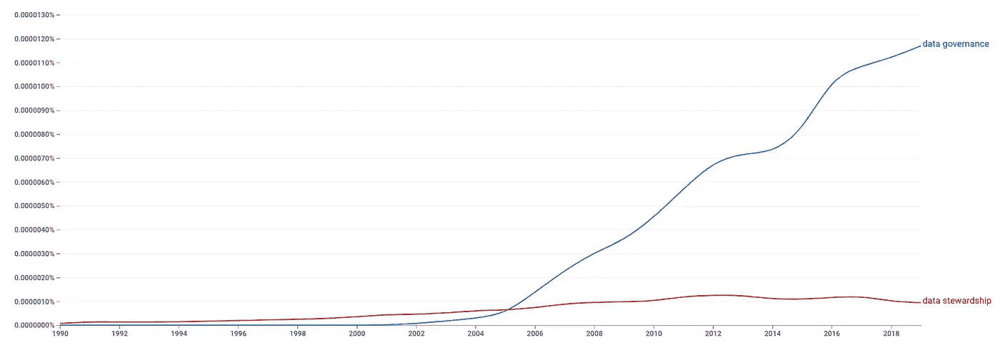
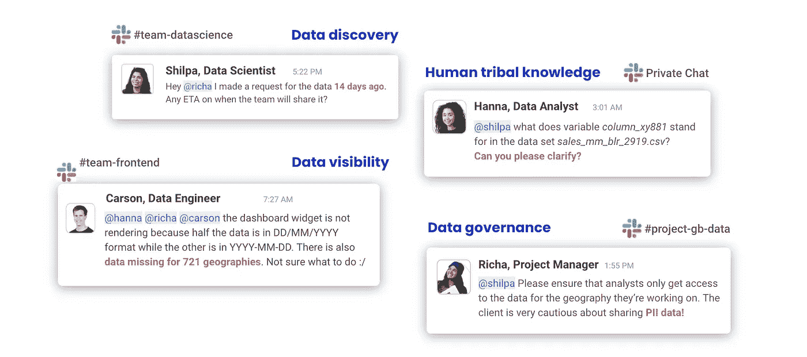
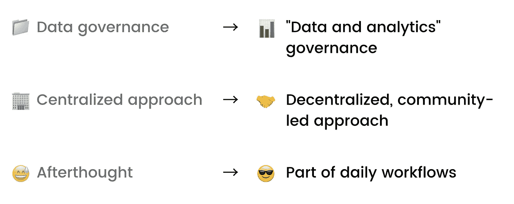

# 数据治理存在严重的品牌问题

> 原文：<https://towardsdatascience.com/data-governance-has-a-serious-branding-problem-7925b909712b?source=collection_archive---------8----------------------->

## 数据治理从哪里开始以及一切是如何出错的故事

*照片由* [*迪米特里·阿尼金*](https://unsplash.com/@anikinearthwalker?utm_source=unsplash&utm_medium=referral&utm_content=creditCopyText) *上* [*下*](https://unsplash.com/?utm_source=unsplash&utm_medium=referral&utm_content=creditCopyText)

> *“在我在数据行业完成的所有任务中，数据治理一直是我最不喜欢的。”*
> 
> *–劳拉·b·麦德森，* [*扰乱数据治理*](http://books.google.com/books?id=YhXCDwAAQBAJ)

当你听到“数据治理”这个词时，你首先想到的是什么？规则还是政策？流程还是管理？控制？

数据治理被视为一个限制性的、官僚的、控制性的过程——一组从高处落下的限制来减缓您的工作。事实是，这通常是组织内部的实际运作方式。

作为从事数据治理工作的人，这让我有点难过。治理不应该是数据人类必须害怕的事情。从本质上讲，数据治理与控制无关。这是为了帮助数据团队更好地合作。

因此，让我们来分析一下为什么数据治理会出现身份危机，它在几十年前的实际设想是什么，以及我们如何才能挽救各地数据管理者的声誉。

# 数据治理从何而来？

数据治理建立在非常酷的原则之上。但是如果你搜索数据治理的历史，你可能不会走得很远。事实上，没有任何东西可以追溯到可笑的早期(想想[数据来源于 20，000 年前的骨头](https://www.weforum.org/agenda/2015/02/a-brief-history-of-big-data-everyone-should-read/)或者[人口普查的‘起源于古埃及](https://www.wsj.com/articles/a-short-history-of-census-taking-11561760685))。

部分原因是，数据治理并不性感。很少有人能忍住哈欠，深究它的现在，更不用说它的过去了。让事情变得更加困难的是，数据治理来自于数据管理，这个词听起来更加密集和专业。

自 1990 年以来，书面提及“数据治理”(蓝色)和“数据管理”(红色)。(图片由 [*图集*](https://atlan.com/) *，用*[*Google Ngrams*](https://books.google.com/ngrams/graph?content=data+governance%2Cdata+stewardship&year_start=1990&year_end=2019&corpus=26&smoothing=3)*创建)。)*

虽然“数据治理”在 2000 年代中期开始兴起，但驯服和保护数据(也称为“数据管理”)的想法自十年前数据爆炸以来就一直存在。

数据管理将技术性的数据世界与非技术性的商业世界联系起来。正如劳拉·麦德森[所写的那样](http://books.google.com/books?id=YhXCDwAAQBAJ)，“数据管家的目的是帮助巩固粘糊糊的东西……他们说 IT 的语言，并将其翻译回业务。这个角色需要幼儿园老师的耐心和成功应对人质危机的能力。”

**从本质上讲，数据管理以及后来的治理都与协作和民主化有关。**数据管家充当了人员和流程之间的桥梁。他们熟练地引导公司克服使用数据带来的复杂性，并为令人生畏的大数据新世界带来清晰和秩序。

# 当今的数据治理:控制，而不是协作

尽管数据治理源于这种协作思想，但很少以这种方式实现。今天，它更多地被视为一种强加控制的方式。

**数据治理计划通常围绕保护和风险展开，我们必须治理数据以降低风险。**

难怪公司害怕数据风险。随着数据的增长，围绕数据的规则和期望也在飙升。随着隐私泄露的新闻不断，人们越来越关注如何保护自己的个人数据。2018 年，由于多次大规模数据泄露摧毁了 Equifax、脸书、万豪和雅虎等品牌的信誉和股票价值，出现了一场“[关于数据治理的全球清算](https://www.wsj.com/articles/the-morning-download-facebook-at-center-of-global-reckoning-on-data-governance-1521463522)”。因此，新的数据法规遵从性要求(例如 GDPR 和 CCPA)每天都在涌现。

如今，公司希望降低向错误的人展示机密数据的风险，降低不良数据被用于制定重大决策的风险，以及降低违反重要法规的风险。为了防止这些失误，数据被复杂的安全流程和限制所包围，所有这些都由远程数据治理团队决定。

# 更多的数据治理，更高的敏捷性？

多年来，数据治理已经失去了它的身份。我们害怕它，但我们应该庆祝它——因为从根本上说，它是关于创建更好的数据团队，而不是控制他们。

事实上，越多的人开始信任数据治理，他们实际上能够实现的就越多。听起来不确定？先说个例子。

在 Atlan，我们最初是一个数据团队。当时，我们不知道什么是数据治理。我们只知道我们想要承担大规模的[“数据为善”项目](https://atlan.com/about)，比如为联合国创建一个 SDG 监测平台，或者开设 10，000 个新的清洁燃料配送中心。

问题是，每天都很混乱。我们有协作过载，人们花更多的时间试图访问或理解数据，而不是实际使用它。我们的空闲时间被诸如“为什么 721 个地理区域的数据丢失了？”或者“为什么这些仪表板显示不同的数字？”

*来自我们数据团队的松弛消息示例。(图片由* [*阿特兰*](https://atlan.com/) *)。)*

因此，我们努力解决这些问题，建立内部数据工具和更好的协作流程。很快，我们意识到我们完成项目的速度是正常规模三分之一的团队的两倍。我们甚至[建立了印度的国家数据平台](https://youtu.be/cctT8QDDC7w)，这是由一个 8 人团队在仅仅 12 个月内完成的。如果没有管理我们的团队和数据的正确的工具和文化实践，我们永远不可能做到这一点。

我认为，组织越是开始相信并投资于(而不是害怕)真正的数据治理，他们就越能实现。这意味着实现敏捷和协作的治理工具和过程，而不是某个地方的自上而下的治理团队宣布，“这就是你需要如何考虑定义”。

# 现代数据堆栈中的数据治理复兴

在 Tristan Handy 关于现代数据堆栈的博客中，他谈到了数据治理落后于现代数据堆栈的其他部分。他写道，“治理是一个时代已经到来的产品领域……**没有良好的治理，更多的数据==更多的混乱==更少的信任。**

我认为他的话反映了现代数据堆栈中数据团队和从业者的广泛情绪。随着数据团队变得越来越主流，现代数据堆栈使得接收和转换数据变得更加容易，数据治理实践的缺乏是阻碍数据团队变得敏捷和产生影响的最大障碍之一。

> *这让我们迎来了数据治理的救赎时刻。从业者第一次自下而上地感受到了治理的需要，而不是由于监管而自上而下地强制实施。*

这种自下而上的采用是我们最终获得正确数据治理的机会。然而，现代数据堆栈的现代数据治理将与其前身大相径庭——这意味着我们必须改变实现数据治理的方式。

# 当今数据治理需要的范式转变

*形象由* [*图册*](https://atlan.com/) *组成。*

## **从数据治理到“数据和分析”治理**

“数据”不再是唯一需要治理的资产。

我们正在转向一个生态系统，在这个系统中，数据资产不仅仅是表格，它们还是仪表板、代码、模型等等。所有这些资产都需要整体形式的治理。

## **从集中的方法到分散的、社区主导的方法**

基于集中式数据管家的自上而下的治理模式将不再有效。

工作场所正在发生变化。自上而下的文化正在被侵蚀，员工渴望他们所做的一切都有目的，所以只是告诉人们做一些事情不再管用。未来的数据治理需要从根本上以实践者为主导。

我几乎认为这是一个数据社区，而不是数据治理，其中从业者感到有责任创建可重用资产，以便他们可以帮助其他社区成员。

## **从事后想法到日常工作流程的一部分**

在过去的十年中，数据治理总是在事后才被应用。数据从业者将按原样交付项目，然后回头添加由自顶向下的命令规定的数据治理需求。

在新的世界里，数据治理将不再是事后的想法。相反，它将成为数据从业者“运输工作流程”中不可或缺的一部分。

# 让我们重塑数据治理

现代数据堆栈是重塑新类别的大师。仅在去年一年，我们就创造了[无头 BI](https://basecase.vc/blog/headless-bi) 、[反向 ETL](https://medium.com/memory-leak/reverse-etl-a-primer-4e6694dcc7fb) 、[数据可观察性](/what-is-data-observability-40b337971e3e)，以及更多领域。最让我着迷的运动是“[分析工程](https://www.getdbt.com/what-is-analytics-engineering/)”，它改变了数据清洗和转换的思路，赋予了一整群人更高的目的。

我对我们的社区有一个要求… **让我们最终重塑数据治理的品牌，并在我们的堆栈中给予它应有的位置和尊重**。让我们让它听起来像它的本意—一套令人惊叹的数据团队将遵循的实践。

我不太清楚现代数据治理的新品牌和名称应该是什么，但它需要与治理的基本重新定位保持一致，作为自下而上、社区主导的实践者运动。

也许它应该被称为数据支持、社区主导的数据治理或数据产品思维模式？也许数据管家的角色应该包含在数据产品经理的角色中？也许数据治理经理应该更名为数据社区经理或数据支持经理，并加入更广泛的数据平台团队？

有这么多的可能性，所以我希望听到更多人的意见。你怎么想呢?

**觉得这个内容有帮助？在我的时事通讯《元数据周刊》上，我每周都写关于活动元数据、数据操作、数据文化和我们的学习建设的文章** [**Atlan**](https://atlan.com/) **。** [**在此订阅。**](https://metadataweekly.substack.com/)