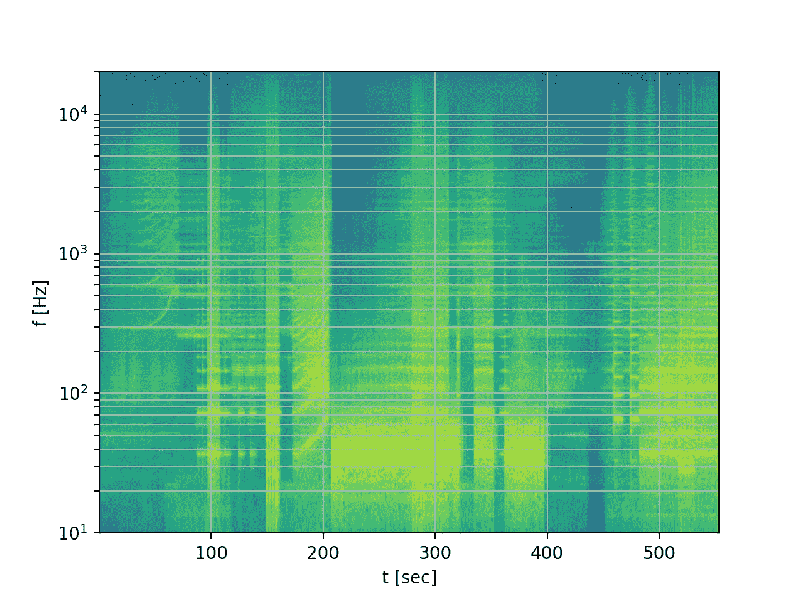
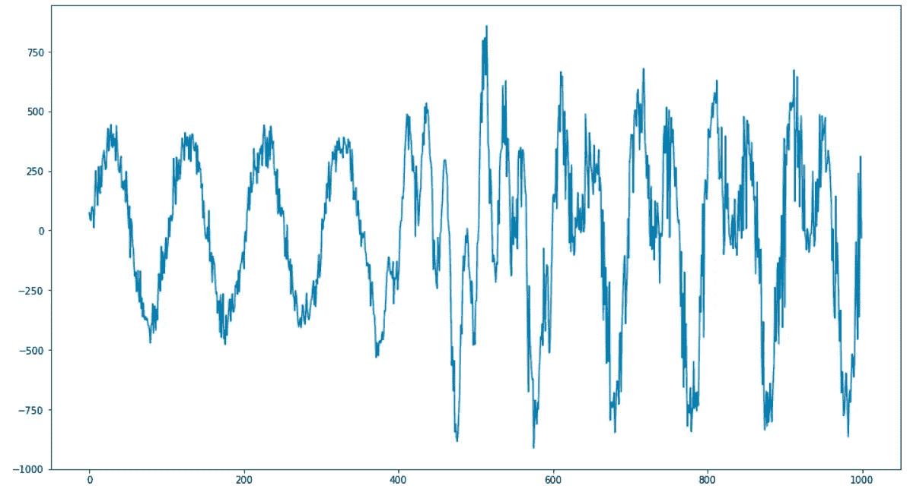
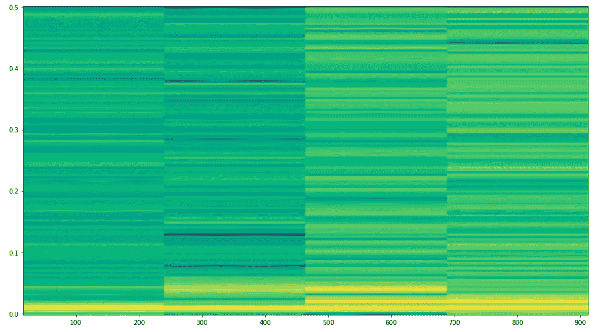
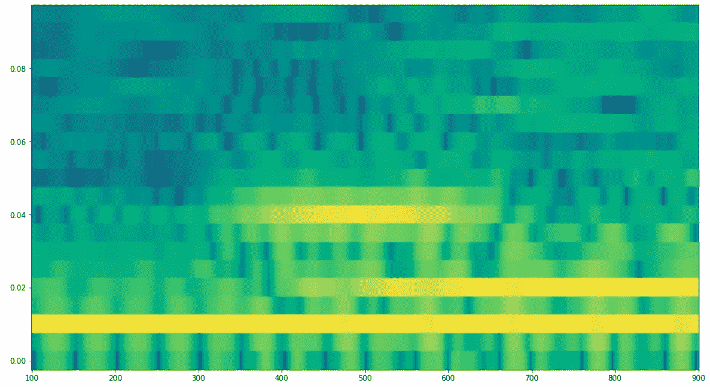
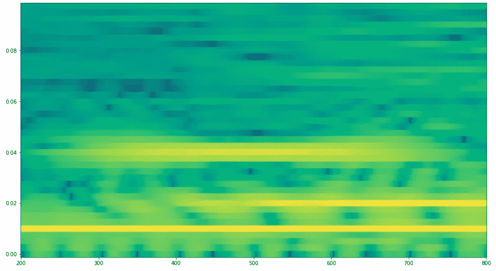
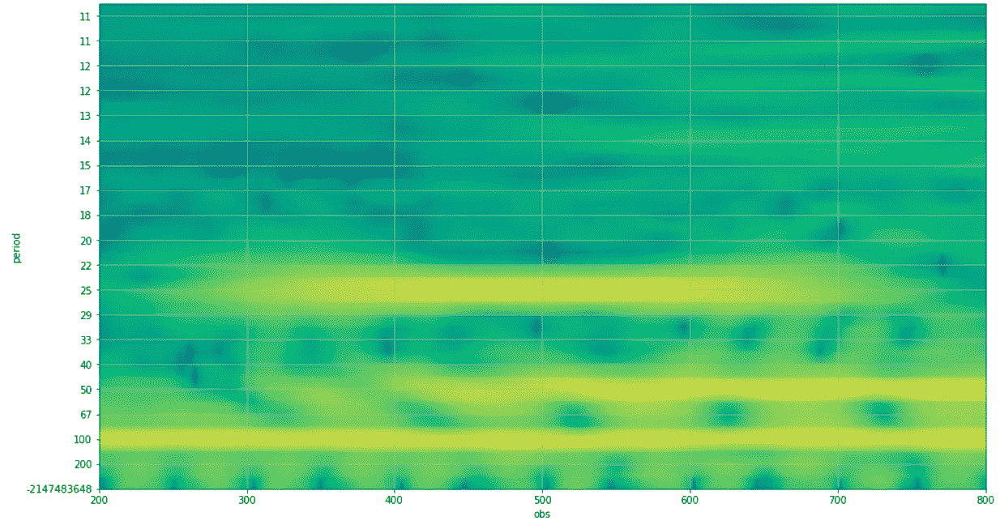

# 数据有许多需要可视化的周期性成分？把它当成音频！

> 原文：<https://towardsdatascience.com/data-has-many-periodic-components-you-need-to-visualize-treat-it-like-audio-dd9569e2a774?source=collection_archive---------17----------------------->

## [提示和技巧](https://towardsdatascience.com/tagged/tips-and-tricks)

## 使用傅立叶变换可视化周期性分量。

您正在处理时间序列数据，并且处于初始发现阶段。你试图找出数据随时间变化的所有不同方式。可能存在趋势，即数据随时间不断增加或减少。可能有完全随机的变化。并且可能存在以某些固定周期随时间上下变化的循环分量。

如果只有一个周期分量，这可能很容易在数据中看到，你甚至可以直观地估计它的周期。但是如果有多个周期分量，每个都有自己的周期呢？如果数据具有超过 3 个(有时超过 2 个)周期分量，简单的绘图通常没有用。

有没有什么方法可以确保你已经识别出所有的周期性成分，每一个都有不同的周期，以及它们自己的趋势和随时间的变化，并将它们可视化？那个东西其实是存在的，它叫声谱图，是信号处理中一个很好理解的话题。由于您正在处理时间序列数据，因此信号处理中使用的许多技术都应该适用，因为信号(音频、天体物理学等)本质上是时间序列数据，其中每个观察值都有一个时间戳和值。

让我们来看看如何制作声谱图。

# 傅立叶变换

其数学基础被称为傅立叶变换。简而言之，如果您的信号有周期成分，FT 是用于从信号中提取其频率(或周期)的数学过程。

[](https://en.wikipedia.org/wiki/Fourier_transform) [## 傅立叶变换-维基百科

### 在数学中，傅立叶变换(FT)是一种数学变换，它根据空间或时间分解函数

en.wikipedia.org](https://en.wikipedia.org/wiki/Fourier_transform) 

对信号中的时间间隔(一个窗口或一段时间)应用一次 FT，可以得到该窗口内的周期分量。如果您将窗口移动到信号中的不同位置，并再次应用 FT，您将获得该窗口中的周期分量。重复这个过程很多次，每次只移动窗口一点点，就会描绘出周期成分如何随时间演化的画面(如果有的话)。

# 来自音频的教训

在音频处理中，这种技术使用非常频繁。捕捉音频的一个小时间窗口并对其应用 FT 将揭示当时信号的“频谱”或音频的一组频率成分。

这是我不久前开始的一个项目，目标是构建任何音频文件的声谱图(周期成分随时间的演变):

[](https://github.com/FlorinAndrei/soundspec) [## 信号处理:音频文件的频谱可视化；使用…

### 音频文件的频谱可视化；使用傅立叶变换需要 Python 3 和一些典型的数字运算…

github.com](https://github.com/FlorinAndrei/soundspec) 

如果你从电影[《黑暗骑士](https://www.imdb.com/title/tt0468569/)中选取歌曲 [Why So Serious](https://www.youtube.com/watch?v=1zyhQjJ5UgY) (小丑主题)，并对其应用 soundspec，这就是你得到的声谱图:



(图片由作者提供)

在水平轴上，有时间。纵轴是频率。请注意，周期和频率是成反比的，所以周期= 1 /频率。颜色表示振幅，黄色表示高振幅，蓝色表示低振幅或零振幅。

你可以看到在 200 到 400 秒之间有非常强的周期成分，频率约为 30 … 40 Hz，因此周期为 0.033 … 0.025 秒(你可以在歌曲中听到这是一条强有力的低音线)。还有许多其他周期性成分散布在声谱图中——音乐通常非常复杂。

# 返回数据

让我们来看看这个数据集:

[https://github . com/FlorinAndrei/misc/blob/master/FFT _ data . p？raw=true](https://github.com/FlorinAndrei/misc/blob/master/fft_data.p?raw=true)

初始化所有库:

```
import pandas as pd
from matplotlib import pyplot as plt
from scipy import signal
import numpy as np
import os
import pickleplt.rcParams["figure.figsize"] = (16, 9)
```

绘制数据集:

```
if os.path.isfile('fft_data.p'):
    dt = pickle.load(open('fft_data.p', 'rb'))
plt.plot(dt);
```



(图片由作者提供)

第一部分有些明显，有一个周期成分，还有一些噪声。但是剩下的就变得相当复杂了。里面有多个周期成分吗？如果有，她们的经期是什么时候？他们有多少人？就对信号的贡献而言，它们在时间上是恒定的，还是变化的？

SciPy 库有一个名为`signal.spectrogram()`的函数，可以生成这个数据集/信号的谱图。让我们应用它:

```
f, t, Sxx = signal.spectrogram(dt, 1)
plt.pcolormesh(t, f, np.log10(Sxx), shading='auto');
```



(图片由作者提供)

如您所见，傅里叶变换对整个数据集应用了 4 次，生成了 4 组光谱。从黄色的位置可以很清楚地看出，所有的活动都发生在底部，低频的地方(短周期的地方)。

我们只保留声谱图底部的 1/5 放大，其余的可以忽略:

```
f, t, Sxx = signal.spectrogram(dt, 1)
frac = len(f) // 5
fshort = f[0:frac]
Sshort = Sxx[0:frac]
per = np.rint(1 / fshort).astype(int)
plt.pcolormesh(t, fshort, np.log10(Sshort), shading='auto');
```


(图片由作者提供)

那更好。您可能已经开始怀疑可能有 3 个周期成分，一个(具有最高频率)在间隔的中心是重要的，另一个(具有中间频率)在间隔的后半部分，第三个(具有低频率)似乎在任何地方都是相同的。

我们需要在时间和频率上提高图像的分辨率。为此，我们将通过`signal.spectrogram()`的`nperseg`参数为时间窗口定义一个固定的大小。我们还将通过`noverlap`参数最大化连续窗口之间的重叠:如果`noverlap = nperseg-1`将第一个窗口应用于信号的最左边部分，那么它将向右移动 1 个像素，再次应用，再次移动 1 个像素，以此类推。

```
nseg = 200
f, t, Sxx = signal.spectrogram(dt, 1, nperseg=nseg, noverlap=nseg-1)
frac = len(f) // 5
fshort = f[0:frac]
Sshort = Sxx[0:frac]
per = np.rint(1 / fshort).astype(int)
plt.pcolormesh(t, fshort, np.log10(Sshort), shading='auto');
```



(图片由作者提供)

好多了。很明显，有 3 个周期成分。频率最低的一个在整个数据集中是恒定的，可能就是我们在原图中看到的那个——图像左三分之一的上下波动。其他两个组成部分随时间变化——这解释了为什么最后三分之二的情节不同。

让我们使用更大的窗口(400 点)再次放大:

```
nseg = 400
f, t, Sxx = signal.spectrogram(dt, 1, nperseg=nseg, noverlap=nseg-1)
frac = len(f) // 5
fshort = f[0:frac]
Sshort = Sxx[0:frac]
per = np.rint(1 / fshort).astype(int)
plt.pcolormesh(t, fshort, np.log10(Sshort), shading='auto');
```



(图片由作者提供)

这可能是最好的了。请记住，这里有一些权衡:为了提高分辨率，您需要一个大窗口，同时也要正确检测长周期信号。但是增加窗口会丢失图像左右两端的数据点——大窗口无法“足够接近”边缘以进行分析。看看横轴是如何随着窗口变大而变短的。

在纵轴上，我们把频率转换成周期。让我们给图像添加一个网格。最后，让我们平滑图像，使它看起来更好(通过`plt.pcolormesh()`的`shading`参数)。

```
nseg = 400
f, t, Sxx = signal.spectrogram(dt, 1, nperseg=nseg, noverlap=nseg-1)
frac = len(f) // 5
fshort = f[0:frac]
Sshort = Sxx[0:frac]
per = np.rint(1 / fshort).astype(int)plt.yticks(ticks=fshort[::2], labels=per[::2])
plt.ylabel('period')
plt.xlabel('obs')
plt.pcolormesh(t, fshort, np.log10(Sshort), shading='gouraud')
plt.grid(True)
plt.show()
```



(图片由作者提供)

现在很清楚了:有一个分量的周期是 100 个点，在整个数据集中是恒定的。还有一个 50 分周期的成分，只在后半段有关系。还有第三个成分，周期为 25 个点，在数据集的中间很强，但在极端情况下很弱。

数据集实际上是合成的。这是用于生成它的代码，在这里您可以看到分量、它们的频率以及它们的可变幅度:

```
N = 1000
dt = np.zeros(N)
np.random.seed(0)for t in range(N):
    dt[t] += 50 * np.random.randn()

    a1 = 429 * np.exp(-((t - N / 2) / (N / 10)) ** 2)
    p1 = 25
    s1 = p1 / 5
    dt[t] += a1 * np.sin(2 * np.pi * t / p1 + s1)

    a2 = 212 * (np.tanh(5 * (2 * t / N - 1)) + 1)
    p2 = 50
    s2 = p2 / 7
    dt[t] += a2 * np.sin(2 * np.pi * t / p2 + s2 + np.random.randn() / 2)

    a3 = 375
    p3 = 100
    s3 = p3 / 4
    dt[t] += a3 * np.sin(2 * np.pi * t / p3 + s3 + np.random.randn() / 10)pickle.dump(dt, open('fft_data.p', 'wb'))
```

具有最短周期的分量具有按照高斯曲线随时间变化的幅度。中间分量的幅度随时间以双曲正切的形式变化。

# 最后的想法

如果数据没有间隙，并且时间维度是均匀的，傅立叶变换就可以很好地工作。否则，您将不得不估算缺失的数据点，填补空白，确保时间维度表现良好。

包含本文中使用的所有代码的笔记本在这里:

[https://github.com/FlorinAndrei/misc/blob/master/fft.ipynb](https://github.com/FlorinAndrei/misc/blob/master/fft.ipynb)

感谢阅读！