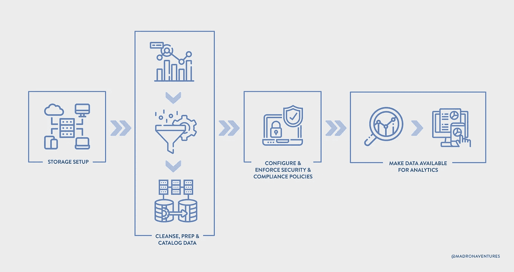

# 现代企业的数据高速公路

> 原文：<https://towardsdatascience.com/data-highways-for-the-modern-enterprise-d8365c2e4024?source=collection_archive---------24----------------------->

## 如果没有支持的基础设施，数据不会传播很远

图片由 Shutterstock 提供，由作者编辑

铺设的道路在技术基础设施中很常见，但这是建设高速公路的最佳时机。一个多世纪前，由于装配线上的大规模生产，汽车价格从 1913 年的 850 美元下降到 1924 年的不到 300 美元，我们看到了美国编号公路系统的诞生，以更好地服务于长途旅行。这些高速公路引发了基础设施投资，以前所未有的规模进一步调动了人员和货物，从根本上改变了我们的生活方式。就像早期的核心创新不是汽车而是装配线一样，今天的“三巨头”云提供商进行创新，以部署装配线的现代等价物，并实施大规模运营。就像一个世纪前汽车风靡一时一样，今天我们生活在消费者应用的黄金时代，这些应用提供服务和商品，从食品和家具到虚拟旅行，触手可及。但是数字高速公路在哪里呢？当今数字世界中的“商品”是数据。跨企业的平台团队正在构建他们自己的铺路和数据基础设施，在他们的本地领域发现新的岩石。这是对想象现代数据高速公路的一次尝试，在未来十年，每个公司都可以利用现代数据高速公路在数据驱动的世界中更快地前进。

# 早期

传统上，数据湖(DLs)是整个组织中的结构化和非结构化数据被转储的地方。过去，这些数据转储自然会导致专有内部解决方案的成本上升。如今，客户可以在云中创建自己的数据湖。构建数据湖的步骤通常包括定义存储(着陆/接收)位置、配置接收到该位置、准备和丰富数据、配置访问控制，以及最终查询数据以进行分析，如下所示。

当前数据接收和存储的设置和配置(图片由 Madrona Venture Group 提供)

但是这种接收、存储、转换和分析步骤的安排并不新鲜。这已经存在了几十年，尽管“现代”工具似乎取代了上一代工具。改变的是‘渣渣’的减少。有了正确的抽象层次，实践者不必一遍又一遍地重新发现同样的粗糙边缘、缺口或惊奇。

# 还有很多路要走

在使用数据进行分析和机器学习的现代组织中，我们发现团队仍然需要解决几个难题-从最直接的查询性能和数据质量问题到围绕数据隐私的更具战略性的问题。团队也对他们的基础设施成本和部署时间(或洞察时间)越来越敏感，这两者都是生产力和长期竞争力的替代指标。这些问题表明需要尚未建成的现代数据高速公路。

**A .高性能查询** —随着存储(现在在云对象存储中可靠且经济高效地可用)与计算的分离，可以将查询编译成高效的逻辑和物理查询计划的*查询引擎*(通过缓存获得额外的性能)对于抽象底层存储布局和格式至关重要。这种查询引擎自然依赖于作为核心能力的*索引*，随着时间的推移，它可以理想地适应新数据类别的新类型索引。毫不奇怪，已经构建了这种高性能查询引擎的现代数据仓库现在可以作为各种查询模式的单一来源，从即席分析查询、数据科学任务和 ML 工程到预定的商业智能报告。他们的核心是一个高性能的查询引擎。[参见:Databricks 的[雪花](https://www.snowflake.com/)，[三角洲湖](https://delta.io/)，[亚马逊红移](https://aws.amazon.com/redshift/) ]随着阿里云的 [Hologres](https://www.alibabacloud.com/product/hologres) 于 2021 年 2 月推出，我们预计明年将看到查询延迟的进一步改善。数据存储的下一步是什么？我敢打赌，在接下来的五年里，将会出现数量级更复杂的查询(更多内容见下一节)。

**B .数据质量&管理** —一项关键的组织能力是让不同的团队就“好数据”的含义达成一致。从战术上讲，这需要定义一个数据模式和管理高质量数据的规则。从战略上来说，组织部落知识的正式化和期望值的设定对于建立对业务决策和最终用户体验的更深信任是至关重要的，这些数据是用来服务的。[参见: [WhyLabs](https://whylabs.ai/) 、[远大前程](https://www.superconductive.com/)、 [Anomalo](https://www.anomalo.com/) 、 [Monte Carlo](https://www.montecarlodata.com/) 、 [BigEye Data](https://www.bigeye.com/) 、 [Hubble](https://www.gethubble.io/) 、 [Databand](https://databand.ai/) 、 [UnravelData](https://unraveldata.com/) ]超越数据质量，我们期待在持续评估和多维评估指标方面的新工作，将数据操作/多操作从目标可观察性转变为知情可控性，让上游系统和团队负起责任例如，修复上游的实体嵌入可以解决使用这些嵌入的下游产品中的错误。最近的论文如 [Bootleg](http://hazyresearch.stanford.edu/bootleg/) 、 [RobustnessGym](https://arxiv.org/abs/2101.04840) 显示，数据管理技术(不是建模技术)如增强和弱标记可以提高基线模型的准确性，特别是长尾分布[见:[潜泳](https://snorkel.ai/)

**C .数据隐私** —另一个关键的组织能力是建立有意使用和控制数据的机制。在第一个层次上，这需要有意识地判断业务决策是否需要不打算用于该场景的数据。例如，当你看到一个令人毛骨悚然的广告时，商家是打算给你看一个令人毛骨悚然的广告，还是无意的代表判断力差？一些公司已经建立了开源框架(如网飞的 Metacat、LinkedIn 的 DataHub、Airbnb 的 Dataportal、优步的 Databook、Lyft 的 Amundsen)用于数据编目、血统跟踪和使用政策的执行。这些框架除了确保模型根据给定业务目的的数据进行训练之外，还支持可重复性。下一层是确保任何人(包括员工)都不能访问用户数据。第三层是部署定义明确的数据保留和删除机制，根据个人或群体的同意对其数据实施可靠的控制。使用传统安全机制的问题是，比如用于信用卡保护的技术，用加密令牌(又名“假名化”)替换特定字段会失败，因为人们无法指出哪个特定数据字段实际上是敏感的。虽然一个数据集本身可能看起来无害，但当它与另一个数据集一起使用时，可能会变得敏感。加密一个给定的数据集(“去标识”)可能看起来是安全的，但是如果多方(非预期的)持有解密密钥呢？目前还不清楚加密数据本身是否能达到预期的准确度。差分隐私提供了可证明的保证，以确保无法通过在数据中引入校准噪声来了解特定个人的任何信息。这使企业能够在准确性和隐私性之间进行权衡，当然也有助于从一个校准良好的数据集中提供效用，否则这是不可用的。虽然谷歌、苹果、脸书和 LinkedIn 等大型公司正在内部建设隐私，而 [Privacera](https://privacera.com/) 、 [Immuta](https://www.immuta.com/) 和 [Privitar](https://www.privitar.com/) 等公司也展现出了希望，但它仍然是数据领域服务最不足的领域。

**D .数据转换** —数据转换能够将数据过滤、整形、丰富成一种形式，这种形式能够激发洞察力并为机器学习(ML)模型生成特征。SQL 仍然是当今最流行的转换接口，而各种管道代码工具将多个相关步骤缝合在一起。[参见: [Dbt](https://www.getdbt.com/) ， [Airflow](https://airflow.apache.org/) ]这本身不一定是一个困难的问题，但它是大量“垃圾”和无差别的繁重工作耗费时间和生产力的地方。诸如[perfect](https://www.prefect.io/)和 [Flyte](https://flyte.org/) 之类的完全托管、经济高效的云中服务很有前途，但这一领域仍然与成本约束、业务 SLA、质量和责任以及我们上面提到的预期使用要求相隔离。有没有办法从根本上改变这个问题空间？例如，如果应用程序生产环境可以用期望的约束来声明性地定义，为什么数据基础设施环境不可以呢？

**E .特性工程** —如果特性不容易“回填”，添加新特性或收集新类型的数据通常会导致较长的交付周期。作为一名希望从用户那里收集新信号的数据科学家，你必须首先设计该功能，将其添加到源应用程序中以收集它，然后等待数周时间来收集足够的数据以得出可靠的结论。这将模型开发周期延长至几个月。这些批处理或流式数据管道可以进一步馈入离线特征存储，也是在 S3 上，其保存注册的 ML 模型“特征”。确保人工智能模型在训练期间看到与推断期间相同的数据分布仍然是一个难题，Airbnb 的 [Zipline](https://conferences.oreilly.com/strata/strata-ny-2018/cdn.oreillystatic.com/en/assets/1/event/278/Zipline_%20Airbnb_s%20data%20management%20platform%20for%20machine%20learning%20Presentation.pdf) 开始解决这个问题，也许 [Tecton](https://www.tecton.ai/) 可以在此基础上继续努力。

**F .模型构建** —随着公司开发更复杂的 ML 系统，比如通过将模型组合在一起，或者用音频和视频等非结构化数据训练更大的模型，训练所需的计算成本迅速膨胀。然而，随着模型开始在架构上趋同，我们预计这些培训成本对于大多数应用程序来说会逐渐减少，这些应用程序可能建立在标准模型的优化版本上，或者使用 API，比如来自亚马逊 Rekognition 或者微软的 GPT-3 API。更重要的是，使模型计算更接近源数据，并利用数据的底层关系结构来执行复杂的查询，这将导致成本的数量级降低。这可能为下一代查询引擎奠定基础，进一步优化数据的组织方式。[参见:[Li liquid](https://engineering.linkedin.com/blog/2020/liquid-the-soul-of-a-new-graph-database-part-1)， [Relational.ai](https://www.relational.ai/)

**G .模型部署**——可悲的是，推理和训练环境继续使用不同的工具、系统和管道。这些孤立的工具和流程在安全地将模型部署到生产环境中时会产生巨大的障碍，导致数据科学家将时间花费在基础设施问题上，而不是数据和模型设计上。在原型阶段早期为数据科学家提供铺平道路的工具自然使他们能够更快地投入生产。[参见:来自 Airbnb 的 [Algorithmia](https://algorithmia.com/) 、 [Seldon](https://www.seldon.io/) 、 [Bighead](https://www.youtube.com/watch?v=UvcnoOrgyhE) 、 [OctoML](https://octoml.ai/) ]

# 是时候建造…什么？

我们在查询性能方面取得了一定的进步，但数据质量和管理、数据隐私、特征工程和模型构建仍有很长的路要走。十多年前，亚马逊通过云服务开创了这场革命，现在我们已经看到了云中构建的变革性产品类别。是时候构建肌肉和护栏来利用这一基础设施来加强我们的组织和数据实践了。您看到的是相同还是不同的差距？我们遗漏了什么？