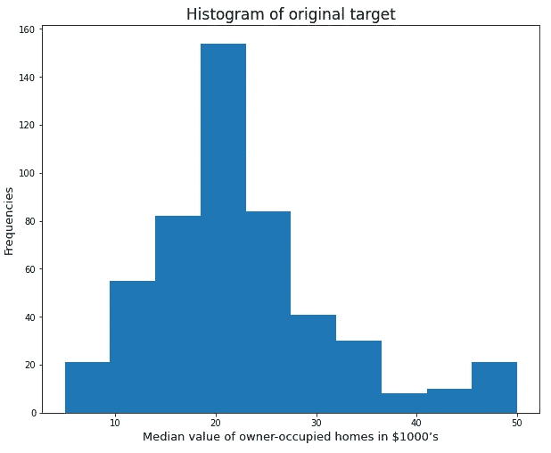
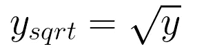
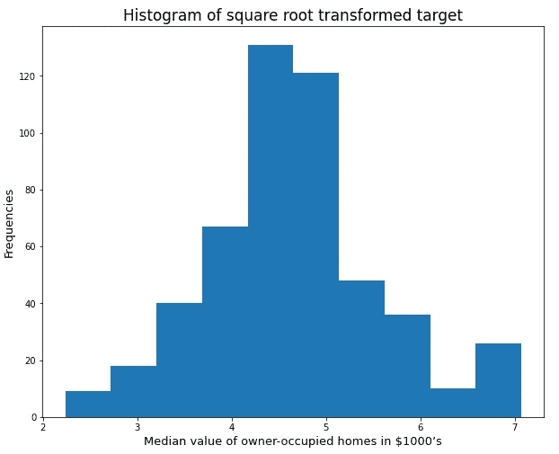
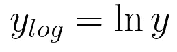
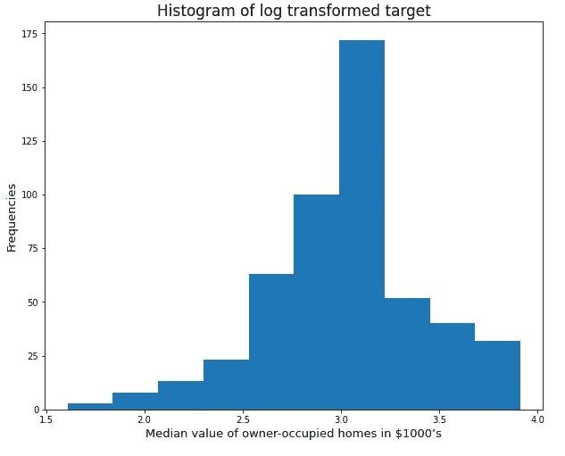
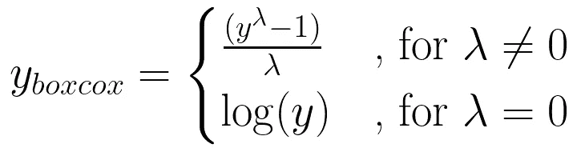
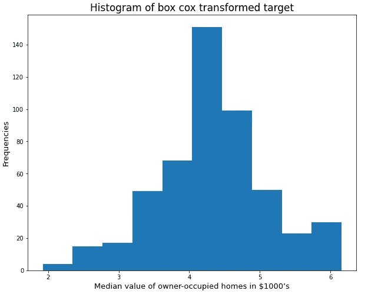
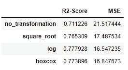

# 回归中的数据不平衡

> 原文：<https://towardsdatascience.com/data-imbalance-in-regression-e5c98e20a807?source=collection_archive---------10----------------------->

## 回归分析中数据不平衡的调查及对策

照片由 [imgix](https://unsplash.com/@imgix?utm_source=medium&utm_medium=referral) 在 [Unsplash](https://unsplash.com?utm_source=medium&utm_medium=referral) 上拍摄

# 介绍

数据不平衡是现实世界数据集的一个典型问题。通过查看二元分类任务，可以最好地描述数据不平衡。在二元分类中，如果 0 类和 1 类之间的样本数量不均匀，则数据集是不平衡的。机器学习模型倾向于更好地预测具有更多样本的类(多数类)而不是具有较少样本的类(少数类)。这种不平衡越大，模型对多数阶级的偏向就越高。在回归分析中，数据不平衡不太明显，但可能存在并导致问题。本文给出了一个回归任务中数据不平衡的例子和一些对策。每个对策用于训练一个线性回归模型，并相互比较结果。可以看出，使用对策提高了 R 平方得分和均方误差(MSE)。这些对策可以直接用于其他不平衡回归任务，以提高性能。使用的数据集是 Boston Housing 数据集，可以在 [scikit-learn](https://scikit-learn.org/stable/datasets/toy_dataset.html) 上找到。完整的 jupyter 笔记本可以在我的 github 页面上找到。

# 数据输入

本章介绍如何加载数据。使用 scikit-learn 库和 pandas 加载数据。图 1 显示了将数据集加载到 pandas 数据框中的 python 代码。

图 1:将波士顿住房数据加载到 pandas 数据框中的代码(由作者编写)。

该数据集已经只包含浮点型要素，没有缺失值，因此无需进一步预处理。

# 目标变量的分布

该数据集的目标变量是“以 1000 美元为单位的自有住房的中值”(MEDV)，如数据集说明中所述。图 2 显示了目标变量的直方图。在最佳情况下，目标变量的分布将是正态分布。但是，可以看出，波士顿住房数据集的目标变量显然不是这种情况。

图 2:波士顿住房目标变量直方图(图片由作者提供)。

平均值在 20 左右，第一部分看起来已经很像正态分布了。但是有一个较高 MEDV 值的大右尾。这可能会导致一个问题，即该模型可以更好地预测平均值周围的 MEDV 值，但在预测右尾的 MEDV 值时却非常糟糕。这是因为在大多数情况下，模型会看到平均值附近的值，因此偏向于这些 MEDV 值。

还可以执行统计测试，以验证该分布不是正态分布。图 3 显示了计算这个分布是正态分布的零假设的 p 值的代码。实际上，小于 0.05 的 p 值意味着可以拒绝零假设。因此，p 值为 0.05 或更大意味着该分布是正态分布。

图 3:执行统计测试以检查数据分布是否为正态分布的代码(由作者编写)。

该统计测试的 p 值为 1.76e-20，因此远小于 0.05。

# 目标变量的变换

如前一章所示，目标变量是高度倾斜的。本章的目标是介绍可应用于目标变量的不同变换。这些转换的目标是使目标变量的分布更接近正态分布，从而消除不平衡。

## 平方根变换

第一个变换是平方根变换。这个转换只是计算目标变量的每个条目的平方根(等式 1)。

等式 1:应用于输入目标变量的平方根变换(图片由作者提供)。

图 4 显示了应用这个转换后目标变量的直方图。新的分布看起来已经不那么偏斜了，但仍然不像正态分布。新分布的 p 值为 3.56e-5，因此仍低于 0.05。

图 4:应用平方根变换后的波士顿住房目标变量直方图(图片由作者提供)。

## 对数变换

另一个有用的转换是计算输入目标变量的每个条目的自然对数(等式 2)。

等式 2:应用于输入目标变量的对数变换(图片由作者提供)。

图 5 显示了应用对数变换后的直方图。这个分布看起来比原来的好，但仍然不像正态分布。这个分布的 p 值在 1.82e-4，仍然低于 0.05。

图 5:应用对数变换后的波士顿住房目标变量直方图(图片由作者提供)。

## Box Cox 变换

最后介绍的变换是 Box Cox 变换。等式 3 示出了如何计算 Box Cox 变换，其中λ被确定为使得分布最佳地接近正态分布。图 6 显示了如何使用 SciPy 库计算 Box Cox 转换，而图 7 显示了转换后的目标变量的分布。这种分布已经看起来非常类似于正态分布，并且达到了大于 0.05 的 p 值 0.1。因此，我们可以说该分布等于正态分布。

等式 3:应用于输入目标变量的 Box Cox 变换(图片由作者提供)。

图 6:计算 Box Cox 变换的代码(作者代码)。

图 7:应用 Box Cox 变换后的波士顿住房目标变量直方图(图片由作者提供)。

# 训练线性回归模型

在这一章中，为每个转换以及没有应用转换时训练线性回归模型。这有助于检查哪种转换最适合当前数据集，以及转换是否有助于提高性能。为了应用转换，创建了一个 Transformer 类。该类还能够应用逆变换，从而可以将变换后的模型的预测转换回来，并且可以将预测与原始测试数据进行比较。图 8 显示了 Transformer 类的代码。

图 8:用于应用转换和逆转换的 Transformer 类的代码(由作者编写)。

下一步，为每个转换和原始的、未转换的案例训练一个线性回归模型(图 9)。使用 scikit-learn 中的 StandardScaler 类对训练数据进行缩放。这里，重要的是仅在训练数据上训练定标器，以避免数据泄漏到测试集中，从而得到过于乐观的结果。然后，为每个转换训练一个线性回归模型，并使用 Transformer 类转换目标数据。在训练之后，执行对拒绝测试数据的预测，并且使用当前应用的变换的逆变换将预测转换回来。最后，计算 R 平方得分和 MSE，并将其存储在数据帧中。

图 9:为每个转换训练线性回归模型的代码，并在保留测试集上获取结果。

图 10:测试集的最终结果。

图 10 显示了最终的数据帧。正如你所看到的，所有的转换都会导致两个分数的提高。Box Cox 变换和 log 变换的性能最好。

# 结论

数据不平衡不仅是分类任务中的问题，也是回归任务中的问题。回归模型的性能可能受到目标变量的分布不是正态分布和偏斜的事实的影响。对目标变量应用转换可以提高性能。