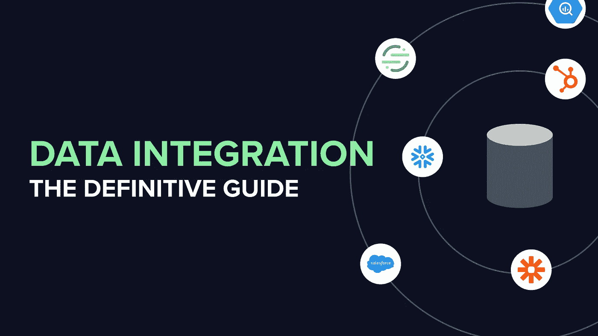
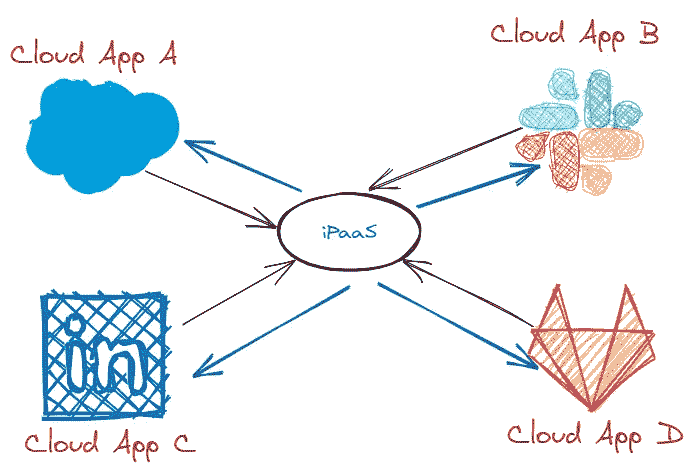
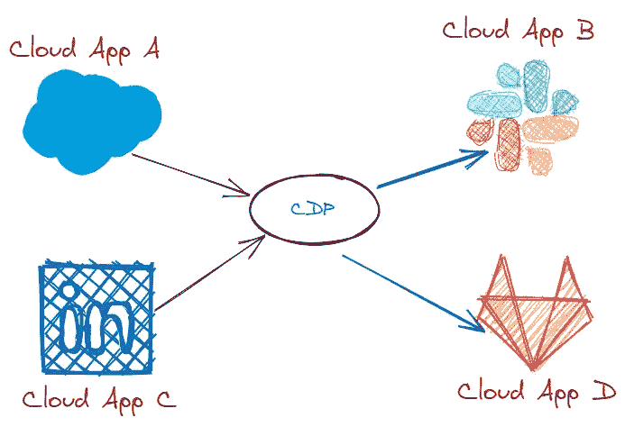
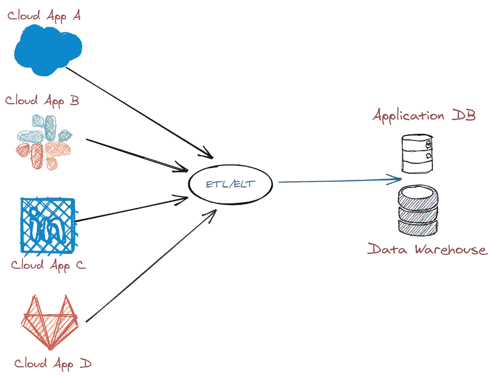
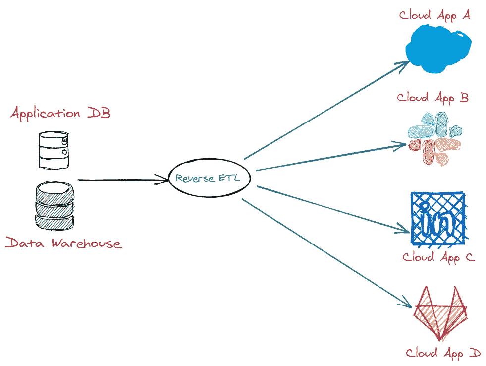

# 数据集成:权威指南

> 原文：<https://towardsdatascience.com/data-integration-the-definitive-guide-e9d42a95a6cd?source=collection_archive---------30----------------------->

## 简单来说，就是移动数据的过程

帖子中的所有图片均由作者提供

# 什么是数据集成？

快速谷歌搜索说，“数据集成是将来自不同来源的数据组合成一个单一的、统一的视图的过程”。听起来很简单，对吗？但是，嘿——既然你正在读这篇文章，你已经知道这么狭隘的数据集成定义，至少可以说是鲁莽的。

在我开始描述数据集成的真正含义之前，让我向您保证，本指南并不是要说服您某个特定的解决方案或技术比其他的更好。相反，本指南的目标是为您提供一个全面、公正、360 度的数据集成前景概述。

为此，我将介绍构成数据集成前景的所有技术— **iPaaS** 、 **CDP** 、 **ETL** 、 **ELT** ，最后是**反向 ETL** 。

即使你是一个经验丰富的数据人员，我也希望这个指南能在你每次选择合适的方法来移动数据时成为你的计算工具。

好吧，那么什么是数据集成呢？

简而言之，**数据集成是*在数据库之间移动*数据的过程——内部的、外部的或者两者都有。**在这里，数据库包括生产数据库、数据仓库以及生成和存储数据的第三方工具和系统。

最好记住所有的集成工具都使用相同的底层技术——API。如果你想了解更多关于 API 的知识，这里有[一个深入的指南](https://zapier.com/learn/apis/chapter-1-introduction-to-apis/)、[一个视频](https://youtu.be/7YcW25PHnAA)和[一个课程](https://www.udemy.com/course/learn-and-understand-apis-and-restful-apis/)。

# 这么多动作..

*   **iPaaS 或集成平台即服务:**数据直接在云应用之间移动，iPaaS 中很少或没有发生转换
*   **CDP 或客户数据平台:**数据通过一个中心枢纽在云应用程序之间移动，从而实现适度的转换能力
*   **ETL 或提取、转换和加载:**数据通过 ETL 工具内置的健壮的转换层从云应用程序移动到数据仓库
*   **ELT 或提取、加载和转换:**数据从云应用程序直接移动到数据仓库，通过 SQL 在仓库中进行转换和数据建模。这里的主要区别是，使用 ETL，转换发生在数据加载到仓库之前(T2)，而使用 ELT，转换发生在之后
*   **反向 ETL:** 数据从数据仓库转移到云应用。通常，核心转换发生在逆向 ETL 过程之前的仓库中，但是逆向 ETL 工具可能有一个最小的转换层来使数据适应外部系统的模式

现在，让我们更详细地看一下每一项技术——它们的优缺点、每一项技术的受众以及当今市场上的主要参与者。再次提醒，请记住，评论完全是基于正在讨论的技术，而不是基于在该技术下运营的公司或产品。

# iPaaS 或集成平台即服务

据称，iPaaS 是由企业 iPaaS 供应商 Boomi 于 2008 年创造的。从那以后，iPaaS 得到了广泛的采用，并导致了以各种形式和包装提供 iPaaS 解决方案的公司的激增。

今天最受欢迎的是面向企业的 [Tray](https://tray.io/) 和 [Workato](http://workato.com/) 以及面向中小企业的 [Zapier](http://zapier.com/) 、[integra mat](http://integromat.com/)和 [Automate.io](http://automate.io/) 。

不用说，集成和功能的范围因供应商而异，但从根本上说，它们都做同样的事情——基于触发器执行操作。触发器本质上是发生在系统 A 中的事件，该事件被传送到集成平台(通过 API 调用或 Webhook ),然后集成平台执行一个或多个预定义的动作。

最简单的例子是，每次您收到一封电子邮件(一个事件或触发器)，您还会收到一条包含该电子邮件内容的松散消息(操作一)，然后该电子邮件会被标记为已读(操作二)。在这里，一旦有新邮件到达您的收件箱，您的电子邮件客户端*就会将此消息发送*到集成平台，然后 iPaaS 会完成它的工作。

关于 iPaaS 解决方案，要记住的一件有趣的事情是，它们还可以按计划(比如每小时)检查系统 A 中的更改，如果检测到更改，就会执行指定的操作。

以上面的例子为例，集成平台可以每小时敲你的收件箱，如果有新邮件，它可以执行操作，如果没有，它什么也不做。在这里，触发器也是在你的收件箱中发现了一封新邮件，但这一次，iPaaS 必须从电子邮件客户端*获取*该信息，而不是将其发送出去。

*数据如何通过 iPaaS 移动*

iPaaS 解决方案还可以用于在事件发生的内部系统之间移动数据。然而，这很不常见，因为集成平台通常根据它们执行的操作或任务的数量来收费，并且很快就会变得非常昂贵。

采用 iPaaS 的最大驱动因素之一是，它们提供了一个可视化界面来构建集成，使业务团队能够控制其工作流自动化需求。本质上，iPaaS 将最简单的编码概念引入到一个 UI 中，这个 UI 很容易操作，几乎不需要任何技术知识，这真是太棒了！

此外，iPaaS 解决方案的亮点之一是它们与第三方 SaaS 工具的深度集成。只要 SaaS 供应商公开了 API 端点，iPaaS 就可以从中提取数据或向其推送数据，从而实现一些真正复杂的集成，否则这些集成将需要编写和维护大量代码。

也就是说，像任何其他技术一样，iPaaS 也有一系列限制，并不是所有类型集成需求的理想解决方案。当需要移动不依赖于事件的数据时，基于事件的集成尤其不够。最后，由于 iPaaS 解决方案如此灵活和自由，它们给用户增加了很多复杂性。

# CDP 或客户数据平台

客户数据平台收集和整理来自不同来源的客户数据，并将这些数据发送到不同的目的地。这里需要注意的是，除了移动数据，CDP 还通过专有的 SDK 和 API 支持数据收集。然而，我打算将本指南的重点放在数据集成上，因此将把数据收集留给另一天的指南。

像 iPaaS 解决方案一样，CDP 在过去几年中也获得了发展，产生了横向 CDP 供应商，如[细分市场](https://segment.com/)、 [mParticle](http://mparticle.com/) 、 [Lytics](https://www.lytics.com/) 和 [Tealium](https://tealium.com/) ，以及专注于解决特定行业需求的纵向 CDP，如 [Amperity](https://amperity.com/) (零售和酒店)和 [Zaius](https://www.zaius.com/) (电子商务)。

*数据如何通过客户数据平台移动*

在移动数据方面，客户数据平台依赖于预定义的数据模型，并提供与第三方供应商的有限或浅层集成，这使得它们对于许多数据集成用例来说不太理想。

关于客户数据平台，需要记住的重要一点是，根据定义，CDP 不仅仅是在工具之间移动数据。它使营销和增长团队能够基于用户行为和用户特征构建细分市场，并将这些细分市场与第三方工具同步，以提供个性化体验，而无需依赖工程或数据团队。如果你想了解更多关于 CDP 的信息，[请查看来自数据导向学院的指南](https://dataled.academy/customer-data-platform/)。

另一方面，如果您已经在使用 Redshift、Snowflake 或 BigQuery 等数据仓库，您甚至可能不需要 CDP — [阅读这篇深入的文章，其中讨论了为什么您的客户数据平台应该是数据仓库而不是现成的产品](https://fivetran.com/blog/customer-data-platform-data-warehouse)。

# ETL 或提取、转换和加载

ETL 是一个传统的数据集成过程，根据维基百科的记载，它的起源可以追溯到 20 世纪 70 年代。然而，直到 90 年代早期，Informatica(T21)才让 ETL 在企业中变得司空见惯。然后是 2005 年推出的 Talend，现在是 ETL 领域的领导者。

在 ETL 范式下，首先从第一方数据库和第三方来源(主要是用于销售、营销和支持的 SaaS 工具)中提取数据，然后由 T2 转换数据以满足分析师和数据科学家的需求，最后由 T4 将数据加载到数据仓库中。

*数据如何在 ETL/ELT 解决方案中移动*

这种转换特别耗费资源和时间，会显著影响数据提取和加载之间的时间。

然而，由于仓储技术和生态系统的进步，ETL 正在被更快、更灵活的 ELT 所取代——请继续阅读以了解更多信息。

# ELT 或提取、加载和转换

ELT 是 ETL 的现代方法，由于 Redshift、Snowflake 和 BigQuery 等云数据仓库变得非常快速和可靠，使得转换可以在仓库内部进行，因此 ELT 在很大程度上得到了推动。除此之外，将计算与存储和数据仓库分离的架构的灵活性和成本优势变得显而易见。

five tran[、](https://fivetran.com/) [Stitch](https://www.stitchdata.com/) 和 [Matillion](https://www.matillion.com/) 是引领新 ELT 范式的公司。领先的 ETL 提供商 Talend 在 2018 年收购了 Stitch，以拥抱 ELT。因此，可以说 ELT 是新的 ETL，但是这两个术语现在都在使用。

在 ELT 范式下，数据从源系统中提取出来，加载到数据仓库中，而不发生任何转换。事实上，现代 ELT 工具甚至不提供内置的转换功能，而是与像 [dbt](https://www.getdbt.com/) 这样的服务很好地集成，这些服务是为处理数据仓库中的转换层而专门构建的解决方案，消除了在其他地方执行转换的需要。

ELT 快速、经济，最重要的是，不需要编码，所有这些都推动了从 ETL 到 ELT 的转变。

# 反向 ETL

使用 ELT 工具存储来自不同来源的数据有很多好处。但是，使用 dbt 等工具转换数据仓库中的数据的能力使数据仓库成为所有类型数据的真实来源，特别是通常分散在内部和外部系统中的客户数据。结果，一种新的工具出现了，由于没有更好的术语，逆向 ETL 诞生了。

Hightouch 是一个反向 ETL 工具，使 Retool、Superhuman 和 Zeplin 等快速发展公司的数据团队能够仅使用 SQL 而非脚本将客户数据从数据仓库同步到销售、营销和分析工具。

像 Hightouch 这样的反向 ETL 工具负责以下工作:

*   定期从仓库或数据库中提取数据，并将其加载到销售、营销和分析工具中
*   每次数据改变时触发一个 webhook 或进行任意 API 调用
*   将提取的数据行移动到生产数据库，以提供个性化体验

*数据如何通过像 Hightouch 这样的反向 ETL 解决方案移动*

你会问，这种新方法对数据团队有什么好处？

因为数据团队已经在维护数据仓库，作为用于分析目的的干净一致的客户数据的来源，将这些数据从相同的真实来源转移到云应用程序是一件容易的事情——数据工程师最终可以维护一个单一的数据管道，供团队*分析*以及*对数据采取行动*。

但是这仅仅有利于数据团队吗？绝对不会。

销售、营销和分析团队受到这一新数据工作流程的积极影响，因为他们最终能够*分析* **和** *根据*相同的*、*一致、可靠的*数据采取*行动。这建立了对数据的信任和团队间的和谐。

# 结论

我希望这篇文章能够帮助您理解整个数据集成的前景，并使您能够理解不同技术的优缺点。显而易见，有多种方法可以满足特定的集成需求，什么对您最合适取决于您的用例以及您可用的资源。

[如果您有任何反馈或者想了解更多关于这些集成技术的信息，我很乐意听取您的意见](https://twitter.com/iCanAutomate)。

[这篇文章最初发表在 Hightouch 博客](https://www.hightouch.io/blog/data-integration/)上。