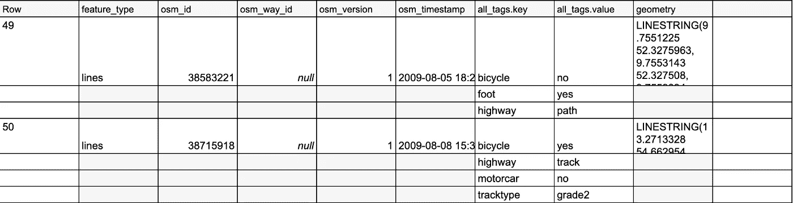

# 数据集成—需要考虑的事项

> 原文：<https://towardsdatascience.com/data-integration-things-to-consider-d557ca97b2f1?source=collection_archive---------27----------------------->

## 对源系统的依赖性是什么？

约翰·福勒在 [Unsplash](https://unsplash.com/t/nature?utm_source=unsplash&utm_medium=referral&utm_content=creditCopyText) 上的照片

当将数据从系统 A 集成到系统 B 时，数据工程师和其他利益相关者不仅应该关注数据过程，例如通过 ETL/ELT，还应该关注源系统。必须考虑的各种情况以及我从早期项目中学到的内容如下:

## **供货情况**

源系统何时可用？你必须考虑维护周期、停机时间等。否则，如果系统不可用，数据集成过程将无法工作，或者只能捕获部分数据。这里，**实现对源系统的监控并使用重试机制**是有意义的(阅读[此处](/five-best-practices-for-stable-data-processing-99304b18360e)了解更多信息[1])。另一个主题是必须考虑的时间窗口，这将影响以下主题:

## **加载次数**

从源系统加载数据需要多长时间，我的进程在满负荷状态下访问源系统需要多长时间？例如，如果您正在进行批量加载或处理大量数据，对于大型数据库来说，这通常需要更长的时间——如果这需要太长时间或给源系统带来太多负载，您应该使用 **CDC 技术或数据库复制服务**。此外，您可以检查**源系统不得从数据传输中接收任何不必要的负载，例如在高峰时间**。我经历的一个例子是，到了月底，每月的财务报表对系统产生了很大的影响——在这里，数据处理作为额外的开销被更好地避免了。

## **不同的数据结构**

在大数据的新世界中，**基于列的非关系数据库和数据仓库正在兴起**。但是如果您有一个经典的数据库作为源系统，那么您必须在 ETL/ELT 过程中考虑这一点。例如，**如果数据来自源系统，那么在最先进的数据仓库服务**中对其进行反规范化是有意义的，比如 Google 的 Big Query 或 Amazon 的 Redshift，并在嵌套数组结构中对其进行处理。这不仅提高了速度，还带来了成本效应[2]。

BigQuery 中嵌套数据的示例—按作者排序的图片

## **不同的数据类型**

**源系统和目标系统可能具有不同的数据类型**。一个经典的例子是，Oracle 数据库处理 0 和 1 或 char 'y '和' n' [3]，而其他技术处理布尔值。为了便于以后的数据处理，例如通过 BI 工具，转换这些数据也是有意义的。

## 商业背景

除了这些技术点，**一般你还应该对源系统背后的业务有一点了解**。它到底是做什么的，背后的业务流程是什么，数据是由谁或通过什么生成的。

业务流程插图—作者图片

这总是帮助我，例如，快速理解数据错误，以有意义的方式设计数据转换，并且，如果必要的话，优化源系统以便优化后续的分析过程。

## 摘要

通过在数据集成项目中的一些经验，我清楚地认识到，不仅关注数据过程和目标系统，而且关注源系统总是有意义的。无论如何，作为项目经理或产品负责人，理解业务流程是至关重要的。这也适用于映射该过程的系统。以下是我认为最重要的几点，对于任何数据集成项目来说都要牢记在心。

## 资料来源和进一步阅读

[1] Christian Lauer，[稳定数据处理的五个最佳实践](/five-best-practices-for-stable-data-processing-99304b18360e) (2021)

[2]谷歌，[避免重复的连接和子查询](https://cloud.google.com/bigquery/docs/best-practices-performance-output#avoid_repeated_joins_and_subqueries) (2021)

[3] O'REILLY，[Oracle PL/SQL Programmin](https://learning.oreilly.com/library/view/oracle-plsql-programming/0596003811/)g(2021)