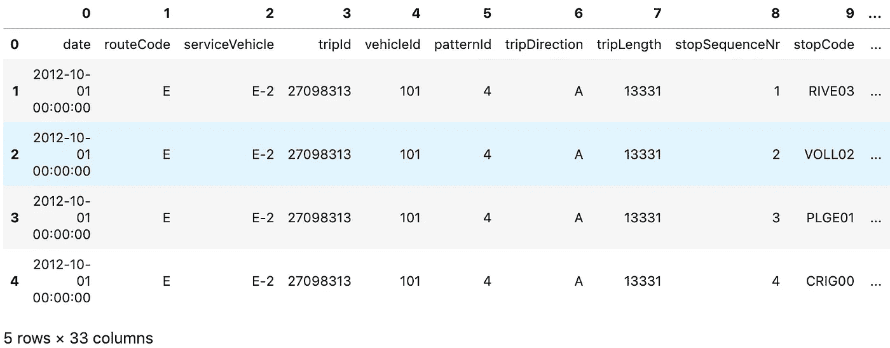
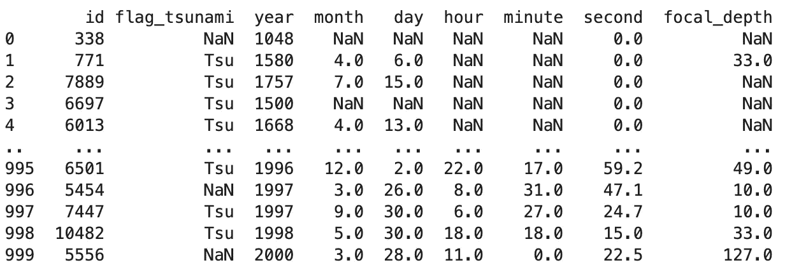

# 与熊猫的数据集成

> 原文：<https://towardsdatascience.com/data-integration-with-pandas-b7deaa4f0f31?source=collection_archive---------21----------------------->

## 如何轻松导入数据


在 [Unsplash](https://unsplash.com/s/photos/pine?utm_source=unsplash&utm_medium=referral&utm_content=creditCopyText) 上由[Duan veverkolog](https://unsplash.com/@veverkolog?utm_source=unsplash&utm_medium=referral&utm_content=creditCopyText)拍摄的照片

对于通过 Jupyter Notebook 进行的即席数据分析，您通常需要通过 CSV、Excel 或数据库获得外部数据，以便使用 Python 对其进行处理。多亏了**便利的熊猫图书馆**，阅读数据相对容易。在本文中，我为您总结了标准流程。当然，您也可以将相同的错误用于以后的标准化和集成的数据集成过程，比如您的数据仓库的 ETL。

## 主要使用案例

下面是我选择的最常用的命令和源代码。如果你也想尝试一下，你可以简单地使用 **Jupyter 笔记本在线**——点击[这里](https://jupyter.org/try)【1】。

**从 CSV 文件中读取**

一个非常典型的第一个用例当然是著名的 CSV 文件，它要么作为源系统的转储提供给您，可以在线检索，要么自动存储在一个文件夹中。

```
import pandas as pdpd.read_csv(‘yourfilename.csv’, header=None, nrows=5)
```

在**导入熊猫**和通过 *read_csv* 导入文件后，您将已经看到成功:



导入的数据-按作者分类的图像

**从谷歌工作表中读取数据**

和上面一样，但是有一个谷歌表单链接— **注意你在**之前就把表单发布到网上了。(转到文件→发布到网站[2])

```
import pandas as pdnew_google_sheet_url = ‘[https://docs.google.com/spreadsheets/d/e/2PACX-1vQ8lv36OQPiqgfFjdgJF9clvwhhh2Ao2xDzkIzYp2g1CqBbpLsnW5nefPsPVOKKBX2PdFVX6Mweyyut/pub?gid=1696994381&single=true&output=csv'](https://docs.google.com/spreadsheets/d/e/2PACX-1vQ8lv36OQPiqgfFjdgJF9clvwABn2Ao2xDzkIzYp2g1CqBbpLsnW5nefPsPVOKKBX2PdFVX6Mweyyut/pub?gid=1696994381&single=true&output=csv')df=pd.read_csv(new_google_sheet_url)
```

瞧:



导入的数据-按作者分类的图像

**从数据库中读取数据**

除了 CSV 和其他类似的文件，你还会经常将数据连接到数据库——这里，除了 Pandas，我们还需要 sqlite3 模块[3]。

```
import pandas as pd
import sqlite3
```

成功导入数据后，我们现在可以通过 SQL 字符串轻松地查询表:

```
# Read via SQLite databases
con = sqlite3.connect(“your.database.link”)
#Read table via Select Statement
player = pd.read_sql_query(“SELECT * from Table”, con)
#close the connection
con.close()
```

**其他可能的数据来源**

除了上面提到的标准数据源，当然还有许多其他可能的数据源，例如像 Google Big Query 和 Amazon 的 Redshift 这样的数据仓库技术，甚至是 NoSQL 数据库。在这里，你会经常找到可下载的 Pythons 库[4]。

## 摘要

无论是通过 Jupyter Notebook 进行的临时数据分析，还是后来的标准化和自动化数据集成流程，通常都需要文件或数据库等外部数据源。这些可以很容易地用工具集 Python、Pandas 和其他可能的库连接和查询。在本文中，作为概述提到了最常用的数据源，其他数据源通常可以通过其他第三方库访问。

来自 giphy.com 的 Gif 图片

## 资料来源和进一步阅读

[1]Jupyter.org，[主页](https://jupyter.org/try) (2021)

[2] [朱可夫格林](https://stackoverflow.com/users/4351027/zhukovgreen)，[斯塔克韦尔弗洛](https://stackoverflow.com/questions/24063629/loading-a-generic-google-spreadsheet-in-pandas) (2016)

[3] pythoncentral.io，[Python 中的 SQLite 介绍](https://www.pythoncentral.io/introduction-to-sqlite-in-python/) (2013)

[4] Google，[使用 BigQuery 存储 API](https://cloud.google.com/bigquery/docs/bigquery-storage-python-pandas) 将 BigQuery 数据下载到 pandas(2021)