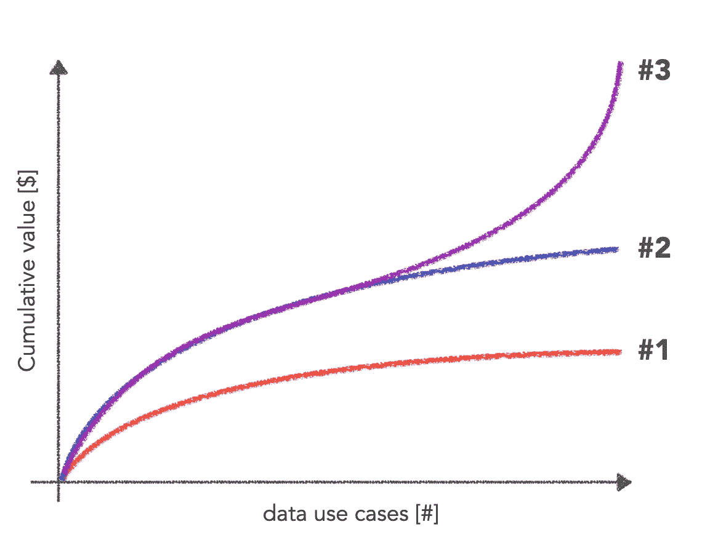
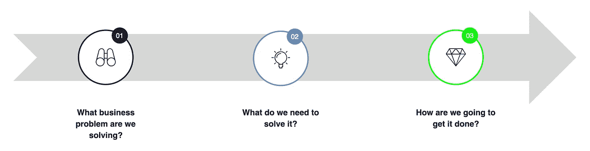
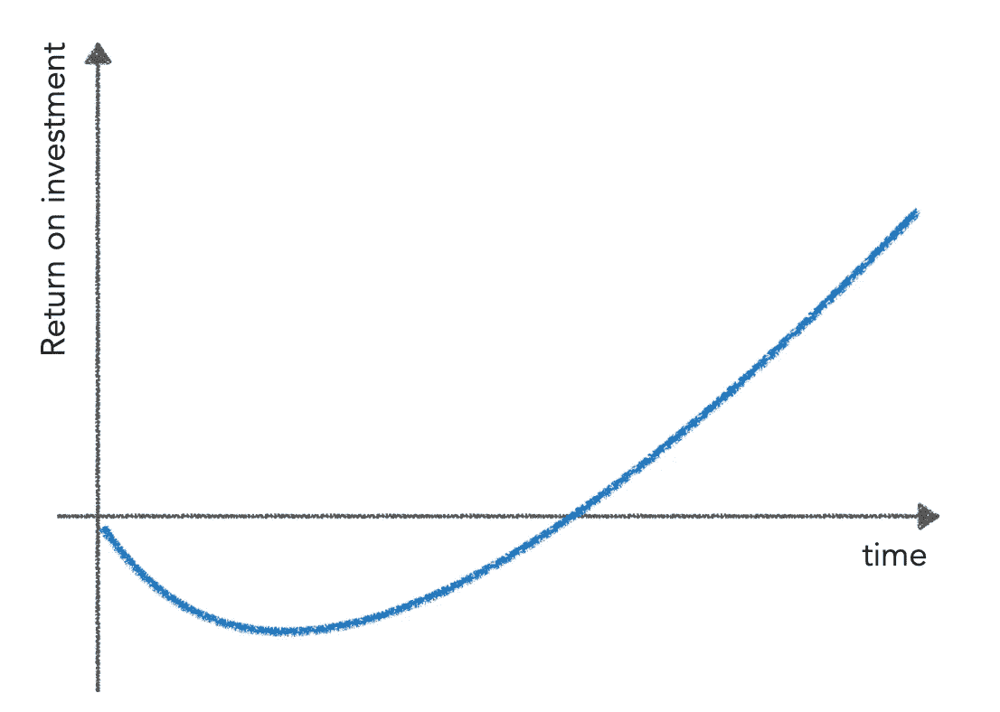
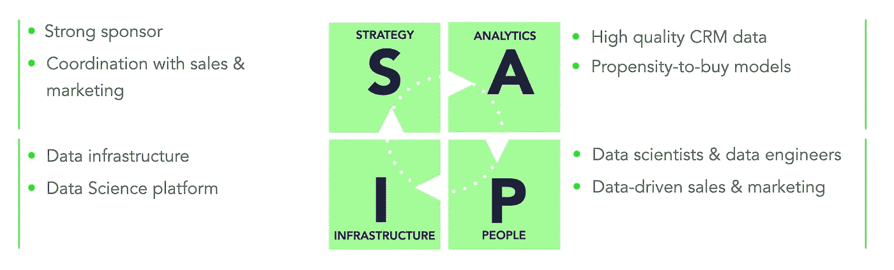
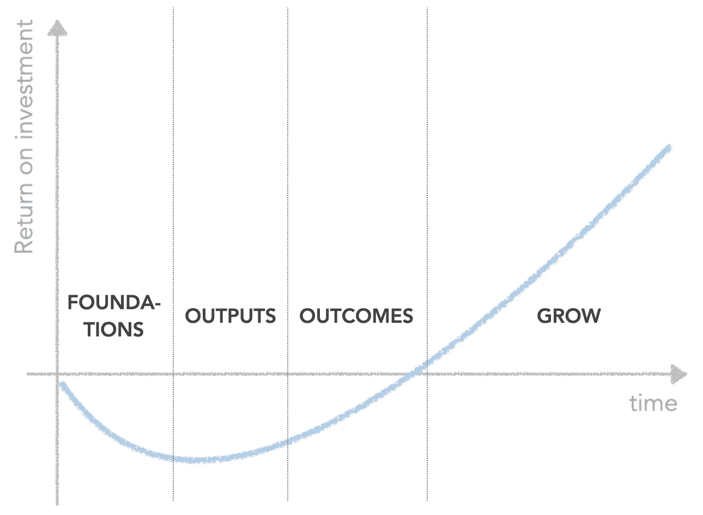

# 数据是一种资产。它的价值是什么？

> 原文：<https://towardsdatascience.com/data-is-an-asset-what-is-its-value-464013d62640?source=collection_archive---------13----------------------->

## 像高管一样思考数据。

*本文是我在* [*大数据黄金时间 2021*](https://bigdata.primetimefor.cz/en/program) *大会上的演讲翻译。*

作者在演讲中。|[jiří·江田的照片](https://www.flickr.com/photos/34231398@N03/51674525903/in/album-72157720187223615/)

我我们都明白 ***数据有值*** 。这就是为什么公司大量投资数据，也是为什么这么多人选择数据作为他们的职业道路。

此外，数据也符合国际财务报告准则(IFRS)或经合组织(OECD)标准对资产的定义。

> 资产是由实体控制的资源，是过去事件的结果，预计未来的经济利益将由此流入实体。

尽管数据是一种有价值的资产，但我们并没有发现它在资产负债表中有所体现。这是为什么呢？道格·兰尼是《信息经济学》的作者，这本书是关于信息货币化和估价的。

2001 年对世界贸易中心的袭击不仅导致了悲惨的生命和财产损失。存储在双胞胎物理服务器上的大量数据也不可逆转地丢失了。

这吓坏了保险公司。想象一下，所有客户列表、历史交易和订单的价值会是多少！为了安全起见，他们将信息资产排除在保险单之外。他们没有浪费时间让这些轮子运转起来—信息资产的排除在攻击后的一个月内就完成了。而会计师在 2004 年[跟进，断言数据不算](https://www.iasplus.com/en/standards/ias/ias38)(无法投保时)。

但是，这并不意味着数据完全没有价值！相反，它的价值是一种固有的属性；这不是权威可以决定的。数据的价值取决于市场及其参与者。因此，我们看到许多数据市场正在兴起，公司在那里出售和购买数据集。想想看，有很多公司的产品无非就是把各种类型的数据提供给别人使用。

而且[数据甚至可以被用作抵押品](https://www.forbes.com/sites/douglaslaney/2020/07/22/your-companys-data-may-be-worth-more-than-your-company/?sh=4fb063ae634c)，就像联合航空公司和美国航空公司在新冠肺炎疫情期间所做的那样。每家航空公司的客户忠诚度项目数据价值约 200 亿美元。

由[克里斯蒂安·兰伯特](https://unsplash.com/@_christianlambert?utm_source=medium&utm_medium=referral)在 [Unsplash](https://unsplash.com?utm_source=medium&utm_medium=referral) 上拍摄的照片

对保险公司来说没有价值的东西，对银行来说却有巨大的价值，这难道不有趣吗？但是他们是怎么得出这个数字的呢？我们如何评价一个数据集？

有句话叫做*‘情人眼里出西施’*。这与买卖双方对数据价值的讨论有关。通常，卖方的观点通常基于构建数据集所产生的成本以及对买方业务影响的估计。另一方面，购买者在评估可能的业务影响的同时，也在估算建造成本(一个“购买还是建造”的决策)——他们通常可以准确地估算。导致卖方和买方之间某种程度上对称的信息不对称。

在现实生活中是如何运作的？我见过这样的例子，卖家认为数据集的价值比买家认为的高 10 倍。价格谈判中无法弥合的巨大差距。不过，我敢肯定，其他潜在买家对同样的价格会更满意。因为，就像我说的，情人眼里出西施。

但是请注意，卖方和买方都在考虑商业利益。那是因为**数据的经济价值** 绝对关键。

我们都见过数据如何被用来制定更好的决策、提高运营效率，甚至产生新的收入流的例子。所有这些都会直接影响公司的 P&L，进而影响其价值。

当考虑经济价值时，我建议采纳比尔·施马尔佐的建议，他在帮助我们理解数据经济学方面做了大量工作。[他说](https://hyperight.com/how-to-monetise-your-data-to-fuel-growth-in-your-business-chat-with-bill-schmarzo/)，那:

> “你不能孤立于业务来确定数据的价值。”

数据有许多独特的属性，不会耗尽、恶化，可以使用和重复使用。多亏了这些，[正如比尔解释的](https://www.datasciencecentral.com/profiles/blogs/schmarzo-s-economic-digital-asset-valuation-theorem-formulas)，我们对数据做得越多:边际成本变平(下图中的效果#1)，经济价值增长(效果#2)。

而且，数据还可以并行多种用途！想象一下，一个客户数据集正被用来确定定价、产品推荐以及针对单个客户的营销活动。当我们提高此类客户数据集的质量，或者我们添加一个新的相关功能时，它会对依赖它的所有数据解决方案产生影响。因此，经济价值加速增长(效应#3)。

Schmarzo 的经济数字资产估值定理|来源:Bill Schmarzo，大数据 MBA |图片由作者提供

那么，x 轴上有哪些数据用例呢？

对我来说，一个数据用例、数据项目、数据计划，甚至整个数据策略都是关于三个问题的:

作者图片

问题 1 将我们的数据项目与业务联系起来。重要的是，它还提供了经济价值的衡量标准(如 ARR、运营成本等)。

第二个问题需要整体回答，因为我们很少只需要数据和分析。我们必须考虑战略联盟、基础设施，可能还有最重要的人。这个问题的答案也让我们对投资的情况有所了解。

最后，第三个问题形成了一个可行的计划。它让我们能够对经济效益和投资进行排序。

我听到你们问，随着时间的推移，数据投资会有什么样的表现？与任何其他投资类似，数据投资回报率遵循熟悉的投资 J 曲线。

作者图片

这里要提到两个要点:

1.  **时间不会停止。**因此，如果我们想在一年内将数据的经济价值最大化，我们不应该浪费六个月的时间去想该做什么。
2.  J 曲线的形状只是一个估计。没有人能保证下跌不会更深，或者甚至会回升，或者足够快地达到盈亏平衡，或者会像预期的那样继续急剧增长(并且持续足够长的时间)。

投资 J 曲线并不新鲜。然而，对数据的投资往往不像其他投资那样得到认真管理。

在我的职业生涯中，我曾在公司、咨询公司、初创公司和私募股权公司工作过。仅从我自己的经验来说，我提出这些看法:

*   在企业中，我们经常估计未来的影响来证明年度预算的合理性。实际影响很少被衡量。
*   顾问在“销售”单个项目的投资回报率，因此客户最终会得到几十条“J 曲线”(客户流失模型、数据仓库、新 ERP、Tableau 实施等)，这些曲线很难汇总，也不会重复计算收益或错过任何投资。
*   对初创企业的数据投资往往受到下一轮投资对估值的影响。因此，收益的实现往往被推迟。
*   私人股本领域似乎得到了认真的管理。一位私募股权投资者收购了一家由关键业务指标驱动的公司，并计划在 5-7 年内出售该公司并获利。因此，数据投资的关键是对这些关键业务指标产生影响。在最初几年大量投资。透过 J 曲线观察投资组合中的公司，在公司从上升轨迹中受益时卖出(甚至为下一个收购者留下一些价值)以支撑估值。

那么，它在现实生活中是什么样子的呢？

举例来说，让我们考虑 SaaS 的 B2B 技术业务。这些公司的共同业务问题(请记住定义数据项目的第一个问题)是通过增加交叉销售和追加销售来推动 ARR(我们的关键业务指标)。

接下来，我们需要考虑需要什么来解决这个问题(数据项目的第二个问题)。在 [DataDiligence](https://www.datadiligence.com) 我们使用 SAPI 框架来提醒自己所有影响数据项目成功的重要因素。让我们看一个快速的高级示例。

*   从**战略**的角度来看，我们可能需要一个强大的赞助商，以及数据、销售和营销部门之间的紧密合作。
*   谈到**数据和分析**，可能需要高质量的 CRM 数据和购买倾向模型。
*   我们需要数据专家来构建 x-sell 模型。我们还需要确保销售和营销团队做出数据驱动的决策，并帮助将倾向得分转化为销售额。我们不要忘记，推动数据文化和采用的是**人**。
*   我们显然需要一个数据基础设施来运行这一切。包括构建和操作模型的数据科学平台。

SAPI 框架由 DataDiligence 有限公司提供，图片由作者提供

现在来谈谈与数据项目相关的第三个问题——我们如何完成它？我不会讲太多细节，因为这是每种情况的独特之处。但是从经济价值的角度来看，路线图通常包含四个阶段。

1.  首先，我们关注基础——建立数据基础设施，获取数据等。
2.  接下来，我们构建数据输出—我们示例中的购买倾向模型。
3.  然后，我们与销售和营销同事合作，利用这些来推动 x 销售(期望的业务成果)。
4.  最后，我们推出它，尽可能扩大影响范围，并尽可能延长影响时间。

作者图片

因为**数据是一项战略投资**并且应该如此对待，我们需要在路线图上附加一个投资计划。这通常包括所需的所有投资(资本支出、OPEX、基础设施、人员……)、对关键业务指标的影响(在这种情况下为 ARR)以及对现金流和 EBITDA 的影响(例如)，按季度或任何其他合理的时间段衡量。

只有这样，我们才能正确管理项目——平衡投资和业务影响，同时处理数据项目的非线性、R&D 性质。通过这种方式，我们可以做出战术和运营决策，以便在需要时让项目回到正轨，并从错误中吸取教训以备将来之用。

我经常被问到的一个问题是，当有这么多其他因素在起作用时，我如何将数据项目对业务指标的影响归因于其他项目、竞争、营销活动、总体市场形势等。答案是用数据驱动决策！在我们的例子中，我们可以使用 A/B 测试，也许甚至包括一个*安慰剂*组。评估它们，并尽可能准确地评估数据项目的实际影响。

让我们假设项目进展顺利，对 ARR 的影响超出了预期。接下来呢？

要回答这个问题，我们需要回到数据经济学。

Schmarzo 的经济数字资产估值定理|来源:Bill Schmarzo，大数据 MBA

并遵循这些步骤来最大化我们成功的机会:

1.  制定一个数据策略来很好地排序用例。
2.  开始！(时间不停。)
3.  做一个接一个的项目，建立在成功(和教训)和数据本身的基础上。

这是我们能够系统地实现数据经济价值的唯一途径。

这是最主要的。

数据是一种资产。流汗！

***感谢阅读！***

***欢迎在评论中分享你的想法或观点。***

***跟我上*** [***中***](https://adamvotava.medium.com/)*[***领英***](https://www.linkedin.com/in/adamvotava/) ***和*** [***推特***](https://twitter.com/_adam_votava) ***。****