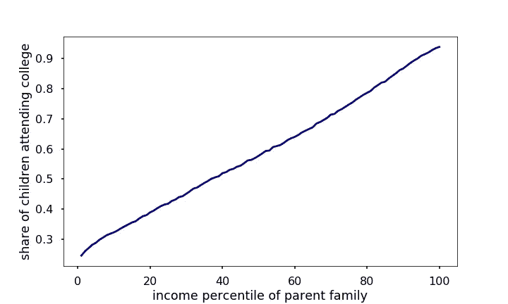
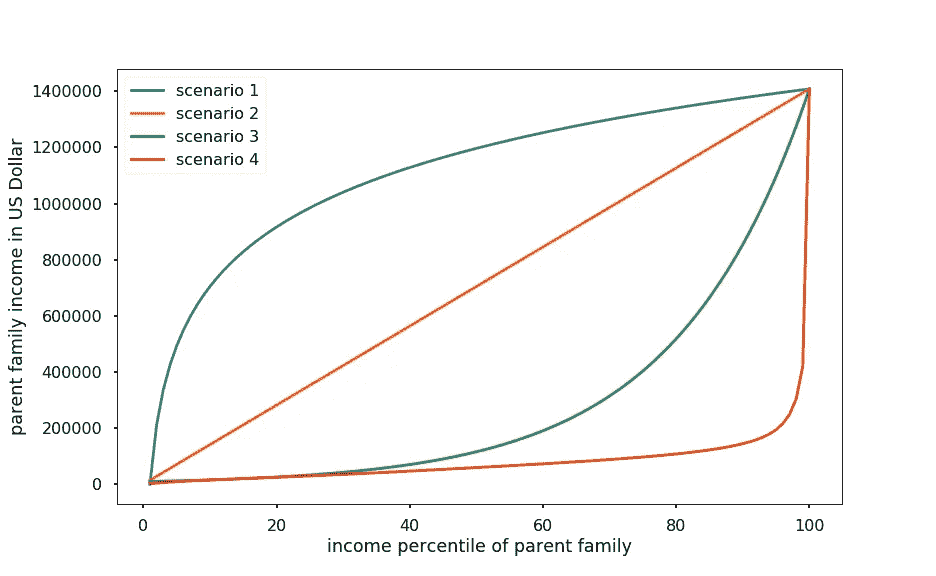
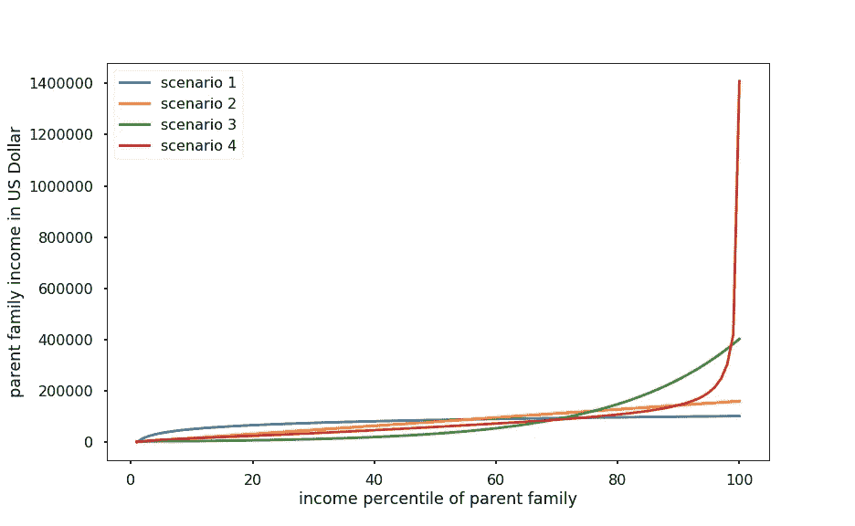
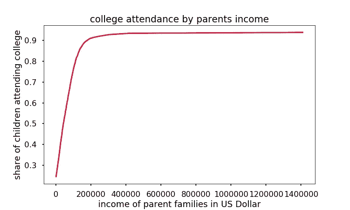
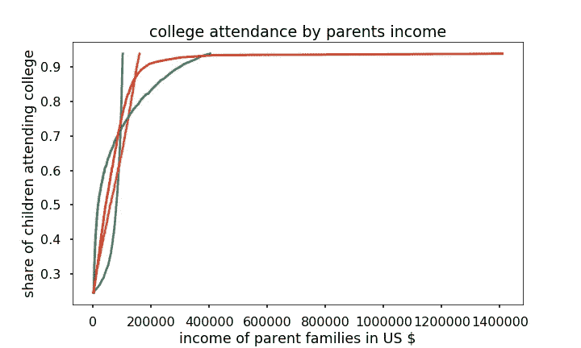
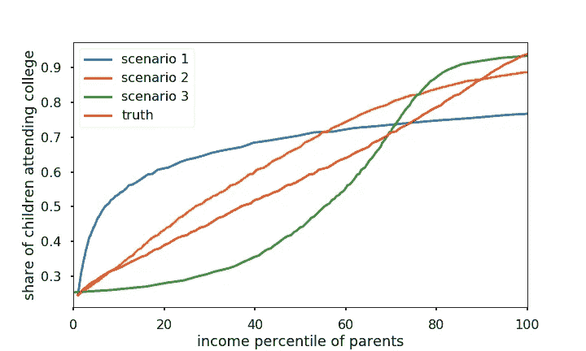

# 数据堵塞会议:父母收入如何决定孩子上大学的概率

> 原文：<https://towardsdatascience.com/data-jam-session-digging-into-the-nyt-teaser-about-college-rate-versus-parent-income-99408e45e4b5?source=collection_archive---------39----------------------->

## 受《纽约时报》数据可视化的启发，我对大学出勤率和家庭收入之间的关系做了更深入的研究

照片由 [**凯拉·伯顿**](https://www.pexels.com/@keira-burton?utm_content=attributionCopyText&utm_medium=referral&utm_source=pexels) 发自 [**Pexels**](https://www.pexels.com/photo/cheerful-diverse-classmates-studying-in-park-6146970/?utm_content=attributionCopyText&utm_medium=referral&utm_source=pexels)

5 月 14 日,《纽约时报》的时事通讯中有一个链接，链接到一个数据，即“穷人”和“富人”家庭的孩子上大学的可能性有多大。读者被要求在一张图上画一条线，y 轴是孩子上大学的比例(一个 0 到 1 之间的数字)，x 轴是父母收入的百分比。
你可以试试[这里](https://www.nytimes.com/interactive/2015/05/28/upshot/you-draw-it-how-family-income-affects-childrens-college-chances.html?campaign_id=9&emc=edit_nn_20210514&instance_id=30809&nl=the-morning&regi_id=119956320&segment_id=58039&te=1&user_id=7bfb48191e644dd8f497d044991861fb)看看你的最佳猜测有多准。

正确的曲线如下所示:

图 1:上大学的孩子的比例和他们父母收入的百分比之间的关系大致是线性的。

这或多或少是一条直线。这意味着父母的收入百分位数和他们的孩子上大学的概率之间存在线性关系。NYT 的文章声称，这种关系让许多读者感到惊讶，因为他们中的许多人都误解了。

我认为这个*惊喜*可能不是因为数据，而是因为选择的指标:**收入百分位数**。当我和大多数人读到“富人”和“穷人”这两个词时，他们脑海中浮现的是实际收入。根据收入分布，即多少人赚了多少钱，相邻的收入百分位数可以对应非常不同的收入。你知道收入排在第 90 位的美国人的平均收入是多少吗？这与第 95 百分位的收入相比如何？大概不会。

在这个小小的数据堵塞会议中，我们将使用上面图[1]中的数据，添加收入分布信息以更好地解释它，并构建一个简单的大学出勤率模型。

我们将

1.  讨论为什么我们应该把大学入学率看作是父母收入和父母收入百分比这两个指标的函数，
2.  探索上面的图如何转化为不同收入分布的大学比率与收入的关系，
3.  查看并理解这个数据样本的真实收入分布，
4.  使用真实的大学入学率与收入的关系来预测如果收入分配不同，有多少(或少)孩子可以上大学。结果可能*其实* *会让*你大吃一惊！

## 收入百分比与收入

那么，哪个指标更能说明问题:实际收入还是收入百分比？首先，让我们回顾一下百分位数的定义:

> 第 10 百分位的家庭收入低于样本中 90%的家庭，收入高于样本中 9%的家庭。

使用 x 轴上的百分位是有意义的，因为它允许您对总体进行量化陈述。例如，我们可以粗略地看到，50%家庭的孩子上大学的机会不到 55%。这一指标还有一个很好的特性，即曲线下的面积是上大学的儿童总比例的估计值。对于这个数据集，我们得到 58.3%。(这是假设孩子的数量不太依赖家庭收入。)

然而，有人会说**决定一个年轻人能否上大学的相关数字不是他们父母的收入与其他父母的收入相比如何，而是他们的收入与高等教育成本相比如何。**

为了理解为什么上面的曲线或多或少是一条直线，包括在较高的收入百分位数(人们会期望它变平，因为每个人都应该能够负担得起大学，对不对？)，我们遗漏的关键信息是收入百分比和实际收入之间的关系。

## 看看不同的收入分配方案

为了说明，让我们对可能的收入分布进行一些猜测，即父母在每个百分点的家庭收入:

图 2:不同的收入分配情景；一个是我们数据集中真实的收入分布。你能猜出是哪一个吗？

让我们花一分钟来了解它们。

*   情景 1 低收入的人很少，高收入的人很多。第 50 百分位和第 90 百分位的收入没有太大差别，这意味着收入最高的 50%的人赚的钱非常相似。你可以说这是一个更加公平的社会的收入分配。
*   场景 2 是线性关系。第 20 和第 30 百分位之间的收入差距与第 80 和第 90 百分位之间的收入差距相同。所有输入箱等间距分布。
*   在情景 3 中，相邻百分位数之间的收入差异随着百分位数的增加而增加。这意味着从第 20 个百分点到第 21 个百分点的收入增长比从第 90 个百分点到第 91 个百分点的增长要小得多。在这种情况下，富人赚的钱比穷人多得多。
*   情景 4 是百分位数低于 75 的线性关系和百分位数高于 75 的指数关系的混合。在这种情况下，收入较高的那几个百分比的人比所有其他人赚的钱都多，包括那些收入在 90%的人，而收入较低的人有更多类似的收入。

**这些*场景中的一个*是真实分布(对于这个数据集)，你大概能猜到是哪一个？**

没错，就是场景 4(红色曲线)！

你可能已经注意到这些场景有些奇怪:它们有不同的资金总量(曲线下的区域)。为了解决这个问题，我们将它们归一化到曲线下的公共区域:

图 3:当对所有收入组求和时，确保我们所有的收入方案都有相同的总收入。

请注意，因为现在货币总量是守恒的，所以不同情景下最高收入人群的收入差别很大。

## 大学出勤率与实际收入

图 6:在基于实际数据的场景 4 中，大学出勤率在收入约 20 万时开始饱和。

如果我们将孩子上大学的比例与实际家庭收入(以美元计)进行对比，我们会发现 90%的比例在家庭收入接近 20 万美元时达到，这比美国人的平均收入高得多。

对照实际收入绘制所有场景，我们得到:

图 7:在所有收入分配方案中，上大学的儿童比例与家庭收入的关系图。

表明在其他情况下，我们已经在低得多的收入下实现了 90%的大学入学率。

**这说明了了解实际收入分布(百分位数和收入值)的重要性，以便充分掌握 NYT 时事通讯(图 1)中的信息。**

有了这个认识，让我们继续，看看我们是否可以做一些进一步的分析。

## **预测不同收入分布的大学入学率**

到目前为止，我们保持了收入百分比和大学出勤率之间的固定关系。正如我在开始时所说，这是不现实的。相反，人们会认为上大学的可能性取决于实际收入(美元)以及它与大学教育成本的对比。

如果我们确定实际收入(美元)和大学费用之间的关系(如果我们知道真实的收入分布，我们可以这样做)，我们可以推导出在不同的收入分布情况下，有多少孩子能够上大学。(请注意，该模型隐含假设高等教育成本独立于收入分配)。

图 8:不同收入分配情景下上大学的儿童比例。假设上大学的概率是由父母的收入决定的，而不是与其他收入相比。

红线表示我们从第一个图开始的真实数据。场景 4 是真实的:在这个数据样本中，收入与百分位数的关系是线性的，除了在最高收入区间，它变成了指数关系。收入最高的家庭平均收入为 140 万美元，而收入倒数第二的家庭收入不到这个数字的三分之一。第 90 百分位的家庭平均收入为 15 万美元。这解释了为什么即使在高收入百分位数的情况下，大学出勤率仍然线性地依赖于收入百分位数，也解释了为什么当被要求画出图 1 时，许多人会弄错。

我们在开始时已经计算过，真实数据样本中上大学的儿童的总百分比是 58.3%。我们现在可以计算其他收入分配情景的百分比:

*   情景一:63.5%
*   情景二:62.5%
*   情景 3: 50.0%

场景 3 比我们的基线场景(事实)拥有更多的高收入家庭，其大学入学率只有 50%。这是因为在这种情况下，中产阶级下层最终会拿回家更少的钱，这将他们的许多孩子排除在大学之外。即使在我们最公平的收入分配方案中，我们也只能提高 4-5%的大学入学率。
这是为什么？
如果你回到图 6，你会发现中低收入人群上大学的概率随着收入的增加而急剧增加。

**为了将大学入学率提高到 60%以上，我们需要让大多数家庭的收入超过 6 万美元**

*或*

降低高等教育的成本。

# 摘要

我们已经看到，在分析大学出勤率时，父母的收入百分位数和收入都是需要考虑的重要指标。

我们已经了解到，在美国，父母的收入在收入较低的 75%的人群中呈线性增长，而在收入较高的 25%的人群中呈指数增长。

基于大学学费取决于实际收入以及实际收入与大学费用的比较这一假设，我们发现，即使收入分布完全不同，大学学费的变化也不到 5%！

对我来说，这是这个数据集真正的惊喜。这表明，提高大学出勤率，尤其是低收入家庭孩子的大学出勤率的最有效方法是降低高等教育的费用。然而，这个想法需要在将来的另一个数据阻塞会议中进行探索！

现在，我希望你喜欢这个。你可以在这里找到随附的 jupyter 笔记本。

# **参考文献:**

我使用的数据是公开的，是从 https://opportunityinsights.org/[下载的。](https://opportunityinsights.org/)

数据链接:[https://opportunity insights . org/WP-content/uploads/2018/04/Statistics _ By _ Parent _ or _ child _ Income _ percentile . xlsx](https://opportunityinsights.org/wp-content/uploads/2018/04/Statistics_By_Parent_or_child_Income_Percentile.xlsx)

它最初被编译并用于本文:

[1] R. Chetty，N. Hendren，P. Kline 和 E. Saez *《机会之地在哪里？《美国代际流动的地理》* (2014 年)，《经济学季刊》

论文链接:https://www.nber.org/papers/w19843

引发这一分析的《纽约时报》数据可视化:

[https://www . nytimes . com/interactive/2015/05/28/upshot/you-draw-it-how-family-income-affects-children-college-chances . html？campaign _ id = 9&EMC = edit _ nn _ 20210514&instance _ id = 30809&nl = the-morning&regi _ id = 119956320&segment _ id = 58039&te = 1&user _ id = 7 bfb 48191 e 644 DD 8 f 497d 044991861 FB](https://www.nytimes.com/interactive/2015/05/28/upshot/you-draw-it-how-family-income-affects-childrens-college-chances.html?campaign_id=9&emc=edit_nn_20210514&instance_id=30809&nl=the-morning&regi_id=119956320&segment_id=58039&te=1&user_id=7bfb48191e644dd8f497d044991861fb)

任何想法和数字(如无特别说明)均为本人所有。