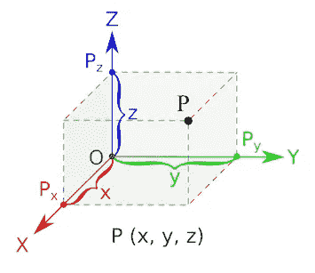
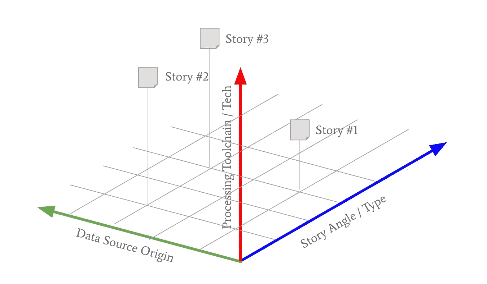
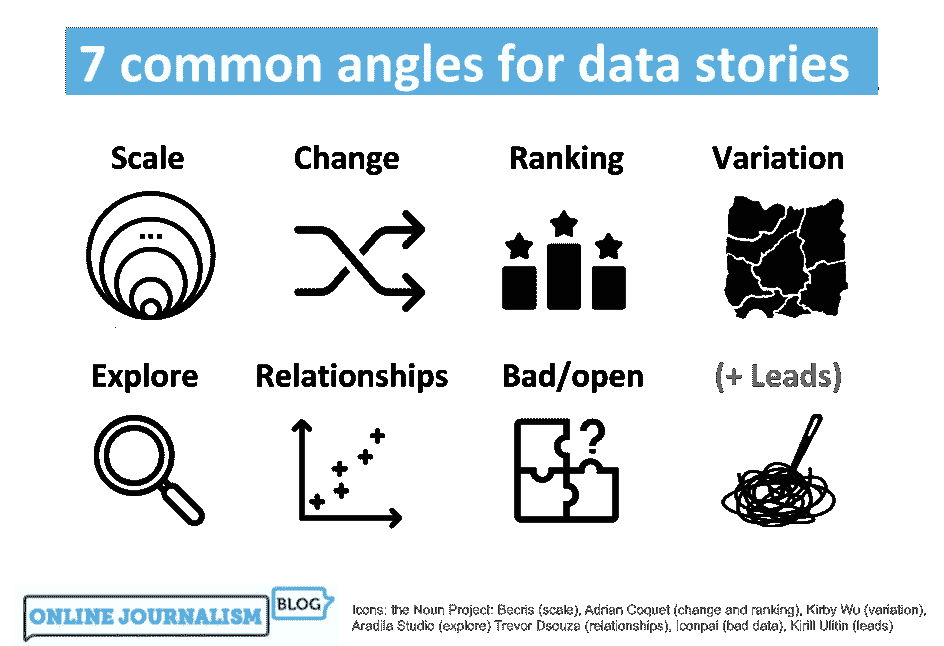
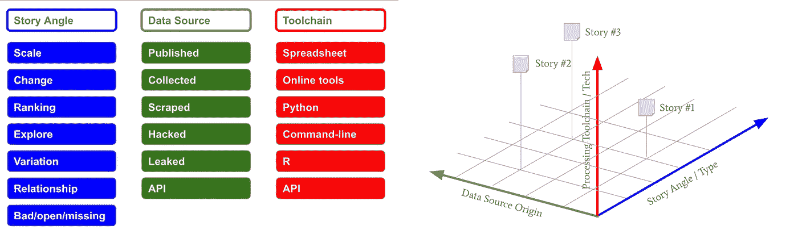
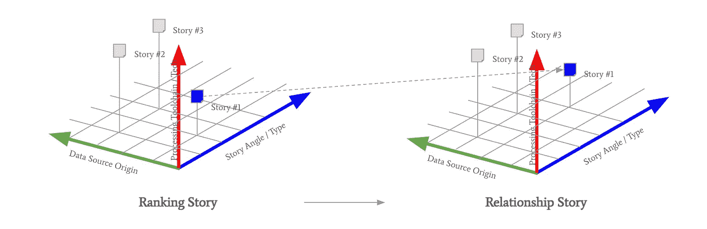
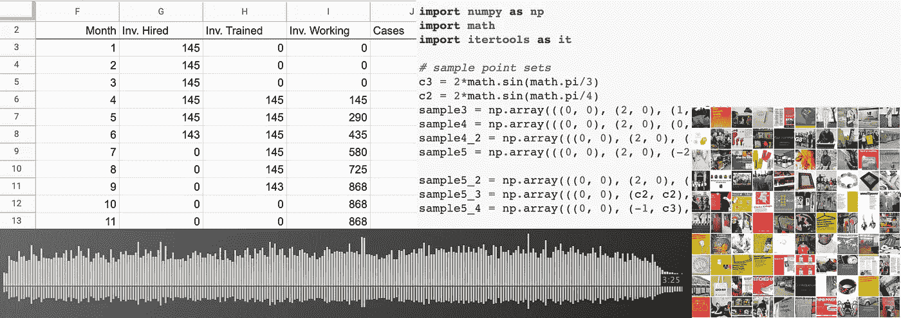
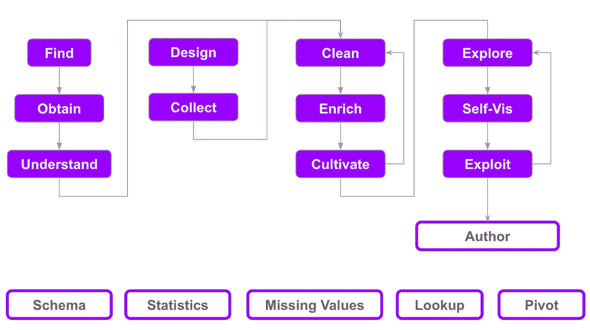

# 数据新闻，一种三维空间投影

> 原文：<https://towardsdatascience.com/data-journalism-3d-spatial-projection-a54c96137c6a?source=collection_archive---------37----------------------->

## [数据新闻](https://towardsdatascience.com/tagged/data-journalism)

## *一个将数据新闻知识解构为几个主要筒仓的框架。*

*【作者表示有兴趣利用这一框架为不发达国家和偏远地区的在职记者提供数据新闻培训】。*

# 数据新闻

1848 年，美国国会议员霍勒斯·格里利利用他对旅行报销记录的访问权，为纽约州论坛报撰写了一篇报道，以**文本和表格**的形式，列出了“每个国会议员的姓名，以及他获得的里程数、邮路可能给他的里程数，以及他们之间的成本差异。”([汉密尔顿，2016](https://journals.sagepub.com/doi/abs/10.1177/1077699017701926) )。

来源: [pixabay](https://pixabay.com/vectors/coach-horse-horse-drawn-stagecoach-2027207/)

这种数据新闻的行为可能比该领域的定义早了 150 多年，但仍然包含了目前范围内的大部分元素。

2014 年，亚历山大·本杰明·霍华德教授(哥伦比亚大学)[为数据新闻业提供了一个**现代定义**，即“收集、清理、组织、分析、可视化和发布数据以支持新闻行为的创作”的工作。](https://academiccommons.columbia.edu/doi/10.7916/D8Q531V1)

资料来源:Dror Kessler

# 解构

从表面上看，解构可以被描述为一种批判性分析的方法，这种方法强调概念系统的内部运作，将其分解为**个组成部分以及它们之间的关系**。

汉密尔顿对数据新闻的定义提供了一系列与数据相关的活动，人们可以在创作故事的过程中参与这些活动。通过这样做，他提供了一个**面向任务的**，以及某种程度上连续的、解构的实践视角。

解构的行为有几个吸引力。它允许将一个整体分割成它的组成部分，从而暴露出它的内部结构和内部依赖性。通过识别每个元素，特定的知识可以与其特定的性质相关联，从而有助于**专业化**和深度。

此外，特定解构策略的选择引入了知识的一个额外的**方面，通过识别其独特的使能价值，作为一种视角，或特定种类的透镜，用于获得对整体的理解。**

# 空间投影

因此，我们有理由假设几种不同的解构可以应用于同一个整体，每一种都突出了一个特定的观点，并呼吁关注特定类型的专业化。

组合几个这样的分解提供了一个**多维表示**，每个分解作为这个新空间的一个轴。空间中的每个交叉点都可以用它在每个轴上的投影，用它与每个分解的关系来描述和研究。

来源:[维基媒体](https://commons.wikimedia.org/wiki/File:Coord_planes_color.svg)

我们整个就是数据新闻的实践。我们将大胆地为它的分解提供几个轴，它们一起将形成一个多维空间，数据新闻实践**居住在其中**。

# 提议的解构

我们提出**三个主要分解**，用于将数据新闻描述为一个 3D 空间，以及支持方面的两个额外的**枚举划分**:

*   D1:故事的类型，它的角度。
*   D2:数据性质**来源**。
*   D3: **工具链**/用于处理相关数据的技术。
*   S1:所涉及数据的**格式**。
*   S2: **活动**/完成的任务。

使用这三个主要的分解，我们因此可以**描述**一个特定的数据新闻行为(例如一个故事),根据它是什么类型的故事，它的数据来自哪里，以及我们如何处理它。

资料来源:Dror Kessler

此外，根据行为的性质，我们可能会对数据的格式和感兴趣的特定活动给予**额外的关注**。

本文的其余部分将概述数据新闻的上述五种分解，并提供关于如何使用它们来描述实践的信息。

# D1:故事角度

伯明翰城市大学和 BBC 数据部的保罗·布拉德肖写了关于数据故事的 7 个常见角度。作为第一次迭代，我们将把这个**分解**作为故事角度分解。

布拉德肖写道:

> 我发现实际上大致有七个核心数据故事角度。许多人在讲述故事时将其他角度作为次要维度(例如，一个变化故事可能会继续谈论某件事情的规模)，但我所看的所有数据新闻故事都以其中一个角度为主导。

来源:[在线新闻博客](https://onlinejournalismblog.com/2020/08/11/here-are-the-7-types-of-stories-most-often-found-in-data/)

简而言之，以下是布拉德肖描述的七个角度:

1.  **规模**:“这是一个多么大的问题”
2.  **变化**(和停滞):“这是上升/下降/没有改善”
3.  **排名**(还有离群值):“谁最好，谁最差？谁不寻常，为什么？我们排在哪里”
4.  **变化**:“邮编彩票”，地图和分布
5.  **探索**:工具、模拟器、分析、互动和艺术
6.  **关系**(及揭穿):“事物有联系”——或者没有。网络，权力和金钱的流动。相关性与因果性。
7.  **不良/开放**(问题和解决方案) :不良数据、“无数据”和“获取数据”案例。

# D2:数据来源

数据可能驱动或支持一个故事，可能来自一个或多个来源，通常以数据集**的形式出现。一个故事的数据可能已经存在，或者将被专门收集来支持这个故事。**

一些特定类型的数据源可能会提供独特的机会。例如，一个定期发布的数据集可能会被**预期**一个基于其先前发布的处理代码，并在它可用时导致更快的故事周转。

我们可以识别出数据故事背后通常存在的以下类型的数据源，与特定的数据格式无关

1.  **公布的**:官方定期公布的数据，通常由负责收集和发布的机构公布(如国家统计局)。
2.  **收集的**:由新闻机构以调查和其他研究方法的形式(例如，在特定推文和其他社交网络事件发生时，自动将它们累积到电子表格中)通过手动或自动方式收集和汇总的数据。
3.  **废弃的**:可在线获得(通常在网站上)但无法直接以可用形式获得的数据，因此被自动流程“剥离”。这是数据收集的一个特例，但由于它很常见且意义重大，因此值得独立存在(例如，从在线市场收集产品信息和供货情况，或从 PDF 文件中检索表格)。
4.  **被黑**:通过使用高级分析、监视和其他计算知识密集型方法从可用和受保护的来源获得的数据(例如监测区块链网络的异常事件)。
5.  **泄露**:通过泄密行为或其他形式的披露(如维基解密)提供的数据。
6.  **API** :通过使用由信息持有者提供(或发现被暴露)的应用编程接口获得的数据(例如，随着时间的推移使用特定标签的推文，使用 Twitter API)。

# D3:工具链

一旦数据到了数据记者的手里，它必须被处理，作为研究的一部分，导致一个故事，故事本身的写作，和它的交付给读者。

用于此类处理的工具在复杂性、可用性和用途方面各不相同。一些工具是通用的(电子表格)，而另一些工具需要专业知识(例如人工智能模型)。

一些工具通常以免费网络服务的形式提供(例如 datawrapper 和 fluorescent visualization assistants ),而其他工具则需要安装和付费许可。一些工具可能专门用于特定的任务(例如 open refine——清理数据),而其他工具则是通用和开放的(Python、Jupyter 笔记本和 Pandas 库)。

数据新闻从业者可能会选择集中并拥有(也可以说是掌握)一套特定的工具，这些工具将成为某种工具箱——在数据出现时应用于数据，并快速处理并将其转化为故事形式。

由于这些工具集在整个故事的生命周期中会以连续的方式处理数据，所以这里采用了工具链这个术语。在软件开发中，工具链是一组用于执行复杂软件开发任务的编程工具([维基百科](https://en.wikipedia.org/wiki/Toolchain))。

类似地，在数据新闻中，工具链是一组服务和工具，用于执行与新闻行为相关的数据处理的各个方面。

作为第三个分解轴的一部分，我们建议对工具链进行以下主要分类:

1.  **电子表格**:行/列模态工具，如 Microsoft Excel 和好的工作表。
2.  **在线工具**:互联网上提供的服务，通常是免费的，可以根据设定和定制的模板上传和处理数据。
3.  **Python** (编程):开放式编码，使用一组公共库进行数据处理，笔记本(Jupyter)或 IDE 形式，着眼于一般计算社区。
4.  (编程):开放式编码，使用 RStudio 和一组公共库，着眼于英国和其他新闻/统计社区。
5.  **命令行**(编程):使用 Linux(以及 MacOS)文本处理命令行实用程序进行低级和高吞吐量处理，着眼于黑客社区。
6.  **API** :使用网络可用的编程服务来收集、丰富、处理和发布数据。这个类别是“在线工具”类别的程序兄弟。
7.  **人工智能**:一个横向类别，包含与在数据处理环境中使用人工智能相关的其他类型和方法的工具链。因为这是一种高度专业化的方法，所以它是独立的。

来源:[凯文·霍奇森](https://www.flickr.com/photos/dogtrax/12050717093)

# 中间点

建立了三个主要的分解，角度-源-工具链，我们可以回到数据新闻行为存在的 3D 空间的概念:

资料来源:Dror Kessler

因此，当**将**投影到每个轴上时，每个故事都可以定位在 3D 空间中。此外，story 可能会沿着不同的轴移动，以寻找更有效的角度、替代数据源或工具链来解决处理问题。

例如，一个关于从 Covid 中恢复最慢的西方国家的故事，一个**排名故事**，可能从世界卫生组织公布的数据中提取数据，并由电子表格工具链处理。

发现这个故事缺乏吸引力，人们可能会使用另一个数据集，这次是废弃的，关于选定国家的疫苗接种率，来改变故事的角度，成为一个关系故事。

资料来源:Dror Kessler

在这种情况下，横跨两个轴(角度、源)的**运动**被用于增强故事，同时保持相同的工具链。

或者，一个人可能使用 Excel 处理与一个故事相关的数据，却发现它的**庞大的数据量**使得对数据的探索变得缓慢，从而降低了截止日期的可能性。在这种情况下，工具链开关可以被认为是一种更有效的开关，可能属于**编程**家族，以取得领先。

因此，将这一框架应用于发展中的故事的能力可以为**生成故事**提供一个地图，中途改变方向，并以有效的方式成功完成数据新闻行为。

当一个有抱负的数据记者开始选择要掌握的领域时，它也可以作为一个专业选择系统。

接下来，我们将概述两个额外的枚举分区。

# S1:数据格式

作为补充，我们列举了可能遇到的数据源的格式。

数据格式在某种程度上与**刀具链**轴相关，因为特定的刀具链更**适合**处理某些格式。

与其他分解一样，这种分解有助于数据新闻行为的产生和记者的专业化。

学习**识别数据格式**，基于它们相关的文件扩展名、交付协议和视觉/文本表示，是探索数据源和在网页和文件中找到数据孤岛的一项有价值的技能。

发现以下格式是常见的:

1.  **XLS** (Excel 格式):可以直接加载到 Excel 和类似工具(Google Sheets 等)中的二进制数据文件。该格式描述了一个二维单元格矩阵(一个表)，通常组织为多列数据行，可能带有一个列标题行。一个文件可能包含几个命名的表，通常用于在单个文件中传递相同数据的几个方面。这种文件类型和所有其他格式一样，也可以通过基于编程的工具链(Python、R 等)来访问。
2.  **CSV** (逗号分隔值):可以直接加载到电子表格和其他工具中的结构化文本文件。文件中的每一行(一行)都由分隔符(通常是逗号)分隔的列值组成。该文件可能包含一个列名标题行作为其第一行。与 XLS 相反，这种格式是自然的，不依赖于工具。尽管如此，它的一些限制使这种格式更具技术性，但仍然非常容易理解。
3.  **HTML** (XML/RSS):网页是使用超文本标记语言(HTML)构建的。对这种格式的深入了解对于数据记者在抓取网站以及生成交互式演示文稿(结合 Javascript)时非常有用。作为一种“标记语言”，HTML 与各种 API 和数据源使用的 XML(通用可扩展标记语言)有些关系。RSS 作为 XML 的具体实现，用于新闻和其他提要(播客等)。
4.  **JSON** :代表 JavaScript 对象符号。JSON 是一种存储和传输数据的轻量级格式。当数据从服务器发送到网页时，经常使用 JSON。JSON 是“自描述”的，很容易理解( [w3schools](https://www.w3schools.com/whatis/whatis_json.asp#:~:text=JSON%20stands%20for%20JavaScript%20Object,describing%22%20and%20easy%20to%20understand) )。这种格式经常出现在 HTML(网页)和 REST APIs 中。
5.  **纯文本**(a)数据可能出现在非结构化文本文件中，而不是 CSV。尽管如此，纯文本还是拥有一些固有的特性。文件由行组成，而行由字符组成，通常使用特定的字符集编码。虽然编程环境最适合处理这类文件，但有经验的用户将能够使用电子表格软件来解析这类文本并从中提取数据。
    (b)文本文件可以仅包含文本(例如，演讲或法律的文本)。这种文件可以通过统计和人工智能方法进行语义分析，这些方法可以提取感兴趣的特征，例如词汇、对概念的引用、提到的人和地点等。
6.  **PDF** :一种可移植的文档格式，起源于印刷行业，现在作为一种出版、人类可读的格式非常普遍。以 PDF 文件发布的报告通常包含感兴趣的数据孤岛。提取这样的数据不是一个简单的任务，有些错误，但仍然很有可能。一系列的在线服务、编程库和黑客，供喜欢冒险的记者使用。
7.  **媒体**(音频/视频):数据可以采用文本和数字之外的形式(尽管人们可以认为所有计算机处理的数据都是数字的——即量化的)。转换的音频是数据。街头摄像机的视频就是数据。能够处理如此多样的数据格式是一个高级和专业的飞跃，但仍然存在一些简单的情况。例如，将一段对话的音频文件转换成文字记录，识别所有各方并自动翻译成一种目标语言的能力是一种可以使用的标准服务。

来源:德罗尔·凯斯勒&[allispossible.org.uk](https://www.flickr.com/photos/wheatfields/4156011254)

# S2:活动

最后但并非最不重要的是活动分解，正如霍华德对数据新闻的定义所提供的:

1.  **采集**:与获取数据相关的活动，如找源、下载、收集、刮取等。
2.  **清理**:应对收集的数据进行审查，以发现收集过程本身的错误、缺失值和其他人为因素(如清除 bug、更改网站、误用调查、拼写错误等)。
3.  **组织**:干净的数据可能需要重新构建，并与其他数据源交叉关联，以生成适合分析的数据。通常收集的数据本质上是通用的，可以缩减为足以支持分析的子集。来自多个源的数据可以使用一个公共键进行连接。例如，房屋销售数据可以在房产地址上连接以提供地理编码位置，从而支持空间(距离)分析和基于地图的发布。
4.  **分析**:故事的角度需要得到数据的支持——这个简单的本质要求对数据进行分析并找到支持证据。这可以是一个简单的数字(增长的百分比)，也可以是一个复杂的多变量关联(有色男性被截停和搜索更频繁)。
5.  **可视化**:数据可能以文本形式(自去年以来增长了 45%)或图形形式出现在最终故事中，图形形式通常由信息图、互动页面和其他媒体形式组成，统称为可视化。这可以从简单的条形图到实际的艺术形式。通常作为出版流程的一部分(面向读者)，可视化也可以在分析活动中发挥作用，因为它允许记者获得以视觉方式表现自己的见解(使用时间增强的人类视觉模式识别能力)。
6.  **出版**:让最终读者了解故事是记者行为的最后一步。在现代背景下，这包括在线(包括社交网络)出版。掌握这项活动需要在线格式(HTML、Javascript)和社交网络礼仪的制作知识。一个相关的领域，SEO(搜索引擎优化)，是前社交时代的遗留物，对有效阅读有一定的重要性。

这些活动与新闻行为(故事)的生命周期相关。一些活动和专业可能有额外的分解和特定于其性质的流程。例如，下面提供了一个**数据集亲密度**流，将在以后的文章中探讨:

资料来源:Dror Kessler

# 链接和示例

为简洁起见，本文正文没有包含每个解构元素的示例。这个列表并不是框架本身的一部分，只是为了使它更容易访问。

*   **D1:风格角度** : [尺度](https://www.nytimes.com/interactive/2020/04/21/world/coronavirus-missing-deaths.html)，[变化](https://www.belfasttelegraph.co.uk/news/uk/from-nine-mentions-a-year-to-9000-how-mps-caught-the-brexit-bug-38909792.html)，[排位](https://www.economist.com/graphic-detail/2020/02/08/data-from-spotify-suggest-that-listeners-are-gloomiest-in-february)，[变异](https://www.bbc.co.uk/news/uk-47696839)，[探索](https://www.nytimes.com/interactive/2014/upshot/dialect-quiz-map.html)，[关系](https://www.channel4.com/news/factcheck/high-immigration-nhs-crisis)，[坏/开](https://www.tampabay.com/florida-politics/buzz/2020/01/05/how-the-pinellas-sheriffs-office-boosts-its-rape-stats-without-solving-cases/)。(来源:[在线新闻博客](https://onlinejournalismblog.com/2020/08/11/here-are-the-7-types-of-stories-most-often-found-in-data/))
*   **D2:数据来源** : [公布](https://data.gov.uk/)，[收集](https://www.youtube.com/watch?v=eGt2EBQPdHg)，[报废](https://chrome.google.com/webstore/detail/web-scraper-free-web-scra/jnhgnonknehpejjnehehllkliplmbmhn?hl=en)，[被黑](https://en.wikipedia.org/wiki/List_of_data_breaches)，[泄露](https://wikileaks.org/)， [API](https://data.police.uk/docs/) 。
*   **D3:工具链** : [电子表格](https://www.youtube.com/watch?v=t0B0Tgz0b-0)，[在线工具](https://app.datawrapper.de/)， [Python](https://colab.research.google.com/) ， [R](https://www.rstudio.com/) ，[命令行](https://cheatography.com/davechild/cheat-sheets/linux-command-line/)， [API](https://aws.amazon.com/sdk-for-python/) ，[人工智能](https://journaliststudio.google.com/pinpoint/about)。
*   **S1:数据格式** : [XLS](https://data.gov.uk/dataset/5577629c-e7d5-4131-8a3f-7da2feb49bd8/expenditure-over-25000-for-nhs-wigan-borough-ccg) ， [CSV](https://data.gov.uk/dataset/55feff51-9528-40e6-99f2-4245024250f0/historic-potholes-data) ，[HTML](https://en.wikipedia.org/wiki/List_of_largest_cities)([XML](https://www.w3schools.com/xml/xml_whatis.asp)/[RSS](https://archive.nytimes.com/www.nytimes.com/services/xml/rss/index.html))， [JSON](https://github.com/jdorfman/awesome-json-datasets) ，[纯文本](http://shakespeare.mit.edu/midsummer/full.html)， [PDF](https://data.gov.uk/dataset/9b6aaf15-06ac-4556-9d85-55eb66a6a765/london-community-response-survey) ，[媒体](https://soundcloud.com/user-510438690/recorded-conversation-with-scammer)。
*   **S2:活动** : [集结](https://ifttt.com/)，[清扫](https://openrefine.org/)，[组织](https://www.data.cam.ac.uk/data-management-guide/organising-your-data)，[分析](/a-beginners-guide-to-data-analysis-in-python-188706df5447)，[可视化](https://flourish.studio/)，[发布](https://pages.github.com/)。

# 摘要

本文描述了一个将数据新闻知识解构为几个主要筒仓并将其实践投射到三维空间的框架。

作者希望这一理论框架对该领域的实践者和研究者同样有用。本文的观点被作者用来为在职记者提供数据新闻培训。