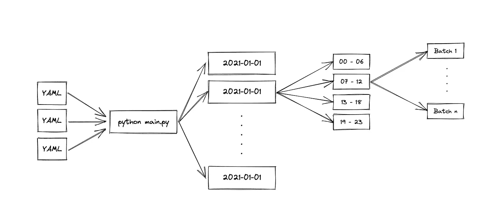
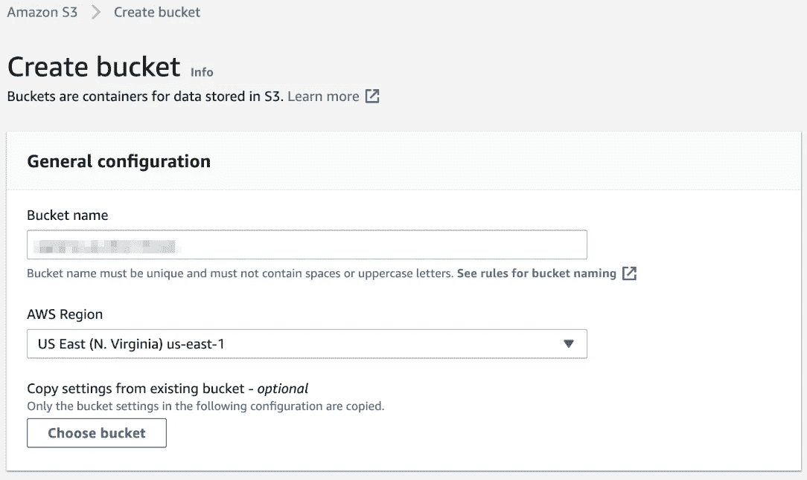
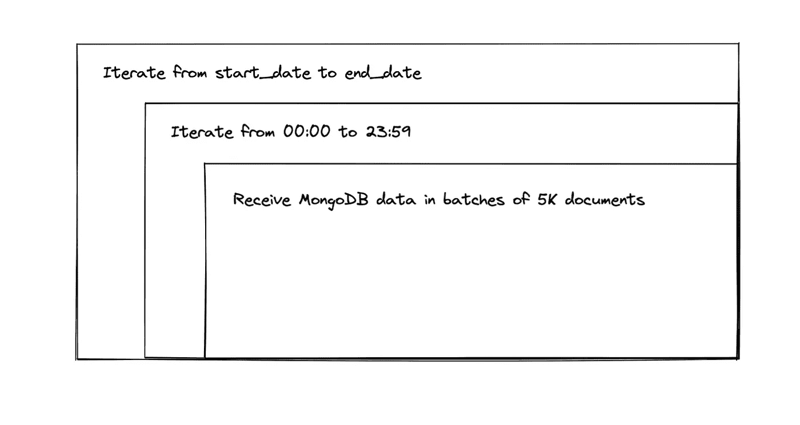
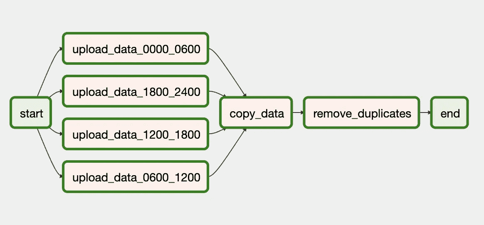

# 来自 MongoDB 的 S3 数据湖

> 原文：<https://towardsdatascience.com/data-lake-in-s3-from-mongodb-addd0b9f9606?source=collection_archive---------3----------------------->

## 使用 Python 将 MongoDB 数据上传到 AWS S3 构建数据湖

我非常幸运能够结合我最热衷的话题来写我的学士论文；经济学(以拍卖理论的形式)、软件开发和数据分析。尽管我的论文是关于拍卖和投标策略的实证研究，但它涉及到使用网络爬行收集数据。然而，这是另一个帖子的另一个故事。问题是，在我的论文发表一年后，我仍然每月支付 [MongoDB Atlas](https://www.mongodb.com/cloud/atlas) 的费用来存储我收集的数据，尽管我并没有使用它。是时候归档数据了。

在本文中，我不仅将向您展示我如何将数据从 MongoDB 移动到 AWS S3 进行冷存储归档，还将展示您如何将相同的原理用于数据管道来构建数据湖。根据您正在构建的现代数据堆栈的类型，您可能需要创建一个数据湖。一种常见的方法是利用 AWS S3 的廉价存储，一种常见的用例是在将数据接收到数据仓库进行处理和转换之前对数据进行暂存。例如，您可能有一个运行在 Snowflake 或 Redshift 中的数据仓库，这些数据仓库有从 AWS S3 读取或复制数据的简单方法。

# 规划

一如既往，我喜欢过度工程化的东西，构建抽象和可重用的代码。我没有编写一个从 MongoDB 读取所有记录、创建一个 JSON 文件并上传到 S3 的脚本，而是考虑了以下前提:

*   使用 YAML 配置文件来确定提取
*   遍历一个时间戳字段，比如`createdAt`
*   按一天中的时间进行细分提取，以避免过度消耗 RAM
*   使用带有分页的游标从 MongoDB 读取，以避免服务器开销
*   每个集合应该有自己的配置文件，以便能够定制它

## **配置文件**

我喜欢 YAML 的配置文件。它们是终极抽象。你可以运行一个极其复杂的 YAML 文件，任何人都可以根据自己的喜好对其进行修改，而无需理解其背后的逻辑。它们非常用户友好，易于使用。在这里使用它们的想法是，可以用它们以不同的方式提取不同的 MongoDB 集合。例如，我的 MongoDB 实例中的`auctions`集合并不是很大，大约有 16000 条记录。然而，`bids`收藏包含了超过 36 亿条记录。我可以配置这些不同的优化提取过程，避免消耗太多的内存。这也省去了我在脚本中硬编码变量的麻烦，每当我想要改变集合来提取和提高代码的可重用性时，就必须改变它们。

最终结果应该是一个脚本(`main.py`)，它接受一个命令行参数作为配置文件的名称，例如`main.py auctions`用于运行`auctions.yaml`配置文件。该文件将确定 MongoDB 集合的名称、开始日期、结束日期以及我们希望如何按一天中的小时来分解提取。下面是一个配置文件的示例:

这将提取从`2020-03-01`到`2020-08-10`的带有`createdAt`字段的集合`catawiki_auctions`中的所有数据，并将在这两个日期之间的每一天使用 24 小时的时间间隔。

以下是脚本执行的概述，以及它是如何分解上传数据的:

将数据从 MongoDB 加载到 AWS S3 数据湖的脚本概述(图片由作者提供)

# 履行

## **AWS S3 斗**

第一步是创建一个 AWS S3 存储桶来存储数据，并创建一个 IAM 用户来使用 [Boto3](https://boto3.amazonaws.com/v1/documentation/api/latest/index.html) 连接到 AWS。你可以查看这个关于创建 S3 桶的指南，但是它应该是相当简单的。

创建一个 AWS S3 桶用作数据湖(图片由作者提供)

现在，我们需要一些凭证，以便能够与 AWS S3 连接并上传我们的文件。这是使用 AWS IAM 管理的。在这里，您可以首先创建一个策略，以允许我们将要创建的用户访问我们已经创建的存储桶:

然后，您可以创建一个用户，并在选择权限时使用“直接附加现有策略”选项。这将允许您将我们创建的策略附加到用户。之后，您应该能够下载访问密钥 ID 和秘密访问密钥。这些是您需要使用 Boto3 调用 AWS APIs 来上传文件的凭证。

## **循环优化 RAM**

现在该看代码了。我把最终的脚本上传到了 Github，你可以在这里找到它。出于教学目的，我将该脚本作为一个单一的文件，但在其他情况下，我会将它分成几个实用模块，然后再导入到我们的主文件中。在任何情况下，你都可以看看它，它应该很容易理解，但我会在这篇文章中介绍最重要的部分，同时解释一些定义。

这个脚本最重要的方面是使用的循环和生成器。这样做的目的是优化 RAM，当使用 MongoDB 集合和许多文档在生产中运行这样的过程时，您可能会遇到 RAM 问题。在生产环境中的小型服务器上运行脚本时尤其如此。出于这个原因，我们经历了 3 个循环，允许我们划分从 MongoDB 获得的数据，并避免将其全部加载到内存中。

将数据加载到数据湖时优化 RAM 的循环(图片由作者提供)

这些循环的另一个极其重要的部分是能够从错误或连接问题中恢复。如果在我们的代码中有一个网络错误或 bug，我们可以从它停止的地方重新开始这个过程，而不是必须清除并重新开始。

## **从开始日期迭代到结束日期**

我们首先从配置文件中定义的参数`start_date`到`end_date`进行迭代。这种迭代一次进行一天，和 Python 中的惯例一样，端点不是生成序列的一部分。该脚本定义了一个生成器来实现这个调用`date_range`。这个想法是你可以通过一个`start_date`、一个`end_date`和一个天数增量。它的工作方式与`range`发电机相同。

如果这听起来很有趣，你绝对应该看看 [Python 生成器](https://wiki.python.org/moin/Generators)，它们非常方便。

## **从 00:00 迭代到 23:59**

现在我们每天都在迭代，我们可以从那天开始迭代不同的小时。例如，我们可以 6 小时(00:00 到 06:00，06:00 到 12:00，12:00 到 18:00，18:00 到 00:00)为一批，12 小时(00:00 到 12:00，12:00 到 00:00)为一批，或者以 24 小时为间隔一次性完成一整天。对于小的集合，这没有意义，我们可以使用 24 小时的时间间隔一次性加载一整天。但是，如果我们正在加载大量数据，那么提交数据提取并从可能的错误中恢复是有意义的。同时，这意味着我们可以并行处理我们的任务。例如，如果我们在气流中使用它来生成这样的 DAG:

将数据上传到 S3 数据湖的示例气流 DAG(图片由作者提供)

## **批量接收 5K 文档的 MongoDB 数据**

最后，我们不希望同时向 MongoDB 服务器请求数百万个文档。在生产中也是如此，否则，你的工程团队可能会打电话给你，看看你在做什么。同时，正如已经提到的，我们还可以通过请求更少的文档和对结果分页来优化 RAM 的使用。最后，如果您计划稍后将这些文件接收到一个仓库(如 Snowflake)中，那么将记录分解成更小的文件实际上是很有用的。这允许您通过并行读取这些文件来并行接收。有关文件大小和雪花摄取的更多信息，请查看他们文档中的[一般文件大小建议](https://docs.snowflake.com/en/user-guide/data-load-considerations-prepare.html#general-file-sizing-recommendations)。

为此，我们再次使用 Python 生成器并迭代 MongoDB 游标。这允许我们一次获得 5K 个记录，而不必将它们存储在内存中，也不必将它们全部请求到服务器。5K 是完全可定制的，在这种情况下，我使用 5K 作为一个完全任意的数字，但你绝对可以增加它。事实上，YAML 文件允许使用一个`batch_size`属性来精确地配置它(默认为`5000`)。

## **文件上传到 S3**

之后，过程就简单了，我们只需从 MongoDB 中获取记录，并将它们存储在一个 JSON 文件中。注意我们正在执行的所有循环是很重要的，本质上，我们希望所有的循环都以某种方式在文件名中表示出来。如果我们做不到这一点，我们可能会一遍又一遍地覆盖同一个文件。此外，我还包含了数据提取日期的时间戳，这有助于在并行/分布式运行期间出现错误和重叠的情况下进行重新处理。

需要注意的一点是，MongoDB 有一些类型有点特殊，没有在 JSON 标准中定义，所以如果您试图用它们编写 JSON 字符串，您会得到一个序列化错误(“TypeError:ObjectId 类型的对象不是 JSON serializable”)。

您可以使用 PyMongo dumper 来解决这个问题:

还要注意，我使用了`.gz`文件扩展名，这是为了存储压缩的 JSON 数据:

最后，为了上传生成的文件，我们只需使用 Boto3 初始化一个 S3 客户端，并调用`upload_file`方法:

# 结论

虽然我的主要目标是将我在 MongoDB 中的数据归档到 AWS S3，但我希望我已经展示了如何使用这个相同的脚本来摄取数据以构建数据湖。这种类型的脚本可以很容易地扩展到在 [Airflow](https://airflow.apache.org/) 、 [Dagster](https://dagster.io/) 或 [Airbyte](https://airbyte.io/) 上运行，作为您的数据管道的一部分，从生产系统中提取数据并将其加载到您的数据湖或数据仓库中。事实上，这个脚本非常类似于我们在 [Sirena](https://sirena.app/) 使用的 Airflow DAGs 来提取数据并加载到 [Snowflake](http://snowflake.com/) 中。您甚至可以使用该脚本一次性重新处理数据，或者将所有内容打包成 CLI，将其 dockerize 并在 Kubernetes 中运行。该脚本非常简单，您甚至可以使用 Celery 以分布式方式运行它来并行提取。可能性是无限的。