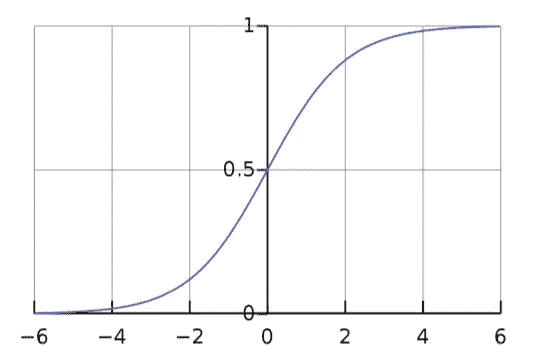

# 数据泄露

> 原文：<https://towardsdatascience.com/data-leakage-5dfc2e0127d4?source=collection_archive---------22----------------------->

## 你会在训练数据中加入偏见吗？


图片来源:([https://pix abay . com/photos/water-water-pipes-饮用水-4803866/](https://pixabay.com/photos/water-water-pipes-drinking-water-4803866/) )

> 如果编码器适合整个数据集，则训练数据的编码会受到验证和测试数据的分布的影响。

你有没有想过为什么像 scikit-learn 这样的数据处理库把编码过程分成两个步骤:*()*和*变换()*？在这篇文章中，我们将探究这种模式背后的原因。

# 泄漏定义

监督算法的目的是对该算法以前未见过的数据进行预测。因此，当训练算法来预测验证和测试拆分时，从业者需要确保算法不会无意中获得关于这些拆分的信息。当这种弊端发生时，它被称为“数据泄漏”

# 泄漏是如何发生的

数据泄漏可能起作用的一个特定领域是数字(连续或非有序整数)数据的预处理(也称为编码)。

scikit-learn 中处理数字数据的实际编码器是 *StandardScaler* 。它以平均值 0 为中心在-1 和 1 之间调整数值。

例如，假设我们正在对波士顿市一年中的每日温度进行标准化:

*   平均温度(例如 52 华氏度)将被编码为零
*   高温(例如华氏 98 度)接近 1
*   和接近-1 的低温(例如-5 华氏度)


图片来源:([https://unsplash.com/photos/0aqJNZ5tVBc](https://unsplash.com/photos/0aqJNZ5tVBc))

现在，我们可以在一个步骤中对整个数据集进行编码，如下所示:

```
from sklearn.preprocessing import StandardScalerscaler = StandardScaler()
encoded_dataset = scaler.fit_transform(dataset)
```

H 然而，你能想出为什么我们不想在这个标准化过程中包括我们所有的拆分(培训、验证、测试)的原因吗？如果我们的测试包含了一些来自寒流的极端温度会怎么样？

如果我们在编码中包括这些寒冷的日子，那么它会使我们的平均值(0 中点)降低，从而使我们的训练样本的编码比正常情况高一点。然后，算法的权重将被这些较高的训练输入值所偏置。本质上，算法的性能被夸大了，因为它暴露于训练样本中不存在的信息。

# 那么为什么要编码呢？

如果对数值型数据进行标准化的过程容易出现泄漏，那么为什么不能跳过呢？编码提供了两个主要好处:

***同等特征重要性*** —假设我们有两个特征: *exam_score* 和 *SAT_score* 【美国大学预科考试】。一方面，考试的最高分是 100 分，但另一方面，SAT 的最高分是 1600 分。如果我们不根据这两个特征的可能值范围对其进行归一化，那么算法最初会倾向于优先考虑 *SAT_score* 特征，因为它的值更大。然而，如果我们在 0 和 1 之间标准化这两个特征，那么它们在训练开始时将被同等对待。

***帮助防止梯度爆炸*** —当输入值接近零时，神经网络学习得更好。如果你不相信我，先试着训练一个 CNN，不管有没有缩放图像数据。原因是许多激活函数(例如，如下图所示的 sigmoid 曲线)在 1 和-1 处是渐近的(即饱和的)。由于渐近线，更高和更低的值不会对输出值产生有意义的影响。方便的是，大多数标准化函数输出接近 0 的值。



Sigmoid 曲线—图片来源:([https://en . Wikipedia . org/wiki/Sigmoid _ function #/media/File:Logistic-Curve . SVG](https://en.wikipedia.org/wiki/Sigmoid_function#/media/File:Logistic-curve.svg))

# 编码前分割

那么我们如何在编码过程中防止数据泄露呢？

关键是在执行标准化之前，将数据集分为训练、验证和测试部分。但是，我们不 *fit_transform()* 各自单独拆分。首先，我们*拟合()*我们的训练分割，然后我们*转换()*其他分割，如下所示:

```
scaler = StandardScaler()
scaler.fit(split_training)encoded_training   = scaler.transform(split_training)
encoded_validation = scaler.transform(split_validation)
encoded_test       = scaler.transform(split_test)
```

这种模式在交叉验证期间尤其难以应用，因为在重新采样期间，训练样本和验证样本会发生旋转。手动跟踪褶皱的预处理变得不切实际。

# 进入 AIQC

幸运的是， [AIQC](https://github.com/aiqc/aiqc) 的自动化 *Pipelines()* ，一个由这篇博文的作者创建的开源库，通过以下方式解决了这些挑战:

*   检测数字 sklearn 预处理器的使用
*   在分别对每个拆分和/或折叠进行*变换()*之前，对训练样本进行*拟合()*
*   保存每个 *fit()* 用于预测的下游解码

```
splitset = aiqc.Pipeline.Tabular.make(
    *# --- Data source ---*
    df_or_path = df *# --- Label preprocessing ---*
    , label_column = 'SurfaceTempK'
    , label_encoder = dict(sklearn_preprocess =   StandardScaler(copy=**False**)) *# --- Feature preprocessing ---*
    , feature_cols_excluded = 'SurfaceTempK'
    , feature_encoders = [
        dict(dtypes=['float64'], sklearn_preprocess=RobustScaler(copy=**False**)),
        dict(dtypes=['int64'], sklearn_preprocess=OneHotEncoder(sparse=**False**))
    ]
    , feature_reshape_indices = **None** *# --- Stratification ---*
    , size_test = 0.12
    , size_validation = 0.22
    , fold_count = **None**
    , bin_count = 4
)
```

如上所述，所有从业者需要做的是:

*   定义用于标签和功能的编码器
*   指定其验证和测试子集的大小
*   指定要使用的折叠数(如果有)

这使得从业者能够将更多的时间花在实际的分析上，而不是处理各种分割的编码。

> [**【https://github.com/aiqc/aiqc】**](https://github.com/aiqc/aiqc)

在总结中，我们已经了解到，当编码器适用于非训练数据时，会发生数据泄漏。这个问题可以通过分别编码每个分割/折叠来解决，但是手动这样做引入了另一个维度的数据争论，需要从业者跟踪。谢天谢地， *aiqc。Pipelines()* 可以用来自动化这个和其他预处理/后处理挑战。