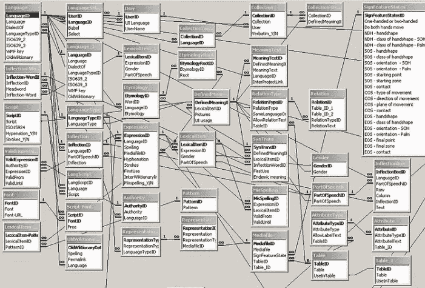
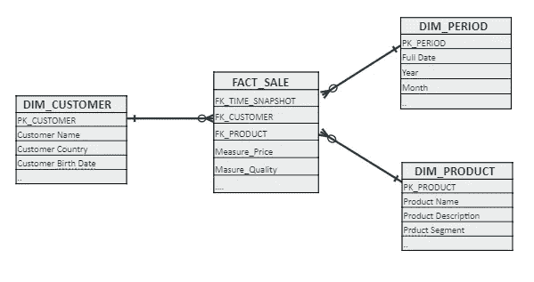

# 数据素养系列:维度建模

> 原文：<https://towardsdatascience.com/data-literacy-series-dimensional-modeling-5de34f747bb9?source=collection_archive---------40----------------------->

Honey Yanibel Minaya Cruz 在 [Unsplash](https://unsplash.com/photos/bYOB7SrWo5w) 上拍摄的照片

## 本系列旨在以简单而有效的方式解释关于数据主体的不同主题。

# 介绍

通常，数据模型是如何将数据组织到数据库表中的表示。我知道，这不是一个严谨/学术的定义，但我在这里的唯一目标是明确的。对于一个给定的数据集合，代表一个业务流程，有许多可能的方法来组织和存储它们:我们是否将所有数据存储在一个大表中？或者 2 年，100 年，..？看情况。对于任何数据分析驱动的主题，从经典的商业智能到最疯狂的数据科学应用，一种非常舒适和有效的方式是使用维度建模。

主题将是:

*   什么是维度建模？
*   维度数据模型的概念
*   数据科学、ML、BI 为什么要用维度模型？

# 什么是维度建模？

维度建模是一种构建数据模型(一堆表，通常大约 10-15 个)的技术，为数据分析而优化。维度建模的目的是允许数据历史化，简化业务数据理解，最大化数据检索的速度，并提供一个用户友好的分析模型(如果与业务流程使用的操作数据库进行比较的话)(也称为在线交易系统，或“OLTP”)。

简单地说，OLTP 是直接存储业务事件产生的数据的任何数据库，例如商店中的结账交易，它简单地记录扫描的每件产品。很明显，对于严肃的分析来说，本机 OLTP 数据从来都不是很好，也不够完整。

假设您是一名数据科学家，需要根据以下模式中的 10 个表中的特性构建一个预测模型。纯粹的噩梦..

图片来自 https://meta.wikimedia.org

这就是维度模型可以发挥作用的地方:它被设计成允许快速阅读、总结、分析数值信息，如值、余额、计数、重量，以及聚合任何业务属性的度量。例如，销售分析按客户国家和产品类别计算总营业额。

相比之下，用于实时 OLTP 系统的关系模型针对添加、更新和删除数据进行了优化，以“记录”它们所服务的业务流程的所有事件。

这些维度和关系模型有其独特的数据存储方式，具有特定的优势。关系模型试图通过使用数据中的冗余来进行有效的数据捕获和存储。这意味着复杂的模型，有许多表格，不可读的模式，通常像埃及象形文字一样清晰。

另一方面，维度模型旨在以一种易于理解数据存储位置以及如何快速检索的方式来安排数据，从而实现敏捷的业务分析和报告。牺牲所有这一切是一个糟糕的存储空间优化，但谁在乎最终的模型是否像这个一样简单明了:

作者截图:维度模型示例(星型模式)

# 维度数据模型的概念

## 事实和事实表

事实是业务流程的量化度量。

示例:对于销售业务流程，事实可以是每月总销售额。

为了模拟事实，我们需要构建一个表，其中包含:

*   一个或多个事实(数量、比率、重量、数量等)。)
*   相关维度表的关系列(接下来解释)。

## 维度和维度表

维度提供了围绕业务流程事件的上下文。一个过程的所有非数值数据都可以看作是维度。简单地说，它们告诉我们一个事实的“何时”、“何人”、“何事”和“何地”。

为了对维度建模，我们为流程中的每个业务概念构建一个维度表。示例:对于销售业务流程，维度将是

*   时间:销售交易日期
*   谁:客户信息(姓名、地址、类型、子类型等。)
*   地点:存储信息(名称、地址、部门、规模等。)
*   内容:产品信息(描述、类别、子类别、细分市场等。)

## 如何建立维度模型？

1.  **分析业务流程**:找出哪些度量值得了解(事实)及其上下文(维度)。示例:前面提到的销售流程可以通过查看其交易内容来完全建模。销售量、价格、产品、客户等。
2.  **定义粒度**:它描述了回答有关业务流程的任何问题的最精细的细节。例:待售粮食可以是单一销售交易。这样，我们的模型将能够表示单个销售细节和我们可能需要的任何汇总(按周、按月、按国家等统计)。)
3.  **确定维度和事实**数据。销售交易的事实可以是交易金额、产品数量、数量、单位成本等。维度:客户标识符、日期、渠道、市场类别、产品标识符、产品细分。
4.  **构建模型:**将每个业务流程的所有度量组织在一个事实表中，通常有几个(10–15)维度表链接到该事实表。每个维度表应该包含一个业务概念。示例:维度表 Customer(及其标识符、名称、地址等。)，一个用于产品，另一个用于日历(日期)，等等。

星型模式中的事实表是规范化的，而维度表是高度非规范化的，这意味着维度中的信息在记录间是高度冗余的。但这正是我们想要提高数据检索性能的地方，因为只有两个级别(事实表和维度表)上的简单连接，分析查询可以比多层连接更有效地运行。

作者截图:维度模型示例(星型模式)

当谈到维度建模时，星型模式并不是唯一的可能性。一种常见的变体称为雪花模式，其中维度可以部分规范化。

# 数据科学、ML、BI 为什么要用维度模型？

*   维度和事实很容易用于分析。它们提供了任何复杂业务流程的直观表示。此外，每个维度都可以在多星型模式中使用:想象一个非常典型的维度客户，既可以用于对客户进行简单的描述性分析，也可以用于对其未来行为进行更复杂的预测性分析、细分、聚类，所有这些都使用同一个核心表。
*   维度模型允许数据历史化，这通常是操作数据库所不具备的。想象一下事务性或实时数据:一旦它们发生变化，它们的旧值就会丢失。通过使用时间维度，维度模型可以捕捉所有的历史变化(实际上这是它最初被发明的原因之一)。
*   如果必须在模型中引入一个新的维度，那么事实表只需要一个小的改动，对现有的维度没有影响。
*   维度模型针对快速数据检索进行了优化。本文没有描述的更复杂的主题，如索引和表分区，总是在维度模型中使用，以显著提高查询性能。

# 如何使用维度模型

作为一个维度模型的用户，你需要知道什么？无论您是需要仪表板、报告、ML 管道的数据，还是任何其他类型的数据分析，原则都是一样的:获取一个或多个事实，以及您想要用来聚合事实的所有维度。以某种方式组合它们(通过 SQL、R、Python，没关系，应用相同的概念),将事实视为主要数据，将维度视为次要数据。

简而言之:**“事实总是离开了联结的维度”！**

例如，使用上图中的星型模式模型，典型的查询会将 Sales 事实表连接到所有维度，并按感兴趣的属性聚合事实。如果我们想按年份和客户所在国家进行一些分析，SQL 可能如下:

从概念上讲，这与 R / Python 中的原则是一样的:事实是主表，事实必须作为辅助表连接。

## 真的这么简单吗？差不多了，还有几件事。

1.  **事实类型:**当您分析事实时，汇总它们是很自然的，例如，计算每月销售总营业额、按产品细分市场或市场或任何维度的平均销售额。但是事实并不总是能以我们想要的任何方式组合:你需要理解可加的、半可加的和不可加的事实。

*   *附加事实*可以在与事实表相关联的任何维度上求和。例如，销售额可以按客户、周期、产品进行汇总。
*   *半累加性*事实可以在某些维度上聚合。例如，移动信用余额在除时间之外的所有维度上都是相加的。
*   非相加的事实根本无法聚合。例如比率。

2.事实历史化:当我们查询事实表时，我们需要知道度量是如何存储的。有两种可能的方法，取决于您尝试测量的过程的性质。您需要了解它们，以避免在分析数据时出现错误，做出不正确的聚合。

*   *定期快照事实表*:定期捕获事实数据，以测量该周期结束时的情况。例如，如果你在每个月末查看你的银行账户，并把余额收集到一个表格中，你正在做一个周期性的快照历史化。这个时期自动成为你的一部分。定期快照是半累加的(我们不能按时间聚合)。
*   *累积快照事实表*:当某个事件发生时，这些事实被捕获。例如，如果您想查看一个月内的银行交易，您可以在每次交易完成时捕捉一个事实，甚至可以通过求和来计算总额。

**3。维度历史化:**我们如何反映维度属性的变化？换句话说:如果一个属性在我们的源数据中获得了一个新值，我们如何向维度表传播它？

例如，如果客户更改了国家或新产品替换了产品目录中的旧产品，我们如何让我们的“按国家销售”和“按产品营业额”分析适用于过去、现在和未来？总共有 8 种方法来处理尺寸的变化，也称为尺寸的“类型”。我只介绍前 3 种类型，这是我在真实环境中见过的唯一类型(理论上还有 5 种)。

*   维度“类型 0”:保留原始值，不需要更新。例如，保险公司可以为客户分配一个初始风险分数，该分数反映了非常初始的情况，并且需要永远保持这种状态。
*   维度“类型 1”:当加载新值时，它替换维度的属性值。例如，相同的保险公司可以具有客户的属性“最近风险分数”，该属性必须给出每个客户的最新风险分类，而对先前的值不感兴趣。
*   维度“类型 2”:进入维度表的新值在维度中创建新行，而不删除前一行。一些额外的列允许标记什么是当前有效值，并指示历史日期。

# 简而言之…

维度建模是对业务数据建模的一种简单方法，它将所有业务量化(数字)放在一个表中，将资格(描述、属性)放在其他表中。这为任何数据分析应用提供了许多优势。

下一步是什么？在这篇文章中，我只是提到了基本概念。如果你想了解实际设计的细节，一个好的起点是这里的和金博尔的书(他是现代维度建模之父)。

感谢阅读。

[随时订阅我的**【分享数据知识】**简讯**。**](http://eepurl.com/humfIH)

如果你想订阅《灵媒》,请随意使用我的推荐链接[https://medium.com/@maw-ferrari/membership](https://medium.com/@maw-ferrari/membership):对你来说，费用是一样的，但它间接有助于我的故事。