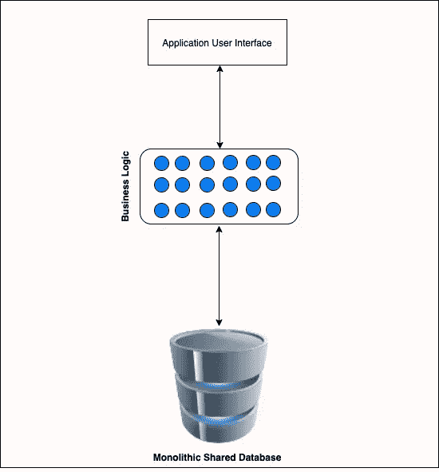
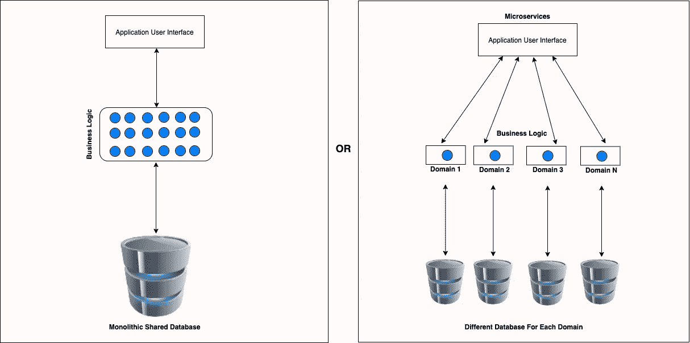

# 数据管理架构—整体数据架构与分布式数据网格

> 原文：<https://towardsdatascience.com/data-management-architectures-monolithic-data-architectures-and-distributed-data-mesh-63743794966c?source=collection_archive---------7----------------------->

## 这篇文章是软件工程师、数据工程师、数据科学家、MLOps 工程师、软件开发人员和数据库架构师的必读之作，他们有兴趣了解更多关于整体数据架构和分布式数据网格的知识。

# 介绍

作者图片

数据管理架构管理*组织如何收集、存储、保护、安排、整合和使用数据*。一个好的数据管理架构可以清晰地了解数据的各个方面，以及企业如何从数据中获得最佳收益，从而实现业务增长和盈利。相反，糟糕的数据管理架构会导致不一致的数据集、不兼容的数据孤岛和数据质量问题，从而使数据变得毫无价值或影响组织运行分析、数据仓库(DW)和商业智能(BI)活动的能力，尤其是大数据。

> 传统上，大多数组织更喜欢从中央数据团队和单一数据管理架构开始，在这种架构中，所有数据操作都是在单一的集中式数据平台上执行的。虽然整体数据架构相对容易建立，并且可以处理小规模的数据分析和存储而不会降低性能，但随着时间的推移，事情会变得不堪重负。此外，随着数据量和需求的增加，中央数据管理团队往往会成为瓶颈。

由 [Zhamak Dehghani](https://www.thoughtworks.com/profiles/z/zhamak-dehghani) 推出的分布式数据网格提供了一种调和并有望解决与以前的数据架构相关的挑战的方法，这些挑战通常被数据消费者和生产者之间的数据标准化挑战所阻碍。分布式数据网格将我们推向更强大、更敏捷、更精简、多功能的团队和领域驱动的业务结构。它以分散的方式结合了最佳的数据管理方法，同时保持数据即产品的观点、自助式用户访问、领域意识和治理。

> 这篇文章将帮助读者了解整体数据架构、与整体数据架构相关的挑战，以及分布式数据网格如何帮助组织将其分析数据转变为产品，并构建高度可伸缩、弹性和数据驱动的应用程序。目标受众是软件工程师、数据工程师、数据科学家、MLOps 工程师、软件开发人员和数据库架构师，他们有兴趣了解更多关于整体数据架构和分布式数据网格的知识。

# 整体数据架构

作者图片

整体数据架构是一个框架，在这个框架中，应用程序数据从一个单一的集中式数据存储中进行存储、转换、操作、消费和管理。整体数据架构由一个大型平台团队管理，适合业务领域相对简单且数据环境不会不断变化的小型组织，但它们对不断发展的工程团队提出了一些挑战。让我们来看看其中的一些挑战。

T 他首先担心的是整体数据架构不能无限扩展，而且大多数整体数据库根本不能自动扩展。随着应用程序工作负载和数据量呈指数级增长，整体数据库逐渐变得缓慢、昂贵且难以维护。由一个中央团队管理的在一个地方消费和协调无处不在的数据的能力，对于具有快速和广泛变化的用例、多个数据源和数据消费者的组织来说，也会减弱。

其次，整体数据库通常有很高的延迟和吞吐量，这是由应用程序中不同的不相连的团队和方法的并发数据库读/写自然产生的。对于整体数据架构，在不改变整个数据管道的情况下响应新需求也是一项挑战。

第三，单一的数据架构缺乏模块性，并且受到技术同质化的影响。当一个整体数据库出现故障或无响应时，它会影响整个应用程序并停止所有与数据库相关的活动。此外，如果工程团队被迫为一个应用程序采用一个单一的数据库，就不会有太多的创新和实验空间。

最终，一个单一的数据架构自然会导致住院病人数据消费者、断开连接的数据生产者和积压的工程团队，他们背负着巨大的技术债务，在一个变化不断、企业需要快速创新的敏捷世界中努力奋斗。

*现在你理解了整体数据架构的意义和局限性。现在让我们来看一个更优化的数据架构，它主要解决与单片架构相关的挑战。*

# 分布式数据网格

作者图片

分布式数据网格是高度分散的，视图“ ***【数据即产品】、*** ”并支持分布式、 ***特定领域的数据所有者*** “负责以一种易于使用、用户友好的方式处理他们自己的数据产品和管道，同时增强不同位置的分布式数据之间的通信。 ***从很多方面来说，分布式数据网格就是微服务的平台版本。***

通过将整个数据架构分解成更小的、面向领域的、更加分散的组件，并让不同的团队管理每个领域，工程团队可以很容易地实现分布式数据网格的可伸缩性。这样，随着用例、数据源和访问模型多样性的增加，就可以更容易地向外扩展。它还允许团队构建高度可扩展、数据驱动的应用程序，并有效地使用数据来更好地改进营销活动、降低成本、优化业务运营和做出更明智的决策。

> 分布式数据网格为数据所有者提供了更大的灵活性、更高的生产率和自主权。通过将责任分配和分散给最接近数据的人，分布式数据网格降低了每个数据库的读/写速率，促进了数据创新，并消除了工程团队使用单个数据管道或数据存储来满足每个数据消费者需求的负担。在分布式数据网格中，每个团队可以自由决定如何收集、组织、存储和使用数据。

第三，分布式数据网格具有自助式的“基础设施即平台”和“联合计算治理”设计，支持领域自治，并为数据产品监控和治理、数据标准化、日志记录、警报、产品质量指标等提供与领域无关的、可互操作的通用方法。在分布式数据网格中，数据库故障的影响大大降低，每个团队都可以对他们的数据平台进行更改，引入新功能，并部署功能更新，而无需更改其他数据存储。

# 何时从整体式数据网格过渡到分散式数据网格

作者图片

**分布式数据网格并不是适用于所有组织和团队的灵丹妙药。**可以想象，整体数据架构也不会消失。在从单一数据架构过渡到分布式数据架构之前，组织需要做足功课，确保迁移对业务来说是一个明智的决策。

以下是组织及其团队在评估向分散数据网格过渡的准备情况时应该问的一些问题:

*   **数据团队的规模:**我们在数据团队中有多少数据工程师、数据分析师、数据科学家和产品经理？
*   **数据量:**我们的数据量有多大？它的增长率是多少？
*   **数据种类和来源:**我们有多少数据用例及来源？
*   **数据瓶颈:**数据团队解决技术债务的频率有多高(因此减缓了新数据产品的实施并使其成为瓶颈)？
*   **交付周期:**尽管我们的团队规模在增长，但是每个团队的成员是脱节的，还是他们缺乏领域知识？
*   **数据域的数量:**有多少职能团队依靠我们的数据存储做决策，我们有多少数据驱动的产品和特性？
*   **数据治理:**对于我们的组织来说，数据治理有多重要？在谁控制的问题上有政治内讧吗

> 通过提出这些问题并评估回答，组织可以确定是坚持传统的整体式架构还是转向分散式架构。一般来说，拥有基于微服务的应用程序、非常苛刻和复杂的数据基础架构要求、高数据量、大量数据源和域以及经常不堪重负的大型团队的公司将从数据网格中受益更多。否则，我认为分散的解决方案将是矫枉过正。

# 结论

组织需要采用一种新的方法来管理大规模数据，以增加和改善数据在生活和业务中的方方面面。尽管过去的技术进步解决了数据量和数据处理计算的规模问题，但它们无法解决其他方面的规模问题，例如数据源的激增、数据环境的变化、对变化的响应速度以及数据用户和使用案例的多样性。

数据网格架构解决了这些问题，并推动了组织结构和技术架构的新逻辑视图。通过从单一数据架构转移到分布式数据网格，组织和工程团队可以大幅缩短交付周期，更好地定位自己，以便在多个用例中高效地使用数据，并构建可扩展的数据驱动型应用程序，与当前向云原生架构和生态系统的转变保持一致。