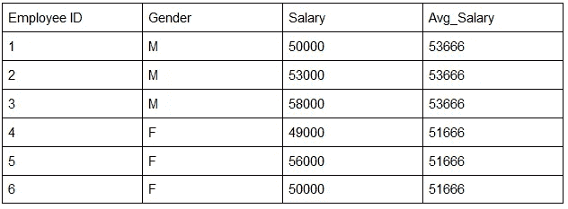
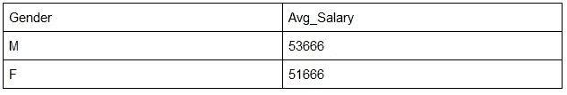

# 窗口函数和聚合函数:SQL 与 Python 熊猫

> 原文：<https://towardsdatascience.com/data-manipulation-sql-vs-pandas-116bb33a9abf?source=collection_archive---------25----------------------->

## 您希望在下一个数据科学项目中使用哪种工具？


帕斯卡·米勒在 [Unsplash](https://unsplash.com?utm_source=medium&utm_medium=referral) 上的照片

# 背景

在任何数据科学项目中，数据清理和操作都是必不可少的。 **SQL** 和 **Pandas** 都是数据分析师和数据科学家常用的工具。

在下面的文章中，我将从数据操作的实现方面比较 SQL 和 Pandas。希望它对熟悉 SQL 并想了解熊猫的人有用，反之亦然。

# 窗口函数和聚合函数

在我们深入比较之前，让我快速回顾一下数据操作的两个主要函数。

**窗口函数**在一组称为**窗口框架**的行上实现。窗口框架是同一组中的所有行。在下面的例子中，我们按性别计算平均工资，结果在同一个性别组中重复。



(作者创作)

**集合函数**的实现与窗口函数相同。但是返回的结果是没有重复的，所以最终输出中的观察数量将等于不同组的数量。



(作者创作)

# **窗口功能**

## 创建一个新的行号列

熊猫和 PostgreSQL 都内置了**窗口函数**。在 Pandas 中，我们可以使用带有窗口函数的 **groupby** 操作，而在 PostgreSQL 中，我们可以使用 **Over (Partition by)** 。当实现窗口功能时，将产生一个新列，并且输出将具有与原始数据集相同的行数。

```
**Using Pandas**
df['new_column_name'] = df.groupby('gender').cumcount()+1**Using PostgreSQL**
SELECT *, 
   ROW_NUMBER() OVER(PARTITION BY gender) AS ROW 
FROM df
```

## 在组内创建计数/最大值/最小值/平均值/总和

在熊猫中，我们经常使用带窗口函数的**变换**，比如，count，max，min，avg，sum。

```
**Using Pandas**
df.groupby('gender')['salary'].transform('count')**Using PostgreSQL**
SELECT *,         
   COUNT(*) OVER(PARTITION BY gender) AS ct 
FROM df;
```

## 在组内创建运行总和

在熊猫身上，我们可以使用 **cumsum** 来计算运行总和。

在 PostgreSQL 中，我们可以使用 **Over (Partion by)** 和 **Order by** 来计算运行总和。如果指定了 ORDER BY，将在窗口中的每一行实现一个窗口函数。

```
**Using Pandas**
df.groupby('gender')['salary'].transform('cumsum')**Using PostgreSQL**
SELECT *,         
   SUM(salary) OVER(PARTITION BY gender ORDER BY age) AS avg 
FROM df;
```

## **在组内创建滞后/领先**

```
**Using Pandas**
df.groupby('gender')['salary'].transform(lambda x: x.shift(1)) df.groupby('gender')['salary'].transform(lambda x: x.shift(-1))**Using PostgreSQL**
SELECT *, 
   LAG(salary) OVER(PARTITION BY gender ORDER BY salary),
   LEAD(salary) OVER(PARTITION BY gender ORDER BY salary)   
FROM df
```

## 在组内创建排名

```
**Using Pandas**
df.groupby('gender')['salary'].rank('dense', ascending = False)**Using PostgreSQL**
SELECT *,         
   RANK() OVER(PARTITION BY gender ORDER BY salary) AS rank 
FROM df
```

# 聚合函数

## 折叠组内具有计数/最大值/最小值/平均值/总和的行

在 Pandas 中，有许多方法可以实现聚合函数。我在下面的代码片段中包含了 3 种不同的方法。

*   使用 **groupby** 将聚合函数作为默认函数运行
*   使用**应用**运行内置的聚合函数或带有**分组依据**的用户自定义函数
*   使用 **agg** 运行内置的聚合函数或用户定义的函数，更加灵活，例如命名新列和创建多个新列

在 PostgreSQL 中，用 **GROUP BY** 可以直接实现聚合函数。

```
**Using Pandas**
df.groupby('gender')['id'].size().reset_index()
df.groupby('gender').apply(lambda x: x['id'].size).reset_index()
df.groupby('gender').agg(count = pd.NamedAgg('id', 'size')).reset_index()**Using PostgreSQL**
SELECT gender, 
   COUNT(*) 
FROM df 
GROUP BY gender
```

## **在组内创建百分位数**

在 PostgreSQL 中，可以使用 GROUP(ORDER BY)中的**和 GROUP BY 中的**来计算组内的百分位数。

```
**Using Pandas**
 df.groupby(‘gender’)[‘salary’].quantile(0.9).reset_index()**Using PostgreSQL**
 SELECT gender, 
    percentile_disc(0.9) WITHIN GROUP(ORDER BY salary) 
 FROM df 
 GROUP BY gender
```

## 需要考虑的事项:

**使用哪种工具**取决于数据存储的位置、数据的格式以及我们想要如何使用它。

*   如果您正在处理的数据还不是面板格式，并且您需要将来自各种来源的数据拼凑在一起，Pandas 可能会更好。例如，当处理文本数据或从网站抓取数据时，数据很可能是非结构化格式的，使用 SQL 将非常困难。
*   如果您不熟悉数据，并且想要探索数据，如果您使用 Pandas 在数据库之外进行工作，您的数据库管理员会很感激。
*   如果你想做数据可视化和实现统计分析和机器学习模型，Pandas 可以与 Python 中的其他库很好地合作，例如， **Matplotlib，Scikit-Learn** ， **TensorFlow** 等。
*   如果处理大量数据，可以配合其他库使用熊猫，比如 **Pyspark、Dask** 和 **Swifter** 等，充分利用自己的硬件力量。
*   如果您非常熟悉数据，并且确切地知道应该采取什么步骤来清理数据，例如过滤、连接、计算等，那么运行 SQL 来处理数据并导出最终数据以用于分析任务应该会更容易。
*   如果您从事前端项目，并且希望在不进行复杂数据操作的情况下访问后端数据库，那么使用 SQL 可能会更好。

# 最终注释:

我建议学习 Pandas 和 SQL，因为它们是数据科学领域的常用工具。当您与不同背景的人一起从事各种数据科学项目时，这种组合将为您提供更大的灵活性。

# 感谢您的阅读！！！

如果你喜欢这篇文章，并且想请我喝杯咖啡，请点击这里。

您可以注册一个 [**会员**](https://aaron-zhu.medium.com/membership) 来解锁我的文章的全部访问权限，并且可以无限制地访问介质上的所有内容。如果你想在我发表新文章时收到电子邮件通知，请 [**订阅**](https://aaron-zhu.medium.com/subscribe) 。