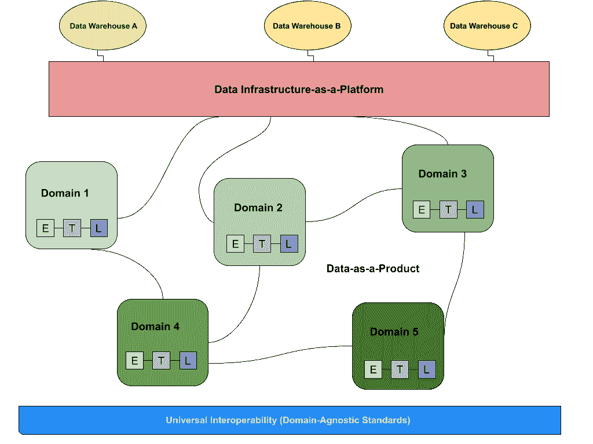

# 数据网格 101:入门所需的一切

> 原文：<https://towardsdatascience.com/data-mesh-101-everything-you-need-to-know-to-get-started-72087f5a7d91?source=collection_archive---------20----------------------->

## 数据团队关于最新行业趋势的初级读本:数据网格

图片由 [Shutterstock](http://www.shutterstock.com) 上的 [Nixx Photography](https://www.shutterstock.com/image-photo/building-structures-aluminum-triangle-geometry-on-1238648299) 提供，可与作者购买的标准许可证一起使用。

*你的公司想要建立一个数据网格。太好了！现在怎么办？这里有一个快速入门指南，可以帮助您入门，并防止您的数据基础架构变成一个热网格。*

自 2010 年初以来，微服务架构已经被许多公司采用(想想:[优步、](https://eng.uber.com/building-tincup-microservice-implementation/) [网飞](https://www.youtube.com/watch?v=CZ3wIuvmHeM)和 [Airbnb](https://www.infoq.com/news/2019/02/airbnb-monolith-migration-soa/) 等等)，作为当今的软件范例，引发了工程团队对面向领域设计的利弊的讨论。

现在，在 2021 年，你很难找到一个数据工程师，他的团队不会争论是否从单一架构迁移到分散的[数据网格](https://martinfowler.com/articles/data-monolith-to-mesh.html)。

由 Thoughtworks 的 [Zhamak Dehghani](https://www.linkedin.com/in/zhamak-dehghani) 开发的 data mesh 是一种数据平台架构，通过利用领域驱动的自助式设计来支持企业中无处不在的数据。

随着公司越来越受数据驱动，数据网格非常适合现代数据组织的三个关键要素:

1.  **对越来越多的数据的需求**，这些数据被整个公司的利益相关者吸收和利用，而不是一个“数据辩论者”团队
2.  **数据管道越来越复杂**因为团队寻求用他们的数据做越来越智能的事情
3.  **[**标准化数据可观察性和可发现性层的兴起**](/data-catalogs-are-dead-long-live-data-discovery-a0dc8d02bd34) 了解数据资产在其生命周期中的健康状况**

**数据网格的潜力既令人兴奋又令人畏惧，就像之前的微服务架构一样，它激发了许多关于如何大规模运营数据的讨论。**

****

**与在一个中央数据湖中处理 ETL 的传统整体式数据基础设施不同，数据网格支持分布式的、特定于域的数据消费者，并将“数据视为产品”，每个域处理自己的数据管道。数据网格的基础是标准化的可观察性和治理层，确保数据在任何时候都是可靠和值得信赖的。图片由蒙特卡洛提供。**

**为了指导您的数据网格之旅，我们整理了基本数据网格读物列表:**

# **基础知识**

*   **[**如何超越单片数据湖走向分布式数据网格**](https://martinfowler.com/articles/data-monolith-to-mesh.html) —扎马克·德格哈尼的原创作品是所有数据网格内容的圣杯。请将本文视为您了解数据网格标准其余部分的门户，激发您未来围绕在实践中实现设计时的机遇、挑战和关键考虑事项展开讨论的兴趣。她的架构图对于理解数据网格如何以新的姿态对抗集中式架构至关重要。**
*   **[**数据网格原则和逻辑架构**](https://martinfowler.com/articles/data-mesh-principles.html) —作为 Zhamak 第一篇文章的后续文章，本文深入探讨了如何大规模地实际实现数据网格，并后退一步解释了联合治理如何以及为什么对架构的成功至关重要。对数据网格的具体细节感兴趣的人的必读之作。**
*   **[**应用数据网格**](/data-mesh-applied-21bed87876f2)—Mercateo Gruppe 的数据分析和数据科学主管 Sven Balnojan 向读者介绍了数据团队如何通过从单一数据仓库和湖泊迁移到数据网格，将 DevOps、“数据即产品”的理念应用到他们的数据架构中。他还谈到了普通企业(在本例中是一家电子商务公司)可能如何进行这种迁移，以及如何适当地民主化数据所有权和访问。**

# **补充阅读**

*   **[在这本初学者指南中，我们将介绍一些关键的注意事项，特别是当它与设置网格以成功实现数据可观察性和可发现性相关时。](/what-is-a-data-mesh-and-how-not-to-mesh-it-up-210710bb41e0)**
*   **[**数据网格是否适合您的组织？**](https://read.hyperight.com/is-data-mesh-right-for-your-organisation/)**——**在 Hyperight 的最新专题中，他们采访了各种数据领导者和顾问，询问他们为什么(或为什么不)实施数据网格架构。TL；DR:如果您的团队已经采用了面向领域的方法来获得数据所有权，并在数据管理方面苦苦挣扎，那么数据网格可能是将您的组织带到下一个级别的正确架构。重要的一点是:倾向于自动化和数据运营的公司更有可能成功，而没有这样做的公司更有可能成功。**
*   ****数据网格简介:分析数据管理的范式转变** ( [第 1 部分](https://www.starburst.io/resources/datanova-2021/?wchannelid=d4oyeh306b&wmediaid=1z50qr8fh6)和[第 2 部分](https://www.starburst.io/resources/datanova-2021/?wchannelid=d4oyeh306b&wmediaid=3sb7nbjc7f) ) —将这两个视频视为 Zhamak 早期关于数据网格文章的额外背景。在 Starburst Data 的 SuperNova 会议的两场讲座中，Zhamak 更详细地介绍了她设计这种新模式背后的动机，以及一流的数据团队如何大规模应用数据网格(通过自动化)来为他们的公司提供更可靠、可操作的见解。**

# **主要来源**

*   **[**数据网格在实践中:欧洲领先的时尚在线平台如何超越数据湖**](https://databricks.com/session_na20/data-mesh-in-practice-how-europes-leading-online-platform-for-fashion-goes-beyond-the-data-lake)**—Zalando 的数据工程师 Max Shultze 和 ThoughtWorks 顾问 Arif Wider 讨论了这家时尚电子商务公司如何通过利用数据网格原则，将他们的“数据沼泽”转变为领域驱动的、可操作的数据湖。对于那些认真对待数据架构去中心化和消除数据工程瓶颈的人来说(不管你是否正在走向全网状)，这是一个必须观看的节目。****
*   ****[**Intuit 的数据网格战略**](https://medium.com/intuit-engineering/intuits-data-mesh-strategy-778e3edaa017)**——Intuit 数据平台的首席架构师 Tristan Baker 讨论了 Intuit 决定实施数据网格架构的原因和方式，用他的话来说就是“减少混乱，提高生产力，回到让客户满意的业务上来。”Tristan 认为，主要挑战包括数据可发现性、数据可理解性和数据信任。通过将代码和数据组织为“数据产品”，Intuit 能够设置清晰的数据责任、服务所有权和目标结果。******
*   ******[**网飞数据网格:可组合数据处理**](https://www.youtube.com/watch?v=TO_IiN06jJ4)**——在 Flink Forward 2020 的这段视频中，网飞数据架构总监贾斯汀·坎宁安(Justin Cunningham)讨论了他的团队如何构建数据网格架构来专门处理可组合数据处理。与其他演讲和文章不同，本演讲深入探讨了他们如何应用数据网格框架来处理数据转换过程中的一个要素——在网飞系统之间移动数据。********

******这个列表并不详尽，但是它应该可以帮助您开始数据网格之旅。对于那些对构建数据网格感兴趣或者希望分享最佳实践的人，可以考虑加入 [**数据网格学习松弛小组**](https://launchpass.com/data-mesh-learning) 。******

****下次再见——祝您的数据网格充满魔力！****

*******贵公司是否在构建数据网格？伸出*** [***巴尔摩西***](http://montecarlodata.com/?utm_source=blog&utm_medium=medium&utm_campaign=data_mesh) ***带着你的经历、提示和痛点。*** [***我们希望收到您的来信！*T34**](http://www.montecarlodata.com)****

********