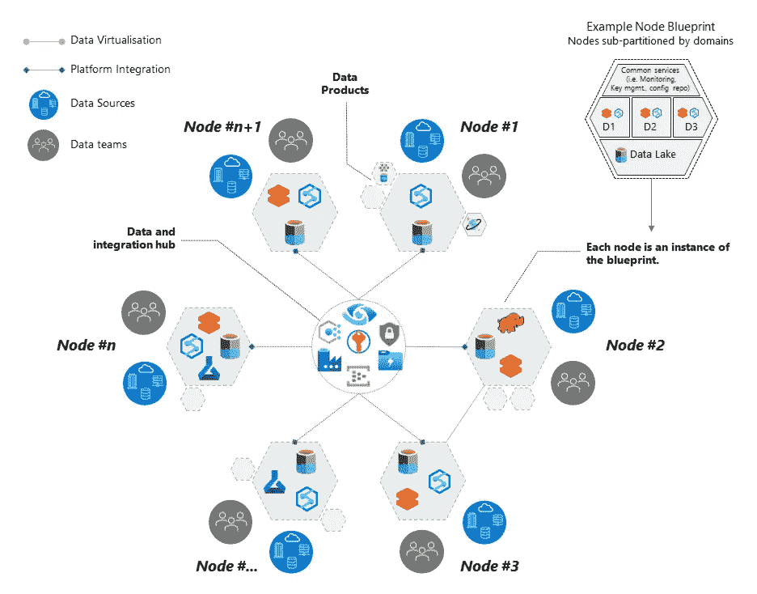
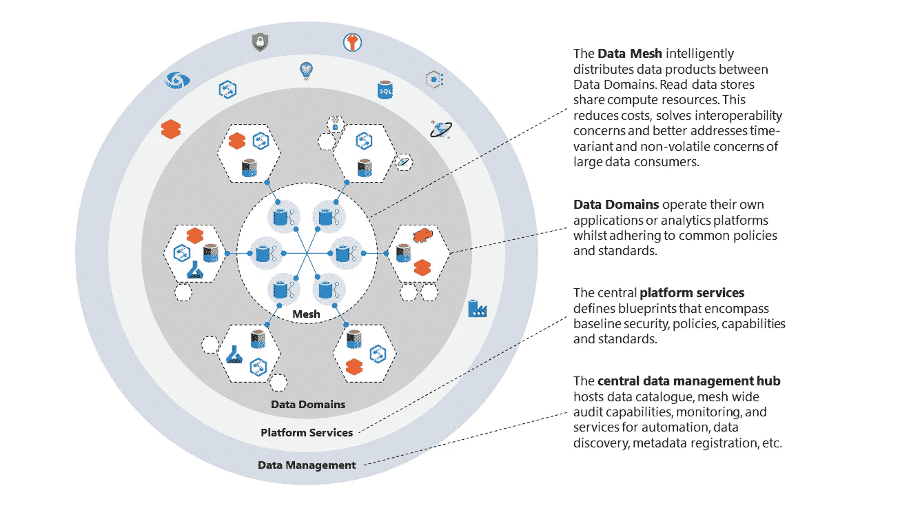
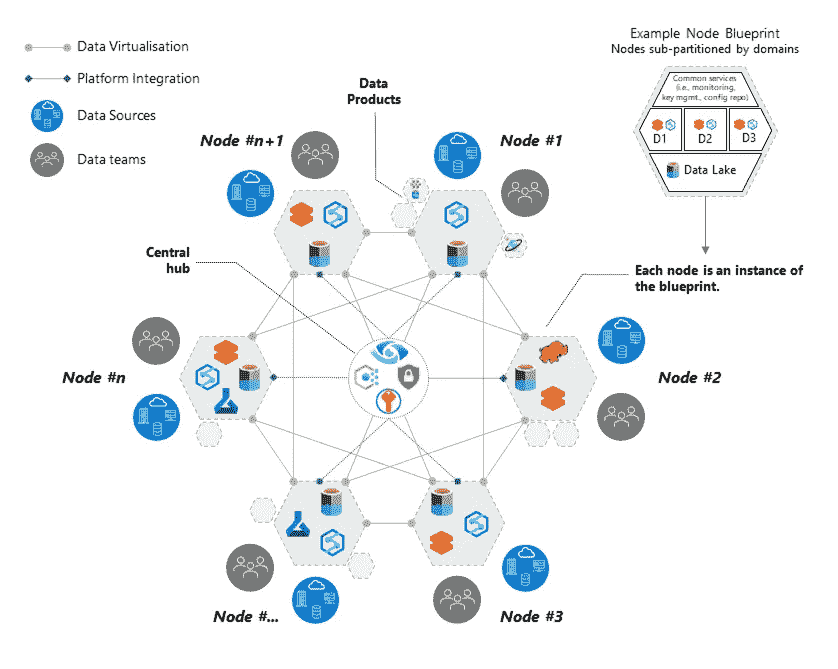
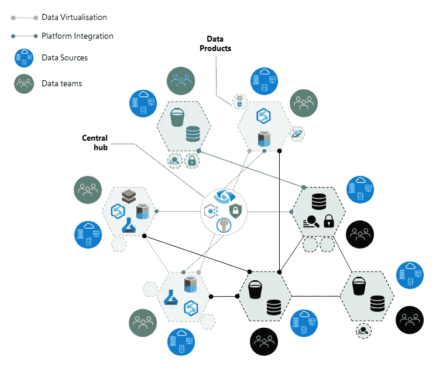

# 数据网状拓扑

> 原文：<https://towardsdatascience.com/data-mesh-topologies-85f4cad14bf2?source=collection_archive---------2----------------------->

## [行业笔记](https://towardsdatascience.com/tagged/notes-from-industry)

## 构建数据网格体系结构的设计考虑

我工作过的所有组织都了解数据的重要性，并且对下一代现代数据平台感兴趣或正在进行规划。他们的目标是从紧密耦合的数据接口和变化的数据流转向允许生态系统连接的架构:云分布式数据网格，它允许特定领域的数据并将“[数据视为产品](/data-domains-and-data-products-64cc9d28283e)，使每个[数据域](/data-domains-where-do-i-start-a6d52fef95d1)能够处理自己的数据管道。这不同于从传统(单一)平台获取数据，传统(单一)平台通常紧密耦合，并且通常会降低从一个中央数据湖或中心获取、存储、转换和使用数据的速度。

分布式数据架构中的这种范式转变伴随着一些细微差别和注意事项，它们主要取决于组织成熟度和技能、组织结构、风险偏好、规模和动态。基于这些细微差别和考虑，可以使用不同的数据网格拓扑。

# **受控网状拓扑**

第一种模式是“受控网状拓扑”。在此模型中，正如您从下图中看到的，不同的数据域被分组并表示为节点。您可以将每个节点视为一个域，它可以将自己表示为其他域的数据提供者和/或数据消费者。

图片由 Piethein Strengholt 提供

在此模型中，作为一般实践，节点是从[蓝图](https://docs.microsoft.com/en-us/azure/governance/blueprints/)中实例化的，蓝图包含实现数据价值创造所需的关键功能(例如，存储、监控、密钥管理、ELT、分析引擎和自动化)。每个节点都可以根据自己的特定需求，使用该蓝图中自己偏好的一组技术。根据需求，您可能希望允许蓝图的变化和不同版本，以适应不同领域的不同需求。

该架构的核心代表了保持控制的所有数据治理和管理解决方案。它托管数据目录、策略和安全实施、网格范围审计功能、监控以及用于部署和自动化的辅助服务。受控网格不同于其他拓扑模式，因为它强制所有数据分布集中路由。例如，在这个模型中的[数据域](/data-domains-where-do-i-start-a6d52fef95d1),在接收之后首先集中交付它们的[数据产品](/data-domains-and-data-products-64cc9d28283e)。

数据网格的重叠之处在于，集中分布的所有数据都是按域划分的，在逻辑上是隔离的，而不是集成的。数据转换仅在消费点完成。同样，你也可以为数据安全辩护:零信任模型继承自域，并通过元数据强制执行。

图片由 Piethein Strengholt 提供

治理网格方法的好处在于，它更好地解决了大型数据消费者的时变和非易失性问题。因此，您可以通过集中编排的时间段来管理时间旅行和数据交付。同时，如果出现数据质量问题，例如域之间的交叉标识符不匹配，您可以阻止任何数据分发。另一个好处是，您可以更高效地共享(中央)计算资源。例如，对于可伸缩性和消费域，您可以创建“历史数据处理即服务”通过这种中央服务，向所有消费者域提供了一个小型计算框架，通过该框架，他们可以根据数据交付协议安排创建历史数据，包括范围(每日、每周或每月)、时间跨度、属性和他们需要的数据集。对于云中的短期处理实例，您甚至可以使其非常经济高效。最后一个好处是避免了大量的网络流量。如果所有的域都以点对点的方式分发它们的数据，你将会看到私有链接和服务端点的爆炸式增长。从“中央缓存”分发将解决这个问题。

增强的控制和集中分发伴随着额外的开销和治理的代价。中央平台团队可能会成为瓶颈，减缓您的数据雄心。这是通向下一个模式的一个很好的桥梁。

# **协调网状拓扑**

第二种模式是协调网状拓扑，这个术语最早是由约翰·马林德创造的。在这种模型中，节点更多地依靠自己运行。数据分发是点对点的，但同时也受到控制。例如，这在实践中是如何工作的，一个节点首先集中发布它的元数据。这允许其他域通过发现中央元数据存储库来发现哪些数据在哪些节点上可用。接下来，在数据契约已经建立并且相应的安全端点已经由各自的域交付之后，数据可以在域之间分发。协调网格中的中央数据中心监管一切。它允许域名运行自己的平台，同时遵守共同的政策和标准。

图片由 Piethein Strengholt 提供

这种模式的好处是不同领域具有更高的灵活性和自主性。该模型的缺点是网络流量更大，资源利用率更低，因为整个模型是联合的。它还需要更成熟的团队和优秀的自助式(云)基础设施来启动和运行。

# **高度联合的网状拓扑**

最后一种方法被称为高度联合网状方法。在这个模型中，域在不同的环境中实现它们自己的技术堆栈有很高的自主性。这为特殊领域、实验或需要快速上市的领域带来了更大的灵活性。

图片由 Piethein Strengholt 提供

在这种模式中，你甚至可以追求一种混合的治理模式:通过枢纽、点对点或这些方式的组合进行分配。具体地说，这意味着模型被改变，以给予域灵活性来选择、构建和运行它们自己的风格，例如，任何数据库或集成平台。这种联合方法中的域需要将它们的解决方案与中央治理能力挂钩。元数据(所有权、数据产品信息、共享协议等。)总是集中管理。这种方法对于从主实体分离的域可能是有用的。您甚至可以追求混合的目标操作模型:例如，一个中心团队可以提供最常用的功能，而其他领域或团队可以操作一些特殊的功能。如果元数据在那里，您将仍然拥有控制权和洞察力。

所有这些灵活性都伴随着昂贵的价格标签。监督端到端发生的事情将变得更加困难，这需要您构建更多独立于平台的抽象来监督和实施您的架构标准。这种模式还可能加剧关于谁控制数据和/或需要数据(平台)主权的政治内斗。

# **升级**

达到数据管理和分发变得非常成熟的成熟水平并不简单。这是一种文化转变，需要对集中化的能力进行投资并做出选择:没有单一的集成解决方案或平台可以满足所有的用例。建立这些能力需要标准化、最佳实践、传播知识和专业技能来支持开发和项目团队。建立这些集中的能力还需要单个团队放弃他们的授权，去决定集成模式和工具。这很可能引发抵制，你可能不得不做出政治选择。此外，这种数据环境的现代化需要一种务实的方法，因为脱离紧密耦合的环境是很困难的。通过从简单的数据流开始，慢慢地扩大规模，您的域和用户将认识到好处，并希望为新的架构做出贡献，为组织带来竞争优势。

任何分布式数据架构都需要企业视图。没有它，架构就不能实现它的全部潜力。自行部署数据服务并简单地用其他数据服务替换数据孤岛的团队面临着“数据蔓延”的风险可重用性、一致性和数据质量是新架构的重要方面。持续的沟通、承诺和强有力的治理是扩大规模所必需的。

我们在这篇博文中讨论的拓扑有助于我们大规模管理数据。如果你想了解更多，我推荐你去看看《规模化数据管理[*》这本书。*](https://learning.oreilly.com/library/view/data-management-at/9781492054771/)