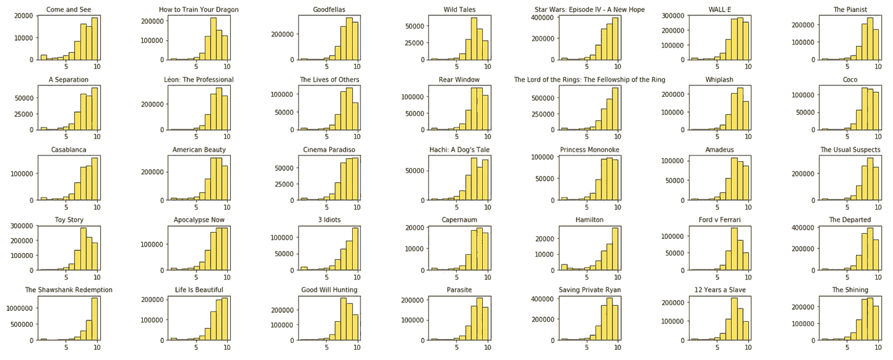
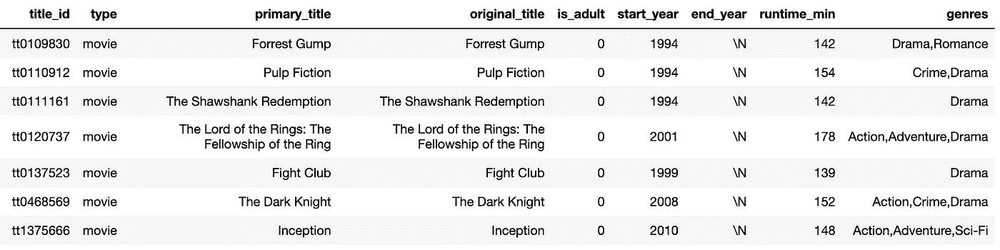
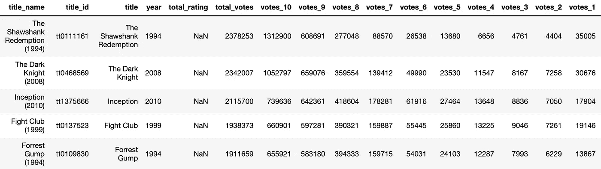
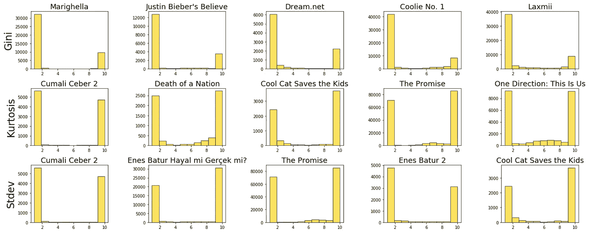
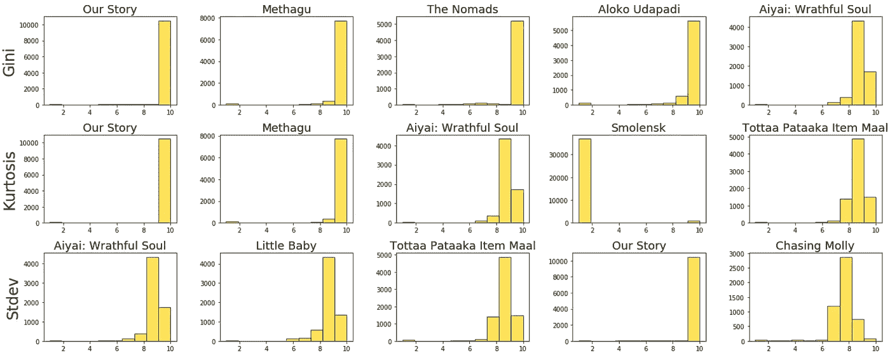
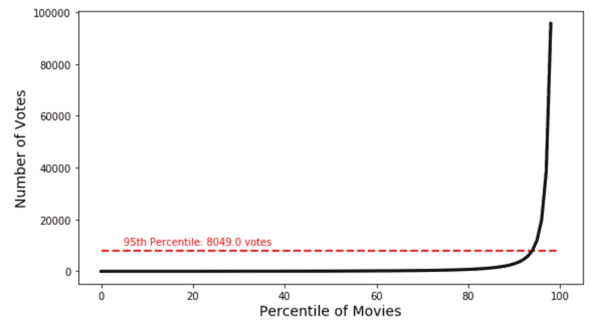
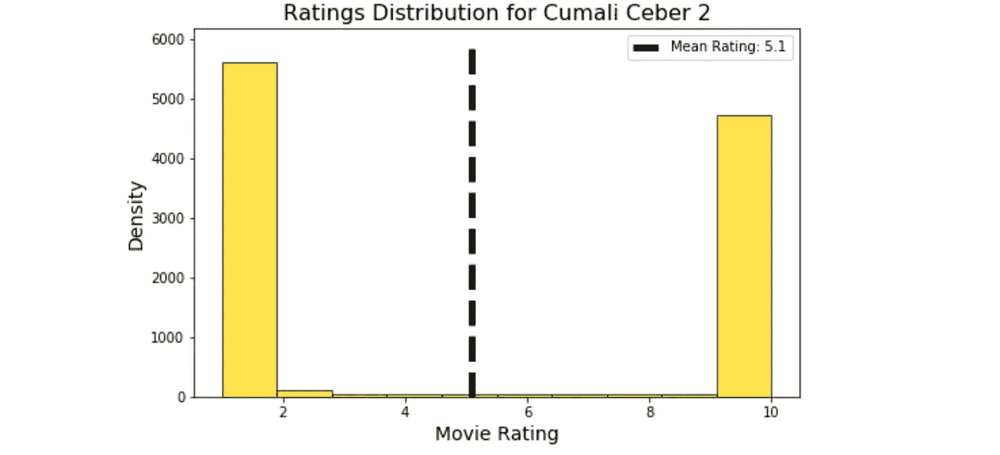
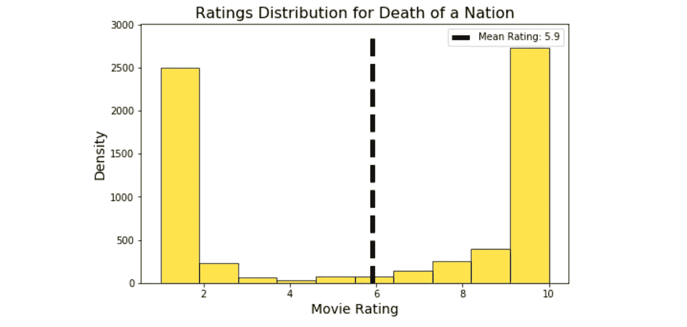
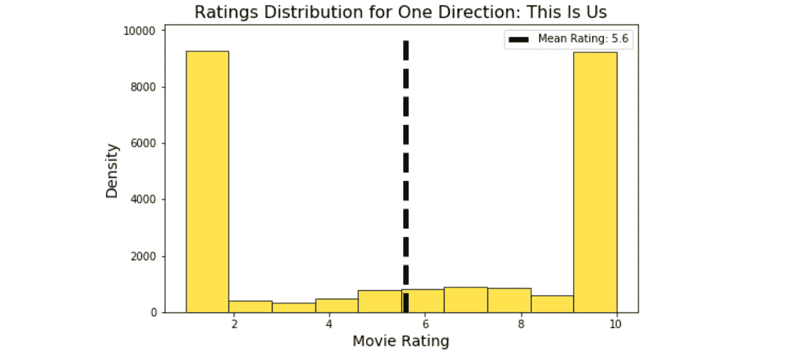

# 有史以来最极化电影的数据挖掘

> 原文：<https://towardsdatascience.com/data-mining-for-the-most-polarizing-movies-ever-made-4d92d27d702?source=collection_archive---------24----------------------->

## 使用 Python 和统计学寻找有分歧的电影

作者图片

有些电影你要么喜欢要么讨厌，没有折中。我们都可以想到一些分裂朋友和家人的电影，但有些人甚至努力整理了[列表](https://www.indiewire.com/2016/09/30-most-polarizing-movies-since-2000-under-the-skin-only-god-forgives-1201723584/)中最分裂的电影，如*【房间】*、*波拉特*和*拿破仑炸药*。对于这些电影，肯定普遍缺乏共识，但它们真的是有史以来最两极分化的电影吗？

IMDB 显示，超过一半(57.3%)的《房间》的[评分](https://www.imdb.com/title/tt0368226/ratings/?ref_=tt_ov_rt)要么是 1 分，要么是 10 分，虽然这肯定是一部很少有人能同意的电影，但我很好奇我们是否能做得更好。使用来自 IMDB.com 的 API 的数据，这一分析将挖掘成千上万部电影，以找到有史以来真正最极化的电影。

# 数据

IMDB，或者说是为门外汉准备的互联网电影数据库，是一个拥有数百万用户评分的网站。它也是一个 [API](https://imdb-api.com/) 的所在地，允许开发者提取这些数据并在各种应用中使用，比如为其他网站提供后端数据，或者在这种情况下，寻找两极分化的电影。IMDB 的[文档](https://imdb-api.com/api#UserRatings-header)中列出了几十个 API 调用来获取不同类型的数据，但“UserRatings”调用可以让用户在一个请求中获取一部电影的所有用户评级，如下面的*社交网络*所示。

然而，对于这些调用，我们需要每个电影的 title_id。这可以在每部电影页面的 url 中找到，但 IMDB 也非常有用地提供了从每个标题到文件**中每个 title_id 的映射，title.basics.tsv.gz**可以在他们的[网站](https://www.imdb.com/interfaces/)上下载。不幸的是，这个文件包含了 IMDB 上的*一切*(电视剧集、短片、视频游戏、迷你剧集等。)而且数据质量可能相当参差不齐。经过一些数据探索，我写了下面的代码片段来转换。IMDB 提供的 tsv 文件转换成更干净，更有用的。用于此分析的 csv 文件。

下面是用于电影到 title_id 映射的已清理数据的示例。

作者图片

有了正确的 movie-to-title_id 映射和正确的 API 调用来获取每部电影的收视率数据，然后我创建一个助手函数，它将获取给定电影所需的所有相关信息。这个函数对 IMDB 的 API 进行初始调用，将响应转换成 JSON 对象，然后从该对象解析出相关信息。

调用 API 的函数

通过遍历我清理的电影数据中的所有 281，459 个 title _ ids 并调用上述函数(以及一些错误处理)，我们最终得到如下所示的数据帧:

作者图片

总之，由于进行每个单独调用所花费的时间长度以及 IMDB 对 API 调用的强制每日限制，提取这些数据需要大约两周的时间。

# 衡量标准

接下来，我希望找到一个衡量标准，在给定评级分布的情况下，从几十万部电影中找出最两极分化的电影。幸运的是，之前的研究([检测收视率的两极分化](https://www.researchgate.net/publication/322255985_Detecting_Polarization_in_Ratings_An_Automated_Pipeline_and_a_Preliminary_Quantification_on_Several_Benchmark_Data_Sets#pf9))已经解决了这个问题。*不幸的是*，研究人员通过特征化电影评级分布来解决这一问题，让“多名专家[手动]将每个项目分为极化或非极化类别”，然后在这个带标签的数据集上训练随机森林，最终计算每个分布的极化分数。因为我在 IMDB 的 API 上花费的 40 美元让我超出了预算 40 美元，所以我需要一种不同的方法。

经过一番头脑风暴，我想出了 3 个可能的指标来检测一个极化的 U 型分布:

> **标准差**:方差的平方根，即均值的方差的平均值。

下面我定义了三个函数，它们将获取汇总的评级信息，将其转换为数据分布，并计算该分布的汇总指标。将这些新特征添加到数据集中后，我检查了每个指标的极端最高值和最低值，以找出哪一个最能捕捉分布中的两极分化。*注意:感谢 GitHub 用户 Olivia Guest 已经编写了一个从 numpy 数组计算基尼系数的函数。*

创建指标的辅助函数

顺便提一下，与 for 循环相比，将这些函数作为 DataFrame.apply()方法的输入确实有助于加快在这种规模下显示数据的速度。当所有这些功能完成后，我绘制了至少有 5000 张选票的电影(以减少噪音)，以及每个候选指标的最高或最低值:

**最极化的电影**

作者图片

**最不两极分化的电影**

作者图片

查看每个指标的定义以及每个指标中最极化和最不极化电影的两个图表，我选择使用峰度作为评论中极性的主要衡量标准。对我来说，它似乎在挑选两极分化的电影方面做得最好，喜欢或讨厌这些电影的人几乎各占一半，另一方面，它似乎发现有一致共识的电影比标准差或基尼不平等要好一点。

# 电影

在我看来，要让一部电影具有分裂性，必须有相当多的人不同意它，但 IMDB 上的绝大多数电影只有很少的评级(一部电影的评级中位数是 85)。为了找到有史以来最两极化的电影，我限制了 IMDB 上投票最多的前 5%的电影。如下图所示，这将我们限制在超过 8，049 票的电影。

作者图片

随着峰度作为我的极化指标和投票阈值的最终确定，我现在可以宣布有史以来最极化的电影是… [**库马利·塞伯 2**](https://www.imdb.com/title/tt8402090/) ！总共 10，736 张选票中的 10，326 张(超过 96%！)无论是 10 分还是 1 分，这部电影的观众都有着难以置信的分化。这部电影讲述的是库马利处理他祖父所在社区的养老院可能被拆除的异常情况，受到了批评，比如“这是我看过的最糟糕的电影”。我甚至不能完成它、*这部电影是在浪费时间。看空烟囱更有益，*”但显然不是每个人都有这种感觉。

作者图片

以峰度衡量，第二部最两极分化的电影是 [*国家之死:我们能第二次拯救美国吗？*](https://www.imdb.com/title/tt8564902/?ref_=nv_sr_srsg_0) 。这部电影比较了唐纳德·特朗普和亚伯拉罕·林肯担任总统期间的政治气候。显然，它还将民主党与纳粹党相提并论，这就很容易理解为什么这部电影如此两极分化。

作者图片

以一种更轻松的方式结束，我给 [*一个方向:这是我们*](https://www.imdb.com/title/tt2515086/?ref_=nv_sr_srsg_0) 在这些有争议的电影奖项中获得荣誉奖。一个 10 星评论家评论说“*显然是 10/10，爱 1d 和想念他们很多。此外，哈利可以得到我的心，zayn 的声音是另一回事*”而一位一星投票者回应道“*没有任何语言可以解释这部电影有多糟糕*。绝对难以置信。

作者图片

感谢您的阅读！要获得所有中型文章的完整访问权限，请点击[此处](https://eonofrey.medium.com/membership)！