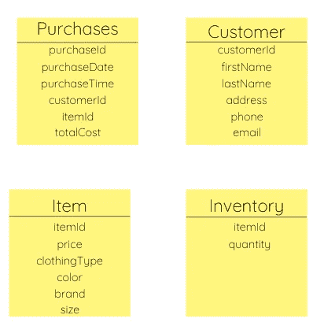
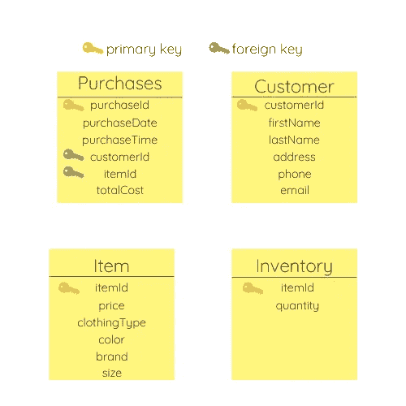
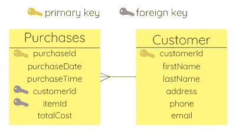
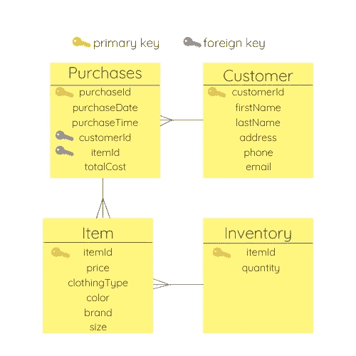

# 数据建模 101:它是什么？

> 原文：<https://towardsdatascience.com/data-modeling-101-what-is-it-e9c688f0680b?source=collection_archive---------10----------------------->

## 什么是数据建模，如何使用，如何实践？

托拜厄斯·菲舍尔在 [Unsplash](https://unsplash.com/s/photos/database?utm_source=unsplash&utm_medium=referral&utm_content=creditCopyText) 上的照片

不久前，我在一家受欢迎的航运公司的数据架构部门实习。去实习的时候，我甚至不知道那意味着什么。我后来发现，数据架构的很大一部分被称为数据建模。

在那里的时候，我学会了设计数据库，映射这些数据库中的列和表之间的关系，最重要的是，在一个图表中可视化这一切。在最近的一次工作面试过程中，其中一次技术面试只关注数据建模，这让我重新审视了所有这些。

为了准备这次面试，深入挖掘四年前我在实习期间学到的一切，这是一次很好的学习经历。如果你也遇到围绕这个话题的技术面试，以下是你需要知道的。

# 什么是数据建模？

数据建模是为将来会存储在数据库中的数据创建数据模型的过程。好吧，那么什么是数据模型呢？数据模型将数据组织成表，并描述这些表之间的关系。

例如，假设我们有一个服装店，需要创建一个数据库来存储库存和客户信息。您将创建一个包含各种表的数据模型，比如采购、客户信息、项目详细信息和库存信息。

我们将所有这些数据组织到表中并定义它们之间的关系的原因与访问数据的方式有关。将信息拆分到不同的表中，使得系统在检索这些数据时更加高效。

# 数据模型的类型

有三种不同类型的数据模型，每一种都具有一定的复杂性。

1.  概念数据模型

这是三个中最不专业的。它提供了您需要的不同表(也称为实体)以及该表中潜在的列(属性)的高级概述。

2.逻辑数据模型

这是一个更复杂的技术问题。该模型将包括实体之间的关系以及属性和实体的数据类型。

3.物理数据模型

这是在生成数据库本身之前创建的最后一个数据模型。这突出显示了数据库的实际模式，并包括前面的数据模型中提到的所有信息。

# 关系的类型

我前面提到过，数据模型可视化了实体之间的关系。数据模型中可以使用四种不同的关系。

1.  一对一

这意味着对于另一个实体的每个实例，只能存在一个实体。以我的经验来看，这种关系相当罕见。

2.一对多和多对一

这意味着一个实体可以有另一个实体的许多实例。例如，一个雇主可以有许多全职员工，但每个员工只能有一个全职雇主。

3.多对多

这意味着一个实体的许多实例可以有另一个实体的许多实例。例如，许多航空公司可以有许多客户，许多客户可以有他们坐过的许多航空公司。

# 主键和外键

在实体之间创建任何类型的关系时，您总是会有一个主键和外键。实体的主键是实体的唯一标识符。这通常是某种身份证号码。一个实体中的外键是另一个实体中的主键。

换句话说，只要另一个实体中有一个属性是另一个实体中的主键，就应该将其标记为外键。下面有一个例子可以帮助理解这个概念。

# 创建数据模型

创建数据模型时，理解数据是关键。跟踪哪个领域很重要？这个数据库的目的是什么？回答这些问题将使建模过程变得更加容易。

1.  你的实体是什么？

让我们回头看看我们的服装店例子。我们首先要确定我们的实体或表是什么。想想不同的更广泛的数据类别。我们需要一个购买实体来跟踪哪些客户购买了哪些商品。我们希望为客户提供一个实体，存储他们所有的个人信息，如姓名、地址和电话号码。我们还希望有一个实体来跟踪每件商品的信息，如唯一的 id，颜色，尺寸和服装类型。最后，我们希望有一个库存实体，这样我们就知道每件商品还剩多少。

2.这些实体中需要什么属性？

现在我们已经创建了实体，我们需要弄清楚在这些特定的实体中需要哪些属性。让我们先来看看购买。以下是我想到的与购买相关的信息:

*   唯一的采购 ID
*   购买日期
*   购买时间
*   采购人员的客户 ID
*   正在购买的项目的项目 ID
*   购买总成本

作者图片

考虑哪个实体对每个属性最有意义是很重要的。考虑这些实体之间的关系也很重要。我们需要在这个购买表中包含 customerId 和 itemId，以访问客户和项目实体。这些将作为这个表中的外键和其他表中的主键。

此外，您还可以在此步骤中包括这些字段的数据类型。然而，这在面试中通常是不必要的。其他概念更需要证明。

现在测试一下你自己，看看你是否能填写我提到的其他实体的属性。不准偷看！

当你完成后，将你的结果与我下面的结果进行比较。

作者图片

3.所有这些实体是如何联系起来的？

现在，我们需要确保拥有将不同实体连接在一起所需的所有主键和外键。为了在一个查询中提取所有需要的数据，这是非常重要的。如果这些表不能正确地相互连接，您的数据库将不会有效或正确地构建。

让我们回顾一下主键和外键之间的区别。主键是实体的唯一标识符。客户 ID 充当客户实体的主键，项目 ID 充当项目实体的主键，采购 ID 充当采购实体的主键。

外键是在另一个实体中充当主键的字段，但不是您当前正在查看的实体。例如，customer ID 和 item ID 都充当 purchases 实体中的外键，因为它们是其他表的唯一标识符(主键)，而不是 purchases 实体本身的唯一标识符。

作者图片

4.这些实体之间的关系类型是什么？

现在让我们重温一下我们之前讨论过的关系类型。我们需要弄清楚哪一个将适用于这些实体。

一次采购可以有很多客户吗？不，但是一个顾客可以有许多购买。客户和购买之间是一对多的关系。

作者图片

测试您的技能，并尝试将正确的关系添加到其余的实体中。完成后，向下滚动，将你的答案与我的答案进行比较。

作者图片

Item 与 purchases 有多对一的关系，因为一个采购可以有多个 item，但是一个 item 只能有一个 purchase。

库存与项目有一对多的关系，因为一个唯一的 itemId 只能有库存信息，但多个项目可以有相同的库存信息。

通过思考不同的日常场景，您可以继续练习这些数据建模问题。电影院如何创建数据库？杂货店怎么样？想一想您每天接触到的必须有数据模型的业务。通常这类问题没有正确或错误的答案，只要确保你理解了概念，并能解释为什么你创建了某个实体。

祝你好运！请务必查看我的其他一些文章，为技术面试做准备，如[应对每个 SQL 面试问题的顶级技巧](/top-skills-to-ace-every-sql-interview-question-33356b08845a)和[如何使用 SQL 超前和滞后函数](/how-to-use-sql-lead-and-lag-functions-35c0db633c5e)。