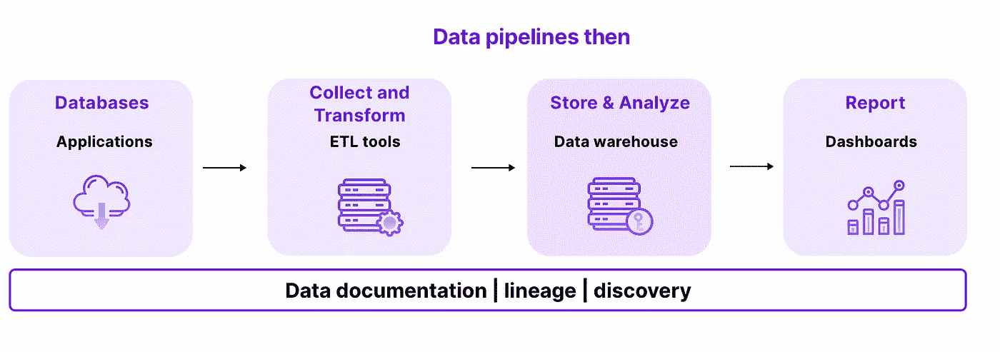
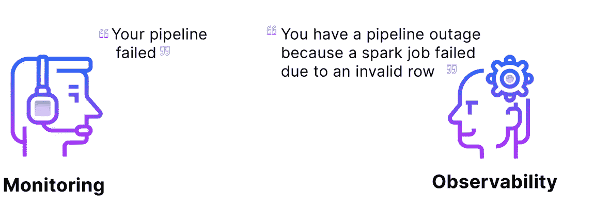
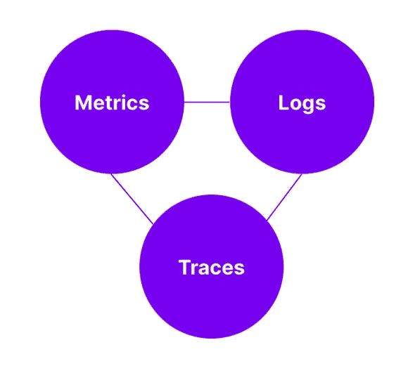
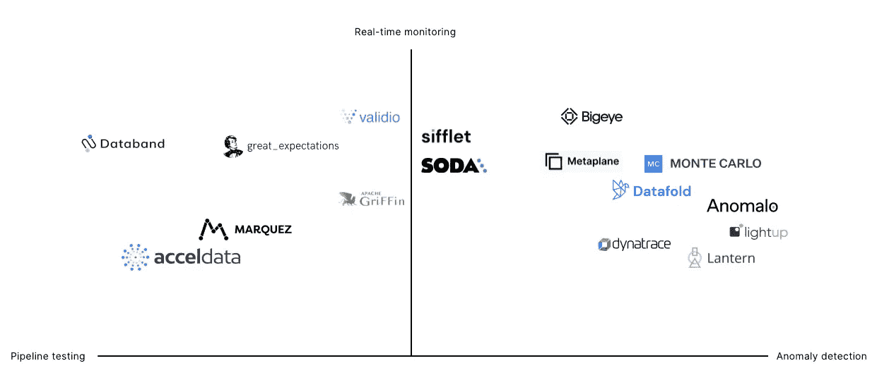

# 中端市场公司的数据监控和可观察性基准

> 原文：<https://towardsdatascience.com/data-monitoring-and-observability-benchmark-for-mid-market-companies-154155f41dcb?source=collection_archive---------24----------------------->

## 现代数据堆栈的五大观察工具

图片来自 [Castor](https://www.castordoc.com/blog/data-monitoring-and-observability) 的网站

现代组织比以往任何时候都更多地生产、收集和处理数据。一项针对数据专业人士的 [IDG](https://www.matillion.com/resources/blog/matillion-and-idg-survey-data-growth-is-real-and-3-other-key-findings) 调查显示，数据量正以平均每月 63%的速度增长。随着业务中数据的激增，我们用来移动这些数据的技术变得更加错综复杂，以至于我们完全看不到数据是如何处理的。结果，随着数据的移动，错误越来越多，我们最终得到的是无用的数据。谢天谢地，**可观察性**工具在过去几年里蓬勃发展，帮助公司重新获得对数据处理的控制权。今天，我们试图理解数据可观测性的概念，并理清可观测性工具的活跃生态系统。

‍The 的可观测性概念起源于控制理论，由鲁道夫·卡尔曼首创于线性动态系统。我们把它定义为一个系统的健康程度可以从它的输出中推断出来的度量。

数据可观察性是数据管道发展的结果。数据管道指的是负责将数据从一个系统转移到另一个系统的任何一组处理材料。它们是数据分析和数据科学活动的支柱，因为它们生成数据科学家和数据分析师使用的数据资产。直到 15-20 年前，数据管道还是相当基础的，为业务分析的稳定需求服务。商业智能团队需要对他们的财务状况、库存水平、销售渠道和其他运营指标进行历史测量。没什么大不了的。数据工程师使用 ETL(提取、加载、转换)工具来转换特定用例的数据，并将其加载到数据仓库中。由此，数据分析师使用 BI 软件创建了仪表板和报告，生活变得很美好。

传统数据管道—图片由 Louise de Leyritz 提供

‍In:近年来，我们见证了对数据需求的飞速增长。从数据分析师到业务用户，数据无处不在，每个人都在使用它。

为了确保数据用户完美地理解数据仓库中存在的所有数据，我们建议使用数据目录，如 [Castor](https://www.castordoc.com) 或 [Collibra](https://www.collibra.com) (取决于您的规模)。你可以在这里找到所有数据目录工具的[基准](https://www.castordoc.com/blog/data-catalog-benchmark-for-mid-market-companies)。

数据管道现在使用复杂工具(Spark、Kubernetes、Airflow)的组合运行，随着互联部件数量的增加，管道故障的风险也在增加。工具的多样性是必要的，因为它允许数据团队在其数据堆栈的每一层选择最佳平台。但是所有这些引擎的组合使得实际上不可能看到管道的不同部分。

现代数据管道 Louise de Leyritz 图片

现代数据管道不仅复杂，而且还具有黑盒特性。你知道进去的是什么，出来的是什么，但你不知道中间发生了什么。只要出现想要的结果就好。但如果没有，那就非常令人沮丧。当数据集从管道中出来时，通常会留下奇怪的值、缺失的列、本应是数字的字段中的字母等等。结果，数据工程师花了几个小时绞尽脑汁想到底哪里出了问题，哪里出了问题，如何解决。Forrester 估计，数据团队将超过 40%的时间花在数据质量问题上，而不是致力于为企业创造价值的活动。所有这些都面临着巨大的压力，因为在客户演示中使用这种低质量数据的数据分析师正在被他的经理痛打一顿。这是最重要的部分。收集、处理和分析数据的全部目的是为了创造商业价值。如果没有对管道的可见性，错误就会累积，数据会恶化，业务价值也会被破坏。这就是数据可观测性技术的用武之地。它告诉你坐下来放松，因为它将揭示每个管道故障的根本原因。不再流泪，不再抓头，不再挨打。但实际上，它是如何工作的呢？

可观察性与监控——广告中的标识

数据监控经常与数据可观察性混淆在一起。这两个术语是共生的，这解释了它们之间界限的模糊性。数据监控是实现数据可观测性的第一步，也是可观测性的一个子集。比方说，你正在观察一个数据管道系统。监控的基本目的是使用一组预定义的系统指标和日志来了解您系统的状态，利用这些指标和日志来**获取有关事件的警报**。它要么告诉你“系统是健康的”，要么告诉你“有问题”。因此，监控应用程序允许您检测****已知的一组故障模式。它不能解决黑匣子的问题。**通过监控，您可以:**

*   **跟踪错误并在错误发生时立即得到通知**
*   **跟踪关于给定微服务消耗的资源数量的度量。**
*   **当您的系统遇到中断或故障时获得警报。**

**数据监控会标记您的数据问题，这很好。不利的一面是，识别问题只是旅程的开始，在了解管道中断的根本原因时，监控并不顺利。**

**数据可观察性带来了一种更主动的方法，通过提供系统操作的更深入的视图。它使用监控产生的数据和见解来全面了解您的系统、其健康状况和性能。**

**比方说，你拥有一家杂货店。每天早上，食品杂货都陈列在货架上，供顾客挑选。简单。监控的作用是提醒你产品可能出现的任何问题:当货架上有丢失的商品时，当产品洒得到处都是时等等。可观察性更进了一步，让你清楚地看到货架上货物堆积背后的供应链。如果你很容易理解为什么货架上的一件商品不见了，如果你能看到后面的房间里发生了什么，或者员工是如何把商品放在手推车上的，那么你的杂货店就是“可观察的”。**

**在数据领域，可观察性揭示了数据管道中发生的工作流，使您能够轻松地从结果导航到原因。借助可观察性，您可以:**

*   **了解请求所经历的服务，并**定位性能瓶颈****
*   **了解**请求失败的原因****
*   **观察特定的**微服务如何处理请求****
*   **识别错误或瓶颈发生时的**模式**,并利用洞察采取行动，以防止将来出现此类情况**

****监控是可观测性**的子集，你只能监控一个可观测的系统。监控告诉你“你的管道出故障了。”而可观察性告诉您“您有一个管道中断，因为一个 spark 作业由于一个无效行而失败”**

# **有哪些可观察性工具？**

**有三代可观察性工具:**

****第 1 代:**传统的 APM(应用管理性能)工具。这些工具是为软件工程师和开发人员创建的，但却是用于数据可观察性的第一批工具。**

****第二代:**数据可观测性工具。这些工具允许您深入数据问题的根源，并了解问题的根本原因。**

****第三代:**自动化数据观察。这些智能工具可以预测并自动修复问题，以免影响性能。**

**如果您正在寻找数据可观察性解决方案，我们在这里列出了所有工具及其产品[。](https://notion.castordoc.com/catalog-of-data-quality)**

# **可观察性 1.0:用于 DevOps 的 APM 工具**

**可观察性并不新鲜。在 DevOps 世界中，这是一个非常成熟的概念。现代组织从整体架构向微服务架构的转变导致了开发运维团队的兴起，这些团队消除了传统的开发和运营团队之间的障碍。DevOps 团队持续关注其系统的健康状况，确保应用程序和基础架构正常运行。**可观测性**的概念源于这一发展。**

**DevOps 团队使用应用管理性能(APM)工具来监控他们的系统和基础架构。APM 旨在检测和诊断复杂的应用程序性能问题，以保持服务水平。这些工具集合了三个监控组件来发现和解决系统故障:**度量、日志和跟踪。**这些通常被称为“可观察性的三大支柱”**

**‍**

****

**软件监控的支柱—图片由 Louise de Leyritz 提供**

****指标:**指标是在给定时间间隔内测量的数值。它包括特定的属性，如时间、名称、KPI 和值。度量可以使用数学建模和预测来获得系统在一段时间内的行为知识。**

****日志:**日志是在特定时间发生的事件的文本记录。在日志中，您可以找到事件的注释、事件发生的时间以及事件的一些背景。**

****跟踪:**跟踪表示请求通过分布式系统的端到端旅程。即在不同微服务中执行的每个操作的记录。跟踪是日志的表示，单个跟踪可以提供对请求所经过的路径及其结构的可见性。**

**将这三个监控组件集成到一个解决方案中，使开发人员能够了解他们的系统。这些系统被称为**可观测的，**因为可以根据监测输出来推断它们的健康状况。**

**随着数据激增，需要有可观察的管道，数据工程团队使用如上所述的标准 APM 工具，试图获得对其数据堆栈的可观察性。**

**然而，APM 工具是专门为软件工程师和开发人员构建的，而不是为了监控数据管道。尽管一些公司将它们用作数据观察工具，但它们并不总是奏效。原因是，技术系统和数据管道天生不同。例如，对于数据管道，在进程成功运行之前遇到许多故障是完全正常的。APM 工具不能理解这一点，也不能理解数据管道逻辑的其他细微差别。使用 APM 工具来获得管道可见性的数据团队通常以错误的警报结束，这带来了不必要的混乱。**

# **可观察性 2.0:数据管道可观察性**

**为了获得数据管道上的可观察性，除了上述标准集之外，还需要监控一组额外的维度。APM 工具并不是为了数据的可观察性而设计的，它们已经逐渐被更好的工具所取代，用来监控与数据管道健康相关的组件。**

****

**数据可观察性的支柱 Louise de Leyritz 的图像**

****数据质量:**数据质量有问题吗？您的数据集是否具有您期望的容量，或者是否有丢失的数据？你的数据分布正确吗？**

****时间表:**管道是否按计划运行？您的数据是最新的，还是更新计划中有故障？**

****依赖关系:**上游的数据问题将如何向下游传播？管道的不同部分是如何关联的？**

**这是接近数据可观察性支柱的一种方式。巴尔·摩西提出了另一个方案，她在其中概述了数据可观察性的五大支柱。可观测性数据“支柱”的数量并不那么重要。其思想是:您可以通过监视一定数量的组件来获得对堆栈的可观察性，这些组件将告诉您数据管道的健康状况。不同的可观测性解决方案将根据它们想要实现的可观测性的种类来监控管道的不同组件。这就是为什么选择适合您需求的解决方案非常重要。**

# **可观察性 3.0:自动化数据可观察性**

**第三代可观测性工具拥有广泛的自动化特性。这意味着这些工具根据提供给它们的数据集调整它们的监控方法，自动决定在哪里设置警报阈值。通过这种方式，您可以拥有可观察的管道，而不必经历为每个数据资产定义警报阈值的烦人任务。**

**使用机器学习模型，现代数据可观察性平台，如 [Bigeye](https://www.bigeye.com) 分析数据趋势，并自动推荐数据质量指标，以开始跟踪特定资产。您不必花时间定义对您的业务至关重要的所有指标和日志，因为这是自动实现的。更重要的是，现代工具可以预测数据质量指标，并根据预测自动调整警报阈值。这节省了时间，因为数据团队不必手动调整阈值。它还确保团队总是收到相关的警报。**

**一些解决方案，如 [databand.ai](http://databand.ai) 提出了自动化功能，如动态管道运行，旨在改善数据管道的性能。该功能使数据团队能够根据不断变化的数据输入、参数或模型分数运行不同版本的管道。**

# **您的组织使用哪种可观察性工具？**

**下面，你会发现一个可观察性工具的图景，它可以帮助你选择一个适合你公司需要的可观察性工具。我们从两个方面对解决方案进行了分类:**

*   **它们是否允许实时数据监控**
*   **他们是使用**管道测试**框架还是**异常检测**框架来调查数据的健康状况。**

****实时数据监控**指的是解决方案是否能够识别数据管道中发生的问题，从而有可能在加载坏数据之前停止管道。**

# **流水线测试与异常检测框架**

**并非所有的数据可观测性解决方案都是相同的。我们特别根据解决方案是使用管道测试还是异常检测框架来区分它们。**

**一个**流水线测试框架**允许数据工程师测试二进制语句。例如，列中的所有值是否都是唯一的，或者模式是否与某个表达式匹配。当测试失败时，数据被标记为“坏的”。有了这些信息，数据工程团队可以诊断质量差的数据，并采取必要的措施来解决问题。测试在管道中的不同步骤重复进行，这使得数据工程师可以很容易地看到数据在管道的哪个阶段/层损坏，并找到最合适的人来解决问题。**

**在**异常检测**框架中，该解决方案扫描数据资产，从这些数据中收集统计数据，并关注这些统计数据的行为变化。设置警报阈值(自动、手动或两者兼有)，当统计行为显示数据有问题时，解决方案会向您选择的平台发送警报。有了这个框架，解决方案通常使用数据沿袭找到数据问题的根本原因，允许他们追溯数据经历的所有事件。**

****

**可用解决方案的基准—图片由 Louise de Leyritz 提供**

**要获得完整的数据可观察性工具基准测试和更多分类标准，请单击此处的。**

**订阅[我的简讯](https://louisedeleyritz.substack.com/)获取更多文章！**

# **更现代的数据堆栈基准？**

**点击查看更多关于现代数据堆栈[的性能指标评测和分析。我们写了利用数据资产时涉及的所有过程:从现代数据堆栈，到数据团队的组成，再到数据治理。我们的博客涵盖了从数据中创造有形价值的技术和非技术方面。](https://notion.castordoc.com)**

**在 Castor，我们正在开发一个数据文档工具 Figma，Slack generation。或者对 Fivetran，Looker，Snowflake，DBT 的狂热爱好者来说是数据方面的。我们将我们的目录设计得易于使用、令人愉快且友好。**

**想去看看吗？[联系我们](https://meetings.hubspot.com/xavier76)，我们将向您展示一个演示。**

***原载于*[*https://www.castordoc.com*](https://www.castordoc.com/blog/data-monitoring-and-observability)*。***