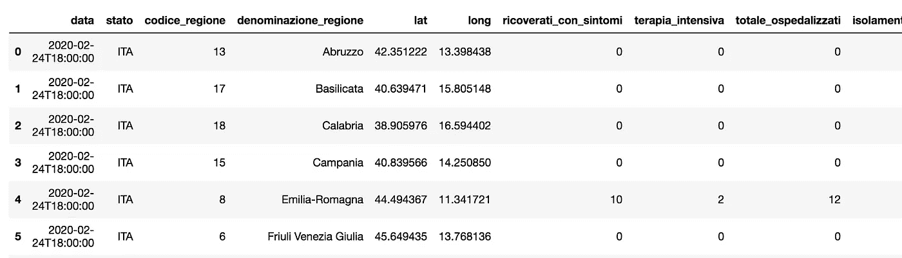

# 使用 Python scikit 进行数据规范化-学习

> 原文：<https://towardsdatascience.com/data-normalization-with-python-scikit-learn-e9c5640fed58?source=collection_archive---------24----------------------->


图片由[洛伦佐·卡法罗](https://pixabay.com/users/3844328-3844328/?utm_source=link-attribution&utm_medium=referral&utm_campaign=image&utm_content=1863880)提供，来自 [Pixabay](https://pixabay.com/?utm_source=link-attribution&utm_medium=referral&utm_campaign=image&utm_content=1863880)

在关于数据预处理的系列文章之后，在本教程中，我将讨论 Python `scikit-learn`中的数据规范化。正如在我之前的教程中已经说过的，数据标准化包括将不同尺度上测量的值调整到一个共同的尺度上。

规范化仅适用于包含数值的列。有五种标准化方法:

*   单一特征缩放
*   最小最大
*   z 分数
*   对数标度
*   剪报

在本教程中，我使用`scikit-learn`库来执行规范化，而在[我之前的教程](/data-preprocessing-with-python-pandas-part-3-normalisation-5b5392d27673)中，我使用`pandas`库来处理数据规范化。我使用了我之前教程中使用的相同数据集，因此可以比较结果。事实上，我们使用这两种方法获得了相同的结果。

无论如何，在本教程中我不处理日志缩放和剪辑，这将是未来教程的对象。

`scikit-learn`库也可以用来处理缺失值，正如我在[上一篇文章](/data-preprocessing-with-scikit-learn-missing-values-8dff2c266db)中所解释的。

本教程中描述的所有`scikit-learn`操作都遵循以下步骤:

*   选择预处理方法
*   通过`fit()`功能进行安装
*   通过`transform()`功能将其应用于数据。

`scikit-learn`库只对数组起作用，因此当执行每个操作时，dataframe 列必须被转换成数组。这可以通过`numpy.array()`函数来实现，该函数接收 dataframe 列作为输入。`fit()`函数接收数组的数组作为输入，每个数组代表数据集的一个样本。因此,`reshape()`函数可以用来将标准数组转换成数组的数组。

本教程描述的所有代码都可以从[我的 Github 库](https://github.com/alod83/data-science/blob/master/Preprocessing/Normalization/Data%20Preprocessing%20-%20Normalization%20with%20scikit-learn.ipynb)下载。

# 数据导入

作为数据集的一个例子，在本教程中，我们考虑由意大利 Protezione Civile 提供的数据集，该数据集与自新冠肺炎疫情开始以来登记的新冠肺炎病例数相关。数据集每天更新，可从[此链接](https://raw.githubusercontent.com/pcm-dpc/COVID-19/master/dati-regioni/dpc-covid19-ita-regioni.csv)下载。

首先我们需要导入 Python `pandas`库，通过`read_csv()`函数读取数据集。然后我们可以删除所有带有`NaN`值的列。这是通过`dropna()`功能完成的。

```
**import** pandas **as** pd
df **=** pd.read_csv('https://raw.githubusercontent.com/pcm-dpc/COVID-19/master/dati-regioni/dpc-covid19-ita-regioni.csv')
df.dropna(axis**=**1,inplace**=True**)
df.head(10)
```



作者图片

# 单一特征缩放

单一特征缩放将列中的每个值转换为 0 到 1 之间的数字。新值的计算方法是当前值除以列的最大值。这可以通过`MaxAbsScaler`类来完成。我们将缩放器应用于`tamponi`列，它必须转换为数组并进行整形。

```
**import** numpy **as** np
**from** sklearn.preprocessing **import** MaxAbsScaler
X **=** np.array(df['tamponi']).reshape(**-**1,1)
scaler **=** MaxAbsScaler()
```

现在，我们可以安装缩放器，然后应用变换。我们通过应用逆`reshape()`函数将其转换为原始形状，并将结果存储到 dataframe `df`的新列中。

```
scaler.fit(X)
X_scaled **=** scaler.transform(X)
df['single feature scaling'] **=** X_scaled.reshape(1,**-**1)[0]
```

`scikit-learn`库还提供了一个函数来恢复原始值，给定转换。这个函数也适用于本文后面描述的转换。

```
scaler.inverse_transform(X_scaled)
```

它给出了以下输出:

```
array([[5.000000e+00],
       [0.000000e+00],
       [1.000000e+00],
       ...,
       [5.507300e+05],
       [6.654400e+04],
       [3.643743e+06]])
```

# 最小最大

与单个要素缩放类似，最小最大值将列中的每个值转换为 0 到 1 之间的数字。新值计算为当前值和最小值之差除以列值的范围。在`scikit-learn`中，我们使用了`MinMaxScaler`类。例如，我们可以对列`totale_casi`应用 min max 方法。

```
**from** sklearn.preprocessing **import** MinMaxScaler
X **=** np.array(df['totale_casi']).reshape(**-**1,1)
scaler **=** MinMaxScaler()
scaler.fit(X)
X_scaled **=** scaler.transform(X)
df['min max'] **=** X_scaled.reshape(1,**-**1)[0]
```

# z 分数

Z-Score 将列中的每个值转换为 0 左右的数字。通过 z 得分变换获得的典型值范围为-3 到 3。新值计算为当前值和平均值之差除以标准偏差。在`scikit-learn`中，我们可以使用`StandardScaler`功能。例如，我们可以计算列`deceduti`的 z 值。

```
**from** sklearn.preprocessing **import** StandardScaler
X **=** np.array(df['deceduti']).reshape(**-**1,1)
scaler **=** StandardScaler()
scaler.fit(X)
X_scaled **=** scaler.transform(X)
df['z score'] **=** X_scaled.reshape(1,**-**1)[0]
```

# 摘要

在本教程中，我展示了如何使用`scikit-learn`库的`preprocessing`包来规范化数据集。我们可以通过手动应用公式来获得相同的结果，如我之前的教程[中所解释的那样。](/data-preprocessing-with-python-pandas-part-3-normalisation-5b5392d27673)

使用`scikit-learn`的主要优点如下:

*   您不需要提前知道公式，因为您有预打包的类来执行操作
*   您可以通过`inverse_transform()`功能恢复原始数据。

如果您想学习如何使用 scikit-learn 库执行数据预处理的其他方面，请继续关注…

如果你想了解我的研究和其他活动的最新情况，你可以在 [Twitter](https://twitter.com/alod83) 、 [Youtube](https://www.youtube.com/channel/UC4O8-FtQqGIsgDW_ytXIWOg?view_as=subscriber) 和 [Github](https://github.com/alod83) 上关注我。