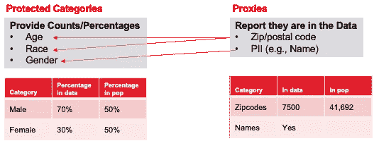

# 专业人工智能开发的数据营养标签

> 原文：<https://towardsdatascience.com/data-nutrition-labels-for-professional-ai-development-a50d26d3d108?source=collection_archive---------27----------------------->


来源于美国美国食品药品监督管理局政府网站。

## 负责任的人工智能不仅仅是一套原则。期望是你会有证据证明他们被支持。

我们在[**LexisNexis Legal&Professional**](https://www.lexisnexis.com/en-us/home.page)的使命是让所有人都能获得法律信息。我们从超过 50，000 个公共来源收集文档和数据，管理着超过 2[Pb](https://searchstorage.techtarget.com/answer/Whats-bigger-than-a-Terabyte)的数据。因为这些文件代表了我们国家的成文法，所以我们完全按照它们的写法提供。我们小心翼翼地不采用任何要求我们改变内容的个人判断或道德标准。然而，支持对社会有积极影响的决策也是我们公司的核心使命。

> 是的，但是你们的科学家太专注于他们能不能做到，他们没有停下来想想他们是否应该。——伊恩·马尔孔博士，《侏罗纪公园》

**正如所有的技术进步都是出于好意，它们也可能被用来产生负面影响。例如，社交网络的发明源于将人们聚集在一起并创造更紧密的社会联系的积极愿望，但它现在可以用来羞辱、欺负甚至操纵社会。思考用例并试图确定长期的道德和社会影响应该是寻求开发[专业级人工智能](/is-your-ai-professional-grade-f402c6bc7213)的公司的一部分。**

**[责任人工智能](https://www.sciencedirect.com/science/article/abs/pii/S026736491930127X)是一个新兴的治理框架，专注于人工智能的道德使用和民主化。为了确保今天开发的人工智能保持道德和社会责任，许多公司开始采用一套人工智能原则。比如 [**谷歌**](https://ai.google/principles/) 和 [**微软**](https://www.microsoft.com/en-us/ai/responsible-ai) 都在自己的网站上公开发布了自己的 AI 原理。正在开发一套人工智能原则的公司将包括以下三个主题的一些变体:**

*   ****最大化积极的社会影响，同时最小化消极影响**(例如，在消除消极偏见的同时保持公平和包容性)**
*   ****透明度**(例如，解释人工智能系统如何运行和构建)**
*   ****人类责任**(例如，确保计算机和人工智能对人类负责)**

***但是仅仅说自己的公司有原则是不够的*。*专业人士的期望是，你会有证据表明他们得到了支持。***

**与当今大多数企业一样，LexisNexis 利用数据科学和人工智能为我们的客户构建智能分析和解决方案。我们的每个*智能*应用程序都依赖于从上述法律数据资产中获得的训练数据。因此，这些模型具有潜在加剧包含在训练数据中的任何负面偏差并通过模型表达它们的风险。**

**负责任的人工智能关注的一个领域是最小化负面偏见，特别是对受保护的社会阶层，如性别、种族或年龄的偏见。一种可能尝试的天真的方法是在他们的模型中不使用变量，如种族、性别或年龄。但是，如果训练数据是有偏差的，例如，偏向一种性别类型，仅仅从模型中排除变量仍然会导致有偏差的模型，因为这是训练数据中的所有信息。一个更好的方法是通过对数据进行分层或者在回归模型中包含社会阶层变量来控制这些影响。然而，使用这两种方法中的任何一种，都需要建模者对训练数据的来源和构成有一个透彻的理解。**

**不幸的是，数据科学模型开发中的大部分时间和精力都花在了模型选择和调整上，很少关注训练数据评估。更令人担忧的是，如果你查看任何应用程序的 [github](https://github.com/) 库，关于数据是如何收集和评估的训练数据和文档是不存在的。**

**在专业级人工智能开发中，我们想要改变这一点。**

**在 LexisNexis，我们认识到训练数据是模型中主要的驱动偏差。*在专业级人工智能开发中，我们要求数据科学家努力实现透明，并提供支持公司负责任的人工智能原则的实证评估。*为此，我们创建了一个轻量级解决方案，让我们的数据科学家在为面向客户的产品开发模型时使用。**

**首先，我们需要沿着关键的受保护类别对训练数据进行剖析。此外，我们列出了也可以用来近似这些类别的代理。例如，如果所有数据都来自佛罗里达州，那么它可能会偏向于比该国其他地区年龄更大的人群。下图显示了我们在分析过程中检查的几个类别和代理。在代理的情况下，很难确定它们可以代表的所有可能的类别，所以我们建议只报告它们在数据和/或原始计数中的存在。**

****

**作者图片**

**虽然检查和分析训练数据对开发模型的数据科学家很有用，但是如果他们选择继续使用数据开发模型，那么该模型的消费者如何知道数据科学家知道什么呢？如果该模型是仅使用来自佛罗里达的数据开发的，它是否应该带有一个警告标签:**“小心！用佛罗里达数据开发的模型，如果在另一个州使用风险自担"**？**

***我们会争辩，是的！***

**嗯，不完全是这样。但我们确实认为，数据科学家不仅有责任测量，而且有责任报告他们的训练数据概况。正如我们前面提到的，大多数代码库不提供关于数据的细节。然而，他们有需求文档，列出了模型开发中使用的代码模块和版本。我们建议代码库也包含一个*训练数据清单文件*，或者我们喜欢称之为 ***数据营养标签*** 。下面是一个标准清单文件的示例，该文件存储在代码存储库的根文件夹中:**

```
**DataNutritionLabel.txt**## Source
[ Training data was queried on 2/10/2020 from 2018-2019 Case Law - CA, TX, FL ]## Protected Category Stats[ Male: Observed 70%, Expected 50%Female: Observed 30%, Expected 50%]## Proxies[ Zipcodes: Observed 7500, Expected 41,692Names: Observed]## Decision[ Include Weight Variable in model to adjust for protected cat skew]## Alternatives considered[ Any alternatives that were considered during the decision making process ]
```

**作为一名寻求开发负责任的人工智能的专业级数据科学家，不仅仅需要找到完美的数据和完美的模型。它要求人们思考和理解使用模型及其应用可能产生的社会和伦理影响。它涉及对训练数据的彻底评估和评价。它还可能需要涉及额外的主题专家和产品经理，以帮助考虑可能的应用程序和用例。最后，这意味着数据科学家对透明度负责；用于记录和共享该信息，以告知模型的未来开发人员和用户他们所使用的训练数据中的偏差。正如营养标签出现在你购买的每一种食品上，使你能够做出消费决定一样， ***我们建议这些训练数据清单成为支持数据科学模型的每个代码库的一部分。*****