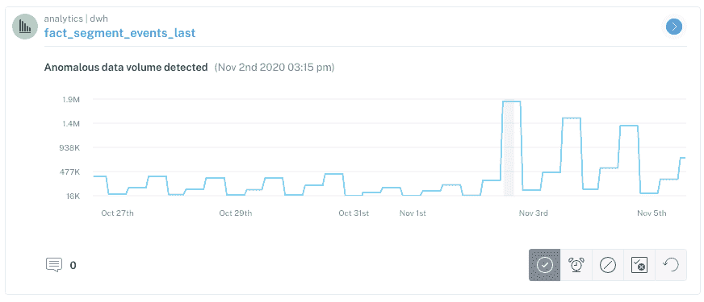
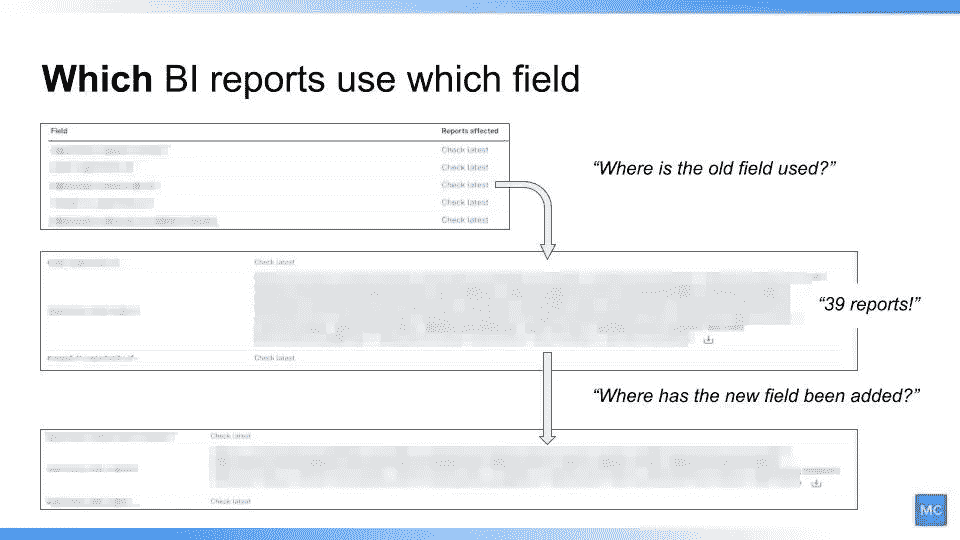
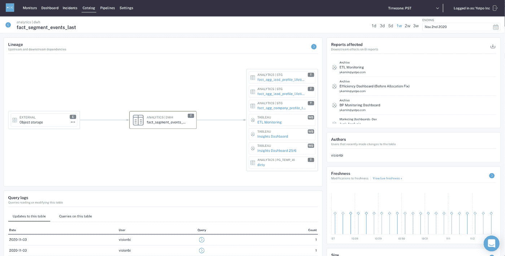

# 数据可观测性:如何大规模地固定数据质量

> 原文：<https://towardsdatascience.com/data-observability-how-to-fix-data-quality-at-scale-a79081d5b94d?source=collection_archive---------23----------------------->

## 引入一种新方法来防止分析仪表板损坏，并增强对您数据的信任。

图片由 Shutterstock 提供。

*公司每年花费超过*[***1500 万美元***](https://www.gartner.com/smarterwithgartner/how-to-stop-data-quality-undermining-your-business/) *处理* [*数据停机*](https://www.montecarlodata.com/the-rise-of-data-downtime/) *，换句话说，在数据丢失、损坏或其他错误的时间段内，每 5 家公司中就有 1 家*<https://www.zdnet.com/article/companies-are-losing-revenue-opportunities-and-customers-because-of-bad-data-practices/>**因数据不完整或不准确而失去了一个客户。**

**好在* [***还有希望数据的下一个前沿:可观测性*** *。*](/data-observability-the-next-frontier-of-data-engineering-f780feb874b) *以下是全球电子商务公司 Yotpo 的数据工程师和 BI 分析师如何利用大规模数据可观察性来提高成本节约、协作和生产率。**

*[Yotpo](https://www.yotpo.com/) 与世界各地的电子商务公司合作，通过评论、视觉营销、忠诚度和推荐计划以及短信营销来帮助他们加速在线收入增长。*

*对于业务绩效总监 Yoav Kamin 和数据工程团队负责人 Doron Porat 来说，始终拥有准确可靠的数据是这项任务成功的基础。*

## *挑战:破损的数据管道和仪表板*

*从第一天起，Yotpo 就为支持公司多样化数据需求的内部团队投资了一个分布式数据平台，从生成营销报告到授权产品开发团队为他们的用户建立更好的服务。*

*在过去的几年里，Yotpo 呈指数级增长，在全球范围内扩张业务，并收购了包括 Swell Rewards 和 SMSBump 在内的公司。随着 Yotpo 的发展，数据源的数量和数据管道的复杂性也在增加。随着时间的推移，跟踪数据完整性、沿袭和质量变得越来越困难，这是可靠数据的三个关键特征。这种</the-rise-of-data-downtime-841650cedfd5>**的数据停机时间，换句话说，就是数据丢失、不准确或其他错误的时期，导致了耗时且成本高昂的数据消防演习，从而导致了 Yotpo 的业务绩效和数据工程团队之间的摩擦。***

> ***“一次又一次，我们的工作人员会找到我的团队，告诉我们数据是错误的，但我们根本不知道数据是如何泄露的，”多伦说。“我们很清楚，我们必须更好地控制我们的数据管道，因为我们不能让我们的数据消费者就数据问题向我们发出警报，并不断被意外捕获，没有人会以这种方式信任我们的分析。”***

***为了解决这个问题，Yotpo 需要一种更好的方法来管理数据健康和发现。最终，他们需要一种解决方案，能够在正确的时间为他们提供正确的信息，以便在数据管道和商业智能仪表板中的异常情况影响业务之前发出警报并加以预防。***

# ***解决方案:数据可观察性***

***为了帮助他们消除数据停机并释放数据的潜力，Yotpo 选择了 [**一种主动的数据可观察性方法**](https://www.youtube.com/embed/YKZ4Ikk8NiE) ，该方法将自动监控 Yotpo 数据生态系统的关键功能，包括数据新鲜度、分布、卷、模式和沿袭。***

***无需手动设置阈值，他们的团队就能快速获得以下问题的答案:***

*   ***我的表上次更新是什么时候？***
*   ***我的数据是否在可接受的范围内？***
*   ***我的数据完整吗？2000 排突然变成 50 排了？***
*   ***谁有权访问我们的营销表并对其进行了更改？***
*   ***我的数据在哪里损坏了？哪些表或报表受到了影响？***

# ***结果:通过在数据异常影响下游消费者之前捕捉它们来节约成本***

***开箱即用的数据可观测性使 Yotpo 能够概述他们的红移环境，包括所有数据资产、模式和表。他们的机器学习算法自动生成规则，通知数据停机监控和警报，提供即时价值。***

******

***调整到 Yotpo 数据生态系统的 ML 算法在数据异常影响下游数据资产之前检测到它们。图片由巴尔·摩西提供。***

***数据可观察性对团队的影响的一个最近的例子是，当 Yotpo 的 Segment 实例中的一个错误数据点生成了比预期多 6 倍的行时，即使考虑了季节性和正常的数据波动。***

***Doron 说:“当峰值发生时，我们的数据可观察性引擎立即向我的团队发出警报，使我们能够在异常影响营销团队的下游数据消费者之前进行调查和故障排除。“因为我们马上发现了这一点，所以我可以放心，任何重要的业务指标都不会受到影响。”***

***由于数据工程团队在问题影响到他们的利益相关者之前就得到通知，他们能够修复他们的管道，并防止未来的异常危及他们数据的完整性。***

# ***结果:通过跟踪外地一级的传承改善了合作***

***数据可观察性对 Yotpo 的日常运营变得至关重要的另一个用例是，当 Yotpo 的业务应用程序团队(负责集成和维护 Salesforce 等内部运营系统的团队)想要用新的字段替换过时的字段时。他们的许多仪表板严重依赖于这一领域，因此他们必须提前为这一变化做好准备。***

******

***数据可观察性使 Yotpo 能够了解关键数据资产的依赖性。图片由巴尔·摩西提供。***

***使用信息丰富的查询日志，数据可观察性有助于 Yotpo 了解 1)该字段的下游依赖关系是什么，2)谁在使用该表以及如何使用，3)哪些仪表板当前正在使用旧字段(沿袭)，以及 4)在何处添加了新字段以跟踪此更新的进度。***

***“我们使用 lineage 来突出我们数据生态系统中的上游和下游依赖关系，包括 Salesforce，让我们更好地了解我们的数据健康状况，”Yoav 说。“我们不需要被动应对并在控制面板出现故障后进行修复，而是需要主动出击。”***

# ***结果:通过监视废弃数据集提高工作效率***

******

***数据可观察性使 Yotpo 对重要数据集和表的健康状况有了更大的透明度。图片由巴尔·摩西提供。***

***此外，数据可观察性使 Yotpo 能够更加透明地了解<https://www.montecarlodata.com/how-to-solve-the-youre-using-that-table-problem/>**重要数据资产的相关性和使用模式，并在不同属性(如记录类型 ID 和特定数据集)被否决时通知他们。数据可观察性使他们能够跟踪新字段添加和使用的位置，以便您可以跟踪哪些仪表板需要更新。这些知识确保了 Yotpo 可以相信他们的数据是准确可靠的，即使他们的数据平台在不断发展。*****

*****“一旦你对你的数据失去信任，你就失去了可靠性，”多伦说。“有了数据可观察性，数据停机时间更少，数据可靠性更高。痛苦的模式更改和破损仪表板的日子已经一去不复返了。”*****

# *****Yotpo 数据可观测性的影响*****

*****对于 Yotpo 来说，数据可观察性使他们能够快速解决数据质量问题，因此他们可以开始相信他们的数据能够为业务提供可靠、可操作的见解。*****

*****“我们的高管依靠我团队的仪表盘来做出决策。有了数据可观察性，当数据发生变化时，我们确切地知道应该更新什么，因此没有停机时间，也没有消防演习。我们的决策者更高兴了，我晚上可以睡觉了，”Yoav 说。*****

*****除其他优势外，数据可观察性使 Yotpo 能够:*****

*   *****[**通过减少解决繁琐的数据消防演习的时间来增加成本节约**](https://www.montecarlodata.com/how-to-calculate-the-cost-of-data-downtime/) 并恢复对数据的信任，以便做出重要决策*****
*   *****[**数据工程和数据分析师团队之间更好地协作**](https://www.montecarlodata.com/why-hiring-a-data-analyst-wont-solve-your-business-problems/) 以了解数据资产之间的关键依赖关系*****
*   *****[**通过获得对数据资产的运行状况、使用模式和相关性的端到端可见性，提高效率和生产力**](https://www.montecarlodata.com/how-to-solve-the-youre-using-that-table-problem/)*****

*****有了数据可观测性，Yoav、Doron 和他们的数据团队已经做好充分准备，可以消除数据停机时间，并继续释放数据的潜力。*****

********有兴趣学习更多数据可观测性？*** [***巴尔摩西***](https://www.linkedin.com/in/barrmoses/) ***。********

********本文由*** [***会知更鸟***](https://www.linkedin.com/in/will-robins/) ***共同撰写。特别感谢 Yoav、Doron 和 Yotpo 数据团队的其他成员！********