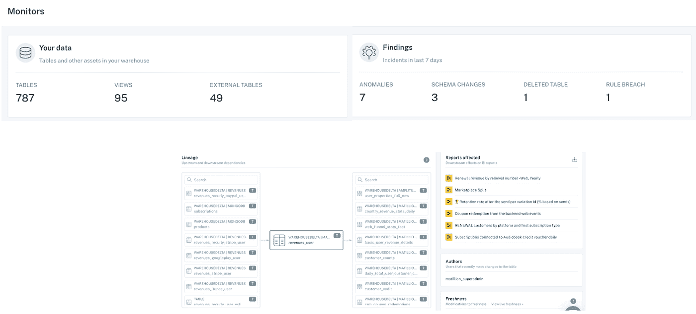

# 数据可观察性:如何防止大规模数据管道破裂

> 原文：<https://towardsdatascience.com/data-observability-how-to-increase-trust-in-data-at-scale-105aa928eabe?source=collection_archive---------39----------------------->

## 介绍了解数据可靠性的新方法

*图片由*[*foximage*](https://www.shutterstock.com/image-vector/business-intelligence-creative-idea-thievery-economic-1257488386)*于*[*Shutterstock*](http://www.shutterstock.om)*上，通过 Shutterstock 的标准许可批准使用。*

*公司每年花费超过*[***1500 万美元***](https://www.gartner.com/smarterwithgartner/how-to-stop-data-quality-undermining-your-business/) *处理* [*数据停机*](https://www.montecarlodata.com/the-rise-of-data-downtime/) *，换句话说，在数据丢失、损坏或出现其他错误的时间段内，超过 88%的美国企业* *因数据质量而遭受损失*

*幸运的是，数据工程的下一个前沿领域* [***还有希望:数据可观察性。***](/data-observability-the-next-frontier-of-data-engineering-f780feb874b) *以下是图书汇总订阅服务 Blinkist 的数据工程团队如何通过大规模的数据可观察性来提高成本节约、协作和生产率。*

Blinkist 在全球拥有超过 1600 万用户，它通过电子书订阅服务帮助时间紧张的读者将学习融入他们的生活。

[工程总监 Gopi Krishnamurthy 领导着负责数据工程、基础设施、云卓越中心、增长和货币化的团队。](https://www.linkedin.com/in/gopikrishnamurthy-digitalarchitect/)

> 对于 Blinkist 来说，拥有值得信赖和可靠的数据是其业务成功的基础。

## 挑战:损坏的数据管道影响增长、用户体验和可靠性

*缺乏实时数据跟踪导致关键分销渠道的营销支出减少。图片由 Blinkist 提供。*

作为一家高速增长的公司，Blinkist 利用付费绩效营销来获得客户。他们的 2020 年战略——雄心勃勃的 40%增长目标——包括对脸书和谷歌等渠道的重大投资，这些渠道将根据 Blinkist 应用程序和渠道本身之间共享的行为数据自动优化活动。

当然，像 2020 年的许多公司一样，新冠肺炎疫情改变了一切。现在，历史数据无法反映受众日常生活的当前现实，实时数据变得至关重要——不仅是为了确定广告支出，也是为了了解用户如何与 Blinkist 应用和网络内容进行交互的当前状态。

这些数据中的任何不准确都可能影响决策，从活动支出到更新产品路线图。至关重要的是，不要错过任何创新的机会，从添加新功能到简化入职到测试新广告——因为围绕“改善通勤”的活动已经不再相关。

随着首席执行官和活动经理越来越依赖实时洞察来推动营销战略、预算支出和投资回报，Gopi 和他的团队正在努力解决数据停机问题，包括数据质量、仪表板更新延迟和管道中断等问题。

> “每周一，我们都会接到高管的电话，”戈皮说。“几乎每周一，我都会在电话中尝试回答为什么我们无法扩展，问题是什么，我们在跟踪数据方面面临多少问题…尝试解释问题的严重性，并尝试增强管理层利益相关者的信心。”

Gopi 估计他的团队花费了**50%的工作时间进行数据演习**，试图解决数据停机问题，同时重建与组织其他部门的信任。这是不可持续的——必须有所改变。

# 解决方案:端到端的数据可观察性

*Blinkist 利用数据可观察性在整个公司范围内恢复对数据的信任，进而确保营销支出得到合理分配。图片由 Blinkist 提供。*

于是在 2020 年秋天，Gopi 和他的团队重组，重新聚焦。他们建立了一个以 Spotify 推广的[深思熟虑的执行框架](https://spotify.design/article/from-gut-to-plan-the-thoughtful-execution-framework)为模型的计划，设定了一个明确的目标，在他们的公司建立对数据的信任。

Gopi 说:“这个框架的核心是数据可靠性工程，我们将[数据可靠性](/what-is-data-reliability-66ec88578950)视为一等公民，就像工程团队在过去十年中开始对待 DevOps 和站点可靠性工程一样。”

实现数据可靠性的基础是关注数据治理、数据质量和重构系统。

“当我们转向尝试引入数据可靠性工程原则时，数据可观察性对我们在短时间内轻松采用并满足这三个期望起到了关键作用，”Gopi 说

## 成果:通过自助工具和明确的数据可靠性 SLA，更快地解决数据事件

*通过制定明确的数据可靠性服务级别协议和利用自助工具，Blinkist 能够在数据宕机影响下游消费者之前对其进行补救。图片由 Blinkist 提供。*

在无代码的情况下，他们的数据可观察性平台在不到两周的时间内建立并运行，提供了对其数据管道和关键资产运行状况的即时可见性，大大加快了事件响应时间。

“我们可以立即看到发生了什么，”戈皮说。“每天，我们都可以看到是否有一个破裂的管道，一个没有更新的表，或者一个因为在上游添加或删除了某些内容而改变了数据模型的表。”

随着 Gopi 和他的团队努力重建破裂的信任以及破裂的管道，他们与公司领导合作，建立对数据可靠性原则的共同理解，并制定具体的[数据 SLA(服务级别协议)](https://www.montecarlodata.com/how-to-make-your-data-pipelines-more-reliable-with-slas/)。

数据利益相关方也获得了访问数据报告的权限，从而提高了整个公司数据运行状况的透明度。

> “数据可观察性的自助服务功能有助于重建对数据的信任，因为用户看到了我们的行动:从红色警报到蓝色的“工作进行中”，再到绿色的“已解决”，Gopi 说。“他们知道谁应该负责，他们知道团队正在努力，一切都变得非常清楚。”

## 成果:通过对关键数据资产的自动监控和警报，每周节省 120 个小时的时间

*数据可观察性为 Blinkist 提供了一个关于其数据资产真相的集中来源，包括浮现相关异常和跟踪血统到现场级别。图片由 Blinkist 提供。*

数据可观察性可检测 Blinkist 数据环境中的异常，使用机器学习算法来生成控制数据停机警报的阈值和规则。这种自动化监控为 Gopi 的团队节省了每个工程师每周 20 个小时的时间，这在内部开发是不切实际的。这为 Gopi 的团队带来了每周 **120 小时**的累计时间节省，现在这些精力可以用于构建他们的产品或其他创新。

“特别是考虑到我们正在工作的时间框架，数据可观察性平台不是我们可以建立的，”Gopi 说。“这基本上是数据可观察性背后的人工智能的力量——要建立这种工具，你需要有大量的内部知识来建立这些业务规则和创建这些警报。”

由于前面提到的自助式报告和数据 SLA，数据可观察性也有助于利益相关者更高效地工作。

例如，当渠道经理注意到营销活动表现不佳时，他们可以轻松访问数据报告，并查看数据可靠性 SLA 是否得到满足以及数据管道是否正常工作。如果是这样的话，他们可以排除不良数据这一罪魁祸首，并寻找其他解决方案，如更换广告创意或调整目标受众——而无需要求数据团队的同事付出时间或精力。

## 成果:通过防止数据管道和仪表板损坏增加收入

*数据事件的自动警报确保了 Blinkist 的数据团队在管道破裂或仪表盘失效时第一个知道。图片由 Blinkist 提供。*

由于 Blinkist 能够更快地检测和解决数据停机问题，他们的营销渠道蓬勃发展，从而增加了收入。

“如果我们能够在 24 小时内发现并解决问题，脸书或谷歌就可以自动更正，永远不会缩减广告活动，”戈皮说。

> 随着更准确的分析和新近恢复的对数据的信任，Blinkist 营销人员现在能够迅速做出决策，优化他们的广告支出，以获得更好的目标和绩效。

“我们今年看到的增长规模是压倒性的，”Gopi 说。“虽然数据团队不能独享全部荣誉，但我绝对认为我们能够做到的事情——在数据可观察性和将透明度引入数据运营方面——改善了我们锁定受众和渠道的方式。”

# Blinkist 数据可观测性的影响

*数据可观察性恢复了人们对数据的信任，确保营销支出得到合理分配，进而增加收入。图片由 Blinkist 提供。*

> 数据可观察性帮助 Blinkist 增加了收入，节省了时间，并在整个组织中重建了数据的信任和透明度。随着损坏的数据管道得到控制，他们的数据工程师正专注于创新和解决核心业务问题，而不是救火。

除其他优势外，数据可观察性使 Blinkist 能够:

*   [**每位工程师每周节省 20 多个小时**、](https://www.montecarlodata.com/how-to-fix-your-data-quality-problem/)**通过消除对繁琐数据消防演习的故障排除需求**
*   **[**通过获得对数据资产的运行状况、使用模式和相关性的端到端可见性，提高效率和协作**](https://www.montecarlodata.com/how-to-solve-the-youre-using-that-table-problem/)**

**“数据可观察性通过在新鲜度、数据量和数据模型变化方面自动化异常检测，使生活变得更加轻松，”Gopi 说。“这对于我们在正确的时间采取行动并确保减少甚至防止数据宕机非常有帮助。”**

*****有兴趣了解数据可观察性如何帮助您获得更可靠的数据？伸出手去*** [***巴尔***](https://www.linkedin.com/in/barrmoses/) ***和*** [***蒙特卡洛！***](http://www.montecarlodata.com)**

*****特别感谢 Gopi 和 Blinkist 团队的其他人！*****

***本文由*[*Will Robins*](https://www.linkedin.com/in/will-robins/)共同撰写。**