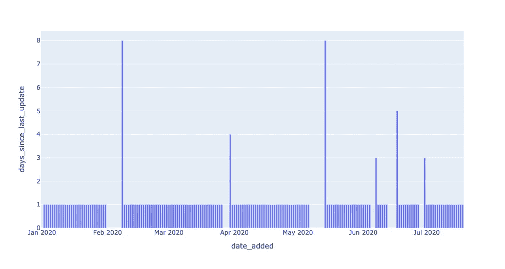
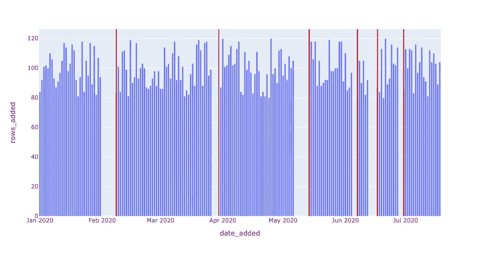
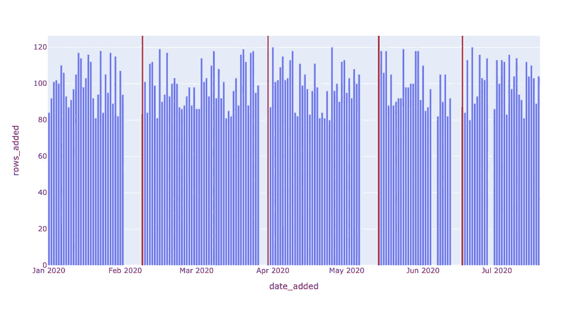
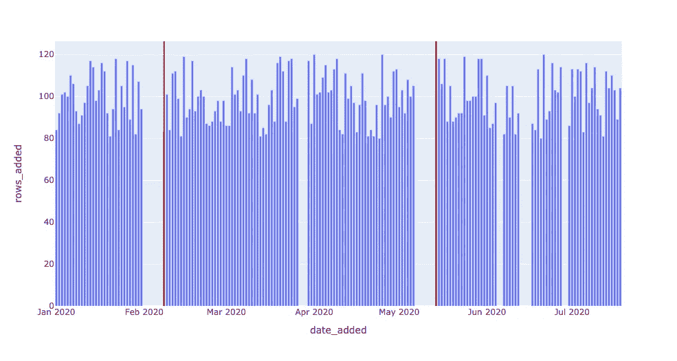
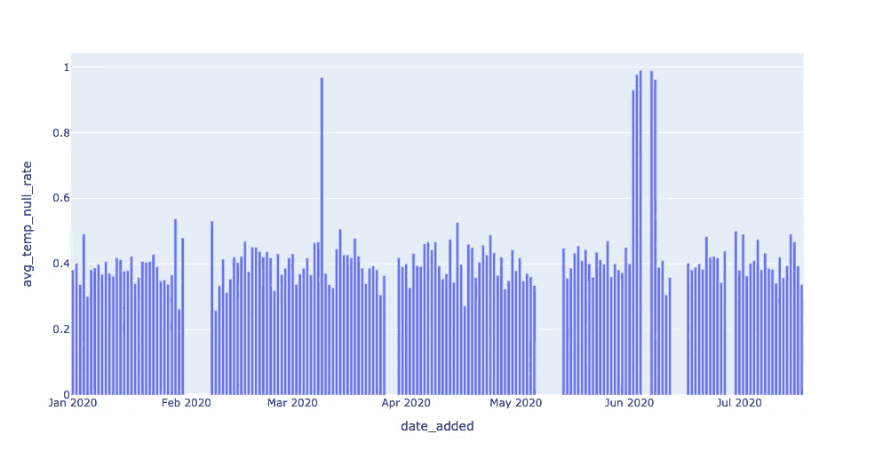
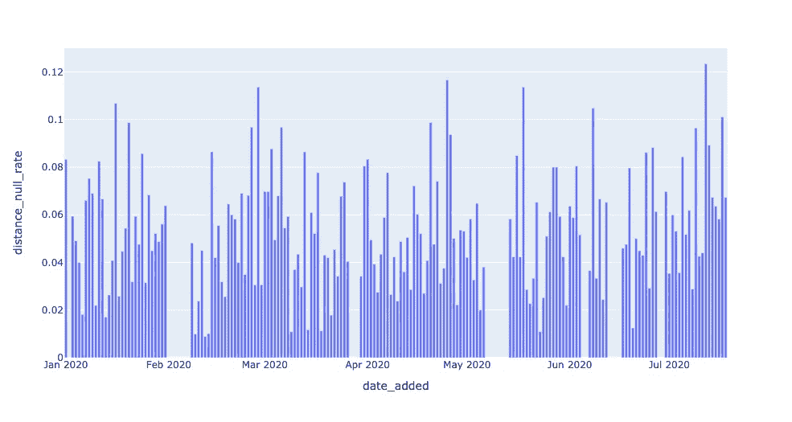
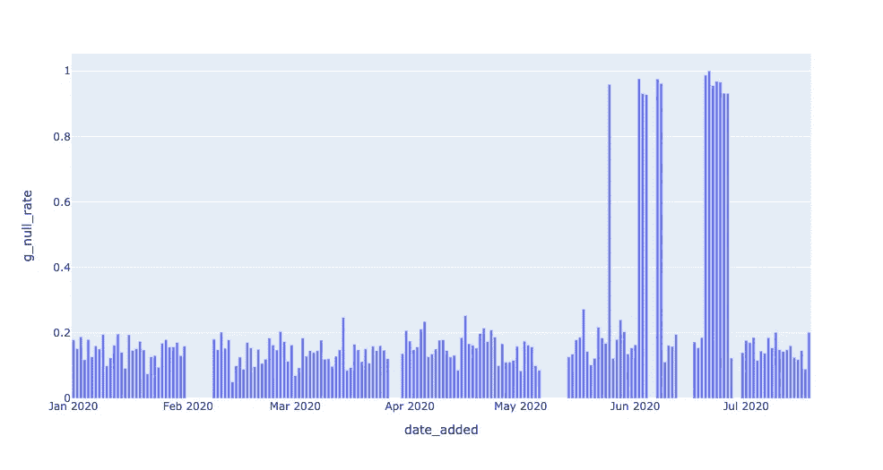
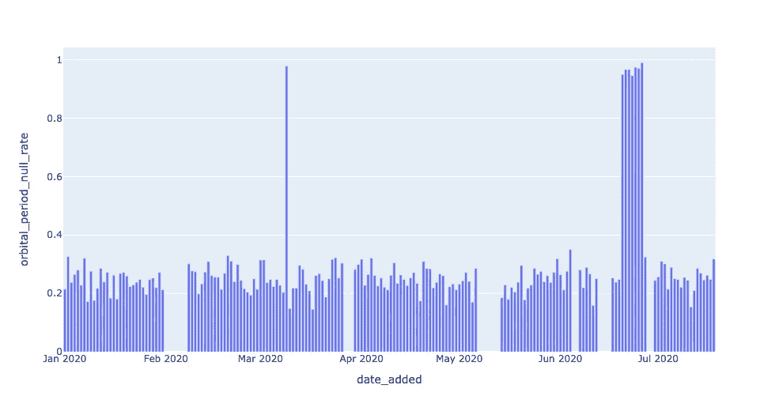
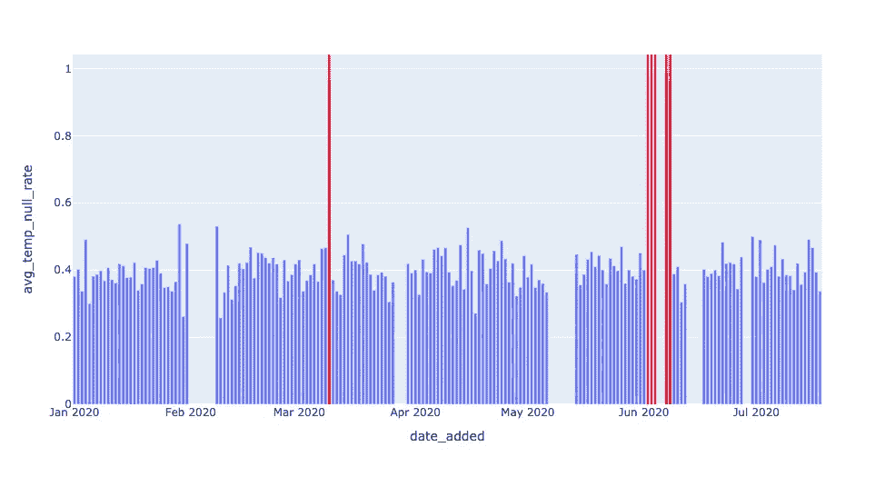
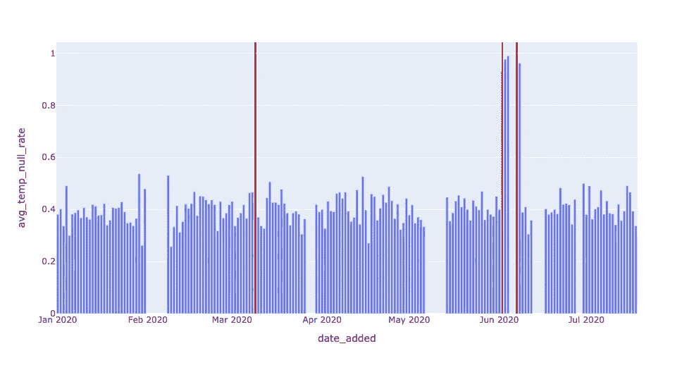

# 数据可观察性:使用 SQL 构建数据质量监视器

> 原文：<https://towardsdatascience.com/data-observability-in-practice-using-sql-755dc6421f59?source=collection_archive---------11----------------------->

## 辅导的

## *如何构建自己的数据质量监控器，以识别数据管道中的新鲜度和分布异常*

由[瑞安·卡恩斯](https://www.linkedin.com/in/ryanothnielkearns/)和[巴尔·摩西](https://www.linkedin.com/in/barrmoses/)


图片由[像素](http://www.pexels.com)上的 [faaiq ackmerd](https://www.pexels.com/@faaiq-ackmerd-383634) 提供。

*在本系列文章中，我们将介绍如何从头开始创建自己的数据可观察性监视器，映射到数据健康的五大支柱*</introducing-the-five-pillars-of-data-observability-e73734b263d5>**。本系列的第 1 部分改编自 Barr Moses 和 Ryan Kearns' O'Reilly 培训，* [***管理数据停机时间:将可观测性应用于您的数据管道***](https://www.oreilly.com/live-training/courses/managing-data-downtime/0636920508717/) *，这是业界首个关于数据可观测性的课程。关联练习在* [*这里*](https://github.com/monte-carlo-data/data-downtime-challenge) *可用，本文所示改编代码在* [*这里*](https://github.com/monte-carlo-data/data-observability-in-practice) *可用。**

*从空值和重复行，到建模错误和模式更改，数据可能由于多种原因而中断。[数据测试](/why-testing-your-data-is-insufficient-6914275a9762)通常是我们抵御不良数据的第一道防线，但是如果数据在其生命周期中出现问题，会发生什么呢？*

*我们将这种现象称为数据宕机，它指的是数据丢失、出错或不准确的时间段。[数据停机](/the-rise-of-data-downtime-841650cedfd5)提示我们提出如下问题:*

*   *数据是最新的吗？*
*   *数据是否完整？*
*   *字段是否在预期范围内？*
*   *零利率是高于还是低于它应有的水平？*
*   *模式改变了吗？*

*为了在数据中断时触发警报并防止数据停机，数据团队可以利用我们在软件工程领域的朋友们的一个屡试不爽的策略: [**监控和可观察性**](https://observability.workshop.aws/en/anomalydetection.html) 。*

*我们将 [**数据可观察性**](/what-is-data-observability-40b337971e3e) 定义为组织回答这些问题并评估其数据生态系统健康状况的能力。反映数据健康的关键变量，数据可观察性的五个支柱是:*

*   *新鲜度:我的数据是最新的吗？我的数据是否有未更新的时间间隔？*
*   ***分布**:我的数据在现场级别的健康程度如何？我的数据是否在预期范围内？*
*   ***卷**:我的数据接收是否达到预期的阈值？*
*   ***模式**:我的数据管理系统的正式结构改变了吗？*
*   ***血统**:如果我的部分数据宕机，对上下游有什么影响？我的数据源如何相互依赖？*

> *以这种概念性的方式谈论数据可观测性是一回事，但完整的处理应该拉开帷幕— **数据可观测性在代码中实际上是什么样子的？***

*很难完全回答这个问题，因为细节将取决于个人对数据仓库、数据湖、BI 工具、首选语言和框架等的选择。即便如此，使用 SQLite 和 Jupyter 之类的轻量级工具解决这些问题可能是有用的。*

*在本文中，我们将通过一个示例数据生态系统来创建我们自己的 SQL 数据质量监视器，并探索数据可观测性在实践中是什么样子的。*

*让我们来看看。*

# *实践中的数据可观测性*

**本教程基于我们奥莱利课程* [*练习 1*](https://github.com/monte-carlo-data/data-downtime-challenge/blob/master/exercise_text/ex1.md) *，* [*管理数据停机*](https://www.oreilly.com/live-training/courses/managing-data-downtime/0636920508717/) *。欢迎您使用 Jupyter 笔记本和 SQL 自行尝试这些练习。我们将在以后的文章中更详细地讨论，包括练习*[*2*](https://github.com/monte-carlo-data/data-downtime-challenge/blob/master/exercise_text/ex2.md)*[*3*](https://github.com/monte-carlo-data/data-downtime-challenge/blob/master/exercise_text/ex3.md)*和* [*4*](https://github.com/monte-carlo-data/data-downtime-challenge/blob/master/exercise_text/ex4.md) *。***

**我们的样本数据生态系统使用关于可居住外行星的[模拟天文数据](https://github.com/monte-carlo-data/data-observability-in-practice/blob/main/EXOPLANETS.db)。出于本练习的目的，我使用 Python 生成了数据集，对我在生产环境中遇到的真实事件的异常进行建模。这个数据集完全可以免费使用，如果您感兴趣的话，存储库中的 [utils 文件夹](https://github.com/monte-carlo-data/data-downtime-challenge/tree/master/data/utils)包含了生成数据的代码。**

**我使用的是 **SQLite 3.32.3** ，它应该可以通过简单的设置从命令提示符或 SQL 文件访问数据库。这些概念实际上可以扩展到任何查询语言，这些实现可以扩展到 MySQL、Snowflake 和其他数据库环境，只需做很小的改动。**

```
**$ sqlite3 EXOPLANETS.db
sqlite> PRAGMA TABLE_INFO(EXOPLANETS);
0 | _id            | TEXT | 0 | | 0
1 | distance       | REAL | 0 | | 0
2 | g              | REAL | 0 | | 0
3 | orbital_period | REAL | 0 | | 0
4 | avg_temp       | REAL | 0 | | 0
5 | date_added     | TEXT | 0 | | 0**
```

**`EXOPLANETS`中的数据库条目包含以下信息:**

**0.`_id`:对应行星的 UUID。
1。`distance`:距离地球的距离，以光年为单位。
2。`g`:表面重力为 *g* 的倍数，引力常数。
3。`orbital_period`:单个轨道周期的长度，以天为单位。
4。`avg_temp`:平均表面温度，单位为开尔文度。
5。`date_added`:我们的系统发现这颗行星并将其自动添加到我们的数据库中的日期。**

**请注意，由于数据缺失或错误，对于给定的行星，`distance`、`g`、`orbital_period`和`avg_temp`中的一个或多个可能是`NULL`。**

```
**sqlite> SELECT * FROM EXOPLANETS LIMIT 5;**
```

**请注意，这个练习是追溯性的—我们正在查看历史数据。在生产数据环境中，数据可观察性是实时的，并应用于数据生命周期的每个阶段，因此将涉及与此处略有不同的实现。**

**出于这个练习的目的，我们将为新鲜度和分布建立数据可观察性算法，但是在以后的文章中，我们将解决我们的五个支柱的其余部分——以及更多。**

# **新鲜**

**我们监控的数据可观察性的第一个支柱是新鲜度，它可以为我们提供重要数据资产上次更新时间的有力指示。如果一个整点定期更新的报告突然看起来非常陈旧，这种类型的异常应该给我们一个强烈的信号，表明有什么不对劲。**

**首先，注意`DATE_ADDED`列。当添加单个记录时，SQL 不存储元数据。因此，为了在这种追溯设置中可视化新鲜感，我们需要自己跟踪这些信息。**

**按`DATE_ADDED`列分组可以让我们深入了解`EXOPLANETS`每天是如何更新的。例如，我们可以查询每天添加的新 id 的数量:**

**你可以自己用[库中的`$ sqlite3 EXOPLANETS.db < queries/freshness/rows-added.sql`运行这个。我们得到以下数据:](https://github.com/monte-carlo-data/data-observability-in-practice)**

**基于我们数据集的这个图形表示，看起来`EXOPLANETS`每天持续更新大约 100 个新条目，尽管存在连续多天没有数据的间隙。**

**回想一下，对于新鲜感，我们想问“我的数据是最新的吗？”—因此，了解表更新中的这些缺口对于了解我们数据的可靠性至关重要。**

****

**新鲜度异常！**

**这个查询通过为`DAYS_SINCE_LAST_UPDATE`引入一个度量来操作新鲜度。(注意:由于本教程使用的是 SQLite3，所以计算时差的 SQL 语法在 MySQL、雪花和其他环境中会有所不同)。**

**结果表显示“在日期 *X* ，在`EXOPLANETS`中的最新数据是 *Y* 天前的数据。”这是从表格的`DATE_ADDED`栏中无法明确获得的信息——但是应用数据可观测性为我们提供了发现它的工具。**

****

**现在，我们有了检测新鲜度异常所需的数据。剩下要做的就是为 Y 设置一个**阈值** **参数**—*多少天算多*？参数将查询变成了检测器，因为它决定了什么算异常(读:值得警告)，什么不算异常。(关于设置阈值参数的更多信息，请参阅后面的文章！).**

**新鲜度异常！**

**返回给我们的数据代表新鲜事件发生的日期。**

**在 2020 年 5 月 14 日，表中的最新数据是 8 天前的！这样的中断可能代表我们的数据管道中的一个破损，了解我们是否将这些数据用于任何有价值的事情将是很好的(如果我们在生产环境中使用这些数据，很有可能我们正在使用)。**

****

**请特别注意查询的最后一行:`DAYS_SINCE_LAST_UPDATE > 1;`。**

**这里，1 是一个 [**模型参数**](https://en.wikipedia.org/wiki/Parameter)**——这个数字并不“正确”，尽管改变它会影响我们认为是事件的日期。数字越小，我们将捕捉到的真正的异常就越多(高[召回](https://en.wikipedia.org/wiki/Precision_and_recall)),但是很有可能，这些“异常”中有几个不会反映真实的停机。数字越大，我们捕捉到的所有异常反映真实异常的可能性就越大(高[精度](https://en.wikipedia.org/wiki/Precision_and_recall))，但是我们可能会遗漏一些。****

****出于本例的目的，我们可以将 1 改为 7，从而只捕捉 2020 年 2 月 8 日和 2020 年 5 月 14 日两次最严重的停机。这里的任何选择都将反映特定的用例及目标，并且是在生产环境中大规模应用数据可观测性时反复出现的重要平衡。****

****下面，我们利用相同的新鲜度检测器，但是用`DAYS_SINCE_LAST_UPDATE > 3;`作为阈值。两个较小的中断现在没有被发现。****

********

****请注意两次未检测到的停机—这两次停机之间的间隔必须少于 3 天。****

****现在我们设想相同的新鲜度检测器，但是现在用`DAYS_SINCE_LAST_UPDATE > 7;`作为阈值。除了两次最大的停电外，其他都没有被发现。****

********

****[就像行星](https://www.nasa.gov/vision/earth/livingthings/microbes_goldilocks.html)一样，最佳模型参数位于过低和过高值之间的“黄金地带”或“最佳点”。这些数据可观察性概念(以及更多！)将在后面的文章中讨论。****

# ****分配****

****接下来，我们想要评估我们的数据在现场级别的分布状况。分布告诉我们数据的所有期望值，以及每个值出现的频率。一个最简单的问题是，“我的数据`NULL`多久一次”？在许多情况下，某种程度的不完整数据是可以接受的——但是如果 10%的无效率变成了 90%,我们就想知道了。****

****该查询返回大量数据！这是怎么回事？****

****通式`CAST(SUM(CASE WHEN SOME_METRIC IS NULL THEN 1 ELSE 0 END) AS FLOAT) / COUNT(*)`，当按`DATE_ADDED`列分组时，告诉我们`SOME_METRIC`的`NULL`值在`EXOPLANETS`的每日批量新数据中的比率。通过查看原始输出很难获得某种感觉，但视觉可以帮助说明这种异常情况:****

********************************

****这些图像清楚地表明，我们应该检测零利率“峰值”事件。现在让我们只关注最后一个指标`AVG_TEMP`。我们可以用一个简单的阈值来检测最基本的零尖峰:****

****我们的第一个分布异常。****

****就检测算法而言，这种方法有点生硬。有时，我们数据中的模式足够简单，这样的阈值就能达到目的。然而，在其他情况下，数据会有噪音或有其他复杂因素，比如[季节性](https://en.wikipedia.org/wiki/Seasonality)，这要求我们改变方法。****

********

****例如，检测 2020–06–02、2020–06–03 和 2020–06–04 似乎是多余的。我们可以过滤出紧随其他警报之后的日期:****

****注意，在这两个查询中，关键参数是`0.9`。我们实际上是在说:“任何高于 90%的空率都是一个问题，我需要知道它。”****

********

****在这种情况下，我们可以(也应该)通过应用带有更智能参数的[滚动平均值](https://en.wikipedia.org/wiki/Moving_average)的概念来变得更智能一点:****

****一个澄清:注意在第 28 行，我们使用数量`AVG_TEMP_NULL_RATE — TWO_WEEK_ROLLING_AVG`进行过滤。在其他情况下，我们可能希望得到这个误差量的`ABS()`，但不是在这里——原因是如果一个`NULL`率“峰值”代表了从先前平均值的增加，那么它就更加令人担忧。每当`NULL`频率突然降低时，可能不值得进行监控，而检测`NULL`频率增加的价值是显而易见的。****

********

****当然，还有越来越复杂的异常检测指标，如<https://en.wikipedia.org/wiki/Standard_score>**和 [**自回归建模**](https://en.wikipedia.org/wiki/Autoregressive_model) 超出了本文的范围。本教程只是为 SQL 中的现场健康监控提供了基本的框架；希望能给你自己数据的思路！******

# ******下一步是什么？******

******这个简短的教程旨在说明“数据可观察性”并不像其名称所暗示的那样神秘，并且通过一个整体的方法来理解您的数据健康状况，您可以在您的管道的每个阶段确保高度的数据信任和可靠性。******

******事实上，使用普通的 SQL“检测器”可以实现数据可观察性的核心原则，前提是保留一些关键信息，如记录时间戳和历史表元数据。还值得注意的是，对于随生产环境增长的端到端数据可观测性系统，ML 驱动的关键参数调整是强制性的。******

> ******请继续关注本系列的后续文章，这些文章将重点关注分布和模式中的异常监控、血统和元数据在数据可观察性中的作用，以及如何大规模地一起监控这些支柱以获得更可靠的数据。******

******在此之前，祝您没有数据宕机！******

*********有兴趣了解有关如何大规模应用数据可观测性的更多信息吗？伸出手去*** [***瑞恩***](https://www.linkedin.com/in/ryan-kearns-203686a9)*[***巴尔***](https://www.linkedin.com/in/barrmoses/) ***，以及剩下的*** [***蒙特卡洛团队***](https://www.montecarlodata.com/) ***。**********

************