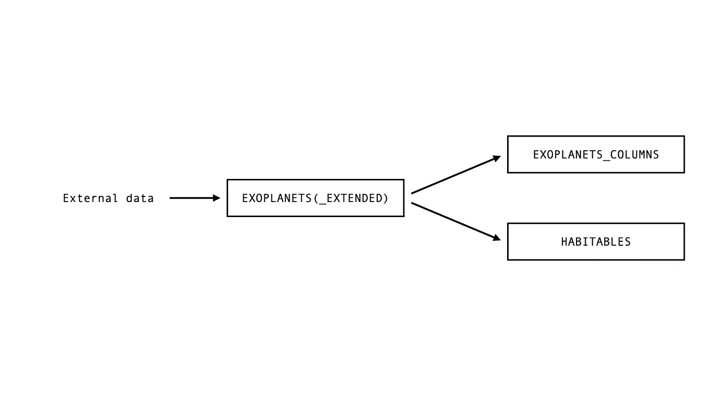
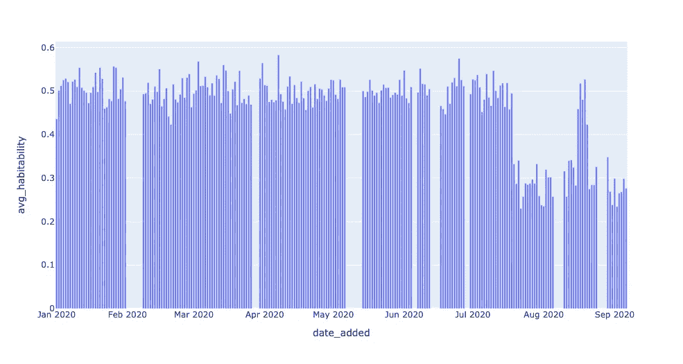
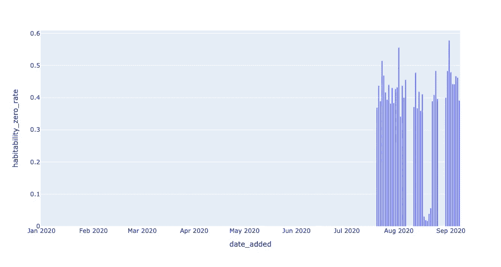

# 数据可观察性，第二部分:如何使用 SQL 构建自己的数据质量监视器

> 原文：<https://towardsdatascience.com/data-observability-in-practice-using-sql-part-ii-schema-lineage-5ca6c8f4f56a?source=collection_archive---------18----------------------->

## 辅导的

## 使用模式和沿袭来理解数据异常的根本原因


图片由卢卡斯·佩泽塔在[像素](https://www.pexels.com/photo/black-telescope-under-blue-and-blacksky-2034892/)上提供。

*在本系列文章中，我们将介绍如何从头开始创建自己的数据可观察性监视器，映射到数据健康的五大支柱*[](/introducing-the-five-pillars-of-data-observability-e73734b263d5)**。第一部分可以在这里找到*[](https://www.montecarlodata.com/data-observability-in-practice-using-sql-1/)**。***

***本系列的第二部分改编自 Barr Moses 和 Ryan Kearns' O'Reilly 的培训，* [***管理数据停机时间:将可观测性应用于您的数据管道***](https://www.oreilly.com/live-training/courses/managing-data-downtime/0636920508717/) *，这是业内首个关于数据可观测性的课程。关联练习可在* [*这里*](https://github.com/monte-carlo-data/data-downtime-challenge) *获得，本文所示改编代码可在* [*这里*](https://github.com/monte-carlo-data/data-observability-in-practice) *获得。***

**随着世界对数据需求的增加，强大的数据管道变得更加必要。当数据中断时——无论是由于模式更改、空值、重复还是其他原因——数据工程师需要知道。**

**最重要的是，我们需要在破坏影响到下游系统和消费者之前，尽快评估破坏的根本原因。我们使用“[](/the-rise-of-data-downtime-841650cedfd5)**”来指代数据丢失、出错或不准确的时间段。如果您是一名数据专业人员，您可能很熟悉提出以下问题:****

*   ****数据是最新的吗？****
*   ****数据是否完整？****
*   ****字段是否在预期范围内？****
*   ****零利率是高于还是低于它应有的水平？****
*   ****模式改变了吗？****

****为了有效地回答这些问题，我们可以从软件工程师的剧本中抽出一页: [**监控和可观察性**](https://observability.workshop.aws/en/anomalydetection.html) **。******

****回顾一下第 1 部分，我们将 [**数据可观察性**](/what-is-data-observability-40b337971e3e) 定义为组织回答这些问题并评估其数据生态系统健康状况的能力。反映数据健康的关键变量，数据可观察性的五个支柱是:****

*   ******新鲜度**:我的数据是最新的吗？我的数据是否有未更新的时间间隔？****
*   ******分布**:我的数据在现场级别的健康程度如何？我的数据是否在预期范围内？****
*   ******卷**:我的数据接收是否符合预期的阈值？****
*   ******模式**:我的数据管理系统的正式结构改变了吗？****
*   ******血统**:如果我的部分数据宕机，对上下游有什么影响？我的数据源如何相互依赖？****

****在本系列文章中，我们感兴趣的是揭开帷幕，研究数据可观测性是什么样子的——代码中的*。*****

****在[第一部分](https://medium.com/swlh/data-observability-building-your-own-data-quality-monitors-using-sql-a4c848b6882d)中，我们看了前两个支柱，新鲜度和分布，并展示了一点 SQL 代码如何操作这些概念。这些是我们称之为更“经典”的 [**异常检测问题**](https://en.wikipedia.org/wiki/Anomaly_detection)——给定一个稳定的数据流，是否有任何东西看起来不正常？良好的异常检测当然是数据可观测性难题的一部分，但不是全部。****

> ****同样重要的是 [***语境***](https://www.montecarlodata.com/data-teams-your-metadata-is-useless/) 。如果发生了异常，很好。但是在哪里？什么上游管道可能是原因？哪些下游仪表板会受到影响？我的数据的形式结构改变了吗？良好的数据可观察性取决于我们正确利用元数据来回答这些问题(以及许多其他问题)的能力，这样我们就可以确定根本原因并在问题变成更大的问题之前解决它。****

****在本文中，我们将研究两个数据可观察性支柱，它们旨在为我们提供这种关键的环境— **模式**和**血统**。同样，我们将使用像 Jupyter 和 SQLite 这样的轻量级工具，因此您可以轻松地构建我们的环境并亲自尝试这些练习。让我们开始吧。****

# ****我们的数据环境****

*****本教程基于奥莱利课程* [*练习 2 和练习 3*](https://github.com/monte-carlo-data/data-downtime-challenge/blob/master/exercise_text/ex2.md) *，* [*管理数据停机*](https://www.oreilly.com/live-training/courses/managing-data-downtime/0636920508717/) *。欢迎您使用 Jupyter 笔记本和 SQL 自行尝试这些练习。我们将在以后的文章中更详细地讨论，包括练习*[*【4】*](https://github.com/monte-carlo-data/data-downtime-challenge/blob/master/exercise_text/ex4.md)*。*****

****如果你读过这个系列的第一部分，你应该熟悉我们的数据。像以前一样，我们将使用关于可居住外行星的模拟天文数据。我们用 Python 生成了数据集，对我在生产环境中遇到的真实事件的数据和异常进行建模。这个数据集完全可以免费使用，如果您感兴趣的话，存储库中的 [utils 文件夹](https://github.com/monte-carlo-data/data-downtime-challenge/tree/master/data/utils)包含生成数据的代码。****

****我使用的是 SQLite 3.32.3，它应该可以通过简单的设置从命令提示符或 SQL 文件访问数据库。这些概念可以扩展到任何查询语言，这些实现可以扩展到 MySQL、Snowflake 和其他数据库环境，只需做很小的改动。****

****再一次，我们有了系外行星表:****

```
****$ sqlite3 EXOPLANETS.db
sqlite> PRAGMA TABLE_INFO(EXOPLANETS);
0 | _id            | TEXT | 0 | | 0
1 | distance       | REAL | 0 | | 0
2 | g              | REAL | 0 | | 0
3 | orbital_period | REAL | 0 | | 0
4 | avg_temp       | REAL | 0 | | 0
5 | date_added     | TEXT | 0 | | 0****
```

****系外行星中的数据库条目包含以下信息:****

****0.`_id`:对应行星的 UUID。****

1.  ****`distance`:距离地球的距离，以光年为单位。****

****2.`g`:表面重力为 g 的倍数，引力常数。****

****3.`orbital_period`:单个轨道周期的长度，以天为单位。****

****4.`avg_temp`:平均表面温度，单位为开氏度。****

****5.`date_added`:我们的系统发现这颗行星并自动将其添加到我们的数据库的日期。****

****注意，对于给定的行星，由于数据缺失或错误，一个或多个`distance`、`g`、`orbital_period`和`avg_temp`可能是`NULL`。****

****`sqlite> SELECT * FROM EXOPLANETS LIMIT 5;`****

****请注意，这个练习是追溯性的—我们正在查看历史数据。在生产数据环境中，数据可观察性是实时的，并应用于数据生命周期的每个阶段，因此将涉及与此处略有不同的实现。****

****看起来我们最早的数据是 2020-01-01(*注意*:大多数数据库不会存储单个记录的时间戳，所以我们的`DATE_ADDED`栏会跟踪我们)。我们的最新数据…****

```
****sqlite> SELECT DATE_ADDED FROM EXOPLANETS ORDER BY DATE_ADDED DESC LIMIT 1;
2020–07–18****
```

****…看起来来自 2020 年 7 月 18 日。当然，这是我们在过去的文章中使用的同一张表。如果我们想要探索模式和血统的更多上下文相关的支柱，我们将需要扩展我们的环境。****

****现在，除了`EXOPLANETS`之外，我们还有一个叫做`EXOPLANETS_EXTENDED`的表，它是我们过去的表的超集。把这些看作是在*不同时刻*的同一张桌子是很有用的。事实上，`EXOPLANETS_EXTENDED`的数据可以追溯到 2020 年 1 月 1 日…****

```
****sqlite> SELECT DATE_ADDED FROM EXOPLANETS_EXTENDED ORDER BY DATE_ADDED ASC LIMIT 1;
2020–01–01****
```

****…但也包含截至 2020 年 9 月 6 日的数据，比`EXOPLANETS`更远:****

```
****sqlite> SELECT DATE_ADDED FROM EXOPLANETS_EXTENDED ORDER BY DATE_ADDED DESC LIMIT 1;
2020–09–06****
```

# ****可视化模式更改****

****这些表之间还有一些不同之处:****

```
****sqlite> PRAGMA TABLE_INFO(EXOPLANETS_EXTENDED);
0 | _ID            | VARCHAR(16777216) | 1 | | 0
1 | DISTANCE       | FLOAT             | 0 | | 0
2 | G              | FLOAT             | 0 | | 0
3 | ORBITAL_PERIOD | FLOAT             | 0 | | 0
4 | AVG_TEMP       | FLOAT             | 0 | | 0
5 | DATE_ADDED     | TIMESTAMP_NTZ(6)  | 1 | | 0
6 | ECCENTRICITY   | FLOAT             | 0 | | 0
7 | ATMOSPHERE     | VARCHAR(16777216) | 0 | | 0****
```

****除了`EXOPLANETS`中的 6 个字段外，`EXOPLANETS_EXTENDED`表还包含两个附加字段:****

****6.`eccentricity`:行星围绕其主星的[轨道偏心](https://en.wikipedia.org/wiki/Orbital_eccentricity)。****

****7.地球大气的主要化学成分。****

****请注意，与`distance`、`g`、`orbital_period`和`avg_temp`一样，`eccentricity`和`atmosphere`都可能是给定行星的`NULL`，这是数据缺失或错误的结果。比如[流氓行星](https://en.wikipedia.org/wiki/Rogue_planet)轨道偏心率未定义，很多行星根本没有大气层。****

****还要注意，数据没有回填，这意味着从表格开始的数据条目(数据也包含在`EXOPLANETS`表格中)没有偏心率和大气信息。****

```
****sqlite> SELECT
   ...>     DATE_ADDED,
   ...>     ECCENTRICITY,
   ...>     ATMOSPHERE
   ...> FROM
   ...>     EXOPLANETS_EXTENDED
   ...> ORDER BY
   ...>     DATE_ADDED ASC
   ...> LIMIT 10;
2020–01–01 | |
2020–01–01 | |
2020–01–01 | |
2020–01–01 | |
2020–01–01 | |
2020–01–01 | |
2020–01–01 | |
2020–01–01 | |
2020–01–01 | |
2020–01–01 | |****
```

****添加两个字段是一个 [**模式** **变更**](https://www.educative.io/blog/what-are-database-schemas-examples) 的例子——我们的数据的正式蓝图已经被修改。当对数据结构进行更改时，会发生架构更改，手动调试可能会令人沮丧。模式更改可以表明关于数据的许多事情，包括:****

*   ****添加新的 API 端点****
*   ****假定已弃用但尚未弃用的字段****
*   ****列、行或整个表格的增加或减少****

****在一个理想的世界中，我们想要一个这种变化的记录，因为它代表了我们管道中可能出现的问题的一个向量。不幸的是，我们的数据库并没有自然地配置来跟踪这样的变化。它没有版本历史。****

****我们在[第一部分](https://medium.com/swlh/data-observability-building-your-own-data-quality-monitors-using-sql-a4c848b6882d)中查询个人记录的年龄时遇到了这个问题，并添加了`DATE_ADDED`列来应对。在这种情况下，我们将做一些类似的事情，只是增加了一个完整的表:****

```
****sqlite> PRAGMA TABLE_INFO(EXOPLANETS_COLUMNS);
0 | DATE    | TEXT | 0 | | 0
1 | COLUMNS | TEXT | 0 | | 0****
```

****在任何给定的日期，`EXOPLANETS_COLUMNS`表通过记录`EXOPLANETS_EXTENDED`中的列来“版本化”我们的模式。查看第一个和最后一个条目，我们看到这些列在某一点上确实发生了变化:****

```
****sqlite> SELECT * FROM EXOPLANETS_COLUMNS ORDER BY DATE ASC LIMIT 1;
2020–01–01 | [
              (0, ‘_id’, ‘TEXT’, 0, None, 0),
              (1, ‘distance’, ‘REAL’, 0, None, 0),
              (2, ‘g’, ‘REAL’, 0, None, 0),
              (3, ‘orbital_period’, ‘REAL’, 0, None, 0),
              (4, ‘avg_temp’, ‘REAL’, 0, None, 0),
              (5, ‘date_added’, ‘TEXT’, 0, None, 0)
             ]sqlite> SELECT * FROM EXOPLANETS_COLUMNS ORDER BY DATE DESC LIMIT 1;
2020–09–06 | 
[
              (0, ‘_id’, ‘TEXT’, 0, None, 0),
              (1, ‘distance’, ‘REAL’, 0, None, 0),
              (2, ‘g’, ‘REAL’, 0, None, 0),
              (3, ‘orbital_period’, ‘REAL’, 0, None, 0),
              (4, ‘avg_temp’, ‘REAL’, 0, None, 0),
              (5, ‘date_added’, ‘TEXT’, 0, None, 0),
              (6, ‘eccentricity’, ‘REAL’, 0, None, 0),
              (7, ‘atmosphere’, ‘TEXT’, 0, None, 0)
             ]****
```

****现在，回到我们最初的问题:模式到底是什么时候改变的？因为我们的列列表是按日期索引的，所以我们可以用一个快速的 SQL 脚本找到更改的日期:****

****以下是返回的数据，为了便于阅读，我对其进行了重新格式化:****

```
****DATE:         2020–07–19
NEW_COLUMNS:  [
               (0, ‘_id’, ‘TEXT’, 0, None, 0),
               (1, ‘distance’, ‘REAL’, 0, None, 0),
               (2, ‘g’, ‘REAL’, 0, None, 0),
               (3, ‘orbital_period’, ‘REAL’, 0, None, 0),
               (4, ‘avg_temp’, ‘REAL’, 0, None, 0),
               (5, ‘date_added’, ‘TEXT’, 0, None, 0),
               (6, ‘eccentricity’, ‘REAL’, 0, None, 0),
               (7, ‘atmosphere’, ‘TEXT’, 0, None, 0)
              ]
PAST_COLUMNS: [
               (0, ‘_id’, ‘TEXT’, 0, None, 0),
               (1, ‘distance’, ‘REAL’, 0, None, 0),
               (2, ‘g’, ‘REAL’, 0, None, 0),
               (3, ‘orbital_period’, ‘REAL’, 0, None, 0),
               (4, ‘avg_temp’, ‘REAL’, 0, None, 0),
               (5, ‘date_added’, ‘TEXT’, 0, None, 0)
              ]****
```

****通过这个查询，我们返回令人不快的日期:2020–07–19。像新鲜度和分布可观察性一样，实现模式可观察性遵循一种模式:我们识别发出管道健康信号的[有用元数据](/metadata-is-useless-535e43311cd8)，跟踪它，并构建检测器来警告我们潜在的问题。提供一个类似于`EXOPLANETS_COLUMNS`的附加表是跟踪模式的一种方式，但是还有很多其他方式。我们鼓励您考虑如何为自己的数据管道实现模式更改检测器！****

# ****可视化血统****

****我们将世系描述为数据可观察性的 5 个支柱中最全面的一个，这是有充分理由的。****

> ****Lineage 通过告诉我们(1)哪些下游来源可能会受到影响，以及(2)哪些上游来源可能是根本原因，将事件联系起来。虽然用 SQL 代码“可视化”血统并不直观，但一个简单的例子可以说明它是如何有用的。****

****为此，我们需要再次扩展我们的数据环境。****

# ****简介:宜居****

****让我们向数据库添加另一个表。到目前为止，我们一直在记录系外行星的数据。这里有一个有趣的问题要问:这些行星中有多少可能有生命？****

****`HABITABLES`表从`EXOPLANETS`获取数据来帮助我们回答这个问题:****

```
****sqlite> PRAGMA TABLE_INFO(HABITABLES);
0 | _id          | TEXT | 0 | | 0
1 | perihelion   | REAL | 0 | | 0
2 | aphelion     | REAL | 0 | | 0
3 | atmosphere   | TEXT | 0 | | 0
4 | habitability | REAL | 0 | | 0
5 | min_temp     | REAL | 0 | | 0
6 | max_temp     | REAL | 0 | | 0
7 | date_added   | TEXT | 0 | | 0****
```

****`HABITABLES`中的条目包含以下内容:****

****0.`_id`:对应行星的 UUID。****

****1.`perihelion`:在一个轨道周期内[离天体最近的距离](https://en.wikipedia.org/wiki/Apsis#Perihelion_and_aphelion)。****

****2.`aphelion`:一个轨道周期内[到天体的最远距离](https://en.wikipedia.org/wiki/Apsis#Perihelion_and_aphelion)。****

****3.地球大气的主要化学成分。****

****4.`habitability`:一个介于 0 和 1 之间的实数，表示该星球有多大可能孕育生命。****

****5.`min_temp`:星球表面的最低温度。****

****6.`max_temp`:星球表面最高温度。****

****7.我们的系统发现这颗行星并将其自动添加到我们的数据库中的日期。****

****与`EXOPLANETS`中的列一样，`perihelion`、`aphelion`、`atmosphere`、`min_temp`和`max_temp`的值允许为`NULL`。事实上，`perihelion`和`aphelion`将是`EXOPLANETS`中任意`_id`的`NULL`，其中`eccentricity`是`NULL`，因为你使用轨道偏心率来计算这些度量。这解释了为什么这两个字段在我们的旧数据条目中总是`NULL`:****

```
****sqlite> SELECT * FROM HABITABLES LIMIT 5;****
```

****因此，我们知道`HABITABLES`依赖于`EXOPLANETS`(或者，同样地，`EXOPLANETS_EXTENDED`)中的值，并且`EXOPLANETS_COLUMNS`也是如此。我们数据库的依赖图如下所示:****

********

****图片由[蒙特卡洛](http://www.montecarlodata.com)提供。****

****非常简单的血统信息，但已经很有用了。让我们在此图的上下文中查看`HABITABLES`中的异常情况，看看我们能了解到什么。****

# ****调查异常现象****

****当我们有了一个关键指标，比如`HABITABLES`中的可居住性，我们可以用几种方法来评估这个指标的健康程度。首先，某一天新数据的`habitability`平均值是多少？****

****看着这些数据，我们发现有些不对劲。`habitability`的平均值通常在 0.5 左右，但在记录的数据中后来减半至 0.25 左右。****

********

****分布异常…但是是什么引起的呢？****

****这是一个明显的分布异常，但是到底发生了什么呢？换句话说，这个异常的*根源*是什么？****

****为什么我们不像我们在第一部分中做的那样，看看适合居住的比率呢？****

****幸运的是，这里看起来没有什么不符合角色的:****

****但这看起来不像是我们问题的起因。如果我们看看另一个分布健康指标，零值比率**，会怎么样？******

******这里似乎有更明显的问题:******

******从历史上看，`habitability`实际上从未为零，但在后来的日子里，它平均飙升至近 40%。这具有降低磁场平均值的检测效果。******

************

******分布异常…但是是什么引起的呢？******

******我们可以修改我们在第一部分中构建的一个分布检测器，以在`habitability`场中获得可感知的零速率的第一个日期:******

******我通过命令行运行了这个查询:******

```
******$ sqlite3 EXOPLANETS.db < queries/lineage/habitability-zero-rate-detector.sql
DATE_ADDED | HABITABILITY_ZERO_RATE | PREV_HABITABILITY_ZERO_RATE
2020–07–19 | 0.369047619047619      | 0.0******
```

******2020 年 7 月 19 日是零利率开始显示异常结果的第一天。回想一下，这与`EXOPLANETS_EXTENDED`中的模式变更检测是同一天。`EXOPLANETS_EXTENDED`在`HABITABLES`的上游，所以这两起事件很有可能是有关联的。******

******通过这种方式，沿袭信息可以帮助我们识别事件的**根本原因**，并更快地解决它们。比较`HABITABLES`中对此事件的以下两种解释:******

1.  ******在 2020 年 7 月 19 日，表格`HABITABLES`中可居住性一栏的零比率从 0%跃升至 37%。******
2.  ******在 2020 年 7 月 19 日，我们开始跟踪`EXOPLANETS`表中的另外两个字段`eccentricity`和`atmosphere`。这对下游工作台`HABITABLES`有不利影响，每当`eccentricity`不为`NULL`时，经常将字段`min_temp`和`max_temp`设置为极值。反过来，这导致了零速率的`habitability`场尖峰，我们检测到这是平均值的异常降低。******

******解释(1)仅使用了发生异常的事实。解释(2)使用沿袭，根据表和字段之间的依赖关系，将事件放在上下文中并确定根本原因。顺便说一句,( 2)中的所有内容实际上都是正确的，我鼓励你去改变周围的环境，自己去理解发生了什么。虽然这些只是简单的例子，配备(2)的工程师会更快地*理解*和*解决*潜在的问题，这都归功于适当的可观察性。******

# ******下一步是什么？******

******跟踪模式更改和沿袭可以让您对数据的运行状况和使用模式有前所未有的了解，提供有关数据使用人、内容、位置、原因和方式的重要上下文信息。事实上，在理解数据停机的下游(通常是真实世界)含义时，模式和沿袭是两个最重要的数据可观察性支柱。******

******总结一下:******

*   ******观察我们数据的**模式**意味着理解我们数据的形式结构，以及它何时以及如何变化。******
*   ******观察我们数据的**血统**意味着理解我们管道中的上游和下游依赖关系，并把孤立的事件放在更大的背景中。******
*   ********数据可观察性**的这两个支柱都涉及跟踪适当的元数据，并以一种使异常可以理解的方式转换我们的数据。******
*   ******更好的可观察性意味着**更好地理解数据损坏的原因和方式**，减少检测时间和解决时间。******

******我们希望“上下文中的数据可观察性”的第二部分是有用的。******

******直到第三部分，这里祝你没有数据停机！******

*********有兴趣了解更多有关蒙特卡洛数据可观测性方法的信息吗？将手伸向*** [***瑞恩***](https://www.linkedin.com/in/ryan-kearns-203686a9)*[***巴尔***](https://www.linkedin.com/in/barrmoses/) ***，以及***[*蒙特卡洛团队****。***](http://www.montecarlodata.com)*******

*******本文由瑞安·卡恩斯和巴尔·摩西撰写。*******