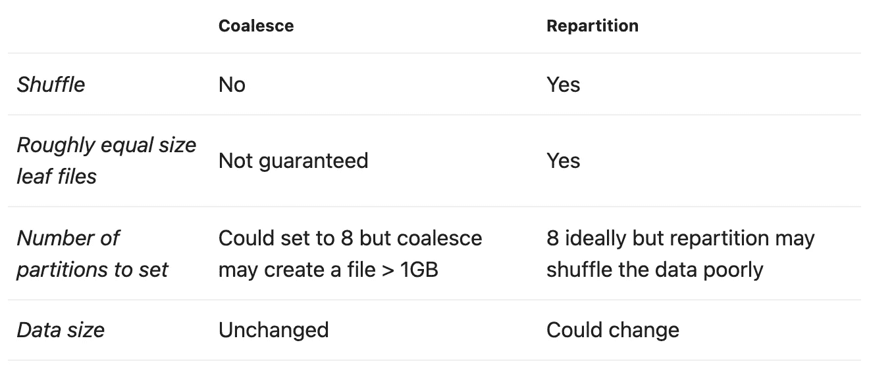
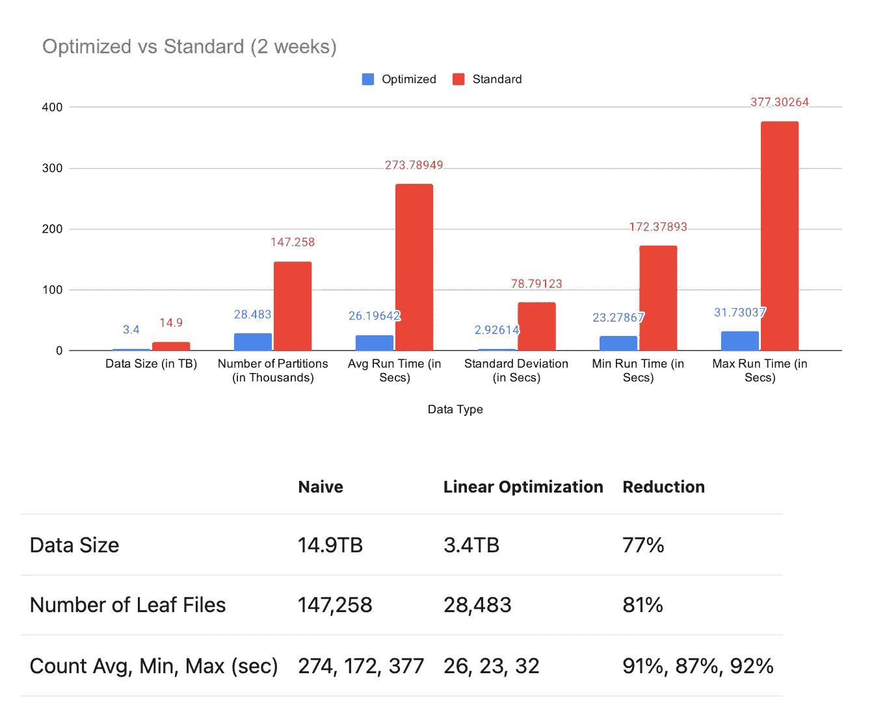
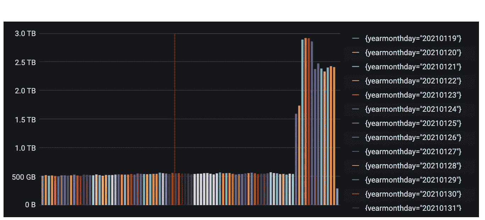
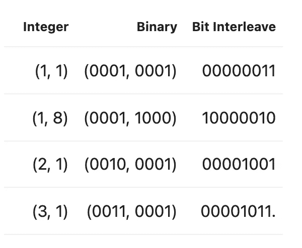
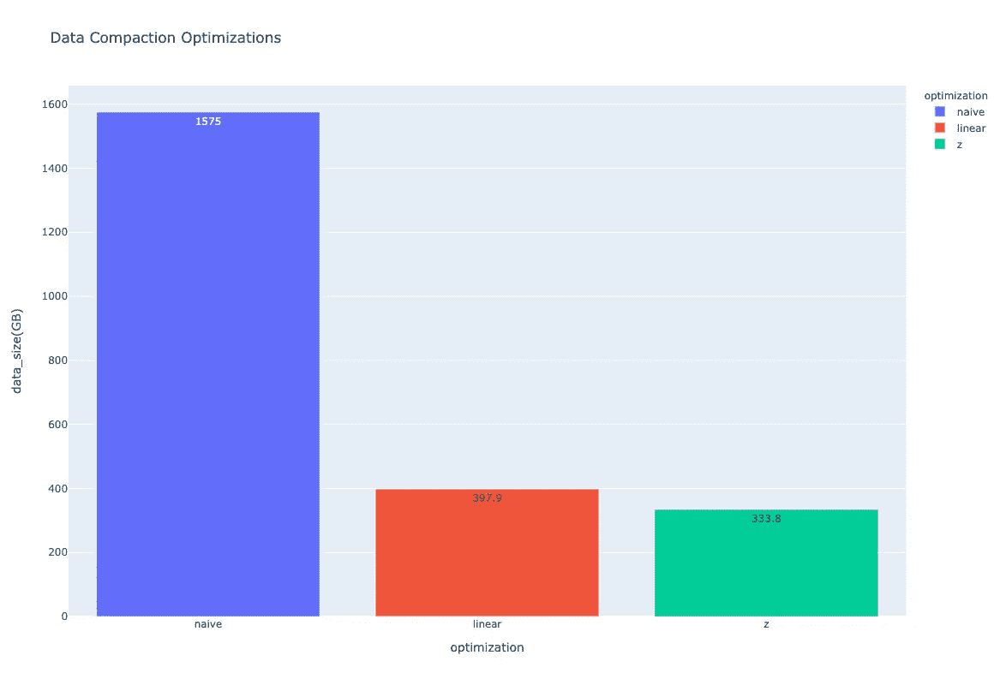

# 压缩分区的数据优化

> 原文：<https://towardsdatascience.com/data-optimization-for-compacted-partitions-7ef1c8a89419?source=collection_archive---------44----------------------->

# TL；速度三角形定位法(dead reckoning)

借助基于使用模式和领域专家确定的高优先级列的智能数据优化，ORC 和 Parquet 等列数据能够创建更小的数据占用空间。这个存储操作是幂等的，不变的。根据数据当前的存储方式，节省的成本可能非常可观。在下面的案例中，我们在存储大小和查询持续时间方面实现了高达 70%的缩减。

# 介绍

因此，您已经创建了一个表。花了几个小时和几天来设置流和/或批处理管道，定义逻辑，解决错误和边缘情况，您已经成功了，祝贺您！您已经有了生产就绪的代码，并且正在用数据填充表分区。剩下的工作就是监控管道，收集统计数据，让用户构建他们的模型并报告任何问题，对吗？在这篇博文中，我们将在这样的假设下工作

1.  我们正在处理 Pb 级的大型数据湖:具有许多 GB 的分区和 TB 级的目录，
2.  潜在的问题与小的非最佳叶文件有关，与集群设置、架构等无关。

# 小活页文件

过了一段时间，我们的表已经写了许多小时、天、月等。我们的用户报告说，即使在访问单个分区时，表也很慢。经过调查，我们注意到管道正在分区中写入许多小的叶子文件。

小叶子文件问题是什么？

小文件是指比 HDFS 块大小小得多的文件。对于 parquet 和 orc 文件，大型数据的最佳文件大小在 512MB 到 1024MB 之间。由于我们处理的是大数据，我们的 HDFS 块大小将是 256MB。也就是说，我们的叶文件是块大小的 2–4 倍，这是最佳设置。

为什么我们会看到非最佳分区大小？

默认情况下，Spark 将在每个分区写入 200 个文件，因为`spark.sql.shuffle.partitions=200`会引入一个会产生混洗的动作。在仅映射写入中，文件的数量将与初始分区的数量相关。在下面的示例中，假设正在从数据工程/模型管道写入数据，该管道在写入数据之前应用了一些逻辑，从而引入了洗牌(对于大多数产生业务使用表的管道逻辑来说是常见的)。

但是，根据您的集群设置或用户指定的设置，该数字可能会更高或更低。假设我们的表是按日和小时划分的。对于给定的一天，我们有 24 个小时，每个分区在 10GB 到 25GB 之间。我们的叶文件将在 51.2MB 和 128MB 之间。

# 天真的方法

对于此表，我们保留了 90 天的滚动数据。该表包含 432，000 个不大于 128MB 的叶文件，我们知道平均每天的数据量约为 2TB，因此该目录约为 180TB。使用 3 因子复制，我们看到的数据占用空间为 540TB。根据我们的同事和/或以前的经验，我们知道我们需要建立一个数据压缩工作。要做到这一点，我们可以使用联合或重新划分，但重新划分的使用将涉及洗牌。我们应该使用哪一个？因为不需要洗牌而合并？考虑 8GB 的分区:

图片拍摄于[https://tech . true analytics . ai/posts/data-optimization-for-compacted-partitions/](https://tech.trueanalytics.ai/posts/data-optimization-for-compacted-partitions/)

在简单的方法中，我们设置一个全局联合或重新分区值，而不是每个分区的值。

有了 coalesce，我们的运行时间会更快，因为它不需要洗牌，数据大小也不会改变。但是，coalesce 不能保证它将数据平均分配到文件中，因此，我们不能使用值 8，这将导致文件大小介于 128MB 和 1024MB++之间，具体取决于使用全局值的最佳分区。

# 再分

对于重新分配，我们引入洗牌。不过，混洗的好处是，当 Spark 写入数据时，叶文件的大小将相对相等。一个有趣的值是分区的数量。如果重新分区将产生相同大小的叶文件，为什么我们不应该使用 8？由于重新分区会改变数据，如果数据有自然的顺序，列压缩的好处可能会被破坏。这意味着重新分区会产生 3 种潜在结果，它可以将数据打乱更好的自然顺序，数据将会减少，它可能不会立即影响数据大小，或者它可能会使数据变得更糟，实际上导致数据大小增加。

# 优化方法

怎样才能做得更好？首先，我们需要了解我们的数据。由此，哪些列对于模型构建、数据分析、过滤等是最重要的。使用该表时，某些列是否比其他列更重要？在过滤的情况下，我们不考虑分区列，因为当用户指定 where `partition_col = some_partition`时，分区修剪会处理这些列。

# 线性排序

对于线性排序，我们希望按照层次结构中最有影响力的列来编写数据。要确定感兴趣的列，最好咨询表所有者、该表的高级用户以及这些数据源的主题专家(SME)。此外，对多列进行线性排序时，优先级基于它们在子句中的指定顺序，也就是说，列表中第一列的影响比最后一列大。因此，只需要挑选少数几个(不超过 10 个，但我建议少于 10 个)列。

大约在 2020 年 3 月至 4 月，我们 True Analytics Tech 在我们最大的数据集上展示了线性排序的优势。我们查看了两周的数据。当我们在下图中谈论运行时间时，这是为了运行计数。在每种情况下，我们在 JVM 预热后收集 10 次运行的结果。在一个更复杂的运行时测试中，这里没有显示，我们聚集了一些数据，并将其连接回原始数据 2 周。在优化的数据上，它运行了大约 5 到 10 分钟。然后，我们用克隆数据(2 周)和表中的数据对它进行了测试。两者都花了 1 个小时才完成 50%。我们克隆了 2 周的数据来运行，因此我们可以确定较长的运行时间与表的完整大小无关。

图片取自[https://tech . true analytics . ai/posts/data-optimization-for-compacted-partitions/](https://tech.trueanalytics.ai/posts/data-optimization-for-compacted-partitions/)

我们的数据占用空间减少了 77%,在 2 周的采样数据中，运行时间减少了约 90%。由于这一结果，我们决定在我们最大的数据集上全面应用这一点，并在 2020 年优化我们的传入数据和旧数据。

该表中的数据已经增长到每天大约 2TB，通过应用线性排序，我们每天能够减少 1.5TB 的数据占用空间，并且通过 3 因子复制，我们每天可以节省 4.5TB 的数据。下面，您将看到由数据模型团队生成的数据监控，他们对我们的一个较大的数据集进行压缩。我们在删除非最佳数据之前等待了 8 天，因此尚未清理的数据将显示大约 2.5TB，因为两个源都存在。

我们对此基础层的保留策略是 90 天，由此，我们有 3 个按小时、天、月派生的聚合层，目前我们将保留大约 1-2 年。我们在这张单个表格上展示的累计节省为 1.322PB。此外，我们的受众团队还优化了他们的数据存储，又节省了 1PB。也就是说，截至 2021 年 6 月 17 日，我们已经保存了 2.331PB 的数据。

在 True Analytics，我们在内部存储数据。然而，为了说明优化压缩流程的好处，我们来看看[亚马逊的定价层](https://aws.amazon.com/s3/pricing/)。我们将只关注存储节省，但请记住，最终用户将体验到运行时间的减少。对于新加坡地区，标准 S3 的成本是第一个 50TB 0.025 美元，第二个 450 TB 0.024 美元，之后 0.023 美元，这是每月的费用。对于亚马逊定价，我们基于 1 个因素；即 2.331 * 1024 / 3 = 795TB。通过减少数据占用空间，我们每月将节省 19，287.04 美元(623，164 泰铢)的成本。

# 空间填充曲线

空间填充曲线是我们可以用来优化数据的另一种广泛使用的方法。同样，我们希望确定最有影响的列，使用的列数规则在这里仍然适用。

空间填充曲线有多种风格:

*   阿砣
*   科赫
*   希尔伯特
*   莫顿

举几个大的例子。

为什么我们要使用空间填充曲线，而不仅仅是使用线性排序？如上所述的线性排序涉及多维索引，其中每个索引对查询结果的权重越来越小。如果您正在寻找存储数据的最佳方式，那么我们需要做的就是减少数据占用空间并能够将多维索引映射到一维。这就是空间填充曲线发挥作用的地方。这里我们来看一个在一组`(x, y)`坐标上使用莫顿曲线(Z 排序)的例子。考虑设置`{(1, 1), (1, 8), (2, 1), (3, 1)}`。这个集合目前按 x，y 线性排序，在 Z 排序中，会发生什么？

图片摘自[https://tech . true analytics . ai/posts/data-optimization-for-compacted-partitions/](https://tech.trueanalytics.ai/posts/data-optimization-for-compacted-partitions/)

如果我们根据比特交织的结果对数据进行排序，我们将得到`{(1, 1), (2, 1), (3, 1), (1, 8)}`。在 x 完全排序之前，y 在排序中起作用，允许其他变量列对排序后的数据产生影响。

当与表列统计一起使用时，空间填充曲线可以加快数据检索速度。发生这种情况时，查询可以跳过较大的数据块，从而最大限度地减少需要遍历的文件数量。在这里，在分析平台上，我们运行了 Z 排序，并将其与我们的原始和线性结果进行了比较。我们看到线性排序的数据占用空间减少了 16%。在这种情况下，我们的原始数据是 1.5TB，线性数据是 398GB，应用 Z 排序时是 334GB。

我们还没有对带有表统计的大型数据集进行完整的性能测试。我们无法显示使用 Z 排序对数据的好处。然而，Amazon 和 Databricks 都有文章概述了使用 Z 排序时的性能提升。对于我们的用例，我们既没有使用 Amazon 集群，也没有在 Deltalake 中使用 Databricks 优化。一切都是内部构建的，用于我们的内部集群。

# 确认

我们运行了一个验证套件来验证数据优化在数据方面是一个等幂变换。首先，我们在原始数据和优化数据的列上运行计数、最小值、最大值等标准指标，最后对两个数据集进行哈希运算以生成校验和。

# 结论

在我们开始使用这种优化压缩的一年半时间里，我们已经在最大的数据集上节省了 50–70%的数据。这提高了我们的集群利用率，减缓了我们的服务器扩展速度，使我们的运营团队不必经常重新平衡节点，并实现了性能提升，使我们的数据模型和数据科学团队能够以更少的资源更快地运行他们的管道。然而，我们还没有完成。我们正在将数据压缩扩展到本地集群中的大多数数据集。

*原载于 2021 年 7 月 22 日*[*https://tech . true analytics . ai*](https://tech.trueanalytics.ai/posts/data-optimization-for-compacted-partitions/)*。*