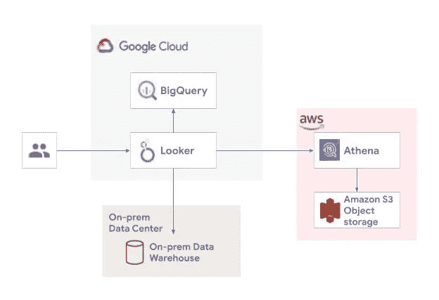
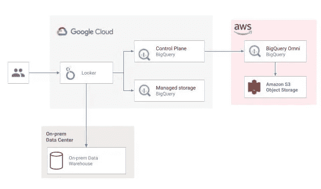

# 多云未来的数据模式

> 原文：<https://towardsdatascience.com/data-patterns-in-a-multi-cloud-future-c2d21376a026?source=collection_archive---------25----------------------->

## 多重云正在成为常态。当您的数据分布在多个云和本地时，这对数据科学和数据工程意味着什么？

弗兰基·查马基在 [Unsplash](https://unsplash.com?utm_source=medium&utm_medium=referral) 上拍摄的照片

对于任何组织来说，最重要的资产就是他们的数据。但这也是最难管理的资产。我已经写了[云计算如何发展](https://kishoregopalan.medium.com/the-multi-cloud-future-3-to-do-multi-cloud-you-should-first-think-multi-cloud-bf76d57660af)以适应世界经济和贸易的不断变化，以及为什么每个组织都必须有一个云计算战略。虽然跟上不断变化的动态对于企业的繁荣和发展非常重要，但它也带来了一系列新的挑战。

尤其是当您引入多个云平台，使您的企业数据分布在不同的云中时，它会如何改变数据科学等式？您是否仍然能够利用来自所有云和本地的所有数据来连接这些点，并从中提取有意义的分析？

Gartner 预测了，这并不奇怪，

> ***到 2021 年，超过 75%的大中型组织将采用多云和/或混合 IT 战略。***

随着我们与一些最大的企业合作，实现他们的云计算和云计算驱动的数据分析之旅，我们在谷歌看到了这一预测的现实已经展开。

在这篇文章和下一篇文章中，我们将讨论不同的数据模式，您可以在跨多个云的数据科学、数据工程和 BI 任务中采用这些模式。

**通过跨多个云连接数据实现商业智能**

作者图片

[Looker](https://cloud.google.com/looker) 是谷歌的云端商业智能和数据分析平台。Looker 的强大之处在于它能够连接到跨不同云或内部的多个数据源，并创建报告和仪表板。它的 LookML 有一套丰富的 API，可以让你在网站中嵌入数据、可视化和见解，并使用工作流集成，在 Looker 本身的基础上构建应用程序。

Looker 可以部署在各种位置，它不一定是谷歌云。如果仪表板上显示的大部分数据位于另一个云中或内部，那么 Looker 最好部署在靠近主数据源的地方。

**使用 BigQuery-Omni 访问多个云中的数据**

作者图片

适用于查询 BigQuery 托管存储的相同控制机制可以应用于驻留在 AWS 中的数据。另一个有趣的模式是将 Looker 与 BigQuery Omni 结合使用。

我们来看看这个图和之前的图有什么不同。Looker 连接到 BigQuery，而不是从 Looker 连接到 Athena，这是查询 S3 存储桶中的数据所需要的。从技术上讲，它连接到控制平面，控制平面转到驻留在 AWS 中的数据平面，并根据 S3 存储桶中的数据处理查询。

使用这种模式的优点是，适用于查询 BigQuery 托管存储的相同控制机制可以应用于驻留在 AWS 中的数据，这将是一个更受控制和更简单的仪表板设置。从旁观者的角度来看，BigQuery Omni 的连接性与托管存储或 Google Cloud 上的联合数据源中的 BigQuery 表的连接性完全相同。当数据科学家或 BI 分析师无法通过 SQL 接口访问 Athena 或其他方式来查询 S3 存储桶中的数据时，这也会变得非常方便。BigQuery Omni 成为 SQL 引擎，从熟悉的 Google 平台控制它既方便又安全。

之前模式的其余部分保持不变——您仍然可以连接到其他数据源，包括 Google Cloud 上的 BigQuery 数据和本地数据仓库，并在同一个仪表板上可视化它，并构建相同类型的应用程序和工作流。

在下一篇文章中，我们将讨论一些更高级的架构模式，它们可以让您跨多个云运行您的分析。