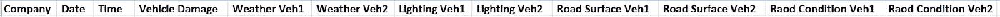
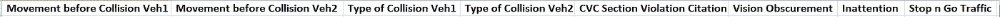
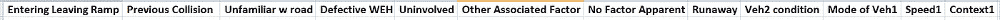
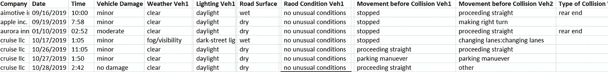
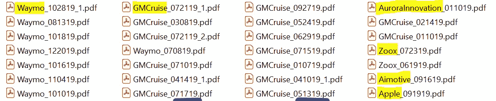
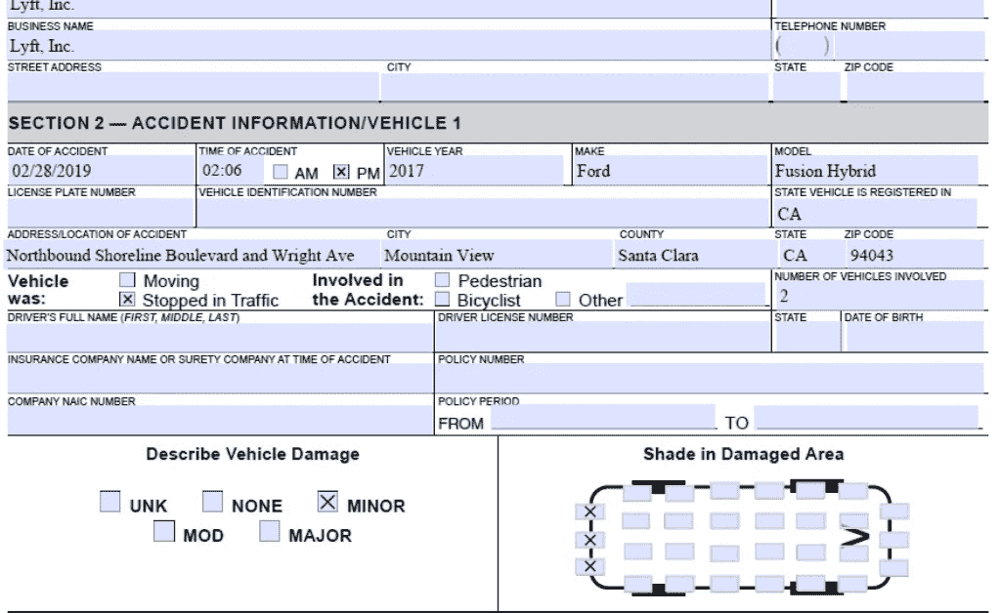
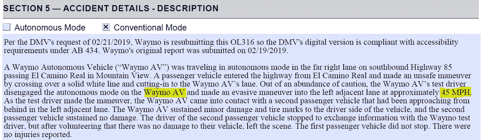
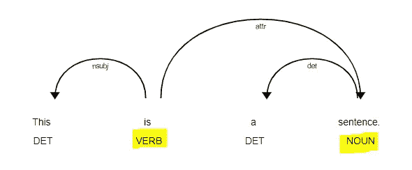
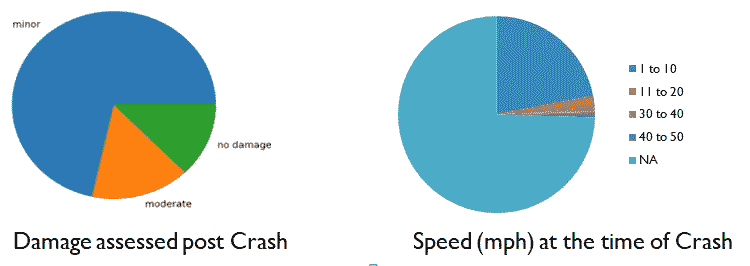
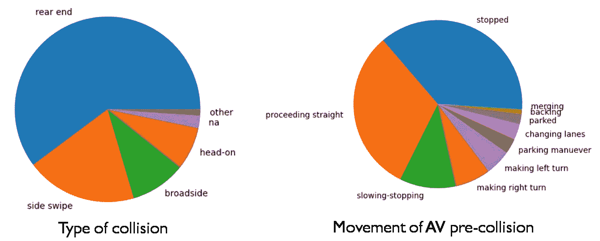

# 自动驾驶汽车试驾结果|数据管道

> 原文：<https://towardsdatascience.com/data-pipeline-for-autonomous-vehicle-test-drive-results-4eabd9b73c49?source=collection_archive---------34----------------------->

## 自动驾驶汽车已经在公共道路上行驶了数百万英里。目前为止结果如何？

来源:[晏殊·李](https://unsplash.com/@yanshulee)通过 [Unsplash](https://images.unsplash.com/photo-1599831968677-d727629073a2?ixid=MXwxMjA3fDB8MHxzZWFyY2h8Mnx8c2VsZiUyMGRyaXZpbmclMjBjYXJ8ZW58MHx8MHw%3D&ixlib=rb-1.2.1&auto=format&fit=crop&w=600&q=60)

你是一个自动驾驶汽车(AV)爱好者吗？你想知道 AV 发展到什么程度了吗？你是否在一家影音公司工作，想知道自己的表现与竞争对手相比如何？

没有单一的答案，没有单一的来源。挖掘法规、安全标准、市场研究、业务案例接受脉冲、独立和关联的汽车子系统报告、算法基准、测试报告、燃烧率分析，等等。

需要一个以上的职位来全面分析所有这些问题。这篇文章占了一大块。它利用公开可用的数据，以定量的方式关注 AV 道路测试报告。它为您提供了代码和指南，以便您可以开始使用 AV 试驾结果数据管道(请记住，数据不是现成的可消费格式)。最后是对未来改进的思考和基于整合数据的简要分析。

系好你的安全带，跟着读…

**公开的 AV 试驾结果数据**

虽然 Udacity、加州大学伯克利分校、Nvidia 和更多机构以专门构建的格式公开提供了大量 AV 传感器数据来试验算法，但缺乏公开提供的 AV 测试结果数据来全面评估当前状况，甚至是公共政策！AV 测试分三个阶段进行:模拟、赛道测试和道路测试。道路测试是在现场部署 AV 之前的最后一英里，监管机构会查看道路测试数据。

加州车管所公布了 AV [碰撞报告](https://www.dmv.ca.gov/portal/vehicle-industry-services/autonomous-vehicles/autonomous-vehicle-collision-reports/)和[脱离报告](https://www.dmv.ca.gov/portal/vehicle-industry-services/autonomous-vehicles/disengagement-reports/)。在 CA 持有 AV 测试许可的公司向 DMV 提交报告。安全性是反车辆地雷可行性的首要标准。碰撞报告提供了直接的见解。脱离接触报告是一个替代指标。假设是，如果 AV 已经脱离，它就没有为无人驾驶做好准备。如果安全驾驶员因为 AV 没有完全遵循他/她的想法而担心，并且他/她启动了脱离，该怎么办？如果场景在模拟中运行，结果是安全的，但没有脱离，会怎么样？关键是这些报告并非没有缺陷。

> 那评价的备选选择是什么？目前没有。**除了加州，美国没有其他州公布过此类数据。**一些州，例如[亚利桑那州](https://azdot.gov/motor-vehicles/professional-services/autonomous-vehicle-notification-and-certification/company-and)、[佛罗里达州](https://flhsmv.gov/html/HSMVAutonomousVehicleReport2014.pdf)已经在 PowerPoint 演示文稿中分享了 AV 文学。

**了解加州车管所 AV 数据管道**

数据管道的目的是以可用于分析的格式访问数据。

谁可以使用数据管道？在 AV 行业工作的开发人员可以访问特定公司的丰富数据，但缺乏其他公司的数据。他们可以用它作为基准。市场研究公司和影音爱好者也可以使用它。

是否需要数据管道？脱离报告以 excel 格式提供，可由任何分析工具获取，并且不需要数据管道。由脱离度驱动的直觉本身就是一个有争议的话题。碰撞报告实际上是一个以 pdf 格式存储的表单。每年都有数百份碰撞报告提交。手动分析数据是不可能的。

数据管道在处理不同 AV 公司在不同日期提交的数百份多页表格后，生成一个整洁的 excel 文件。以下是字段/列标题列表和字段子集上的字段值片段。

字段列表(来源:作者)

字段列表(来源:作者)

字段列表(来源:作者)

字段值的片段(来源:作者)

上述输出的输入是从 [CA DMV](https://www.dmv.ca.gov/portal/vehicle-industry-services/autonomous-vehicles/autonomous-vehicle-collision-reports/) 站点下载的一堆 pdf 表单文件。下面的截图显示 1) Waymo、Cruise、苹果、Zoox、Aurora 购买了优步的自动驾驶设备，以及更多提交 AV drive 崩溃报告的 AV 公司 2)先睹为快 Lyft 提交的 pdf 表格。

输入=不同公司在不同日期的 pdf 表单(来源:作者)

在 Lyft 自动驾驶实验室提交给 CA DMV 的 pdf 表格中先睹为快(来源:作者)

**数据管道入门指南**

参见 [GitHub](https://github.com/manimalakumar/Autonomous-Vehicle-CA-DMV/tree/master) 。[自述文件](https://github.com/manimalakumar/Autonomous-Vehicle-CA-DMV/blob/master/README.md)包含分步指南。

有几点值得注意。这两种光学字符识别(OCR)技术都用于从表单中提取信息，它们相互补充。

空间用于自然语言处理(NLP)。表单中有一个描述部分，如下所示。并不是所有的影音公司都以同样的方式填写。如果有，速度和相关的对象值将被捕获到 excel 的速度<n>和上下文<n>字段中。在下面的截图中:1) Waymo 填写了自动驾驶车辆的速度。2)提取速度、动词和对应的名词对象，从而实现词性依存分析。图中显示了 spaCy 文档中的图表。这是一个有趣的实验。但由于数据的不一致性和 NLP 的复杂性，这部分并不是很有成果。</n></n>

Waymo 在 CA DMV 表格中输入了 19 年 2 月 21 日撞车时 AV 速度的详细信息(来源:作者)

使用 spaCy 的依赖解析器可视化(来源: [spaCy 开发者文档](https://spacy.io/displacy-3504502e1d5463ede765f0a789717424.svg)

**AV 测试结果数据管道的未来改进**

让某样东西工作，测试它，让它变得更好。当前版本是最低可行版本。它允许按照碰撞报告的当前格式创建一个 excel 文件。

以下是未来改进的想法:

*捕捉多选选项。举例来说，天气可能同时下雨、有雾和刮风。表格可以通过勾选所有这些选项来填写。到目前为止，没有表单选择一个以上的选项，代码只支持一个选项。*

*自动收集输入文件*。从 CA DMV 网站下载文件需要一段时间。考虑使用网络爬虫和自动下载。爬虫可以第一次运行，然后以每季度或每年的频率收集新文件。代码应该只快速增量地处理新文件。

*拥有易于维护且健壮的代码库*。CA DMV 将来可能会改变表格的格式。这一特点强调了 AV 领域对标准的需求。这将要求不可避免的代码变更。目前在图像处理和最终格式检查时需要一些人工干预。代码应该没有任何人工干预。

*NLP 识别相关信息*:如果数据和管道继续有用，最后要改进的是准确和相关的文本提取。

**结果分析一瞥**

使用数据管道生成的 excel 文件，可以进行数据分析。下面是对 2019 年数据的分析；报告了 104 起事件。

CA DMV AV 碰撞报告 2019 |损坏程度|碰撞时的速度(来源:作者)

CA DMV AV 碰撞报告 2019 |碰撞类型| AV 碰撞前的移动(来源:作者)

> 在深入分析之前，看一下数据是值得的。数据有偏差。**所有记录都属于城市道路上的撞车和自动驾驶汽车。**没有关于高速公路驾驶或大型车辆(如自动驾驶卡车和公共汽车)的数据。

速度(mph)数据不足以推断结论，因为 75%的情况下没有报告速度。

令人惊讶的是，在预碰撞阶段，自动驾驶汽车直线行驶，然后发生碰撞。AV 在崩溃前停止似乎是一个常见的场景。AV 是否预见到了碰撞并停止了？还是在停车标志前停下来被撞了？当中等强度的碰撞发生时，AV 是否试图使其变得轻微？如果是，交换是什么？为了进一步了解情况，需要访问 AV 的事件日志和情况的原因分析。

有大量的追尾事故。汽车主机厂是否应该在车尾材料上进行创新和实验？

你注意到 AV 准备就绪的好消息了吗？虽然撞车确实发生了，但 70%的撞车是轻微的。让我们以积极的态度到达终点。