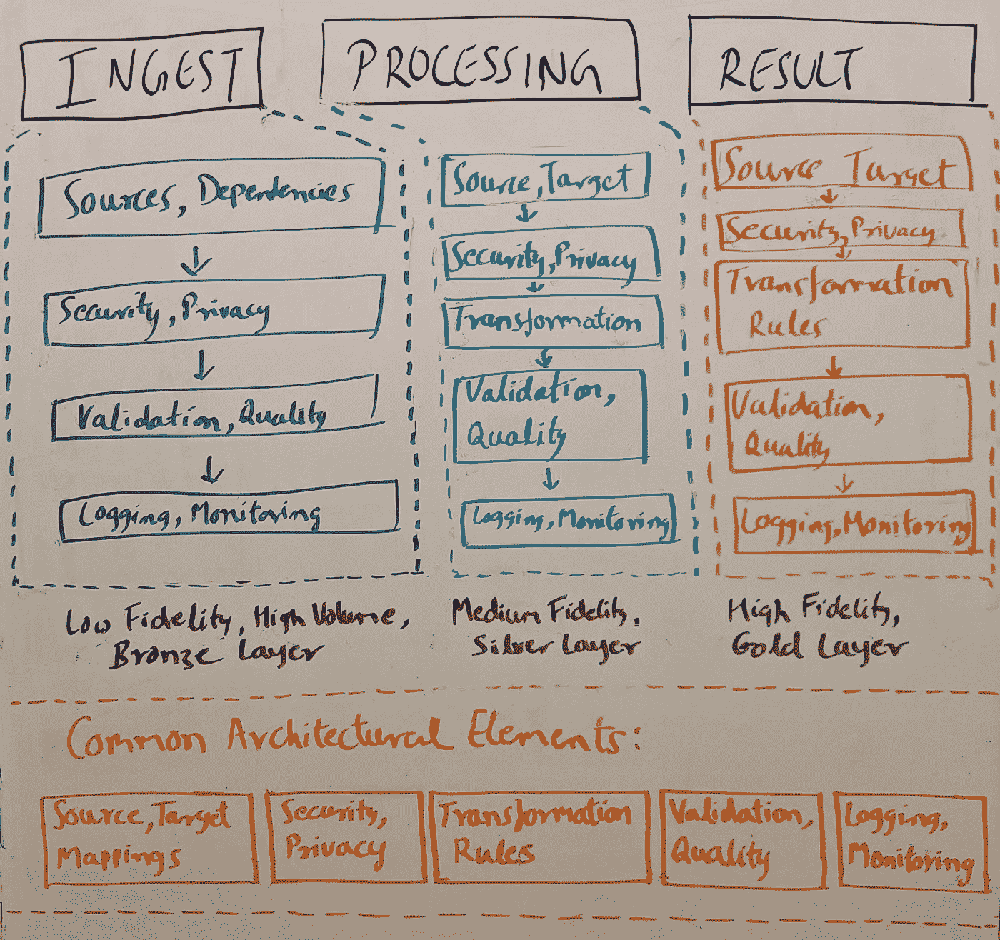
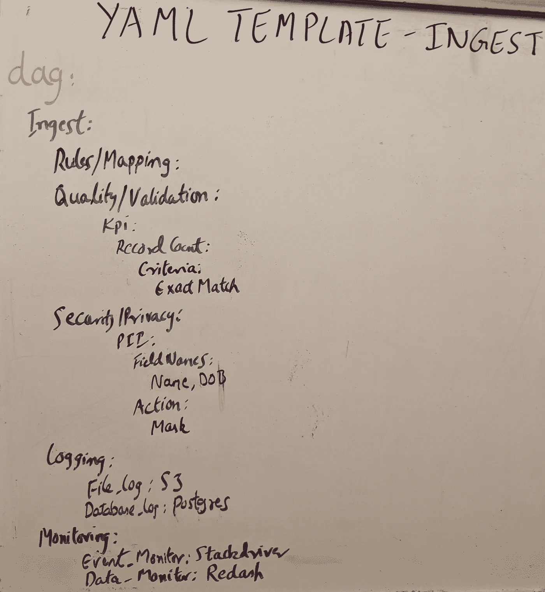
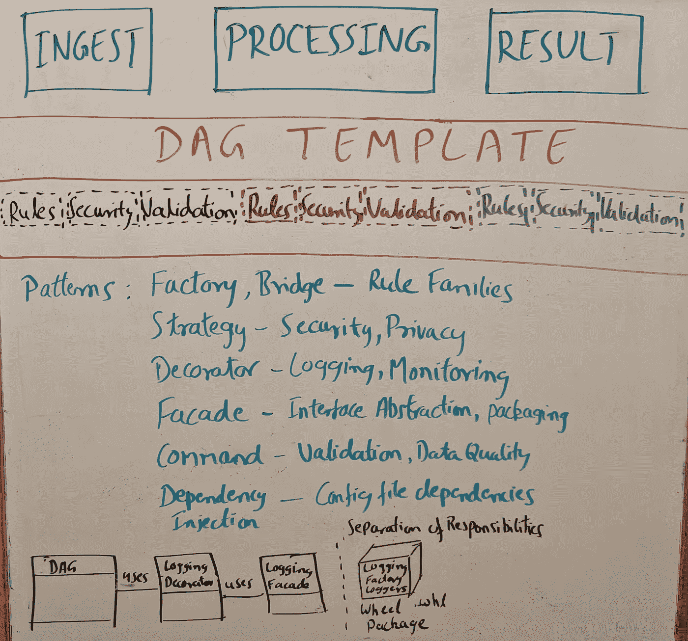

# 数据管道——可重用性、可扩展性

> 原文：<https://towardsdatascience.com/data-pipelines-design-patterns-for-reusability-extensibility-3df0af020c64?source=collection_archive---------14----------------------->

## 为质量、灵活性、透明度和增长发展数据管道


图片:[去飞溅](https://unsplash.com/@victor_g)

设计可扩展、模块化、可重用的数据管道是一个更大的主题，与数据工程密切相关，因为这类工作涉及处理不同层的不断变化，如数据源、接收、验证、处理、安全、日志记录和监控。这些层之间的变化速度各不相同，根据管道的抽象级别和设计，它们对数据管道的影响也各不相同。在本帖中，我们将讨论横切关注点，特别是日志和监控，并讨论一些用例及模式，它们可能为在管道中构建模块化和可重用性提供基础

为了在数据管道的层中获得一些上下文，并开始映射配置，这里有一个概念性视图:



图:作者数据管道高级架构

这是一个简化的视图，因为这些层可以用许多不同的方式表示，但是在一个提炼的形式中，管道可以被认为是摄取、处理和结果层。对于每一层，我们可以从功能的角度来考虑，因为图像显示了功能块。块的内容根据层的要求而变化。这有助于我们从可以表示管道 DAG 的模板和配置方面进行思考。例如，下面的 yaml 配置:



图:为 DAG 层创作概念 Yaml 配置

接收、处理和结果层可以根据需求映射到不同的记录器和监视器。例如，在接收层，文件日志可以是 S3，事件日志可以是自定义的，监视器可以是 Stackdriver 和 Redash。但是，结果层可以作为数据狗映射到事件日志数据狗和事件监视器。

如果我们采用一个通用的管道，特别是查看日志和监控，这种表示将作为 Dag 方法实现，其中日志记录器和监控器将与 Dag 代码耦合。这涉及到更多的编码，它是脆弱的，难以重用的，并且违反了 SRP、DRY、Open Closed 的设计原则，使得整个管道不稳定和不可靠。如果我们将这个问题陈述扩展到监控和日志记录之外，我们将在不同的功能块中看到类似的问题—数据质量/验证、安全性/隐私等。

当我们看到问题的相似性时，这是识别共同主题的标志。例如，这里我们有特定于 DAG 和特定于功能(日志记录、监控)的职责。此外，我们希望消除这些之间的耦合，并增加这些之间的内聚力。这给了我们足够的背景来开始考虑设计模式。参考 [*设计模式:可重用面向对象软件的元素*](https://en.wikipedia.org/wiki/Design_Patterns)*“四人帮”(Gamma 等人)。对于我们的上下文，我们将展示这些模式如何在我们的设计中发挥作用。下图显示了适用于不同层的模式的管道 DAG 的高级视图:*

**

*图:适用于不同 DAG 层的作者模式*

*第一组模式是创造性的或结构性的。它们允许我们将横切关注点的创建和结构分开，例如日志记录、来自 Dag 特定区域的监控。[工厂](https://en.wikipedia.org/wiki/Factory_method_pattern)和[抽象工厂](https://en.wikipedia.org/wiki/Abstract_factory_pattern)有助于从 Dag 代码中抽象和分离不同的记录器和监视器，允许 Dag 代码库在不依赖于日志记录和监视代码库的情况下发展*

```
*from loglib import LogConfigConst
from abc import ABC, abstractmethod
from boto3 import Session

class Logger(metaclass=ABC.ABCMeta):
    @abstractmethod
    def log(self,message):
        pass

class S3Logger(Logger):
    *""" log to AWS S3 """* _initialized = False
    _instance = None
    _s3session = None
    def __new__(cls, *args, **kwargs):
        if not cls._instance:
            cls._instance = super(S3Logger, cls).__new__(cls, *args, **kwargs)
        return cls._instance

    def __init__(self, *args, **kwargs):
        if self._initialized:
            return
        super(S3Logger, self).__init__(*args, **kwargs)
        #get the kwarg config that has details of S3 connection params -- Region, Public Key, Secret Key
        logconfig=kwargs["logconfig"]
        logConfigConst=LogConfigConst()
        #establish s3 session, use boto3
        self.__class__._s3session=Session(aws_access_key_id=logconfig[logConfigConst.AWS_ACCESS_KEY_ID],
                                          aws_secret_access_key=logconfig[logConfigConst.AWS_SECRET_ACCESS_KEY],
                                          region_name=logconfig[logConfigConst.AWS_REGION])
        self.__class__._initialized = True

    @classmethod
    def log(cls, message):
        #log to S3
        return*
```

**显示 Logger 和 LogFactory 类示例的代码示例:**

```
*class LogFactory:
    _dictlogger={}
    @classmethod
    def create_logger(config):
        logger=None
        if config.name == LogConfigConst.filelog.names.S3:
            logger=S3Logger(logconfig=config)
        elif config.name == LogConfigConst.eventlog.names.DataDog:
            logger=DataDogLogger(logconfig=config)
        elif config.name == LogConfigConst.databaselog.names.PostGresDB:
            logger=PostGresDBLogger(logconfig=config)
        return logger
    @classmethod
    def get_logger(cls,config):
        if cls._dictlogger[config.name] is None:
            cls.dict_logger[config.name] = cls.create_logger(config)
        return cls.dict_logger[config.name]*
```

*第二组模式是行为模式。它们允许我们在保持 SRP、DRY 和 SOLID 原则的同时指定行为。[装饰器](https://en.wikipedia.org/wiki/Decorator_pattern)模式广泛用于修改或添加现有函数的行为。正如我们在下面看到的，日志记录和监控是直接适用的。*

```
*import functools,sys,traceback
from loglib import LoggingFacade

class LoggingDecorator:

    def __init__(self,config):
        self.logFacade=LoggingFacade(config_template=config)

    def log_error(self,func=None):
        def error_log(func):
            @functools.wraps(func)
            def wrapper(*args, **kwargs):
                try:
                    # Execute the called function
                    return func(*args, **kwargs)
                except Exception as e:
                    error_msg = 'And error has occurred in '.join(func.__name__)
                    self.logFacade.log_filestore(error_msg)
                    raise e
            return wrapper
        return error_log

@LoggingDecorator.log_error
def push_exception_to_xcom(kwargs):
    *"""To push exception occuring from dag task to xcom ; this will be used in alert/reporting"""* exc_type, exc_value, exc_traceback = sys.exc_info()
    exception_details= ''.join(traceback.format_exception(etype=type(exc_type),value=exc_value, tb=exc_traceback))
    kwargs['ti'].xcom_push(key='exception_details', value=exception_details)*
```

**显示 LoggingDecorator 示例的代码示例:**

*当客户端或消费者需要更窄或特定的 api 时， [Facade](https://en.wikipedia.org/wiki/Facade_pattern) 模式非常有用。例如，由不同的记录器和监视器展示的 api 或方法的广泛集合不需要向 Dag 层展示。Facade 模式有助于定义对日志记录、监控层的访问或接口，如下所示*

```
*from loglib import LogConfigConst
from loglib.LoggerFactory import LogFactory

class LoggingFacade:
    _file_logger, _event_logger, _database_logger = None
    _initialized = False
    def __new__(cls, *args, **kwargs):
        if not cls._instance:
            cls._instance = super(LoggingFacade, cls).__new__(cls, *args, **kwargs)
        return cls._instance

    def __init__(self, *args, **kwargs):
        if self._initialized:
            return
        super(LoggingFacade, self).__init__(*args, **kwargs)
        #get the kwarg config that has config for all the loggers
        config=kwargs["config_template"]
        logconfig=LogConfigConst()
        for conf in config.loggers:
            if conf.type == logconfig.FILELOG:
                self.__class__._file_logger = LogFactory().get_logger(conf)
            elif conf.type == logconfig.EVENTLOG:
                self.__class__._event_logger = LogFactory().get_logger(conf)
            elif conf.type == logconfig.DATABASELOG:
                self.__class__._database_logger = LogFactory().get_logger(conf)
        self.__class__._initialized = True

    #filestore could be S3 or other providers
    @classmethod
    def log_filestore(cls,message):
        cls._file_logger.log(message)

    #event logger could be DataDog or other providers
    @classmethod
    def log_event(cls,message):
        cls.event_logger.log(message)

    @classmethod
    def log_database(cls,message):
        cls.database_logger.log(message)*
```

**显示 LoggingFacade 示例的代码示例:**

*当我们组合这些模式时，我们意识到设计原则的好处，因为职责的分离允许在多个级别上模块化代码库:Dag 级别、横切关注点级别(用于监控、日志记录的单独的包)、跨 Dag 级别(公共模板可以被抽象为例如领域特定的)。这提供了构建模块，用于将数据管道一般化，从编写定制代码转移到更通用的模块、模板、配置。不同的部分遵循它们的开发周期和部署包，与 Dag 代码库完全分离。虽然添加这些设计原则确实增加了抽象性和某种程度的复杂性，但是这对于在保持质量和速度的同时扩大管道开发来说是一个很小的代价*

*尽管数据工程领域在不断发展，DAG 管道设计和架构也面临着一系列挑战，但仍有一些关键原则可用于提高管道的稳定性、可靠性和可维护性。我希望您喜欢阅读这篇文章，并找到一些有用的信息应用到您的数据工程计划中。我期待您的评论和反馈。*