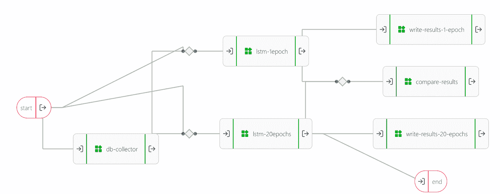

# 数据管道:什么，为什么，哪些

> 原文：<https://towardsdatascience.com/data-pipelines-what-why-and-which-ones-1f674ba49946?source=collection_archive---------9----------------------->

## 不同管道框架如何相互关联的示例和解释

克林特·王茂林在 [Unsplash](https://unsplash.com?utm_source=medium&utm_medium=referral) 上拍摄的照片

如果您在数据科学领域工作，您可能会在各种文章和教程中不断看到术语“数据管道”。您可能还注意到，术语“管道”可以指代许多不同的事物！有跨越 IT 堆栈不同部分的管道，特定工具的管道，以及特定代码库中的管道。例如，我工作的公司 UbiOps 也提供自己的管道形式。

跟踪所有这些不同的管道是什么，以及它们彼此之间有什么不同，可能会非常令人困惑。在本文中，我们将列出并比较一些常见的管道，并阐明 UbiOps 管道在总体情况中的位置。

# 什么是数据管道？

让我们从头开始，什么是数据管道？总的来说，数据流水线就是简单的**对数据执行的自动化操作链**。它可以将数据从 A 点带到 B 点，它可以是从多个来源聚合数据并将其发送到某个数据仓库的流程，或者它可以对检索到的数据执行某种类型的分析。基本上，数据管道有多种形状和大小。但是它们都有三个共同点:它们是自动化的，它们引入了可重复性，并且有助于将复杂的任务分解成更小的、可重用的组件。

您可能熟悉 **ETL** ，或者它的现代对应物 **ELT** ，它们是常见的数据管道类型。ETL 代表*提取、转换、加载*，它就是这样做的。ELT 管道提取、加载，然后才进行转换。它们是许多处理数据的公司使用的通用管道模式。尤其是当他们处理需要存储在数据仓库中的来自不同来源的数据时。ETL 或 ELT 管道是数据管道的子集。换句话说，每个 ETL/ELT 管道都是数据管道，但不是每个数据管道都是 ETL 或 ELT 管道。

在数据管道的另一端，我们有更侧重于分析的管道。这些通常出现在数据科学项目中。它们是处理传入数据的管道，这些数据通常已经以某种方式进行了清理，以提取洞察力。它不仅仅是加载和转换数据，而是对数据进行分析。

数据管道不局限于这种或那种类型，它更像一个光谱。一些管道完全专注于 ETL 端，另一些专注于分析端，还有一些两者兼而有之。建立数据管道有许多不同的方法，但最终最重要的是它要符合你的项目需求。

# 为什么需要数据管道？

好了，我们已经讨论了什么是数据管道，但是也许你仍然想知道它们的额外好处是什么。毕竟建立管道需要时间。出于几个原因，我可以保证这段时间花得很值。

首先，自动化管道最终会节省您的时间，因为您不必手动地一遍又一遍地做同样的事情。它允许您在可重复的任务上节省时间，因此您可以将更多的时间分配给项目的其他部分。

不过，使用自动化管道最重要的原因可能是，您需要思考、计划并在某个地方写下您计划放入管道的整个流程。换句话说:它迫使你预先做一个设计，并考虑必需品。反思过程并记录下来对于防止错误和允许多人使用管道非常有用。

此外，管道允许您将一个大的任务分成更小的步骤。这提高了效率、可扩展性和可重用性。这有助于针对他们必须做的事情优化不同的步骤。例如，有时不同的框架或语言更适合管道的不同步骤。如果它是一个大的脚本，你将不得不坚持一个，但是使用大多数管道工具，你可以为管道的每个单独部分选择最好的框架或语言。

最后，管道引入了再现性，这意味着几乎任何人、几乎任何地方都可以再现结果(当然，如果他们可以访问数据的话)。这不仅引入了安全性和可追溯性，还使调试变得更加容易。每次运行管道的过程都是相同的，所以每当出现错误时，您可以轻松地追溯步骤，并找出错误出在哪里。

# UbiOps 管道在这幅图中是怎样的？

如果你熟悉 [UbiOps](https://ubiops.com/product/) ，你会知道 ubi ops[也有流水线功能](https://ubiops.com/docs/pipelines/)。UbiOps 管道是模块化工作流，由称为**部署**的对象组成。每个部署都为 UbiOps 中的一段 Python 或 R 代码提供服务。每个部署都有自己的 API 端点，并根据使用情况进行动态扩展。通过管道，您可以将部署连接在一起，以创建更大的工作流。这种设置有助于模块化，允许您将应用程序分成小的独立部分，以便随着时间的推移构建更强大的软件。UbiOps 将负责这些部署之间的数据路由，整个管道将通过自己的 API 端点公开，供您使用。

UbiOps 中的管道截图，图片由作者提供

当我们回顾我之前讨论的管道频谱时，UbiOps 更多地是在分析方面。最终，无论您在代码中指定什么，您都可以使用 UbiOps 管道，但它更多地意味着数据处理和分析，而不是在其他技术之间路由数据。

# 不同管道框架的比较

正如我前面提到的，有很多不同的管道框架，都有各自的优点和用例。在数据科学领域不断出现的几个例子是:Luigi、Airflow、scikit-learn 管道和 Pandas 管道。让我们看看它们的异同，并检查它们与 UbiOps 管道的关系。

Luigi 是 Spotify 为其数据科学团队打造的，用于构建数千个任务的长期运行管道，这些任务跨越数天或数周。它旨在帮助将任务整合到流畅的工作流程中。这是一个基于 Apache 的开源许可的 [Python 包。](https://github.com/spotify/luigi)

Luigi 的目的是解决通常与长时间运行的批处理相关的所有问题，其中许多任务需要链接在一起。这些任务可以是任何事情，但通常是长时间运行的事情，如 Hadoop 作业、向/从数据库转储数据或运行机器学习算法。

Luigi 有 3 个步骤来构建管道:

*   `requires()`定义任务之间的依赖关系
*   `output()`定义了任务的目标
*   `run()`定义每个任务执行的计算

在 Luigi 中，任务与提供给它们的数据错综复杂地联系在一起，这使得创建和测试一个新任务变得困难，而不仅仅是将它们串在一起。由于这种设置，也很难更改任务，因为您还必须单独更改每个相关任务。

**air flow** [air flow](https://airflow.apache.org/)最初是由 AirBnB 创建的，旨在帮助他们的数据工程师、数据科学家和分析师掌握建设、监控和改造数据管道的任务。气流是一个非常通用的系统，能够处理各种工具的气流。Airflow 将工作流定义为有向无环图(Dag)，任务是动态实例化的。

气流围绕着:

*   **钩子**，是连接外部平台的高级接口(如 [Postgres 钩子](https://airflow.apache.org/docs/apache-airflow/1.10.6/_api/airflow/hooks/postgres_hook/index.html))
*   **操作符**，它们是成为 DAG 节点的预定义任务
*   **执行者**(通常是[芹菜](https://docs.celeryproject.org/en/stable/))远程运行作业，处理消息队列，并决定哪个工人将执行每个任务
*   **调度器**，负责触发预定的工作流，以及将任务提交给执行器运行。

有了气流，就有可能创建高度复杂的管道，这是很好的编排和监测。对于 Airflow 来说，最重要的因素是它与其他系统(如数据库、Spark 或 Kubernetes)良好连接的能力。

然而，气流的一个大缺点是它陡峭的学习曲线。要很好地利用气流，你需要 DevOps 知识。一切都是高度可定制和可扩展的，但是以简单性为代价。

**scikit-learn 管道** [scikit-learn 管道](https://scikit-learn.org/stable/modules/generated/sklearn.pipeline.Pipeline.html)与 Airflow 和 Luigi 有很大不同。它们不是编排不同服务的大型任务的管道，而是一个可以让您的数据科学代码更加清晰、更具可重复性的管道。scikit-learn 管道是 scikit-learn Python 包的一部分，该包在数据科学领域非常流行。

scikit-learn 管道允许您连接一系列转换器，后跟一个最终估计器。通过这种方式，您可以将模型训练或数据处理等特定步骤连接在一起。借助 scikit-learn pipelines，您的工作流程变得更加易于阅读和理解。正因为如此，发现数据泄露这样的事情也变得容易多了。

但是请记住，scikit-learn 管道只能与 scikit-learn 库中的转换器和估算器一起工作，并且它们需要在相同的运行时中运行。因此，这些管道与您在 Airflow 或 Luigi 中创建的编排管道非常不同。例如，使用 Airflow 或 Luigi，您可以在不同的工作节点上运行管道的不同部分，同时保持一个控制点。

熊猫管道
[熊猫管道](https://pandas.pydata.org/docs/reference/api/pandas.DataFrame.pipe.html)是特定 Python 包管道的另一个例子，在本例中是熊猫。Pandas 是一个流行的数据分析和操作库。你的数据分析变得越大，你的代码也会变得越乱。Pandas 管道提供了一种清理代码的方法，允许您在一个函数中连接多个任务，类似于 scikit-learn 管道。

Pandas pipes 有一个标准:所有的步骤都应该是一个函数，一个数据框作为参数，一个数据框作为输出。只要遵循这个标准，您可以根据需要添加任意多的步骤。您的函数可以在数据帧后面带额外的参数，这些参数也可以传递给管道。

按照数据帧进，数据帧出的原则，Pandas 管道非常多样化。就用例而言，它们与 scikit-learn 管道相当，因此也与 Airflow 和 Luigi 有很大不同。它们也可能是管道，但类型完全不同。

**对比** 很明显，所有这些不同的管道都适合不同类型的用例，甚至可以很好地结合使用。例如，完全有可能在 UbiOps 管道的部署中使用 Pandas 管道，以这种方式结合它们的优势。让我们把前面提到的管道并排放在一起，勾勒出更大的图景。

在管道频谱中，Luigi 和 Airflow 位于更高级别的软件编排端，而 Pandas 管道和 scikit-learn 管道位于特定分析的代码级别，UbiOps 位于两者之间。Luigi 和 Airflow 是创建跨堆栈中多个服务的工作流或在不同节点上调度任务的绝佳工具。Pandas 管道和 scikit-learn 管道对于更好的代码可读性和更具重现性的分析来说是非常棒的。UbiOps 非常适合在 Python 或 r 中创建分析工作流。

UbiOps、Airflow 和 Luigi 之间有一些重叠，但它们都面向不同的用例。UbiOps 面向数据科学团队，他们需要以最少的开发运维麻烦将其分析流程投入生产。Luigi 面向长时间运行的批处理过程，其中许多任务需要链接在一起，这些任务可能持续几天或几周。最后，气流是三者中最通用的，允许您监控和协调复杂的工作流，但以简单性为代价。随着其多功能性和功能的增加，也带来了很多复杂性和陡峭的学习曲线。

scikit-learn 和 Pandas 管道实际上无法与 UbiOps、Airflow 或 Luigi 相提并论，因为它们是专门为这些库设计的。scikit-learn 和 Pandas 管道实际上可以与 UbiOps、Airflow 或 Luigi 结合使用，只需将它们包含在这些管道中各个步骤的代码运行中即可！

# 结论

数据管道是将自动化、可再现性和结构化引入项目的一个很好的方式。有许多不同类型的管道，每一种都有自己的优点和缺点。希望这篇文章有助于理解所有这些不同的管道是如何相互关联的。