# 使用 Apache Beam 的数据管道

> 原文：<https://towardsdatascience.com/data-pipelines-with-apache-beam-86cd8eb55fd8?source=collection_archive---------2----------------------->

## 利用 Beam 实施大数据

## 如何借助 Beam 实现数据管道


[来源](https://pixabay.com/photos/binary-binary-code-binary-system-2910663/)

[Apache Beam](https://beam.apache.org/) 是 Apache 的最新项目之一，这是一个整合的编程模型，用于表达高效的数据处理管道，正如 Beam 的主网站[ [1](https://beam.apache.org/) 所强调的那样。在本文中，我们将更深入地研究这个特定的数据处理模型，并探索它的数据管道结构以及如何处理它们。此外，我们还将举例说明。

# 什么是阿帕奇光束

Apache Beam 可以表示为分布式数据处理的编程模型[ [1](https://beam.apache.org/) ]。它只有一个 API 来处理数据集和数据帧这两种类型的数据。当您建立束管线时，您并不关心您所建立的管线类型，无论您是建立批次管线还是串流管线。

就其侧面而言，顾名思义，它可以调节到任何位置。在 Beam 上下文中，这意味着开发您的代码并在任何地方运行它。

## 装置

要在 Python 中使用 Apache Beam，我们首先需要安装 Apache Beam Python 包，然后将其导入到其网页[ [2](https://beam.apache.org/get-started/quickstart-py/) ]上描述的 [Google Colab](https://research.google.com/colaboratory/faq.html) 环境中。

```
! pip   install apache-beam[interactive]
import   apache_beam as beam
```

## 什么是管道

管道通过改变输入来封装信息处理任务。

## Apache Beam 的体系结构

在本节中，将介绍 Apache Beam 模型的体系结构、它的各种组件以及它们的作用。主要是用于合并处理的 Beam 概念，这是 Apache Beam 的核心。Beam SDKs 是用户可以用来创建管道的语言。用户可以选择自己喜欢的、舒适的 SDK。随着社区的发展，新的 SDK 正在被整合。

一旦用任何支持的语言定义了管道，它将被转换成通用语言标准。这种转换由一组运行程序 API 在内部完成。

我想提一下，这种通用格式并不完全是语言通用的，但我们可以说是部分通用的。这种转换只是概括了核心转换的基本内容，这些内容对于所有人来说都是通用的，如映射函数、分组和过滤。

对于每个 SDK，都有一个相应的 SDK 工作人员，他们的任务是理解特定于语言的东西并解决它们。这些工人提供了一个一致的环境来执行代码。

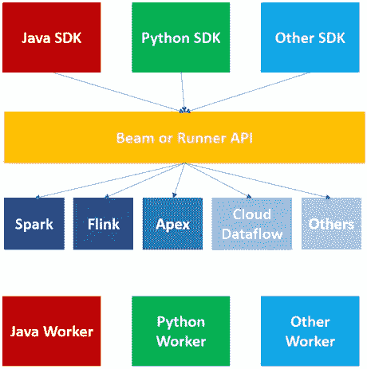

来源:图片由作者提供

对于每种语言的 SDK，我们都有一个特定的 SDK 工作人员。所以现在，如果我们有这个 runner 或 Beam API 和特定于语言的 SDK 工作器，我们使用哪个 Runner 就无关紧要了。任何跑步者都可以执行其指南页[ [4](https://beam.apache.org/contribute/runner-guide/) ]上提到的相同代码。

# 阿帕奇波束的特点

阿帕奇波束包括四个基本特征:

*   管道
*   p 集合
*   p 转换
*   跑步者

`Pipeline`负责读取、处理和保存数据。这整个循环是一个从输入开始直到输出的整个循环的管道。每个 Beam 程序都能够生成一条流水线。

光束的第二个特征是一个`Runner`。它决定了这条管道将在哪里运行[ [5](https://beam.apache.org/contribute/runner-guide/) ]。

光束的第三个特征是`PCollection`。它相当于 Spark 中的 RDD 或数据帧。管道通过从数据源读取数据来创建一个`PCollection`，之后，随着 PTransforms 被应用于它，更多的 PCollections 继续发展[ [6](https://beam.apache.org/documentation/programming-guide/) ]。

每个`PCollection`上的`PTransform`都会产生一个新的`PCollection`，使其不可改变。构造后，您将无法配置 PCollection 中的单个项目。在`PCollection`上的转换将产生一个新的`PCollection`。`PCollection`中的特征可以是任何类型，但必须是同一类型。然而，为了保持分布式处理，Beam 将每个元素编码为一个字节串，以便 Beam 可以将项目传递给分布式工作器，如其编程页面[ [6](https://beam.apache.org/documentation/programming-guide/) 中所述。

Beam SDK 包还作为所用类型的编码机制，支持自定义编码。此外，PCollection 不支持粒度操作。因此，我们不能对 PCollection 中的某些特定项目应用转换。我们使用所有的转换来应用于整个`PCollection`而不是某些方面[ [6](https://beam.apache.org/documentation/programming-guide/) ]。

通常，当读取或添加项目时，源通常会为每个新元素分配一个时间戳。如果`PCollection`持有有界数据，我们可以强调每个特性都将被设置为相同的时间戳。您可以显式指定时间戳，或者 Beam 将提供自己的时间戳。在任何情况下，如果源没有为我们指定时间戳，我们可以手动为元素指定时间戳。

光束的第四个特征是`PTransform`。它将一个样本`PCollection`作为数据源，并生成一个带有时间戳的相同的 PCollection。它们并行操作，同时进行诸如开窗、分配水印等操作。

# 梁的管道结构

在本节中，我们将使用 Python 实现 Beam 的管道结构。第一步从“给管道分配一个名称”开始，这是一行强制代码。

```
pipeline1 = beam.Pipeline()
```

第二步是通过读取任何文件、流或数据库来“创建”初始的`PCollection`。

```
dept_count = ( 
 **pipeline1**
 |beam.io.ReadFromText(‘/content/input_data.txt’)
 )
```

第三步是根据您的使用案例“应用”`PTransforms`。我们可以在这个管道中使用几个转换，每个转换都由管道操作符应用。

```
dept_count = (
 **pipeline1**
 |beam.io.ReadFromText(‘/content/input_data.txt’)
 **|beam.Map(lambda line: line.split(‘,’))
 |beam.Filter(lambda line: line[3] == ‘Backend’) 
 |beam.Map(lambda line: (line[1], 1))
 |beam.CombinePerKey(sum)**
 )
```

要请求一个转换操作，您需要对输入`PCollection`实现它。对于每个转换，都存在一个非专有的应用方法。我们可以通过`. apply '或`| '管道运算符来使用 apply 操作。

在所有转换之后，第四步是将最终的`PCollection`写入外部源。它可以是文件、数据库或流。

```
dept_count = (
 **pipeline1**
 |beam.io.ReadFromText(‘/content/input_data.txt’)
 |beam.Map(**lambda** line: line.split(‘,’))
 |beam.Filter(lambda line: line[3] == ‘Backend’) 
 |beam.Map(**lambda** line: (**line**[1], 1))
 |beam.CombinePerKey(sum)
 **|beam.io.WriteToText(‘/content/output_data.txt’)** 
 )
```

最后一步是运行管道。

```
pipeline1.run()
```

# 用 Python 生成变换操作

转换是每个数据处理结构的基本元素。Apache Beam 包含内置的转换，可以很容易地用封闭的形式应用，如 Beam 的主编程文档[ [6](https://beam.apache.org/documentation/programming-guide/) 中所述。让我们在接下来的章节中介绍这些转换。

## 从文本中读取

Beam 支持多种文件格式的“读”和“写”操作，如文本、 [Avro](https://avro.apache.org/) 、 [Parquet](https://parquet.apache.org/documentation/latest/) 。第一个转换是“ReadFromText”。这种格式将文本文件解析为换行符分隔的元素，这意味着默认情况下，文件中的每一行都将被视为单个元素。“ReadFromText”共有六个参数可供编辑，如果您希望在读取 Beam 的包模块页面[ [7](https://beam.apache.org/releases/pydoc/2.6.0/apache_beam.io.textio.html) ]上列出的文件时有完全的控制权。让我们来看看这些参数。

```
import apache_beam as beam
 reading = beam.Pipeline()

 content_read = (
 reading 
 **|beam.io.ReadFromText(‘/content/input_data.txt’)**
 |beam.io.WriteToText(‘/content/output_data.txt’)
 )

 reading.run()
```

首先是`file_pattern`。它指定输入文件的完整路径。当从一个目录中读取多个文件时，我们可以用*操作符来设置它。这个路径意味着它将读取所有以 input 关键字开始的文件。

第二个参数是`minimum_bundle_size`。此参数指定将源拆分成束时应该生成的束的最小大小。一个 PCollection 在内部被分成许多批，称为 bundle[[8](https://beam.apache.org/documentation/runtime/model/)]。它们在不同的机器上并行处理。这个参数的值决定了 PCollection 的最小包大小，它的参数应该是一个整数值。

第三个参数是`compression_type`。它处理压缩的输入文件，以防输入文件被压缩。我们不提供，因为 Beam 将使用提供的文件路径的扩展名来检测输入文件的压缩类型。例如，如果我们有一个. gzip 文件，那么输入路径将从这个路径检测压缩类型。但是，如果您希望自己处理压缩的输入文件，您可以显式地提供压缩类型。

第四个参数是`strip_trialing_newlines`，一个布尔字段。它指示源是否应该移除换行符。如果设置为“真”,则结束行被移除并且不被读取。如果设置为“假”,则不绘制结束线，并作为空行读取。默认情况下，其值为“True”。

第五个参数是`validate`。它还是一个布尔标志，用于确认文件在管道创建期间是否存在。如果设置为“真”,它将控制输入文件是否存在。如果没有创建管道，那么 Beam 将抛出一个错误。如果设置为“false ”, Beam 不检查文件是否存在，而是生成管道。在这种情况下，您将看到空的输出文件。建议将该参数设置为“真”。因此，其默认值为“True”。

最后一个参数是`skip_header_lines`。它帮助处理加载了头文件的文件。我们不希望处理标题，所以我们可以使用此参数跳过阅读它们。您可以在输入文件中提供想要忽略的行数。

## 从 Avro 读取

此操作用于读取一个或一组 Avro 文件。它有四个参数。`ReadFromAvro`的前三个参数与 ReadFromText 的参数相同。它的第四个不同的参数是“use_fastavro”。该参数接受一个布尔值，以从 Avro 文件[ [7](https://beam.apache.org/releases/pydoc/2.6.0/apache_beam.io.textio.html) ]中读取数据。由于该参数是强制性的，`ReadFromAvro`应将其设置为‘真’以使用该库。

```
import apache_beam as beam
import avro.schema
from avro.datafile import DataFileReader, DataFileWriter
from avro.io import DatumReader, DatumWriter

from apache_beam.io import ReadFromAvro
from apache_beam.io import WriteToAvro

schema = avro.schema.parse(open(“parquet_file.parqet”, “rb”).read())

parquet_write = beam.Pipeline()
 content_4 = ( parquet_write
 |beam.Create({‘dict1’:[24,45,68],’dict2':[32,54,75]})
 |beam.Map(lambda **element**: element)
 |beam.io.WriteToAvro(‘/content/output.avro’,schema=schema))

parquet_write.run()
```

# 阅读拼花地板

第三个输入变换是`ReadFromParquet`。该操作受益于读取拼花文件。前三个参数是与`ReadFromText`相同的参数，第四个是“columns”。该参数指定了`ReadFromParquet`将从输入文件[ [8](https://beam.apache.org/releases/pydoc/2.11.0/apache_beam.io.parquetio.html) ]中读取的列列表。

```
import apache_beam as beam
import pandas as pd
import pyarrow
from apache_beam.options.pipeline_options import PipelineOptions

parquet_data = pd.read_parquet(‘/content/parquet_data.parquet’, engine=’pyarrow’)parquet_schema = pyarrow.schema([])

schema_map = {
 ‘STRING’: pyarrow.string(),
 ‘FLOAT’: pyarrow.float64(), 
 ‘STRING’: pyarrow.string(),
 ‘DATE’: pyarrow.date64()
}

for item in parquet_data.schema:
parquet_schema = parquet_schema.append(pyarrow.field(item.name, schema_map[item.field_type]))

parquet_write = beam.Pipeline()
content = ( parquet_write |beam.beam.io.ReadFromParquet(‘/content/parquet_data.parquet’)
|beam.io.parquetio.WriteToParquet(‘/content/output5.parquet’,schema=parquet_schema))

parquet_write.run()
```

## 从 TFRecord 读取

拼花之后，最后一个文件 I/O 是`ReadFromTFRecord`。该操作读取 TensorFlow 记录。TFRecord 格式是一种用于存储二进制形式序列的简单格式。这些记录之所以出名，是因为它们被序列化，因此在网络上传输速度更快。这种格式还有助于捕捉任何数据预处理。要读取 TensorFlow 记录，我们有`ReadFromTFRecord` [ [9](https://beam.apache.org/releases/pydoc/2.11.0/apache_beam.io.tfrecordio.html) 。它有一个包含四个参数的列表。

它的三个参数与以前的类型相同。其他参数包括指定用于解码每个 TFRecord 的“编码器”名称的“编码器”。

这些是各种基于文件的读取转换。

```
import apache_beam as beam
from apache_beam.io.tfrecordio import ReadFromTFRecord
from apache_beam import coders

reading_tf = beam.Pipeline()
data_path = ‘/content/input_data’

content_read = (
reading_tf 
|beam.io.ReadFromTFRecord(data_path, coder=beam.coders.BytesCoder(), 
compression_type=’auto’, validate=True) |beam.io.WriteToText(‘/content/output_tfrecord.txt’)
 )reading_tf.run()
```

## 从 PubSub 读取

下一个主题是从消息队列中读取。梁整体支持[阿帕奇卡夫卡](https://kafka.apache.org/)、[亚马逊 Kinesis](https://aws.amazon.com/kinesis/) 、 [JMS](https://www.oracle.com/technical-resources/articles/java/intro-java-message-service.html) 、 [MQTT](https://mqtt.org/) 、 [Google Cloud PubSub](https://cloud.google.com/pubsub/docs) 。 [Java](https://www.java.com/download/) 支持其中的每一种；但是，Python 只支持 Google Cloud PubSub。我们有一个转换操作。它有一个大约五个参数的列表，如下所示。

```
import apache_beam as beam
from apache_beam.options.pipeline_options import PipelineOptions
import os
from apache_beam import windowproject = 'SubscribeBeam'
pubsub_topic = 'projects/qwiklabs-gcp-01-7779ab5fa77e/topics/BeamTopic'path = "C:\\Users\ersoyp\qwiklabs-gcp-01-7779ab5fa77e-2d40f7ded2a8.json"os.environ["GOOGLE_APPLICATION_CREDENTIALS"]=path  

input_file = "C:\\Users\ersoyp\data.csv"output_file = "C:\\Users\ersoyp\output.csv"
options = PipelineOptions()options.view_as(StandardOptions).streaming = Trueprocess = beam.Pipeline(options=options)output_file = '/content/outputs/'pubsub_data = ( process
                | 'Read from PubSub' >> beam.io.ReadFromPubSub(subscription= input_file)
                | 'Write to PubSub' >> beam.io.WriteToPubSub(output_file)
              )
final_file = process.run()
```

第一个参数是`topic`。对于这个参数，我们必须提供主题名称。然后，我们指定要发布的消息，Beam 将从这些消息中读取，如数据流文档[ [9](https://cloud.google.com/pubsub/docs/pubsub-dataflow) 中所述。

第二个参数是`subscription`。现有的发布-订阅订阅附加到特定的主题。以上两个参数是相互矛盾的。在这种情况下，我们提供一个主题作为参数。

第三个参数是`id_label`。它指定传入 PubSub 消息的哪个属性应被视为 Beam 的模块页面[ [10](https://beam.apache.org/releases/pydoc/2.8.0/_modules/apache_beam/io/gcp/pubsub.html) ]中指定的记录标识符。设置后，该属性的值将用于消息的重复数据删除。否则，如果不提供，Beam 将不保证数据的唯一性。

第四个参数是`with_attributes`。这是一个布尔型字段。如果设置为“True ”,则输出元素将是 objects 类型。如果设置为“False ”,输出元素将为字节类型。默认情况下，该参数设置为“假”[ [10](https://beam.apache.org/releases/pydoc/2.8.0/_modules/apache_beam/io/gcp/pubsub.html) ]。

最后一个参数是`timestamp_attribute`。因为 Beam 中的每个元素都附有时间戳。该参数是从 PubSub 转换中读取的，用于从 Google Cloud PubSub [ [10](https://beam.apache.org/releases/pydoc/2.8.0/_modules/apache_beam/io/gcp/pubsub.html) ]中提取消息。

## 创建转换

为了生成我们的数据，Beam 支持创建转换操作。我们可以生成各种形式的数据，如列表、集合、字典等。创建转换将在下面的示例中显示“创建转换”操作的一些状态。我们将简单地使用 create 生成数据，并将其写入输出文件。

要生成元素列表，请使用' beam.Create ',然后使用方括号，在方括号内，您可以指定用逗号分隔的项目。在下面的示例中，我们没有对生成的数据应用任何转换。

```
import apache_beam as beamcreate_transform = beam.Pipeline()content = (**create_transform**
            |beam.Create(['Beam create transform'])
            |beam.io.WriteToText('/content/outCreate1.txt')
          )create_transform.run()
```

作为第二个例子，可以创建一个列表。为此，我们生成一个数字列表。管线段应该在直线的最开始，前面没有空格。当我们创建管道或预期的缩进时，情况也是如此。它是无缩进的。

```
import apache_beam as beam

create_transform_2 = beam.Pipeline()

content_2 = (create_transform_2
            |beam.Create([10,22,38,47,51,63,78])
            |beam.io.WriteToText('/content/output2.txt')
           )create_transform_2.run()
```

如果您想要两列或更多列的数据，那么传递一个元组列表。它是一个键值元组。如果在元组中进一步应用映射转换，每个元素都表现为一个单独的列。

```
import apache_beam as beam

create_transform_3 = beam.Pipeline()

content_3 = (create_transform_3
 |beam.Create([(“DataScience”,10), (“DataEngineering”,20),(“ArtificialIntelligence”,30), (“BigData”,40)])
 |beam.io.WriteToText(‘/content/output3.txt’)
)create_transform_3.run()
```

对于字典，可以传递键值对。对于键值对，你用花括号传递它们。您可以使用圆形、方形和花括号来生成各种形式的数据。使用这些括号的不同组合，你会得到额外的数据。它在“beam.Create”操作的帮助下创建一个变换。

```
import apache_beam as beam

create_transform_4 = beam.Pipeline()content_3 = ( create_transform_4
       |beam.Create({'dict1':[24,45,68],'dict2':[32,54,75]})
       |beam.Map(lambda element: element)
       |beam.io.WriteToText('/content/output4.txt'))

create_transform_4.run()
```

## 写入文本

`WriteToText`将 PCollection 的每个元素作为一行写入输出文件。

第一个参数是`file_path_prefix`。它指定写入 PCollection 的文件路径。如果我们将其定义为一个参数，那么 Beam 将生成文件或者数据目录[ [11](https://beam.apache.org/releases/pydoc/2.1.0/apache_beam.io.html) ]中的项目。

```
beam.io.WriteToText(‘/content/output.txt’)
```

`num_shards`和`file_path_suffix`是第二个和第三个参数。我们文件的全名如下所示。

```
<prefix><num_shards><suffix>content-0000-of-0001-departments
```

第一部分，“内容”是一个前缀。第二个“0001 的 0000”属于“碎片数”。此参数指定作为输出写入的碎片数或文件数。如果我们将“number_of_shards”参数设置为 3，那么我们得到的文件将由 3 部分组成。当我们不设置这个参数时，服务将决定最佳碎片。

在本例中,“部门”代表由名为“文件名后缀”的参数控制的后缀。

第四个参数是`append_trailing_newlines`。此参数接受一个布尔值，该值指示输出文件是否应该在写入每个元素后写入一个换行符。即输出文件是否应该用换行符分隔。默认情况下，它被设置为“真”[ [12](https://beam.apache.org/releases/pydoc/2.16.0/apache_beam.io.textio.html) ]。

第五个参数是`coder`。它指定了用于编码每一行的编码器名称。

第六个参数是`compression_type`，一个字符串值。此参数用于处理压缩输出文件。

第七个参数是`header`。它指定一个字符串作为头写在输出文件的开头。

## 写信给 Avro

`WriteToAvro`的参数包括`file_path_prefix`、`file_path_suffix`、`num_shards`、`compression_type`，如刚才对`WriteToText`的解释。

```
import apache_beam as beam
from avro import schema
import avro
from apache_beam.io import ReadFromAvro
from apache_beam.io import WriteToAvro

schema = avro.schema.parse(open("avro_file.avsc", "rb").read())

create_transform_5 = beam.Pipeline()content_4 = ( create_transform_5
|beam.Create(['Beam create transform'])
|beam.Map(lambda **element**:   element)  **|beam.io.WriteToAvro('/content/output5.avro',schema=schema)**)create_transform_5.run()
```

`WriteToAvro`的第五个参数是`schema`。写入 Avro 文件需要指定模式。

第六个参数是`codec`。它是用于块级压缩的压缩编解码器。

第七个参数是设置为“真”的`use_fastavro`。你可以使用“fastavro 库”来加快写作速度。

最后一个参数是`mime_type`。如果文件系统支持指定的 MIME 类型，它将传递生成的输出文件的 MIME 类型。

# 写信给拼花地板

它用于将 PCollection 的每个元素写入 Parquet 文件。`file_path_prefix`、`file_path_suffix`、`num_shards`、`codec`、`mime_type`、`schema`的参数与`WriteToAvro`相同。

```
import apache_beam as beam
import pandas as pd
import pyarrow
from apache_beam.options.pipeline_options import PipelineOptions

parquet_data = pd.read_parquet(‘/content/parquet_data.parquet’, engine=’pyarrow’)parquet_schema = pyarrow.schema([])

schema_map = {
 ‘STRING’: pyarrow.string(),
 ‘FLOAT’: pyarrow.float64(), 
 ‘STRING’: pyarrow.string(),
 ‘DATE’: pyarrow.date64()
 }

for item in parquet_data.schema:parquet_schema =parquet_schema.append(pyarrow.field(item.name, schema_map[item.field_type]))

parquet_write = beam.Pipeline()
content = ( parquet_write
|beam.beam.io.ReadFromParquet(‘/content/parquet_data.parquet’) **|beam.io.parquetio.WriteToParquet(‘/content/output.parquet’, 
schema=parquet_schema**))

parquet_write.run()
```

第七个参数是`row_group_buffer_size`。它指定行组缓冲区的字节大小。行组可以被接受为 parquet 文件的一部分，它保存列输入的序列化数组。这是一项高级功能，用于调整拼花文件的性能。

第八个参数是`record_batch_size`。它指定了每个`record_batch`的记录数。记录批次可以定义为用于在行组缓冲区中存储数据的基本单位。该参数纯粹与拼花文件相关。

# 写入 TFRecord

它具有`file_path_prefix`、`file_path_suffix`、`num_shards`、`compression_type`参数，这些参数已经在上面的写操作中解释过了。

```
import apache_beam as beam
from apache_beam import Create
from apache_beam import coders
from apache_beam.io.filesystem import CompressionTypes
from apache_beam.io.tfrecordio import ReadFromTFRecord
from apache_beam.io.tfrecordio import WriteToTFRecord

reading_tf = beam.Pipeline()
data_path = ‘/content/input_data’

content_read = (reading_tf 
|**beam.io.ReadFromTFRecord(data_path, coder=beam.coders.BytesCoder(), compression_type=’auto’, validate=True**)
|**beam.io.WriteToTFRecord(data_path, compression_type=CompressionTypes.GZIP, file_name_suffix=’.gz’**)
)

reading_tf.run()
```

# 写入 PubSub

该操作将 PCollection 作为消息流写入 Google Cloud PubSub 服务。

```
import os
import apache_beam as beam
from apache_beam import window
from apache_beam.options.pipeline_options import PipelineOptionsproject = ‘SubscribeBeam’pubsub_topic = ‘projects/qwiklabs-gcp-01–7779ab5fa77e/topics/BeamTopic’path = “C:\\Users\ersoyp\qwiklabs-gcp-01–7779ab5fa77e-2d40f7ded2a8.json”os.environ[“GOOGLE_APPLICATION_CREDENTIALS”]=pathinput_file = “C:\\Users\ersoyp\data.csv”output_file = “C:\\Users\ersoyp\output.csv”options = PipelineOptions()options.view_as(StandardOptions).streaming = Trueprocess = beam.Pipeline(options=options)output_file = “/content/outputs/”pubsub_data = ( process
 | ‘Read from PubSub’ >> beam.io.ReadFromPubSub(subscription= input_file)
 | ‘Write to PubSub’ ‘ >> beam.io.WriteToPubSub(output_file)
 )final_file = process.run()
```

第一个参数是`topic`。它被用作写入输出的位置。

第二个参数是`with_attributes`，决定输入元素的类型。如果它被设置为“真”,那么输入元素将是对象类型。如果为“假”,则特征的格式为字节。

第三个参数是`id_label`。它为每个具有给定名称和新颖内容的 Cloud PubSub 消息设置一个属性。它可以在`ReadFromPubSub`和`PTransform`中应用该属性，以对消息[ [14](https://beam.apache.org/releases/pydoc/2.32.0/apache_beam.io.gcp.pubsub.html) ]进行重复数据删除。

第四个参数是`timestamp_attribute`。它被用作每个具有给定名称的云发布订阅消息的属性，其发布时间为 Beam 的模块页面[ [15](https://beam.apache.org/releases/pydoc/2.18.0/apache_beam.io.external.gcp.pubsub.html) 中提供的值。

# 地图变换

`Map` transform 将一个元素作为输入，一个元素作为输出。它对集合中的每个项目执行一对一的映射功能。该示例应该将整个字符串作为单个输入，基于逗号对其进行分割，并返回元素列表。

```
import apache_beam as beam

map_transform = beam.Pipeline()

content = ( map_transform
 |beam.io.ReadFromText(([‘data.txt’]))
 |beam.Map(lambda element: element)
 |beam.io.WriteToText(‘/content/output_1.txt’)
 )

map_transform.run()
```

# 平面图变换

功能方面`FlatMap`与`Map`几乎相同，但有一个显著的区别。虽然`Map`只能为单个输入输出一个元素，但`FlatMap`可以为单个组件发出多个元素。以下示例生成一个列表作为输出。

```
import apache_beam as beam

flatMap_transform = beam.Pipeline()

 content = ( flatMap_transform
 |beam.io.ReadFromText(([‘data.txt’]))
 **|beam.FlatMap(lambda element: element)**
 |beam.io.WriteToText(‘/content/output_1.txt’)
)

 flatMap_transform.run()
```

## 过滤变换

`filter`操作将过滤指定部门的元素。这个过滤函数将前面的列表作为输入，并返回匹配条件中所有需要的特征。

```
import apache_beam as beamfiltering = beam.Pipeline()

dept_count = (
 filtering
 |beam.io.ReadFromText(‘/content/input_data.txt’)
 |beam.Map(lambda line: line.split(‘,’))
 **|beam.Filter(lambda line: line[3] == ‘Backend’)** 
 |beam.Map(lambda line: (line[1], 1))
 |beam.io.WriteToText(‘/content/output_data.txt’)
 |beam.CombinePerKey(sum)
 )
 filtering.run()
```

# 管道分支操作

大多数管道只是用一对一的映射来表示操作的线性流程。在第一个 PCollection 之后，一个过滤操作产生一个新的 PCollection。在 PCollection 上，一个映射转换在队列中创建附加 PCollection，直到它被写入文件。

然而，对于大多数用例来说，您的管道可能非常复杂和分支。这种类型的管道在 Beam 中称为分支管道，我们可以使用同一个 PCollection 作为多个转换的输入。

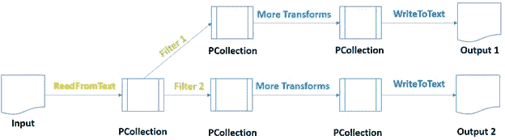

来源:图片由作者提供

以下是管道分支结构的实现示例流程。

```
import apache_beam as beambranched = beam.Pipeline()input_collection = ( 
branched 
 | “Read from text file” >> beam.io.ReadFromText(‘data.txt’)
 | “Split rows” >> beam.Map(lambda line: line.split(‘,’)))

 backend_dept = (input_collection
 | ‘Retrieve Backend employees’ >> beam.Filter(lambda record: record[3] == ‘Backend’)
 | ‘Pair them 1–1 for Backend’ >> beam.Map(lambda record: (“Backend, “ +record[1], 1))
 | ‘Aggregation Operations: Grouping & Summing1’ >> beam.CombinePerKey(sum))
 ai_dept = ( input_collection
 |’Retrieve AI employees’ >> beam.Filter(lambda record: record[3] == ‘AI’)
 |’Pair them 1–1 for HR’ >> beam.Map(lambda record: (“AI, “ +record[1], 1))
 |’Aggregation Operations: Grouping & Summing2' >> beam.CombinePerKey(sum))output =(
 (backend_dept , ai_dept)
 | beam.Flatten()
 | beam.io.WriteToText(‘/content/branched.txt’)
 )branched.run()
```

在上面的例子中，第一个 transform 操作在后端部门应用了一个过滤器，Transform B 过滤了 AI 部门的所有雇员。

# 用 Python 生成 ParDo 变换运算

ParDo 可以作为并行处理的转换机制[ [16](https://beam.apache.org/documentation/programming-guide/#applying-transforms) ]。

第一个是`Filtering`，数据集。您可以使用 ParDo 获取 PCollection 中的每个元素，或者将该元素输出到一个新的集合中，或者按照 Beam [ [16](https://beam.apache.org/documentation/programming-guide/#applying-transforms) ]的编程指南中的规定将其丢弃。

第二个是数据集中每个元素的`Formatting`或`Type Converting`。`ParDo`可用于对输入 PCollection [ [17](https://cloud.google.com/dataflow/docs/concepts/beam-programming-model) ]上的每个组件进行转换。

第三个是每个项目的`Extracting Individual Parts`。如果存在具有多个字段的元素集合，您可以使用`ParDo`或提取单个项目。

第四个是对 PCollection 的每一项执行`Computations`。我们可以将这个函数应用到 PCollection 的各个方面。

此外，我们可以利用 ParDo 以各种方式分割 PCollection。在下面的脚本中，我们使用了`Map`、`FlatMap`和`Filter`变换。当您应用一个`ParDo`转换时，您将需要以一个`DoFn`对象的形式提供用户代码。

在内部，`Map`和`FlatMap`也继承了`DoFn`类。为了实现代码中的`ParDo`，用`ParDo`替换`Map`和。“DoFn”类中有许多函数，我们只需覆盖其中的一部分，即流程函数。

```
import apache_beam as beam
 class EditingRows(beam.DoFn):

def process(self, element):
 return [element.split(‘,’)]

class Filtering(beam.DoFn):

def process(self, element):
 if element[3] == ‘Finance’:
 return [element] 

class Matching(beam.DoFn):

def process(self, element):
 return [(element[3]+”,”+element[1], 1)] 

class Summing(beam.DoFn):

def process(self, element):
 (key, values) = element 
 return [(key, sum(values))]

pardo = beam.Pipeline()
 department_operations= (pardo
 |beam.io.ReadFromText(‘data.txt’)
 |beam.ParDo(EditingRows())
 |beam.ParDo(Filtering())
 |beam.ParDo(Matching())
 |’Grouping’ >> beam.GroupByKey()
 |’Summing’ >> beam.ParDo(Summing()) 
 |beam.io.WriteToText(‘data/output_pardo.txt’) )
 pardo.run()
```

# 合成变换操作的生成

`CompositeTransform`顾名思义是一个内部有一系列内置转换的转换。

在管道中使用复合转换可以使您的代码更加模块化，更容易理解。在复合转换中，我们将多个转换组合成一个单元。为此，我们将创建一个类`CompositeTransform`，和 Beam 中的每个其他类一样，它应该继承其对应的基类。

```
import apache_beam as beam

class CompositeTransform(beam.PTransform):

def expand(self, columns):
 x = ( columns |’Grouping & Summing’ >> beam.CombinePerKey(sum)
 |’Filtering’ >> beam.Filter(Filtering))
 return x

def EditingRows(element):
 return element.split(‘,’)
 def Filtering(element):
 name, count = element
 if count > 30:
 return element
 composite = beam.Pipeline()
 input_data = ( composite 
 | “Reading Data” >> beam.io.ReadFromText(‘data.txt’)
 | “Editing Rows” >> beam.Map(EditingRows))frontend_count = (input_data
 | ‘Get Frontend Employees’ >> beam.Filter(lambda record: record[3] == ‘Frontend’)
 | ‘Matching one-to-one’ >> beam.Map(lambda record: (“Frontend, “ +record[1], 1))
 | ‘Composite Frontend’ >> MyTransform()
 | ‘Write to Text’ >> beam.io.WriteToText(‘/content/composite_frontend.txt’))

 ai_count = (input_data
 | ‘Get AI Employees’ >> beam.Filter(lambda record: record[3] == ‘AI’)
 | ‘Pairing one-to-one’ >> beam.Map(lambda record: (“AI, “ +record[1], 1))
 | ‘Composite AI’ >> MyTransform()
 | ‘Write to Text for AI’ >> beam.io.WriteToText(‘/content/composite_ai.txt’))composite.run()
```

为了创建复合变换，我们可以使用函数“Beam.PTransform”。这个 PTransform 是我们使用的每个 PTransform 的基类。PTransform 有一个需要重写的扩展方法。此方法将一个 PCollection 作为输入，将对其应用几个转换。要在我们的管道中使用这个转换，只需用它的惟一标签调用它的对象。

# 侧面输入和侧面输出

顾名思义，`side input`是可以贡献给`DoFn`对象的额外信息。除了输入“PCollection”之外，您还可以以侧面输入[ [19](https://beam.apache.org/documentation/patterns/side-inputs/) ]的形式将附加信息引入到`ParDo`或其子转换中，如`Map`、`FlatMap`。

让我们为侧面输入实现一个示例脚本。我们可以将侧面输入移动到`ParDo`转换。

```
import apache_beam as beam

side_inputs = list()

with open (‘id_list.txt’,’r’) as my_file:
 for line in my_file:
 side_inputs.append(line.rstrip())
 sideInput = beam.Pipeline()

class Filtering(beam.DoFn):def process(self, element, side_inputs, lower, upper=float(‘inf’)):
 id = element.split(‘,’)[0]
 name = element.split(‘,’)[1]
 items = element.split(‘,’)
 if (lower <= len(name) <= upper) and id not in side_inputs:
 return [items]

small_names =( sideInput
 |”Reading Data” >> beam.io.ReadFromText(‘data.txt’)
 |”Side inputs & ParDo” >> beam.ParDo(Filtering(), side_inputs,3,10) 
 |beam.Filter(lambda record: record[3] == ‘Frontend’)
 |beam.Map(lambda record: (record[0]+ “ “ + record[1], 1))
 |beam.CombinePerKey(sum)
 |’Write to Text’ >> beam.io.WriteToText(‘/content/side_inputs.txt’))

sideInput.run()
```

# 在 Apache Beam 中实现 windows

Beam 中的窗口可以说是其数据处理理念中的一个关键元素。窗口逻辑是任何流处理环境的关键概念。没有它，处理实时数据几乎是不可能的。

流式传输中有两种时间概念。这些是事件时间和处理时间。这些时间在处理过程中起着至关重要的作用，因为它们决定了窗口中要处理的数据。

`event time`可以表示为特定事件的时间。这个时间嵌入在记录中。所有生成和发送事件的源都嵌入了带有值的时间戳。

`processing time`可以描述为特定事件开始被处理时的处理时间。它是指执行相应操作的机器的系统时间。通过网络将信息发送到服务器需要一些时间，甚至是几毫秒或几秒钟。

## 翻滚的窗户

`tumbling window`的意思是一旦创建了一个窗口，窗口将继续处理数据，直到特定的时间过去。用户必须在创建窗口时分配该时间。一旦给定了指定的时间量，窗口将发出直到该时间的计算结果。

```
import apache_beam as beam

fixed_window = beam.Pipeline()

content = ( fixed_window
 |beam.Create({‘dict1’:[24,45,68],’dict2':[32,54,75],‘dict3’:[56,78,92]})
 |beam.Map(lambda element: element)
 |beam.WindowInto(window.FixedWindows(20))
 |beam.io.WriteToText(‘/content/output_1’)
)

fixed_window.run()
```

## 推拉窗

创建一个`sliding window`的基本原理类似于一个`tumbling window.`，一旦完成，窗口将继续执行数据，直到一段特定的时间过去；然而，这是一个不同之处，因为滑动窗口可以重叠。单个窗口可能会与另一个窗口的时间重叠。为此，多个窗口有可能重叠。最终，数据中的大多数元素将属于多个窗口。

```
import apache_beam as beam

sliding_window = beam.Pipeline()

content = ( sliding_window
 |beam.Create({‘dict1’:[24,45,68],’dict2':[32,54,75],‘dict3’:[56,78,92]})
 |beam.Map(lambda element: element)
 |beam.WindowInto(window.SlidingWindows(30,10))
 |beam.io.WriteToText(‘/content/output_2’)
 )

sliding_window.run()
```

## 水印

可以在事件时间戳上处理窗口。为了让 Beam 跟踪事件时间，会有一个额外的操作与之对应。如果我们用声明的时间定义一个窗口，那么应该有一些实体可以跟踪已经过去的指定数量的时间戳元素。测量事件时间进度的波束机制称为水印。水印声明流中已经过了指定的事件时间量。当前窗口不会接受时间戳小于当前水印值的任何元素。

# 用编码器进行编码操作

本节重点介绍 Beam 的数据编码机制。因此，您应该理解有两种数据模式。第一种是面向对象的，用户可以理解。另一种是机器可以理解的字节形式的序列化数据。

## Beam 中的编码器类别

在每个生态系统中，对象数据在通过网络传输时被序列化为字节串。对于目标机器，它们被反序列化为对象形式。在 Beam 中，当运行者执行您的管道时，他们需要具体化您的 PCollections 的中间数据，这需要将组件从字节格式转换为字符串。

编码人员不一定与数据类型有一对一的关系。一种数据类型可以有多个编码器。

## 波束中的数据编码

创建定制编码器的最重要的步骤在下面作为一个例子来实现。

```
import parquet
from apache_beam.coders import Coder
from apache_beam.transforms.userstate import ReadModifyWriteStateSpec

class ParquetCoder(Coder):
def encode(self, item):
 return parquet.dumps(item).encode()

def decode(self, item):
 return parquet.loads(item.decode())

def is_deterministic(self) -> bool:
 return Trueclass EncodeDecode(beam.DoFn):
 data_source = ReadModifyWriteStateSpec(name=’data_source’, coder=ParquetCoder())

def execute(self, item, DataSource=beam.DoFn.StateParam(data_source)):return DataSource
```

第一种方法是`Encode`。它接受输入值并将它们编码成字节串。

第二种方法是`Decode`，它将编码后的字节串解码成相应的对象。

第三种方法是`is_deterministic`。它决定该编码器是否按照 Beam [ [21](https://beam.apache.org/releases/pydoc/2.5.0/_modules/apache_beam/coders/coders.html) ]文档中的规定对值进行确定性编码。

# 阿帕奇光束触发器

Apache Beam 触发器提示窗口发出结果。如[ [22](https://beam.apache.org/releases/javadoc/2.6.0/org/apache/beam/sdk/transforms/windowing/Window.html) 和[ [23](https://beam.apache.org/releases/javadoc/2.5.0/org/apache/beam/sdk/transforms/windowing/Trigger.html) 所述，在对窗口结构中的元素进行分组的情况下，Beam 受益于触发器来决定何时转换每个窗口的聚合结果。即使你没有指定，每个窗口都有一个“默认触发器”。

您可以为您的窗口设置触发器来更改此默认行为。Beam 提供了几个预置的触发器供您选择。除此之外，您还可以创建自定义触发器。根据触发类型，您的窗口可以在水印穿过您的窗口之前发出早期结果，也可以在任何后期元素到达时发出后期效果。

## 事件时间触发器

`EventTimeTrigger`表现为`AfterMarkTrigger`。这些是传输窗口内容的默认触发器。当缺省窗口设置和缺省触发器一起使用时，缺省触发器精确地发出一次，并且后期数据被丢弃[ [24](https://beam.apache.org/releases/javadoc/2.5.0/org/apache/beam/sdk/transforms/windowing/AfterWatermark.html) ]。

```
import apache_beam as beam
from apache_beam import window
from apache_beam.options.pipeline_options import PipelineOptions, StandardOptions
from apache_beam.transforms.trigger import AfterWatermark, AfterProcessingTime, AccumulationMode, AfterCount

after_watermark_trigger = beam.Pipeline()

content = ( after_watermark_trigger
 |beam.Create({‘dict1’:[24,45,68],’dict2':[32,54,75], ‘dict3’:[56,78,92]})
 |beam.Map(lambda element: element)
 |beam.WindowInto(window.FixedWindows(20), 
trigger=AfterWatermark(
early=AfterProcessingTime(5),
late=AfterCount(5)),
accumulation_mode=AccumulationMode.DISCARDING)
 |beam.io.WriteToText(‘/content/after_watermark_trigger.txt’)
)

after_watermark_trigger.run()
```

## 处理时间触发器

第二个是`ProcessingTimeTrigger`俗称`AfterProcessingTime` [ [25](https://beam.apache.org/releases/javadoc/2.1.0/org/apache/beam/sdk/transforms/windowing/AfterProcessingTime.html) 。顾名思义，这个触发器在处理时间上运行。经过一定的处理时间后，触发器会提示窗口发出结果。执行时间受到系统日期的限制，最好是数据项的时间戳。此触发器有助于从窗口中触发早期结果，尤其是具有重要时间范围的窗口，如单个全局窗口。

```
import apache_beam as beam
from apache_beam import window
from apache_beam.options.pipeline_options import PipelineOptions, StandardOptions
from apache_beam.transforms.trigger import AfterWatermark, AfterProcessingTime, AccumulationMode, AfterCount

after_processing_time_trigger = beam.Pipeline()

content = ( after_processing_time_trigger
 |beam.Create({‘dict1’:[24,45,68],’dict2':[32,54,75], ‘dict3’:[56,78,92]})
 |beam.Map(lambda element: element)
 |beam.WindowInto(window.FixedWindows(20), trigger=AfterProcessingTime(10), accumulation_mode=AccumulationMode.DISCARDING) |beam.io.WriteToText(‘/content/after_processing_time_trigger.txt’))

after_processing_time_trigger.run()
```

## 数据驱动触发器

第三个是`DataDrivenTrigger`，名字叫`AfterCount`。它在现有窗口收集了至少 N 个元素后运行。如果用“N = 5”指定计数触发器，当窗口的窗格中有五个功能时，它将提示窗口再次发出结果。

```
import apache_beam as beam
from apache_beam import window
from apache_beam.options.pipeline_options import PipelineOptions, StandardOptions
from apache_beam.transforms.trigger import AfterWatermark, AfterProcessingTime, AccumulationMode, AfterCount

after_count_trigger = beam.Pipeline()

content = ( after_count_trigger
 |beam.Create({‘dict1’:[24,45,68],’dict2':[32,54,75], ‘dict3’:[56,78,92]})
 |beam.Map(lambda element: element)
 |beam.WindowInto(window.GlobalWindows(), trigger=AfterCount(5), accumulation_mode=AccumulationMode.DISCARDING)
 |beam.io.WriteToText(‘/content/after_count_trigger.txt’)
 )

after_count_trigger.run()
```

## 复合触发器

复合触发器是多个触发器的组合。它允许用谓词合并不同类型的触发器。它们允许同时使用多个触发器。光束包括以下类型[ [26](https://beam.apache.org/releases/javadoc/2.5.0/org/apache/beam/sdk/transforms/windowing/AfterEach.html) ]。

第一个是`Repeatedly`。该条件指定一个运行到无穷大的触发器。建议将`Repeatedly`与其他一些可能导致该重复触发停止的条件结合使用。下面添加了一个示例代码片段。

```
import apache_beam as beam
from apache_beam import window
from apache_beam.options.pipeline_options import PipelineOptions, StandardOptions
from apache_beam.transforms.trigger import AfterWatermark, AfterProcessingTime, AccumulationMode, AfterAny, Repeatedly

composite_repeatedly = beam.Pipeline()

content = ( composite_repeatedly
 | beam.Create({‘dict1’:[24,45,68],‘dict2’:[32,54,75], ‘dict3’:[56,78,92]})
 | beam.Map(lambda element: element)
 |beam.WindowInto(window.FixedWindows(20), trigger=Repeatedly(AfterAny(AfterCount(50), AfterProcessingTime(20))),
 accumulation_mode=AccumulationMode.DISCARDING)
 | beam.io.WriteToText(‘/content/composite_repeatedly’))

composite_repeatedly.run()
```

第二个是`AfterEach`。这种状态将多个触发器组合在一起，以特定的顺序一个接一个地触发。每当触发器发出一个窗口，过程就前进到下一个窗口。

第三个是`AfterFirst`。它使用多个触发器作为参数。当它的任何参数触发器被满足时，它处理窗口发出结果。它类似于多个触发器的“或”运算。

第四个是`AfterAll`。它保存多个触发器作为参数，并使窗口在其所有参数触发器都满足时发出结果。对于许多触发器来说，它相当于“与”运算。

第五个是`Finally`。它作为最终条件，使任何触发器最后一次触发，并且不再触发。

# Beam 中流式数据管道的结构

Beam 的核心思想是提供整合的大数据处理管道。正如其官方文档[ [6](https://beam.apache.org/documentation/programming-guide/) ]中所述，其和谐的本质用单个 API 构建了批处理和流管道。

当您创建您的`Pipeline`时，您还可以设置一些与之相关的配置选项，比如管道运行器，它将执行您的管道，以及所选择的运行器所需的任何运行器特定的配置。

您可以考虑通过硬编码来分配管道的配置参数。尽管如此，通常建议从命令行读取它们，然后将其传递给`Pipeline`对象。出于这个原因，如果我们可以构建一个从命令行获取运行器信息、输入输出文件路径信息的管道，那么我们的问题就解决了，我们可以说我们将获得一个通用管道。

```
import apache_beam as beam
import argparse
from apache_beam.options.pipeline_options import PipelineOptions, StandardOptions

parser = argparse.ArgumentParser() 

parser.add_argument(‘ — input’, dest=’input’, required=True, help=’/content/data.txt/’)parser.add_argument(‘ — output’, dest=’input’, required=True, help=’/content/output.txt/’)

path_args, pipeline_args = parser.parse_known_args() 

input_arguments = path_args.input 
output_arguments = path_args.output 

options = PipelineOptions(pipeline_args)
pipeline_with_options = beam.Pipeline(options = options)

dept_count = (pipeline_with_options
 |beam.io.ReadFromText(input_arguments)
 |beam.Map(lambda line: line.split(‘,’))
 |beam.Filter(lambda line: line[3] == ‘AI’) 
 |beam.Map(lambda line: (line[1], 1))
 |beam.io.WriteToText(output_arguments)
)

pipeline_with_options.run()
```

# 部署数据管道

Beam 将通过 Google PubSub 提供流媒体数据。为了在 Google PubSub 中处理流数据，我们需要创建一个项目，并获得它的“服务 _ 账户 _ 认证”密钥[ [27](https://cloud.google.com/dataflow/docs/concepts/streaming-with-cloud-pubsub) ]。

## 在 Google PubSub 中创建主题

首先，我们需要点击[https://cloud.google.com/](https://cloud.google.com/)主页右上角的按钮进入“控制台”。


来源:图片由作者提供

第二，谷歌云控制台将帮助你创建一个新项目。启动此项目可能需要几秒钟时间。创建项目后，您可以在“项目信息”部分查看“项目名称”。

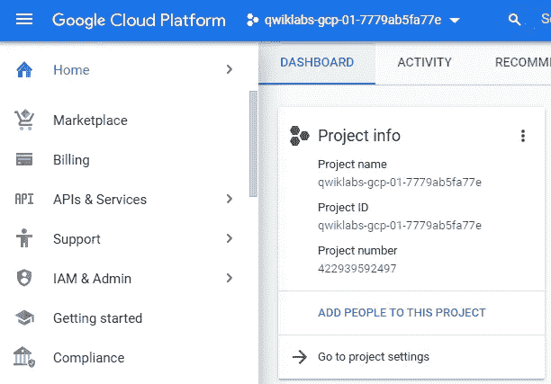

来源:图片由作者提供

要获得其“服务身份验证密钥”,我们需要转到“IAM & Admin”部分下的服务帐户。

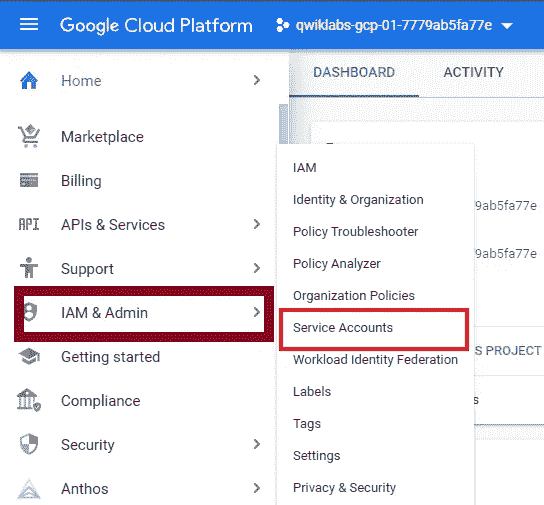

来源:图片由作者提供

填写完必填字段后，我们可以点击“创建并继续”。

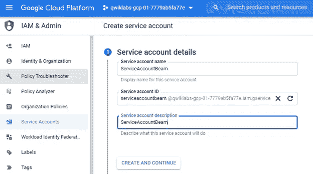

来源:图片由作者提供

或者，您可以在该身份验证密钥中授予您想要的权限。从选项中，继续“项目>编辑器”。


来源:图片由作者提供

您可以通过单击“完成”按钮来完成初始化部分。


来源:图片由作者提供

要创建一个`. json '格式的密钥，您可以单击“密钥”选项卡，然后选择“添加密钥”下的“创建新密钥”。

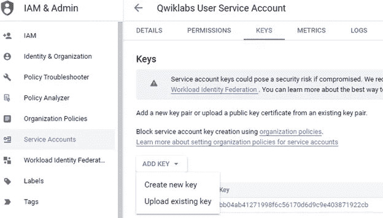

来源:图片由作者提供

这是我们希望为服务帐户生成的密钥。下载并保存在一个非常安全的地方。任何拥有此密钥的人都可以查看您的项目。

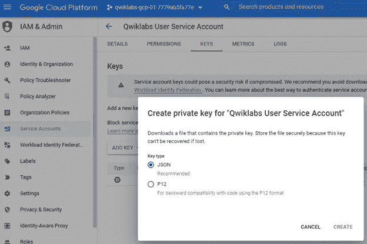

来源:图片由作者提供

您将需要一个出版商、一个主题和一个订阅。发布者将发布关于某个主题的消息。为此，我们将使用“PubSub”。

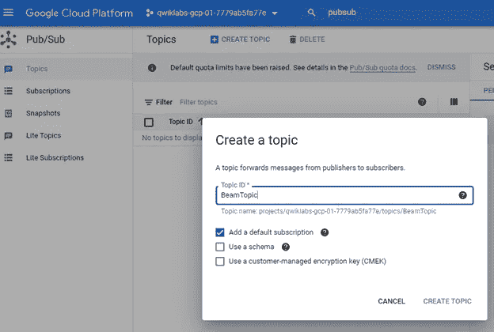

来源:图片由作者提供

我们已经创建了主题。一些统计数据是“发布消息请求计数”和“发布消息操作计数”。我们将在 publisher 脚本中使用这个主题路径。


来源:图片由作者提供

您需要通过将订阅名称和“交付类型”填写为“拉”来创建订阅主题。

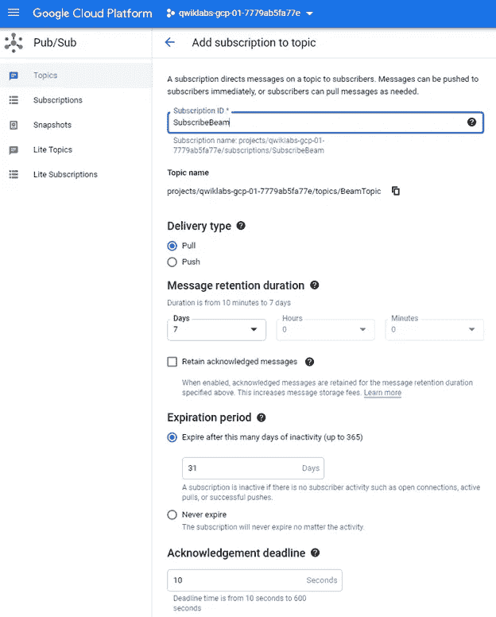

来源:图片由作者提供

在创建了主题和订阅之后，我们可以查看统计图表，该图表没有显示任何内容，因为我们还没有发布任何消息。

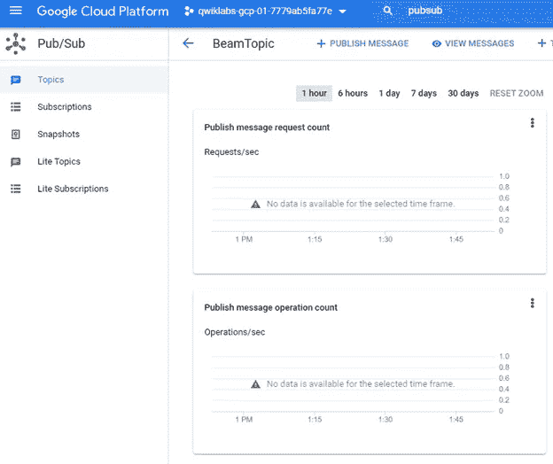

来源:图片由作者提供

假设您希望通过使用接口本身来发布消息。您可以点击“发布消息”并提供可选的消息属性作为键值对。这些属性用于发送有关消息的附加信息。对于“添加属性”,您可以添加“语言”作为关键字，添加“英语”作为其值。

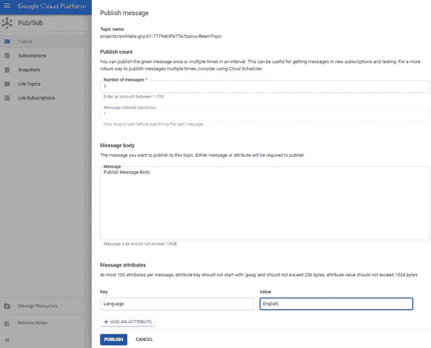

来源:图片由作者提供

消息已发布，我们可以手动提取此消息，因为没有正在运行的订阅者。您可以选择您想要“拉”它的订阅。您可以选中“启用确认”按钮，在收到确认后发送确认。

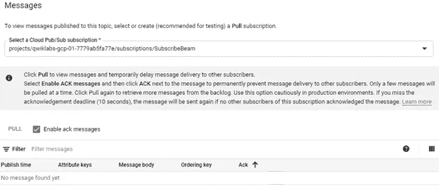

来源:图片由作者提供

然后，您可以点击“拉”。除了查看消息的属性之外，您还可以查看消息。我们可以观察到该消息已被确认。

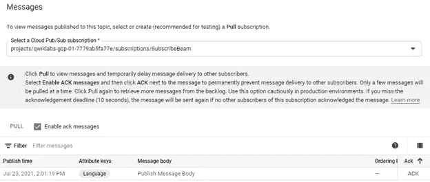

来源:图片由作者提供

整个活动中包括一些连接器，用于将客户的提供者连接到我们的发布者应用程序。这种方法在一些现实场景中使用，在这些场景中，他们希望我们逐行读取文件并进行处理，而不是对文件进行批处理。

创建的 PubSub 主题可以像下面这样在脚本中定义来使用它。您可以用您的特定路径替换引用的字符串。应该填写这些路径，以便在 Google Cloud 的指南页面[ [28](https://cloud.google.com/pubsub/docs/publisher) ]中提到的正确主题上发布消息。

```
import os
 from google.cloud import pubsub_v1

 project = ‘SubscribeBeam’

 topic_for_pubsub = ‘projects/qwiklabs-gcp-01–7779ab5fa77e/topics/BeamTopic’

 service_account_path = “C:\\Users\ersoyp\Documents\ApacheBeam\qwiklabs-gcp-01–7779ab5fa77e-2d40f7ded2a8.json”
 os.environ[“GOOGLE_APPLICATION_CREDENTIALS”] = service_account_path 

 data_path = “C:\\Users\ersoyp\Documents\ApacheBeam\data.csv”
```

## 用 GCP 处理数据管道

在上一节中，我们定义了 PubSub 主题和相关的“service_account_path”信息。在接下来的步骤中，我们将使用 PubSub 凭证通过 Beam 读写数据。我们一起来实施吧。

以下脚本定义了发布订阅主题路径、服务帐户路径、输入和输出文件路径。此外，我们添加了“GOOGLE_APPLICATION_CREDENTIALS”作为环境变量。在分配了这些路径之后，我们初始化了将要处理的射束管道。在输入和输出路径的帮助下，我们很容易从 Google Cloud PubSub 中读取数据，然后将结果写回给它。

```
import osimport os
import apache_beam as beam
from apache_beam.options.pipeline_options import PipelineOptions, StandardOptions
from apache_beam import window
project = ‘SubscribeBeam’

pubsub_topic = ‘projects/qwiklabs-gcp-01–7779ab5fa77e/topics/BeamTopic’

path_service_account = “C:\\Users\ersoyp\Documents\ApacheBeam\qwiklabs-gcp-01–7779ab5fa77e-2d40f7ded2a8.json”

os.environ[“GOOGLE_APPLICATION_CREDENTIALS”] = path_service_account 

input_file = “C:\\Users\ersoyp\Documents\ApacheBeam\data.csv”

output_file = ‘C:\\Users\ersoyp\Documents\ApacheBeam\output.csv’

options = PipelineOptions()

options.view_as(StandardOptions).streaming = True

process = beam.Pipeline(options=options)

output_file = ‘/content/outputs/’

pubsub_data = ( process
 |’Read from Google PubSub’ >> beam.io.ReadFromPubSub(subscription= input_file)
 |’Write to Google PubSub’ >> beam.io.WriteToPubSub(output_file))

final_file = process.run()
```

## 向 GCP 订购数据管道

作为部署数据管道的最后一步，我们需要用 PubSub 创建一个“SubscriberClient”对象。订阅服务器初始化后，将被分配到相应的订阅路径。您可以使用下面的脚本查看实现。

脚本首先将“GOOGLE_APPLICATION_CREDENTIALS”指定为操作系统中的一个环境变量。分配的路径包括从 GCP IAM & Admin 界面生成的服务帐户密钥。之后，我们在“args”的帮助下创建一个订阅路径。然后，我们用 GCP 公共订阅创建一个 SubcriberClient。最后，我们将构建的订阅路径分配给 GCP 的订阅者。

```
from google.cloud import pubsub_v1
import time
import os

os.environ[“GOOGLE_APPLICATION_CREDENTIALS”] = ‘C:\\Users\ersoyp\Documents\ApacheBeam\qwiklabs-gcp-01–7779ab5fa77e-2d40f7ded2a8.json’

path_for_subcription = args.subscription_path

pubsub_subscriber = pubsub_v1.SubscriberClient()

pubsub_subscriber.subscribe(path_for_subcription, callback=callback)
```

# 监控数据管道

在上面的章节中，我们在 Google Cloud PubSub 的帮助下发布、处理和订阅了带有示例脚本的数据管道。由于我们使用了 GCP，我们可以使用谷歌云监控工具跟踪监控活动。

为此，我们可以通过使用此窗格选择监控来查看“概述”、“仪表板”、“服务”和“指标浏览器”。


来源:图片由作者提供

我们创建的任何指标都将添加到“指标浏览器”选项卡下。我们可以选择“资源类型”和“指标”来过滤出正确的数据。此外，我们可以使用“Group by”和“Aggregator”的聚合操作和“Alignment period”。


来源:图片由作者提供

# 阿帕奇光束 vs 阿帕奇火花

阿帕奇梁生产各种环境下的管道。它只是分布式数据的另一种编程模型。与 Apache Spark 一样，Apache Beam 有 RDD 或数据帧来执行批处理，还有数据流来进行流处理。Beam 用 [Java](https://www.java.com/download/) 、 [Python](https://www.python.org/) 和 [Go](https://golang.org/) 语言实现。

另一方面，Apache Spark 是一个用于海量数据处理的综合引擎。它是在 2012 年开发的，最初只是为批处理而设计的。Spark 将流分成几个小批量，并处理这些小批量。

如果我们保持小批量，就好像我们在执行实时流数据。这就是为什么 Spark 被认为接近实时流处理引擎，而不是有效的流处理引擎。Spark 是用 Scala 语言实现的。也兼容 Spark 官方页面[ [29](https://spark.apache.org/docs/latest/streaming-programming-guide.html) ]中描述的 [Hadoop](https://hadoop.apache.org/) 平台。

# 最后的想法

在整篇文章中，在最初描述概念和用示例脚本实现解决方案的结构中呈现了广泛的主题。主题包括介绍 Apache Beam，然后在 Beam 中构建管道。标题包括但不限于:

*   Apache Beam 的体系结构
*   阿帕奇波束的特点
*   阿帕奇梁的管道结构
*   帕尔多变换
*   复合转换
*   侧面输入和侧面输出
*   在 Apache Beam 中实现 Windows
*   用编码器进行编码操作
*   阿帕奇光束触发器
*   流式数据管道的结构
*   部署数据管道
*   监控数据管道
*   阿帕奇光束 vs 阿帕奇火花

非常感谢您的提问和评论！

# 附加参考

*   阿帕奇光束:[https://beam.apache.org/documentation/](https://beam.apache.org/documentation/)
*   Apache Beam Pipeline:[https://Beam . Apache . org/documentation/pipelines/design-your-Pipeline/](https://beam.apache.org/documentation/pipelines/design-your-pipeline/)
*   阿帕奇火花:【https://spark.apache.org/documentation.html】的[，](https://spark.apache.org/documentation.html)[的 https://beam.apache.org/documentation/runners/spark/](https://beam.apache.org/documentation/runners/spark/)
*   阿帕奇弗林克:[https://ci.apache.org/projects/flink/flink-docs-master/](https://ci.apache.org/projects/flink/flink-docs-master/)
*   阿帕奇萨姆扎:[http://samza.apache.org/startup/quick-start/1.6.0/beam.html](http://samza.apache.org/startup/quick-start/1.6.0/beam.html)
*   谷歌云数据流:[https://Cloud . Google . com/data flow/docs/concepts/beam-programming-model](https://cloud.google.com/dataflow/docs/concepts/beam-programming-model)
*   大数据描述:[https://www . SAS . com/en _ us/insights/big-Data/what-is-big-Data . html](https://www.sas.com/en_us/insights/big-data/what-is-big-data.html)
*   Apache Beam |构建大数据管道的实践课程:[https://www . udemy . com/course/Apache-Beam-A-Hands-On-course-build-Big-data-Pipelines/](https://www.udemy.com/course/apache-beam-a-hands-on-course-to-build-big-data-pipelines/)
*   窗口累加模式，[https://beam . Apache . org/documentation/programming-guide/# triggers](https://beam.apache.org/documentation/programming-guide/#triggers)
*   谷歌云控制台，[https://console.cloud.google.com](https://console.cloud.google.com)