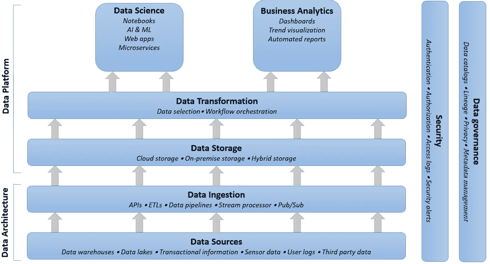

# 数据平台—将数据从您的传统系统中解放出来

> 原文：<https://towardsdatascience.com/data-platforms-liberate-data-from-your-legacy-systems-669b643e3124?source=collection_archive---------10----------------------->

## 数据分析的潜力经常被分散在公司各处的古老而多样的遗留系统所阻碍。然而，数据和运营不需要永远纠缠在一起。

米切尔·伦辛克在 [Unsplash](https://unsplash.com?utm_source=medium&utm_medium=referral) 上拍摄的照片

# 数据驱动的决策——销售宣传

数据从根本上改变了企业的运营方式，这种说法并不新鲜。无论是高频传感器数据、实时股票市场价格还是详细的用户日志，我们都以历史上前所未有的规模跟踪、收集和存储数据。原因是:这些大量的数据隐藏了价值。**数据驱动的决策**不仅仅是一个时髦词——高质量的数据真正允许采取有证据支持的行动，推动业务向前发展。

数据分析的发展一个接一个，速度惊人。我们将只存储*更多的*数据；更高的频率，更丰富的记录，更多的来源。不仅数据量增加，我们还在不断寻找新的方法来使用它。复杂的分析工具如雨后春笋般涌现，新的模式不断衍生，我们发现了以前从未想到的数据集之间的联系。要了解数据分析领域有多热闹，只需查看每天的媒体文章。

马库斯·斯皮斯克在 [Unsplash](https://unsplash.com?utm_source=medium&utm_medium=referral) 上拍摄的照片

# 数据驱动的决策——现实

不幸的是，公司系统的发展速度非常不同。晦涩的编程语言和工具——几年甚至几十年前的——分散在团队和部门中。这些所谓的**遗留系统**很难升级，对于那些没有直接参与的人来说几乎不可能访问。我们可能在谈论数百甚至数千个应用程序。这样一系列系统不可能在一夜之间重新设计和现代化；这是一项浩大的工程，可能需要数年时间。

因此，大多数公司在他们想要做的和他们能够做的之间有很大的不匹配。这些数据可能会在公司的某个地方找到，但只对那些意识到这一点并碰巧熟悉系统的少数幸运者开放。这就是所谓的**筒仓结构**——当身处不同的公司筒仓时，从另一个筒仓获取见解是一个缓慢而痛苦的过程。

那么，我们如何在数据分析的革命性世界中导航，同时维护(或许逐步更新)我们的核心遗留系统呢？概念性的解决方案既简单又出色:简单地将数据层从 it 系统中分离出来。通过这种方式，我们可以利用大数据和高级分析的潜力，而不会彻底根除日常业务。这个我们数据的新家叫做**数据平台**。

# 什么是数据平台？

一个不同的平台。[华纳](https://unsplash.com/@warnerl?utm_source=medium&utm_medium=referral)在 [Unsplash](https://unsplash.com?utm_source=medium&utm_medium=referral) 拍摄的照片

Splunk 给出了数据平台的全面定义:

> “数据平台是一个完整的解决方案，用于接收、处理、分析和呈现由现代数字组织的系统、流程和基础设施生成的数据。”

正如所见，它不仅仅是一个保存公司所有原始数据的巨大数据湖。不，它是一个自己的生态系统，一个包含从应用程序检索数据到呈现给最终用户的一切的平台。

出于可伸缩性和弹性的考虑，这样的数据平台很可能位于云中，而不是内部。**云服务**设置简单，存储相对便宜，工具不断更新，服务往往可以采用现收现付的模式。为了利用未来几年的发展，建立适应变化的能力，并灵活地应对新的机遇，云可能是一条出路。

## 好处

数据平台的潜在优势非常丰富:

*   来自各种(分离的)系统和来源的数据可以汇集在一起。
*   不断从不灵活的遗留系统中检索最新信息。
*   最终用户处于控制之中。无论是数据科学家还是业务经理，您都可以使用您想要的工具来获得您想要的洞察力。
*   IT 部门不再是检索某些数据的瓶颈。不再有抽奖票，不再依赖 IT 设置的优先级。
*   可以将内部 IT 人才部署到他们能够增加最大价值的地方，而不是手动从旧系统中提取数据。
*   最先进的服务——如新的人工智能技术和[数字双胞胎](/need-help-making-decisions-ask-your-digital-twin-6e4cf328cb0)——可以在不需要与现有遗留系统集成的情况下进行部署。
*   未来的数据源可以连接到平台。一个设计良好的数据平台甚至可以处理合并和收购。
*   平台为未来的数据需求做准备。大数据带来了必须应对的挑战，如[速度、多样性、数量和准确性](https://medium.com/codex/ibms-introduction-to-data-science-in-10-minutes-2a684f1828d5)。

总之，数据平台使每个公司利益相关者能够随时随地访问和处理与决策相关的所有数据。只有这样，才能实现真正的**数据驱动型企业**。

## 怎么做？

照片由[弗兰·雅克耶](https://unsplash.com/@fran_?utm_source=medium&utm_medium=referral)在 [Unsplash](https://unsplash.com?utm_source=medium&utm_medium=referral) 上拍摄

正如您可能已经从其功能中推测的那样，建立一个数据平台并不是简单地安装一个软件包就能神奇地从公司系统中抓取所有数据的事情。BCG 声称——与改造遗留系统相比——建立一个数据平台只需一半的时间**和一半的成本 T10。提醒你；这仍然是一个很大的操作。**

该平台可以被视为工具和数据操作的集合，它们的结合为真正的数据驱动型企业奠定了基础。当然，这样的设计需要认真思考数据策略和清晰的路线图。

要列出构建数据平台所需的所有东西可能会太长，但下面是常见构建模块的概述和相应工具的示例:

*   **数据摄取工具**:数据必须从各种来源收集，具有不同的数量、格式和频率。无论是传感器数据、用户日志还是第三方数据库，都必须以某种方式获取。*(阿帕奇气流，歌手)*
*   **数据存储**:存储传统上是数据仓库*的领域，提供结构化但不灵活的数据表示。相比之下，数据湖*存储各种各样的非结构化数据。数据平台可能需要介于两者之间的东西(新兴数据 *lakehouse* )，在尽可能保留结构的同时处理各种数据。*(红移、亚马逊 S3、谷歌云存储)*
*   数据转换:当使用传统的数据库仓库时，转换归结为选择正确格式的正确数据。对于更奇特的数据，可能需要编排应用程序。 *(dbt，阿帕奇气流)*
*   **商业智能**:在管理和执行层面，平台应报告相关见解，可视化关键绩效指标和项目趋势。仪表板通常用于这些目的。*(力量匕，画面)*
*   **数据科学**:为了从数据中获得非预定义的洞察力，可以部署定制脚本和测试。然而，如今的云平台也托管了许多分析工具。 *(Python，R，Amazon Sagemaker)*

这些模块仅仅涵盖了平台的功能方面。还有其他需要注意的构建模块和主题，例如:

*   安全性:将所有公司数据捆绑在一个平台上自然会带来相当大的风险。在整个架构中，保持高标准的安全性至关重要。 *(IBM 安全卫士)*
*   **数据治理**:为了在系统中建立信任，所有的数据(以及执行的转换)都应该可以追溯到其源头。职责、隐私和数据编目等方面应该设计得很好。*(阿帕奇图集)*

一句话:数据平台不是一个可以尝试的噱头——建立一个数据平台是一项战略承诺，可以将数据转化为一项独立的公司资产。

数据平台和底层架构的概念布局[图片由作者提供]

## 值得吗？

数据分析不再是*唾手可得的东西* —明智决策的力量对于保持长期竞争力至关重要。在可预见的未来，数据可用性和分析将继续以比系统本身更快的速度增长。记住遗留系统的主要目的不是生成数据；它们是安排员工、处理交易、处理客户订单的系统。这些系统构成了公司的电子心脏。尽管如此，数据分析也不应该再被 90 年代的 VBA 脚本所束缚。只有一个解决方案——将数据从传统的笼子中解放出来。

# 外卖食品

*   数据平台将数据从操作系统中分离出来。它创建了一个单独的层，明确地将数据视为公司资产。
*   易于访问的实时数据对于成功的分析至关重要。最终用户需要能够基于相关信息做出数据驱动的决策，不受不灵活的遗留系统和孤岛结构的阻碍。
*   数据分析的发展远远超过内部系统的变化。构建独立的数据层利用了分析技术的进步，同时保留了运营系统的工作。
*   数据平台是一项长期的战略承诺。在前进之前，应该对业务一致性和平台架构进行充分的思考。

喜欢这篇文章吗？您可能还喜欢以下内容，在数字孪生环境中利用数据平台:

 [## 需要帮助做决定吗？问问你的数字双胞胎吧！

### 将实时数据与模拟、机器学习和人类推理相结合，以提升决策水平。

towardsdatascience.com](/need-help-making-decisions-ask-your-digital-twin-6e4cf328cb0) 

# 来源

 [## 数据和数字平台

### 了解更多有关 BCG 的数据和数字平台(DDP)方法如何使用一种方法加速数字化转型的信息…

www.bcg.com](https://www.bcg.com/capabilities/digital-technology-data/digital-platform)  [## 什么是数据平台？

### 构建现代数据平台需要采用现代数据架构(MDA ),它规定了数据将如何…

www.mongodb.com](https://www.mongodb.com/what-is-a-data-platform#:~:text=A%20data%20platform%20is%20an,layer%20for%20users%20and%20applications)  [## 什么是数据平台？初学者指南| Splunk

### Splunk 在 2021 年 Gartner SIEM 魔力象限中被评为领导者阅读报告，了解 Splunk 连续 8 年成为领导者的原因…

www.splunk.com](https://www.splunk.com/en_us/data-insider/what-is-a-data-platform.html)  [## 您需要了解的 31 个大数据平台

### 不清楚什么时候普通的旧“数据”变成了“大数据”，但后一个术语可能起源于 20 世纪 90 年代的硅谷…

builtin.com](https://builtin.com/big-data/big-data-platform)