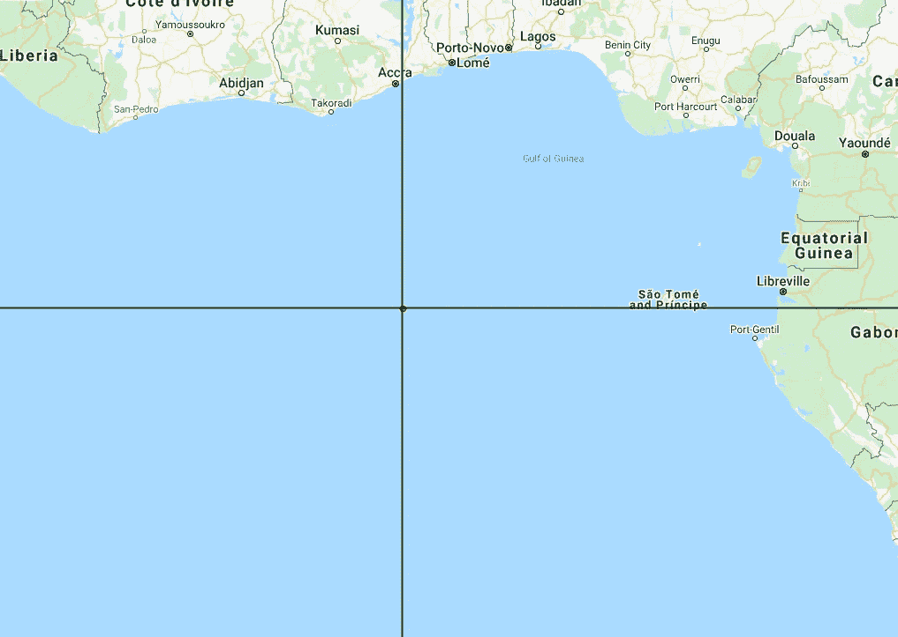

# 地理空间分析的数据准备&用 Python 中的 Laguerre-Voronoi 进行 ML

> 原文：<https://towardsdatascience.com/data-preparation-for-geospatial-analysis-ml-with-laguerre-voronoi-in-python-71b9b418d8b6?source=collection_archive---------30----------------------->

## [实践教程](https://towardsdatascience.com/tagged/hands-on-tutorials)

## 人口和健康调查数据的加权 Voronoi 镶嵌，用于预测社会和经济福祉。

印度 GADM 边界 DHS 数据的拉盖尔-沃罗诺伊镶嵌

在这篇文章中，应用拉盖尔-Vornoi 镶嵌人口和健康调查(DHS)的数据进行了探讨。提出了清理和转换 DHS 数据的管道以及相关的 python 代码。

# 人口和健康调查数据

DHS 调查包含机密信息，这些信息有可能通过独特信息或 [PII](https://en.wikipedia.org/wiki/Personal_data) 来识别个人身份。为了避免这种情况， [DHS 项目](https://dhsprogram.com/)开发了一种方法来降低 GPS 坐标的精确度，这样就无法得到真实的居住地。在所有 DHS 调查中，记录一个聚类中人口居住地点的中心 GPS 坐标，并根据该聚类是*城市*还是*农村*应用单独的退化误差值。随机误差在农村地区最大为 5 公里，在城市地区最大为 2 公里，这将家庭识别的可能性降低了 10 倍。新的坐标列表可以被认为有一个圆形的误差缓冲区(5 公里或 2 公里),实际值位于其中。这种退化对进一步的数据分析和对这些数据的机器学习任务提出了挑战。全面准确地衡量经济福祉是研究和决策的基本投入。[世界资源研究所项目](https://www.solveforgood.org/proj/47/)的最终目标是能够利用遥感和 OpenStreetMaps 数据对印度最精细的空间微区域进行基于人口和健康调查的预测。

# 拉盖尔 Voronoi 图

在 1985 年推出的拉盖尔芙诺以图是平面上的 *n* 个点的芙诺以图概念到平面上的 *n* 个圆的拉盖尔几何概念的扩展。它是将欧几里得平面分割成由一组圆定义的多边形单元，也称为[功率图](https://en.wikipedia.org/wiki/Power_diagram)。本文中使用的图表是从下面的 [GitHub 要点](https://gist.github.com/sunayana/a3a564058e97752f726ca65d56fab529)中生成的。

平面上 32 个点的功率图示例，其中每个点具有不同的半径。

# DHS 数据的拉盖尔 Voronoi 镶嵌

由于 DHS 数据中引入的退化性质，DHS 数据集的 Laguerre Voronoi 镶嵌是一种可行的模型，可用于创建国家地图的多边形分区，以进行进一步的数据分析。以印度为例介绍管道。

**预处理 DHS 数据**

*   请注意，地图上 0 度纬度(赤道)和 0 度经度(本初子午线)的交叉点位于大西洋中部，在西非海岸的几内亚湾。

显示赤道和本初子午线交点的图像

*   因此，来自任何国家特定的 DHS `GeoDataFrame` 的所有条目都可以被丢弃，其纬度和经度条目都为 0.0。

DHSGeographicData 类处理 DHS 数据和成员方法 clean。

*   接下来，使用方法`DHSGeographicData.extract_dhs()`提取对计算拉盖尔-沃罗诺图重要的列。来自地理数据 [IAGE71FL.zip](https://dhsprogram.com/data/dataset/India_Standard-DHS_2015.cfm) 的印度 shapefile `IAGE71FL.shp`用于提取，并获得以下`GeoDataFrame`:

提取步骤后的地理数据框，显示从 IAGE71FL.shp 中提取的列

由提取的地理数据框的几何列表示的纬度和经度点的绘图。

*   然后根据不同的地点是*城市*还是*农村*来分配权重，并使用`DHSGeographicData.get_sites_and_radii()`方法提取地点和权重。

# 生成加权 Voronoi

使用 [Laguerre-Voronoi GitHub 要点](https://gist.github.com/sunayana/a3a564058e97752f726ca65d56fab529)获得加权 Voronoi 镶嵌。

计算 DHS 数据的加权 Voronoi 单元图。

印度 DHS 聚类的加权 Voronoi 镶嵌图

# 将 DHS 数据与 Voronoi 单元相结合

接下来，将 DHS 地理数据框架与 Voronoi 像元相结合，使得 DHS 聚类中的每个点都被精确地分配一个 Voronoi 像元。目标是创建一个新的 ESRI 形状文件，其中的几何图形由 Voronoi 单元组成。成员方法`DHSGeographicData.combine_dhs_voronoi(poly_lst)`用于此

DHSGeographicData 类的成员方法将 DHS 数据与 Voronoi 单元图结合起来。

# 裁剪具有 GADM 国家轮廓的组合地理数据框

[GADM](https://gadm.org/about.html) 网站用于下载特定国家的地图和空间数据。在最后一步中，DHS 数据和 Vornoi 像元的组合`GeoDataFrame`被从 GADM 下载的国家边界形状文件剪切。以下步骤用于裁剪`GeoDataFrame`并将最终输出存储到 shapefile 中以备后用。

完整的管道

过程的所有步骤都可以在 [dhs_data_voronoi.ipynb](https://github.com/dai-mo/gis-laguerre/blob/master/examples/dhs_data_voronoi.ipynb) 中找到。下图显示了在国家边界处裁剪的 DHS 和 Voronoi 组合地理数据框架。

从 [GADM](https://gadm.org/) 获得的与印度行政边界相交的组合地理数据框架

# 结论

空间划分是基于一组给定的约束条件，例如空间属性，例如自然或人文地理因素，将一个地理区域划分成有限数量的非重叠区域的过程。对于现有方法的概述，我们参考 to⁵.加权 Voronoi 是空间分割方法的一个例子。Voronoi 图被广泛用于处理人类地理问题。Voronoi 图的一些应用是在公共设施优化、城市规划和区域设计中。[在生态学](http://wiki.gis.com/wiki/index.php/Voronoi_diagram#Applications)中，Voronoi 图用于研究森林和林冠的生长模式，也可能有助于开发森林火灾的预测模型。在本项目中使用加权 Voronoi 图的原因是，一些社会和经济变量的空间结构反映了一个事实，即高变量值往往集中在其他高值附近，而低值出现在地理上彼此接近的位置。未来的工作将证明这种方法是否真的有助于预测社会和经济福祉。

# 关于我

我的专长是计算几何、几何处理以及 C++和 Python 的软件开发。目前，我正在发展与地理空间计算相关的机器学习领域的技能，并探索几何在这些领域的应用。我期待着在这一领域与社会相关项目的潜在合作。你可以在 [LinkedIn](https://www.linkedin.com/in/sunayanag/) 和 [Medium](https://medium.com/@sunayanag/about) 上和我联系。

# 承认

*   这项工作是作为 [Solve For Good](https://www.solveforgood.org/proj/47/) 项目的一部分完成的:使用机器学习、卫星图像和地面实况数据创建福祉数据层。

我要感谢:

*   [Gijs van den Dool](https://www.linkedin.com/in/gvddool/) 广泛讨论了 Voronoi 图及其在 GIS 中的使用，最终导致加权 Voronoi 图用于该项目。
*   [凯瑟琳·白金汉](https://www.wri.org/profile/kathleen-buckingham)&<https://www.wri.org/profile/rong-fang>[世界资源研究所](https://www.wri.org/)的房融
*   [卡洛斯](https://cmougan.github.io/)穆甘&罗汉·纳迪姆为好团队解决。

# 参考

[1] Imai，h .，Iri，m .和 Murota，K.(1985 年)。拉盖尔几何中的 Voronoi 图及其应用，SIAM 计算杂志，14(1)，93–105。doi:10.1137/0214006

[2][DHS GPS 数据使用指南](https://dhsprogram.com/pubs/pdf/SAR8/SAR8.pdf)

【3】[纬度零度和经度零度是什么？](https://www.geographyrealm.com/zero-degrees-latitude-and-zero-degrees-longitude/)

[4]Devert Alexandre 关于[拉盖尔 Vornoi 图](https://gist.github.com/marmakoide/45d5389252683ae09c2df49d0548a627)的 GitHub Gist

[5]王，关，马，李(2014).基于加权平面的自适应晶体生长 Voronoi 图服务区划分:以广州市海珠区为例。应用地理，50，108–119。doi:10.1016