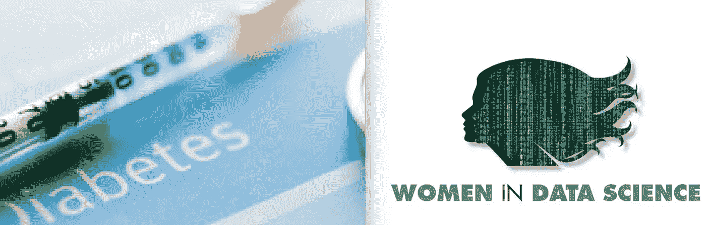

# 基于 MATLAB 的 WiDS 数据传输的数据准备

> 原文：<https://towardsdatascience.com/data-preparation-for-wids-datathon-using-matlab-d7e4d09ef78b?source=collection_archive---------39----------------------->

## 以 WiDS 2021 数据集为例分析和处理数据的资源指南

来源:https://www.kaggle.com/c/widsdatathon2021

# 介绍

在研究 [MATLAB 起始代码 WiDS Datathon](https://medium.com/mathworks/matlab-benchmark-code-for-wids-datathon-2021-b445e8c0e3f2) 时，我意识到对于今年的[数据科学中的女性(WiDS)问题](https://www.kaggle.com/c/widsdatathon2021/overview)，数据清理、处理和特征选择将在开发精确模型中发挥最重要的作用。

在这篇博客中，我将提供一些概念和资源，你可以用来准备你的数据。这里我将使用 [WiDS 数据集](https://www.kaggle.com/c/widsdatathon2021/data)作为例子，但是您可以对您正在处理的任何数据集使用这些方法。以下方法的顺序可以根据您的直觉和数据要求进行更改。

# 导入数据集

由于内存不足问题，导入和分析大数据可能是一项挑战。在 MATLAB 中，您可以使用[数据存储库](https://www.mathworks.com/help/matlab/import_export/what-is-a-datastore.html)和[高数组](https://www.mathworks.com/help/matlab/tall-arrays.html)来加载和导入大数据。

[数据存储](https://www.mathworks.com/help/matlab/ref/datastore.html)是用于读取单个文件或文件或数据集合的对象。数据存储充当具有相同结构和格式的数据的存储库。当集合中的每个文件都太大而无法放入内存时，这是非常有用的，因为它允许您以较小的部分读取和分析每个文件中的数据，而这些部分可以放入内存。

[高数组](https://www.mathworks.com/help/matlab/ref/tall.tall.html)提供了一种处理由数据存储支持的数据的方法，该数据存储可能有数百万或数十亿行。高数组和表允许您以类似内存中 MATLAB 数组的方式处理大型数据集，而不是编写考虑数据巨大规模的专门代码。要创建高数组，首先创建一个引用数据的数据存储，然后使用 tall 函数将数据存储转换为高数组。

*参考文件:*

*   [使用高数组对大数据进行统计和机器学习](https://www.mathworks.com/help/stats/statistics-and-machine-learning-with-big-data-using-tall-arrays.html)
*   [使用高数组在 MATLAB 中分析大数据](https://www.mathworks.com/help/matlab/import_export/analyze-big-data-in-matlab-using-tall-arrays.html)
*   [读取并分析大型表格文本文件](https://www.mathworks.com/help/matlab/import_export/read-and-analyze-data-in-a-tabulartextdatastore.html)
*   [高数组逻辑回归](https://www.mathworks.com/help/stats/logistic-regression-with-tall-arrays.html)
*   [在 MATLAB 中处理大数据](https://www.mathworks.com/videos/working-with-big-data-in-matlab-1567681897209.html)
*   [高大阵列的可视化](https://www.mathworks.com/help/matlab/import_export/tall-data-visualization.html)

# 探索性数据分析

探索性数据分析旨在最大限度地洞察数据集以及数据集的底层故事和结构。它包括对数据进行初步调查的过程，以发现模式，提取重要变量，检测异常值和异常值，并通常使用统计数据和图形表示来测试假设。

以下是您在浏览数据时可以对数据执行的一些活动。

# 特征和目标变量

您会注意到[这个数据集](https://www.kaggle.com/c/widsdatathon2021/data)有许多重要的变量/列(180 个预测列，130157 个观察值)。太多的数据列会导致数据稀疏。基于一些领域知识和直觉，你可以决定哪些变量在预测一个特定患者是否患有糖尿病时可能不起重要作用。这也称为特征选择。在这个数据集中，我们的目标变量是“糖尿病”。

> 这一步主要需要领域知识，应该仔细分析以避免偏差、过度拟合和遗漏关键信息。

# 数据类型转换

你会注意到的另一个特征是变量有不同的数据类型。将分类数据类型转换为数值数据类型是一个很好的做法，这样可以使您的机器学习模型训练得更好。

*参考文件:*

*   [数据类型识别](https://www.mathworks.com/help/matlab/data-type-identification.html?s_tid=CRUX_lftnav)
*   [数据类型转换](https://www.mathworks.com/help/matlab/data-type-conversion.html)

# 数据处理

一旦你理解了数据，你的大部分时间将花在这个数据预处理阶段。数据需要预处理技术来确保准确、高效或有意义的分析。没有通用的步骤可以遵循，也没有强制性的检查来处理数据。然而，可以执行的事情很少:

*   **数据清理**是指寻找、删除和替换坏的或丢失的数据的方法
*   **检测局部极值**和突变有助于识别重要的数据趋势
*   **平滑**和去趋势是从数据中去除噪声和多项式趋势的过程，而缩放会改变数据的边界
*   **分组**和宁滨方法通过分组来识别数据特征

我将在下面更详细地介绍几个，我认为对 WiDS 数据集很重要的东西。

# 缺失数据和异常值

在该数据集中，您会发现有许多重要的变量缺少值。缺失值一般编码为“NA”、“Null”、“不可用”。大多数机器学习模型要求所有特征都是完整的，因此必须处理缺失值。我不建议通过简单的方法删除缺少值的行，尤其是在这个数据集中。因为它会删除大部分数据，并会造成信息丢失和偏差。删除数据的替代方法是输入值，用适当的替代值替换丢失的值。

离群值是与其余数据明显不同的数据点。异常值表示坏数据(收集不正确的数据)。您也可以替换和估算异常值。

下面是一些在 MATLAB 中清除缺失数据和异常值的不同方法的资源。

*   [使用随机森林算法估算缺失数据](https://www.mathworks.com/help/finance/impute-missing-data-using-random-forest.html?searchHighlight=data%20imputation&s_tid=srchtitle)
*   [数据平滑和异常值检测](https://www.mathworks.com/help/matlab/data_analysis/data-smoothing-and-outlier-detection.html)
*   [使用最近邻法估算缺失数据](https://www.mathworks.com/help/bioinfo/ref/knnimpute.html)
*   [数据科学教程](https://www.mathworks.com/videos/series/data-science-tutorial.html)

您也可以在 MATLAB Live Editor 中交互执行[数据预处理](https://www.mathworks.com/help/matlab/preprocessing-data.html)任务。

*   [在实时编辑器中清除异常数据](https://www.mathworks.com/help/matlab/ref/cleanoutlierdata.html)
*   [清除 Live 编辑器中丢失的数据](https://www.mathworks.com/help/matlab/ref/cleanmissingdata.html)
*   [在 Live 编辑器中找到变化点](https://www.mathworks.com/help/matlab/ref/findchangepoints.html)

# 处理多重共线性

该数据集的另一个挑战是多重共线性。当您的模型包含多个不仅与响应变量相关，而且彼此相关的因素时，就会出现多重共线性。在该数据中，许多变量彼此高度相关，这可能影响回归和分类练习的结果。以下是处理多重共线性的几种方法:

*   [特征选择](https://www.mathworks.com/help/stats/feature-selection.html) - *特征选择*通过仅选择测量特征(预测变量)的子集来创建模型，从而减少数据的维度。特征选择算法搜索预测器的子集，该子集最优地模拟测量的响应，服从诸如所需的或排除的特征以及子集的大小的约束。
*   [因子分析](https://www.mathworks.com/help/stats/perform-factor-analysis-on-exam-grades.html) —多元数据通常包括许多测量变量，有时这些变量会“重叠”，因为它们的组可能是相关的。因子分析是一种将模型与多变量数据拟合以估计相互依赖性的方法。
*   [主成分分析](https://www.mathworks.com/help/stats/principal-component-analysis-pca.html?searchHighlight=pca&s_tid=srchtitle) —主成分是一种回归方法，将预测因子的数量减少到一个较小的不相关成分集。该方法生成一组新的变量，称为主成分。每个主成分都是原始变量的线性组合。所有的主成分都是相互正交的，所以没有冗余信息。主成分作为一个整体形成了数据空间的正交基。
*   [正则化](https://www.mathworks.com/help/stats/regularization-1.html?searchHighlight=multicollinearity&s_tid=srchtitle)-为了减少多重共线性，我们可以使用正则化，这意味着保留所有要素，但减少模型系数的大小。两种常见的方法是:

1.  [岭回归](https://www.mathworks.com/help/stats/ridge-regression.html) —在岭回归中，我们增加λ的值，最重要的参数收缩一点，不太重要的参数**保持高值。**
2.  [套索正则化](https://www.mathworks.com/help/stats/lasso-regularization.html):在套索中，我们增加λ的值，最重要的参数收缩一点，不太重要的参数**接近于零。**

# 数据不平衡

您将在此数据集中观察到的另一个挑战是类别不平衡，即糖尿病患者的阳性和阴性类别及其特征没有类似数量的示例，这可能会阻止算法学习如何识别带有少数类别的模式。下面是一些你可以用来处理不平衡数据的方法。

*   [处理分类集成中不平衡的数据或不相等的误分类成本](https://www.mathworks.com/help/stats/classification-with-unequal-misclassification-costs.html)
*   [不平衡数据分类](https://www.mathworks.com/help/stats/classification-with-imbalanced-data.html?searchHighlight=data%20imbalance&s_tid=srchtitle)

# 后续步骤

[在此注册](https://airtable.com/shrLE1J7hVxuYAILv)开始在 WiDS 2021 挑战数据集上实施这些概念。如果您没有 MATLAB 许可证，[请在此处](https://www.mathworks.com/academia/student-competitions/wids-datathon.html)申请免费许可证。请在下面的评论中给出您的反馈或任何问题。