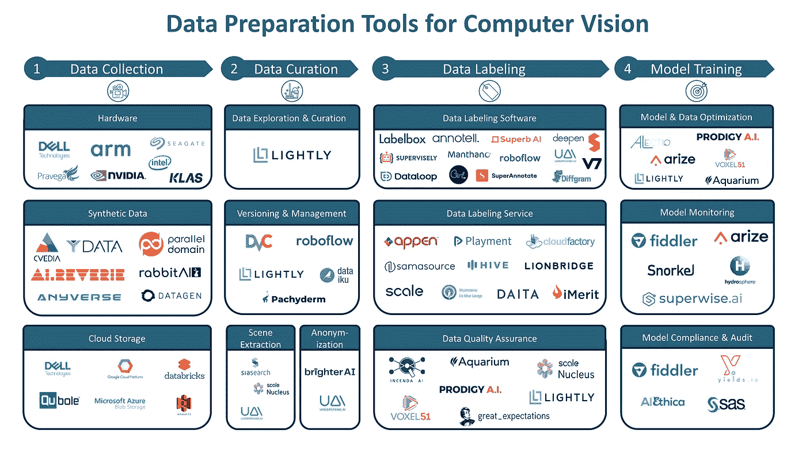
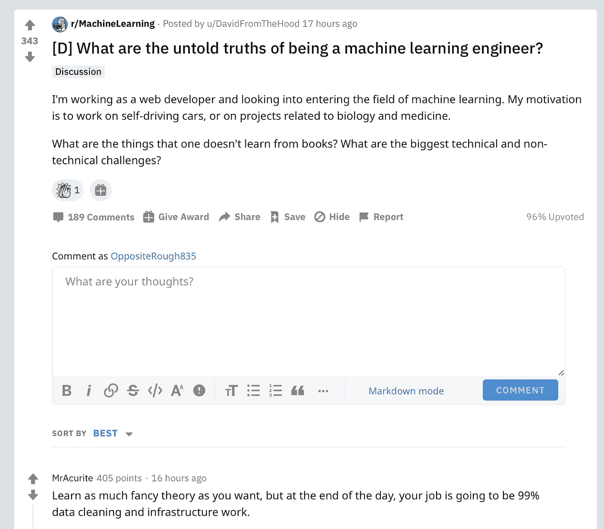
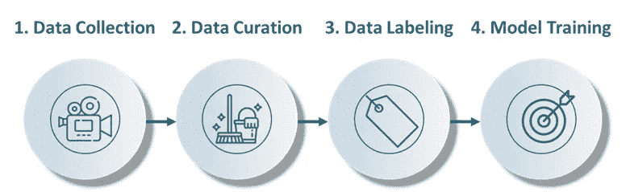
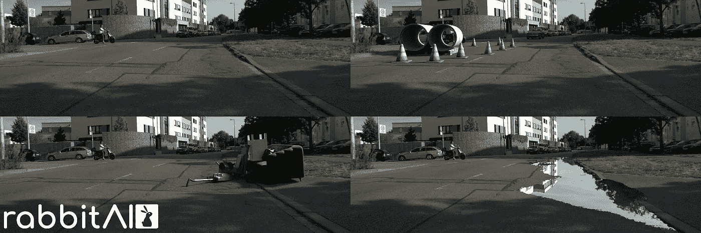
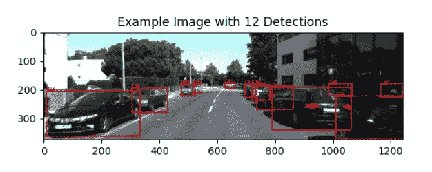

# 计算机视觉 2021 的数据准备工具

> 原文：<https://towardsdatascience.com/data-preparation-tools-for-computer-vision-2021-3ad4dbb95d84?source=collection_archive---------34----------------------->

计算机视觉前景 2021 的数据准备工具。图片作者。

***本文为计算机视觉 2021 提供了数据准备工具景观。目的是给出可用解决方案的概述，机器学习工程师可以使用这些解决方案来构建更好的模型并提高效率。下面详细解释了每个部分。***

热门的新人工智能创业公司每天都在涌现。然而，当涉及到机器和深度学习的实际使能技术时，资源相当匮乏。对于计算机视觉来说尤其如此。这就是为什么我决定建立一个数据准备工具和基础设施景观，以深入了解一家公司可以使用哪些产品和技术来提高其机器学习管道的效率。

为什么关注数据准备？很简单，因为数据准备通常占任何机器学习项目工作的 80%[1]。因此，手头拥有合适的工具至关重要。此外，人工智能模型只能与训练它的数据一样好。因此，专注于机器学习数据的前景早就应该出现了。我最近看到的这个 [Reddit 帖子](https://www.reddit.com/r/MachineLearning/comments/ifn7ua/d_what_are_the_untold_truths_of_being_a_machine/)说明了这种需求(见下面的截图)。

截图[作者 Reddit r/MachineLearning](https://www.reddit.com/r/MachineLearning/comments/ifn7ua/d_what_are_the_untold_truths_of_being_a_machine/g2rie2e/) 。

# 沿着价值链组织

重要的是要有一个类似于典型的机器学习开发管道的价值链的景观。这样做的原因是:( 1)很容易根据工具在价值链中的位置对它们进行分类,( 2)每个人都已经熟悉了工作流程。对于大多数机器学习项目来说，有 4 个步骤是相同的(见下图)。

机器学习管道/价值链。图片作者。

这些步骤中的每一步都有不同的子步骤，我将在下面的专门章节中从数据收集开始更详细地讨论这些子步骤。

# 1.数据收集

数据收集是价值链中最关键的一步。当然，今天，可以使用许多免费的、学术的和公共的数据集来进行机器学习。迁移学习可以做很多事情。但是，许多公共数据集仅用于非商业用途。这就是为什么如果一个人想为特定的应用程序微调他们的模型，就需要自己的数据。本节试图更深入地了解这一步所需的工具。

## 五金器具

首先，我们需要硬件来收集、存储和处理数据。在这里，我们可以区分三组系统:(1)捕捉系统，例如相机、激光雷达传感器或麦克风，(2)存储系统(例如，[戴尔](https://www.dell.com/de-ch)、 [Klas](https://www.klasgroup.com/) )，以及(3)计算系统(例如，[英伟达](https://www.nvidia.com/de-de/)、[戴尔](https://www.dell.com/de-ch)、 [ARM](https://www.arm.com/) )。

第一组是如此之大，以至于它值得被包含在自己的风景中。这就是为什么我将避免在本文中详细阐述和包括捕获系统，因为这将超出范围。

(2)存储系统的专用硬件例如由[戴尔](https://www.dell.com/de-ch)、[希捷](https://www.seagate.com/de/de/)、 [Pravega](https://www.pravega.io/) 和 [Klas](https://www.klasgroup.com/) 提供。

(3)专门的计算系统例如由[英伟达](https://www.nvidia.com/de-de/)、[戴尔](https://www.dell.com/de-ch)和 [ARM](https://www.arm.com/) 提供。

例如:半合成伦理数据。物体是合成的，环境是真实的。图片来源:由 [RabbitAI](https://rabbitai.de/) 提供。

## 综合数据

一旦我们收集了真实世界的数据，我们可能会注意到数据不够，或者某些情况没有被充分覆盖。例如，对于自动驾驶来说，这可能是真的，因为事故场景很少被捕捉到。缺失的数据可以用专用工具生成。例如，对于全合成数据，存在[媒体](https://www.cvedia.com/)，另一方面，对于半合成数据，可以使用 [RabbitAI](https://rabbitai.de/) 。

## 云存储

最著名的云存储提供商是[谷歌](https://cloud.google.com/)、[亚马逊](https://aws.amazon.com/)、[微软](https://azure.microsoft.com/)。尽管如此，重要的是要意识到，还有其他参与者试图通过智能数据湖解决方案进行创新。例子包括[数据砖块](https://databricks.com/de/)或 [QuBole](https://www.qubole.com/) 。

# 2.数据监管

数据监管是价值链中被低估的一步。这是一个预处理步骤，这可能是为什么许多人直接跳到更令人兴奋的行为发生的标签和培训的原因。主要目标通常是了解收集了什么类型的数据，并将其整理成一个平衡的高质量数据集。然而，通过良好的分析、选择和管理所能创造的价值是巨大的。当低准确性和高成本发生时，这里发生的错误将使你付出昂贵的代价。

## 探索和管理

不幸的是，在探索和管理未标记的原始数据方面，这个领域仍然相对空白。数据监管由清理、过滤和[处理数据](https://www.trifacta.com/data-wrangling/)等任务组成。这一点的重要性在于，许多公司只处理了大约 1%的收集数据。因此，这一步非常重要，因为这 1%(或任何其他百分比的已用数据)随后将用于训练模型。那么，如何确定使用哪 1%呢？有许多传统的解决方法，如回归(如随机森林)或原始采样方法，如随机、GPS 或基于时间戳的数据选择。然而，这个领域目前唯一提供替代方案的玩家是轻轻的。他们基于人工智能的解决方案提供了分析和智能选择方法。
除了可以处理未标记数据的[和](https://www.lightly.ai/)之外，还有针对行业的特定应用，例如自动驾驶，它利用传感器数据进行场景提取(参见场景提取部分)

## 版本控制和管理

有开源的数据版本控制解决方案，如 DVC，也有专有的解决方案，如 [roboflow](https://roboflow.com/) 或 [Pachyderm、](https://www.pachyderm.com/)或 [Dataiku](https://www.dataiku.com/de/) 。需要强调的是，支持的数据类型和提供者的关注点是不同的。Roboflow 和 [Lightly](https://www.lightly.ai/) 提供全面的平台解决方案，不仅仅是版本控制和管理，例如，DVC 只专注于版本控制。

## 场景提取

说到场景提取，我们看到了一个新兴领域。最老牌的玩家有 [SiaSearch](https://www.siasearch.io/) 、[鳞核](https://scale.com/nucleus)、 [Understand.ai](https://understand.ai/) 。

这也是许多数据注释公司通过人工劳动提供的任务。

## 匿名化

有许多开源解决方案(例如 [OpenCV](https://www.pyimagesearch.com/2020/04/06/blur-and-anonymize-faces-with-opencv-and-python/) )可用于匿名化。还有像 [Understand.ai](http://www.understand.ai) 这样专注于人脸和号牌的商业提供商。也有人努力实现“智能”匿名化。这意味着取代典型的模糊，添加了一个合成的覆盖层(例如，人脸或车牌)，这不会损害机器学习模型的性能。据我所知，目前唯一提供这种解决方案的公司是 [Brighter AI](https://brighter.ai/de/) 。

街上贴有标签的汽车。图片作者。

# 3.数据标记

这是一个竞争激烈的市场。近年来出现了许多玩家——其中一些甚至达到了杰出的独角兽地位，如 [Scale AI](https://scale.com/) 。也有一些公司已经存在了一段时间，如[阿彭](https://appen.com/)。如果更仔细地评估市场，可以确定三个不同的细分市场:(1)标记软件提供商，(2)标记服务提供商，以及(3)数据质量保证提供商。但是，也有可能有些玩家活跃在几个细分领域。在这种情况下，我将公司归因于其主要业务重点。

## 标签软件

几年前，构建标签软件主要是为了提供一个 UI，让它尽可能高效地在图像上绘制边界框。随着对语义分割图像注释需求的增长以及其他数据类型(如激光雷达、医学图像格式或文本)的出现，这种情况发生了巨大的变化。

今天，玩家沿着四个轴区分。一是通过行业专业化(如 [7V](https://www.v7labs.com/) 专注于医疗数据)，二是通过自动化创新(如 [Labelbox](https://labelbox.com/) 、 [SuperAnnotate](https://superannotate.com/) 、 [Superb AI](https://www.superb-ai.com/) 专注于自动化标注)。第三，通过应用聚焦(如 [Segments.ai](https://segments.ai/) 聚焦图像分割)。第四，通过他们的商业模式，软件——标记界面和后端——是开放核心的，有付费网络平台和企业版本可用(例如， [Diffgram](https://diffgram.com/) )。

## 标签服务

毫无疑问，标签服务提供商市场是最大的参与者最拥挤的领域。它也是最大的市场，到 2024 年收入将达到 41 亿美元[2]。

一些知名的大玩家有:[阿彭](https://appen.com/)、 [Samasource](https://www.sama.com/) 、 [Scale](https://scale.com/) 、 [iMerit](https://imerit.net/) 、 [Playment](https://playment.io/) 、 [Cloudfactory](https://www.cloudfactory.com/) 。然而，也有更小的玩家，他们更专注于利基市场，如 [Humansintheloop](https://humansintheloop.org/) 、 [Labelata](https://www.labelata.ch/) 或 [DAITA](https://daita.tech/) 。

## 数据质量保证

去年出现的一个有趣的新领域，它专注于数据质量保证。这里的目标是找到错误标记的数据以及其他负面因素，如冗余数据或缺失数据，以提高机器学习模型的性能。

有些玩家提供这种服务，比如[incundai](https://www.incenda.ai/)或者工具，比如 [Aquariumlearning](https://www.aquariumlearning.com/) 。

# 4.模特培训

我们现在已经收集、管理和标记了我们的数据。但是，在我训练了一个模型之后，数据会怎么样呢？人们可能会认为这个过程已经完成，但这不是真的。与软件类似，机器学习模型需要用数据更新——猜猜怎么更新。因此，让我们来看看帮助我们实现这一目标的数据工具。

## 模型和数据优化

在部署之前验证和优化模型以及培训数据至关重要。应该评估的领域是模型性能、模型偏差和数据质量。为此，理解模型不确定或表现不佳的地方是至关重要的。为了更新模型，人们可以使用不同的技术，例如由水族馆学习或主动学习等公司提供的视觉评估，这由 Alectio 和[提供。主动学习是一个概念，用于查询您想要用于训练过程的新样本。换句话说，使用模型表现不佳的样本来查找相似的数据，以更新模型并使其更加稳健。](https://www.lightly.ai/)

这个领域的一些玩家有[阿莱克西奥](https://alectio.com/)、[轻飘飘](https://www.lightly.ai/)、[水族学](https://www.aquariumlearning.com/)、[神童艾](https://prodi.gy/)、[阿里扎](https://arize.com/)。

## 模型监控

一旦部署了模型，工作就会继续。有可能我们的 AI 系统(例如自动驾驶)遇到了从未见过的场景或情况。这意味着这些场景/样本在训练数据集中缺失。这种现象被称为数据或模型漂移[4]。这是一种危险的现象，也是为什么部署的模型需要持续监控的原因。

好在有很多玩家提供这样的解决方案:[阿里泽](https://arize.com/)、[提琴手](https://www.fiddler.ai/)、[水圈](https://hydrosphere.io/)、 [Superwise.ai](https://www.superwise.ai/) 、[浮潜](https://snorkel.ai/)。

## 合规与审计

不幸的是，法规遵从性和审计是一个经常被业界忽视的话题。结果是数据收集过程中的隐含偏差一直传播到应用程序的模型。重要的是要强调，没有任何借口来构建和部署不道德和不可持续的模型。公司必须意识到自己的责任，需要对开发基于深度学习的产品负责。如果他们行为不当，就应该受到惩罚。

行业内有几项自律倡议，其中包括 Google 提出的框架[3]。九名研究人员合作开发了该框架，包括谷歌员工安德鲁·斯马特、玛格丽特·米歇尔和蒂姆尼特·格布鲁，以及前人工智能伙伴关系研究员和现任人工智能研究所研究员黛博拉·拉吉。

然而，也有一些私人公司提供独立的第三方评论，如 [Fiddler](https://www.fiddler.ai/) 、 [AI Ethica](https://www.ai-ethica.com/) 、 [Yields.io](https://www.yields.io/) 和 [SAS](https://www.sas.com/de_ch/home.html) 。

# 结论

简而言之，三年前还没有出现的许多令人惊叹的工具。当时，公司必须自己开发所有工具，这使得机器学习开发非常昂贵。今天，多亏了众多的供应商，我们有可能变得更加高效和可持续。然而，仍然有很大的差距需要填补。近年来的焦点主要集中在数据标签软件和数据标签服务上，这是由大量风险投资资金推动的。这就是为什么在数据监管、质量保证以及模型验证、监控和法规遵从性领域仍有发展空间的原因。幸运的是，已经有玩家在那个领域工作，解决 AI 的新瓶颈。

我期待着今年看到更多的出现。

Matthias Heller，联合创始人 [Lightly.ai](https://www.lightly.ai/)

**PS:** 如果你最喜欢的工具不见了或者你觉得某个工具放错了地方，不要犹豫，来找我。

# 感谢

**感谢**至 [RabbitAI](https://rabbitai.de/) 为我提供半合成数据的示例图像。

**感谢**Mara Kaufmann、 [Philipp Wirth](https://medium.com/@philipp_74619) 、Malte Ebner、 [Kerim Ben Halima](https://kerim-ben-halima.medium.com/) 和 [Igor Susmelj](https://medium.com/@isusmelj) 阅读本文的草稿。

# 参考

[1]cognelytica，[AI 2020 CGR 的数据准备&标签-DLP20](https://www.cognilytica.com/2020/01/31/data-preparation-labeling-for-ai-2020/) (2020)，第 3–4 页，公司出版物

[2]cognelytica，[AI 2020 CGR 数据准备&标注-DLP20](https://www.cognilytica.com/2020/01/31/data-preparation-labeling-for-ai-2020/) (2020)，第 14–16 页，企业出版

[3]伊尼奥卢瓦·德博拉·拉吉、安德鲁·斯马特、丽贝卡·n·怀特、玛格丽特·米歇尔、蒂姆尼特·格布鲁、本·哈钦森、贾米拉·史密斯-卢德、丹尼尔·塞隆和帕克·巴恩斯。[弥合人工智能问责制差距:为内部算法审计定义端到端框架](https://dl.acm.org/doi/abs/10.1145/3351095.3372873) (2020)。p，33–44 DOI:https://DOI . org/10.1145/335 . 33353636736

[4] Samuel Ackerman，Eitan Farchi，Orna Raz，Marcel Zalmanovici，Parijat Dube，[检测数据漂移和离群值随时间的变化对机器学习模型性能的影响](https://arxiv.org/abs/2012.09258) (2020)，

# 联系我们

如果这篇博文引起了你的注意，并且你渴望了解更多，请在 Twitter 和 Medium 上关注我们！如果您想了解更多关于我们在 Lightly 所做的事情，请通过 info@lightly.ai 联系我们。如果您有兴趣加入一个有趣的 rockstar 工程团队来帮助简化数据准备，请通过 jobs@lightly.ai 联系我们！