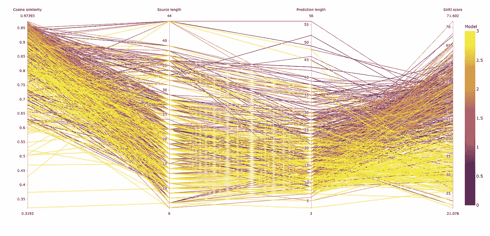
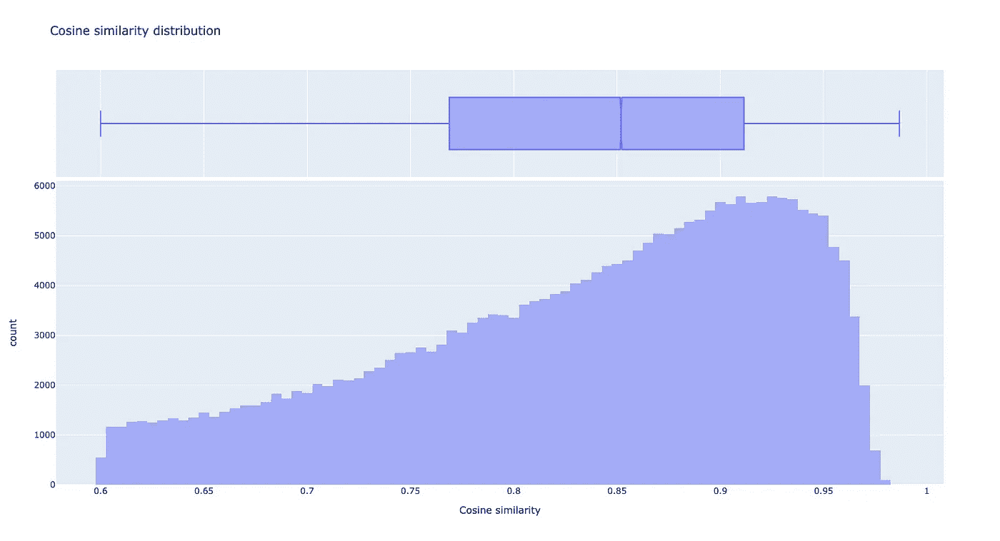

# 自然语言处理中的数据预处理

> 原文：<https://towardsdatascience.com/data-preprocessing-in-nlp-c371d53ba3e0?source=collection_archive---------9----------------------->

## 用于文本简化的数据清理和数据扩充(不仅仅是)



不同模型在余弦相似性、源和目标长度方面的性能(图片由作者提供)

# 介绍

这是第二篇关于我使用变形金刚简化文本的文章。如果您还没有阅读第一篇文章，请随意阅读，但是理解这篇文章并不是强制性的。请随意查看该项目的 [GitHub repo](https://github.com/chrislemke/deep-martin) 。

数据预处理不仅经常被视为开发深度学习模型的更乏味的部分，而且也被低估了，尤其是在 NLP 中。所以现在是时候站出来支持它，给数据预处理应有的信任和重视了。正如在我的第一篇文章中一样，这篇文章的灵感来自于我从事文本简化的经历。它将展示一些技术——它们的优缺点以及背后的想法。

所以让我们开始吧！

# 数据清理

作为语言表示的文本是遵循例如句法和语义规则的正式系统。尽管如此，由于其复杂性及其作为正式和非正式交流媒介的作用，它还没有达到简单(预)处理所需的正式程度。这是我们在 NLP 中进行数据清洗要克服的障碍。同样，这也是我们需要数据清理的原因。

看一眼数据集就能很快弄清楚它到底是什么。对于文本简化方法，我使用了多个数据集。然后，有时你会发现这样的简化:

```
Castleton is a honeypot village in the Derbyshire Peak District , in England .
```

这篇关于卡斯尔顿小村庄的短文被简化为:

```
Derbyshire
```

这可能将文本缩短到最低限度，但我不认为这是简化。那么，我们如何才能克服这一点呢？计算余弦相似度可以告诉我们两个版本有多接近。幸运的是，有多个库可以帮助我们。为了计算余弦相似度，我们首先需要嵌入文本。如果你想了解更多关于单词嵌入的知识，有很多关于它的文章——我强烈推荐[这本](/introduction-to-word-embedding-and-word2vec-652d0c2060fa)。在本文中，我假设您理解向量嵌入。

对于 NLP 来说， [Gensim](https://radimrehurek.com/gensim/index.html) 是一个优秀且非常有用的项目。我们使用他们的 [Doc2Vec](https://radimrehurek.com/gensim/models/doc2vec.html) 库来创建文档嵌入。

我们在 *Doc2Vec* 中加载一个[预训练模型](https://github.com/jhlau/doc2vec)。然后，在使用 [scikit-learn](https://scikit-learn.org/stable/modules/generated/sklearn.metrics.pairwise.cosine_similarity.html#sklearn.metrics.pairwise.cosine_similarity) 库计算余弦相似度之前，我们推断向量。结果是一个浮点数告诉我们这两个文本有多接近:

```
0.04678984
```

这是我们所期望的。但不幸的是，Doc2Vec 以文字简洁的话表现不佳著称。“德比郡”甚至不是一个文本，而是一个单词。我们应该尝试另一个库，看看它的性能如何。

Spacy 是 NLP 中一个知名的库。它提供了词性标注、词汇化、停用词以及嵌入的功能。上面显示的代码给出了如下结果:

```
0.19534963
```

现在我们发现自己陷入了某种困境:两个不同的库，两种不同的结果。而且 *0.04678984* (Doc2Vec)和 *0.19534963* (Spacy)之间一点都不接近。如果我们看看他们使用的各种模型，我们可能会更好地理解这些差异。Doc2Vec 正在使用的模型是在英文版维基百科上训练出来的。另一方面，Spacy 正在使用在 [Commoncrawl 语料库](https://commoncrawl.org/)上训练的 [GLoVe](https://github.com/stanfordnlp/GloVe) s 单词向量。两种模型的嵌入大小 300 是相同的。为了测试，我们可以对源和目标使用一个相同的句子，然后看看两者的表现如何——我们期望的是非常接近 1:

Doc2Vec:

```
0.9235608
```

空间:

```
1.0000002
```

在这个简短的评估和信任 Spacy 已经用于许多其他任务之后，我们现在继续使用 Spacy。因此，不要忘记，这项工作是通过删除所有低余弦相似性的句子来清理数据集。但是我们怎么定义低呢？一种经验方法可以是查看数据集中具有低余弦相似性的记录，并找到可接受的阈值。

```
‘Toes are the digits of the foot of a tetrapod .’‘Toes are the digits of the foot of a animal .’
```

给了我们:

```
0.9701131
```

很明显，我们保持这个记录，对吗？现在，我们知道，但是让我们以后记住这一点。

这个怎么样:

```
‘It can cause a zoonotic infection in humans , which typically is a result of bites or scratches from domestic pets .’‘Pasteurella multocida was first found in 1878 in fowl cholera-infected birds .’
```

我们可以看到，这两个句子指的是同一个东西——多杀性巴氏杆菌。但是第二句话并不是第一句话的简化。两者结合在一起将会相互补充，这清楚地表明这不是一种简化。并且余弦相似度只有 *0.18766001* Spacy 证实了我们的假设。

但是 0.18766001 似乎是一个低门槛。所以我们继续寻找更高的目标。

```
‘Zax Wang was a member of short-lived boyband POSTM3N .’‘Wang was a member of POSTM3N .’
```

余弦相似度:

```
0.61018133
```

又对比了几次，得出了 0.6 的门槛。但是在我们开始清理我们的数据集和删除低余弦相似性的记录之前，我们必须谈论高相似性。如果我们的值> = 99 呢？这意味着这些句子彼此非常接近，甚至完全相同。这些记录不会帮助我们的模型学习简化文本，但会降低它的性能。因此，我们不仅删除余弦相似度低于 *0.6* 的记录，还删除相似度高于 *0.985* 的记录。结果是这样分布的:



使用这种方法，我们从数据集中删除了 40，000 多条记录。这不仅缩小了它，而且提高了它的质量。

下一步是什么？关于如何改进数据集，还有其他想法吗？Spacy 能做的不仅仅是创建嵌入。去掉停用词或者使用词汇化怎么样？

停用词被认为是一种语言中最常见的词。没有通用的清单。但是像 [NLTK](https://www.nltk.org/) 或者 Spacy 这样的图书馆提供了现成的。这个想法听起来很吸引人。但是我们对它有什么期望呢？存在许多方法，其中停用词的移除可以改善训练的性能，因此也改善模型的性能。在文本分类中，像“the”、“this”或“and”这样的词没有传递任何有价值的意思，因此没有有用的信息。但是，如果它们被视为句子语法的一部分，它们对于生成输出是至关重要的。换句话说:如果模型是一个序列到序列的模型，我们希望它能创建类似人类的句子，那么我们不能忽略停用词和语言中其他非信息部分。这同样适用于词汇化。这种对表达的屈折形式进行分组的语言过程可能只会删除少量的信息，但会扰乱处理自然语言的模型。此外，大多数预训练的标记化器没有在词条化的文本上训练——这是降低质量的另一个因素。

另一个吸引人的简单想法是删除太短的句子。这样，我们就可以删除像这样的不完整的简化:

```
Magnus Carlsen born Sven Magnus Carlsen on 30 November 1990 is a Norwegian chess Grandmaster and chess prodigy currently ranked number one in the world on the official FIDE rating list .
```

简化为:

```
Other websites
```

不知道这种奇怪的文字简化是如何产生的。但是这是为什么数据清理是必要的一个完美的例子，不是吗？删除短于——比如说——三个单词的句子会丢掉很多破记录。但幸运的是，我们已经在处理这件事了。无论如何，我们的余弦相似度算法将删除相似度仅为 *0.15911613* 的这句话。使用这种解决方案而不是按长度删除句子的一个优点是，我们保留了有效但非常短的文本。

余弦相似性方法(使用适当的阈值)似乎是一种简单而强大的方法，只需一步即可清理数据集以实现文本简化。

# 数据扩充—从无到有创建文本

当数据清理是更好的执行模型的圣杯时，数据扩充是国王的纪律。我承认这个有点夸张，但是特别是在 NLP 中，新数据的创建被证明是一个严峻的挑战。这是计算机视觉和自然文本处理再次分道扬镳的地方。虽然计算机视觉模型通常满足于获得已有图像的旋转、镜像或颠倒副本，但由于语言结构的原因，NLP 模型不幸地要求更高。但是让我们继续受到计算机视觉的启发。我们的方法应该是在现有文本的基础上创建新的文本。

```
The story about Abraham is a part of the Jewish , Christian and Islamic religions .
```

收件人:

```
The religions of Christian is a part about the Jewish , Abraham and Islamic story .
```

即使算法考虑了动词、名词、形容词等。(例如，使用 Spacy 的 POS-tagging)，结果很容易是过多的垃圾。所以只要这不是机械土耳其人做的，这种方法提供好的结果似乎是不现实的。

但是除了这种语法上的修改，我们可以尝试一种更加词汇驱动的方法:同义词。由于 Python 的库集合过多，所以也有一个用于等价物。

首先，我们将看看 [PyDictionary](https://github.com/geekpradd/PyDictionary) 库:

这将打印:

```
['snake', 'moon', 'dry land', 'property', 'ice', 'catch', 'oddment', 'makeweight', 'ribbon', 'lot', 'stuff', 'peculiarity', 'web', 'physical entity', 'whole', 'hail', 'soil', 'terra firma', 'wall', 'floater', 'trifle', 'physical object', 'fomite', 'token', 'location', 'remains', 'part', 'formation', 'shiner', 'relic', 'paring', 'souvenir', 'portion', 'ground', 'charm', 'geological formation', 'earth', 'curiosity', 'small beer', 'neighbour', 'commemorative', 'vagabond', 'thread', 'good luck charm', 'film', 'vehicle', 'rarity', 'hoodoo', 'trivia', 'discard', 'curio', 'oddity', 'land', 'neighbor', 'unit', 'prop', 'filler', 'solid ground', 'growth', 'je ne sais quoi', 'head', 'triviality', 'draw', 'keepsake', 'finding']
```

伟大的开始！我们收到一个带有不同同义词的列表。即使我不得不承认“蛇”、“月亮”和“旱地”是“物体”的奇怪同义词也许我们应该试试另一个图书馆。接下来— NLTK:

```
[‘object’, ‘physical_object’]
[‘hope’]
```

这看起来更有希望。NLTK 为“object”找到了一个较小但更有用的同义词范围。更值得一试的是:

输出:

```
‘angstrom three-dimensional object rotates always around Associate in Nursing complex number line called angstrom rotation axis .‘‘angstrom three-dimensional object rotates around angstrom line called Associate in Nursing axis .’
```

有趣的是**有很多**的优化潜力🤔。检查余弦相似性以避免出现不合适的同义词可能如下所示:

```
‘A three-dimensional physical object rotates always around AN imaginary line called a rotary motion axis .’ ‘A three-dimensional physical object rotates around a line called AN axis .’
```

这种方法正朝着正确的方向发展。然而，该代码不是用于生产系统的。表演还不够好。但是我们看到同义词似乎打开了在现有文本的基础上创造新文本的可能性。还有其他的图书馆，比如[py-thesaurus](https://pypi.org/project/py-thesaurus/)——但是我们现在不会深入讨论它们。相反，我们将直接跳到下一个方法:来回翻译。

这个过程背后的想法很简单。我们把一篇文章翻译成另一种语言，比如说德语，然后再翻译回它的源语言。像往常一样，这应该是自动化的，所以我们可以使用[谷歌翻译](https://cloud.google.com/translate/docs?hl=en)或 [DeepL](https://www.deepl.com/pro#developer) 的 API。我不会在下面的例子中使用 API，而是使用他们的网站服务。让我们从[谷歌翻译](https://translate.google.com/?hl=en)开始玩吧:

源文本:

```
A three-dimensional object rotates always around an imaginary line called a rotation axis .
```

德语版:

```
Ein dreidimensionales Objekt dreht sich immer um eine imaginäre Linie, die als Rotationsachse bezeichnet wird.
```

重新翻译成英文:

```
A three-dimensional object always rotates around an imaginary line called the axis of rotation.
```

不算太坏。它至少改变了一点文本。DeepL 提供了类似的结果。它如何处理更长或更复杂的文本？这次我们尝试 DeepL:

源文本:

```
Carol I of Romania , original name Prince Karl Eitel Friedrich Zephyrinus Ludwig of Hohenzollern-Sigmaringen , later simply of Hohenzollern (April 20th , 1839) , German prince , was elected Domnitor Prince of Romania on April 20th , 1866 , following the overthrow of Alexandru Ioan Cuza .
```

德语版:

```
Carol I. von Rumänien , ursprünglicher Name Fürst Karl Eitel Friedrich Zephyrinus Ludwig von Hohenzollern-Sigmaringen , später einfach von Hohenzollern (20\. April 1839) , deutscher Fürst , wurde am 20\. April 1866 , nach dem Sturz von Alexandru Ioan Cuza , zum Domherrn Fürst von Rumänien gewählt.
```

重新翻译成英文:

```
Carol I of Romania , original name Prince Karl Eitel Friedrich Zephyrinus Ludwig von Hohenzollern-Sigmaringen , later simply von Hohenzollern (20 April 1839) , German prince , was elected Canon Prince of Romania on 20 April 1866 , after the fall of Alexandru Ioan Cuza .
```

非常好——它稍微改变了词汇和语法。这似乎是一个增加新文本的有用方法。还需要更多的尝试和研究来感受它的可靠性和潜在的改进，但这第一个非常短的见解看起来很有希望。

未来尝试的一些想法可能是，例如，在把它翻译回原来的地方之前，先把它翻译成两种不同的语言。如果我们使用不属于印欧语系的语言，也许效果会更好。还有更多的东西有待发现，我很乐观，我们可以找到一种合适的方法来扩充自然语言处理的文本。假设你对此有更多的想法或经验。请与我们分享！

以上是我关于 NLP 和文本简化的第二部分。下一部分将详细介绍如何实现和理解 transformer 架构。在那之前——再见。