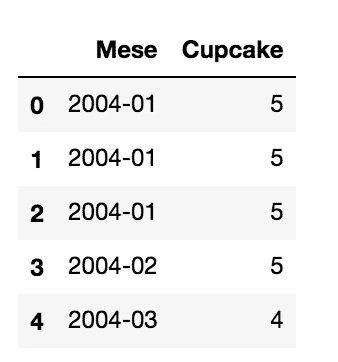

# Python Pandas 中的数据预处理—第 6 部分删除重复项

> 原文：<https://towardsdatascience.com/data-preprocessing-in-python-pandas-part-6-dropping-duplicates-e35e46bcc9d6?source=collection_archive---------13----------------------->

## 数据预处理

## 使用 Python 熊猫库删除重复项的快速教程。


图片来自 [Pixabay](https://pixabay.com/?utm_source=link-attribution&utm_medium=referral&utm_campaign=image&utm_content=2548105) 的 [Gerd Altmann](https://pixabay.com/users/geralt-9301/?utm_source=link-attribution&utm_medium=referral&utm_campaign=image&utm_content=2548105)

在这个简短的教程中，我将展示如何使用`pandas`库提供的`drop_duplicates()`函数从数据帧中删除重复项。去重是一种用于预处理数据的技术。数据预处理还包括:

*   [缺失值](/data-preprocessing-with-python-pandas-part-1-missing-data-45e76b781993?source=your_stories_page-------------------------------------)
*   [标准化](/data-preprocessing-with-python-pandas-part-4-standardization-ccd5b1608f1c?source=your_stories_page-------------------------------------)
*   [正常化](/data-preprocessing-with-python-pandas-part-3-normalisation-5b5392d27673?source=your_stories_page-------------------------------------)
*   [格式化](/data-processing-with-python-pandas-part-2-data-formatting-710c2eafa426?source=your_stories_page-------------------------------------)
*   [宁滨。](/data-preprocessing-with-python-pandas-part-5-binning-c5bd5fd1b950?source=your_stories_page-------------------------------------)

这个教程可以从我的 [Github 库](https://github.com/alod83/data-science/tree/master/Preprocessing/RemoveDuplicates)下载。

# 数据导入

首先，我导入 Python `pandas`库，然后通过`read_csv()`函数读取 CSV 文件。在本教程中，我利用了`cupcake.csv`数据集，该数据集包含在 Google Trends 上对单词`cupcake`的趋势搜索。数据是从[这个环节](https://trends.google.com/trends/explore?q=%2Fm%2F03p1r4&date=all)中提取出来的。我修改了原始数据集，以便包含重复的数据集。

```
import pandas as pddf = pd.read_csv('cupcake_duplicates.csv')
df.head()
```



作者图片

现在我列出数据帧中包含的记录数。我利用了`shape`属性，它显示了数据帧的行数和列数。

```
df.shape
```

它显示了以下输出:

```
(210, 2)
```

# 检查是否存在重复

为了检查一条记录是否重复，我可以利用`duplicated()`函数，如果一条记录有其他重复项，则返回`True`，否则返回`False`。

```
df.duplicated()
```

它给出了以下输出:

```
0      False
1       True
2       True
3      False
4      False
       ...  
205    False
206    False
207    False
208    False
209    False
Length: 210, dtype: bool
```

我还可以在数据帧的列子集上使用`duplicated()`函数。在这种情况下，我必须使用`subset`参数，它包含要检查的列的列表。

```
df.duplicated(subset=['Mese'])
```

现在我可以通过`True`记录的总和计算出重复的数量。

```
df.duplicated().sum()
```

它给出了以下输出:

```
6
```

# 删除重复项

现在，我可以通过`drop_duplicates()`功能删除副本。我可以使用不同的策略:

*   基于所有列删除所有重复项
*   基于某些列，删除所有重复项

在这两种策略中，我可以决定是否维护重复值的副本。这可以通过作为输入传递给`drop_duplicates()`函数的`keep`参数来完成。

```
df1 = df.drop_duplicates()
df1.shape
```

它给出了以下输出:

```
(204, 2)
```

这意味着已经从数据集中移除了 6 个元素，这对应于 6 个副本。

或者，我也可以删除第一个副本:

```
df2 = df.drop_duplicates(keep=False)
df2.shape
```

它给出了以下输出:

```
(201, 2)
```

我注意到有 9 条记录已经从数据集中删除。

作为一种额外的策略，我可以根据列的子集删除重复项。这可以通过使用`subset`参数来完成。

```
df3 = df.drop_duplicates(subset=["Cupcake"])
df3.shape
```

它给出了以下输出:

```
(78, 2)
```

在这种情况下，从数据集中删除了大量记录。

# 摘要

在这篇简短的教程中，我描述了如何使用 Python `pandas`从数据集中删除重复项。可以使用`drop_duplicates()`功能。根据所需的输出，可以向函数传递不同的参数。

如果你想了解我的研究和其他活动的最新情况，你可以在 [Twitter](https://twitter.com/alod83) 、 [Youtube](https://www.youtube.com/channel/UC4O8-FtQqGIsgDW_ytXIWOg?view_as=subscriber) 和 [Github](https://github.com/alod83) 上关注我。

# 相关文章

[](/data-normalization-with-python-scikit-learn-e9c5640fed58) [## 使用 Python scikit 进行数据规范化-学习

### 继关于数据预处理的系列文章之后，在本教程中，我将讨论 Python 中的数据规范化…

towardsdatascience.com](/data-normalization-with-python-scikit-learn-e9c5640fed58) [](/data-preprocessing-with-python-pandas-part-5-binning-c5bd5fd1b950) [## 用 Python Pandas 进行数据预处理—第 5 部分宁滨

### 数据宁滨(或称存储桶)将数据分组到存储箱(或存储桶)中，从这个意义上说，它替换了包含在

towardsdatascience.com](/data-preprocessing-with-python-pandas-part-5-binning-c5bd5fd1b950) [](/data-preprocessing-with-python-pandas-part-4-standardization-ccd5b1608f1c) [## Python Pandas 的数据预处理—第 4 部分标准化

### 本教程解释了如何使用 Pandas 库预处理数据。预处理是做一个…

towardsdatascience.com](/data-preprocessing-with-python-pandas-part-4-standardization-ccd5b1608f1c) 

# 新到中？您可以每月订阅几美元，并解锁无限的文章— [点击此处](https://alod83.medium.com/membership)。