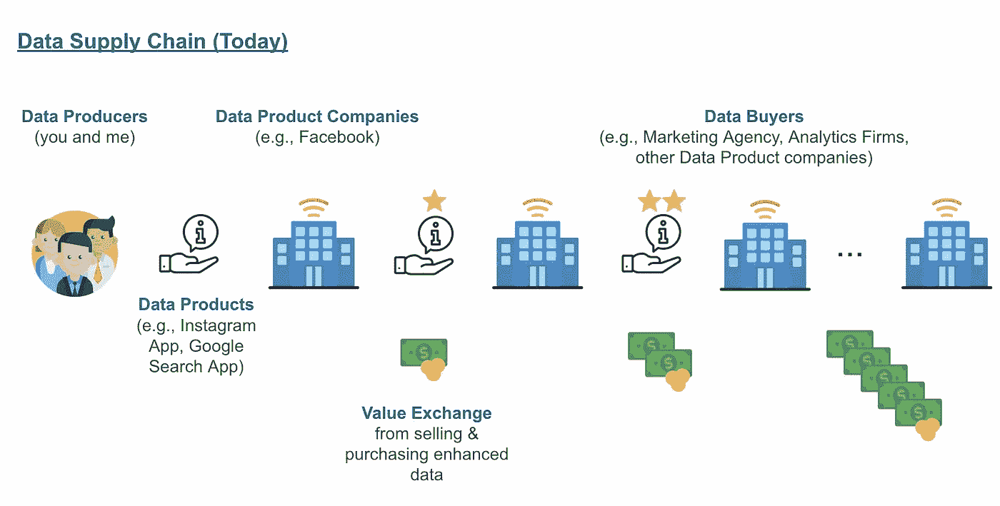
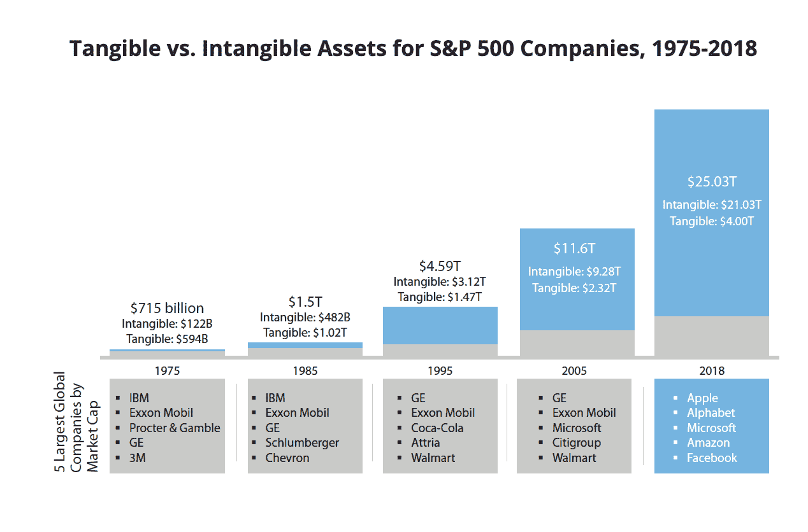
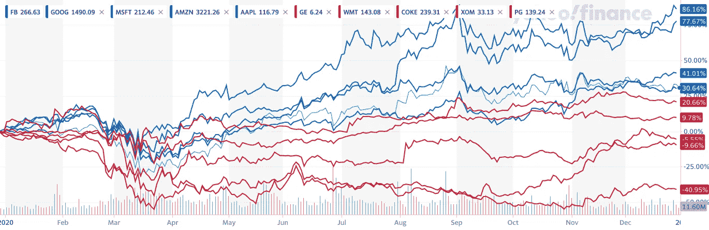
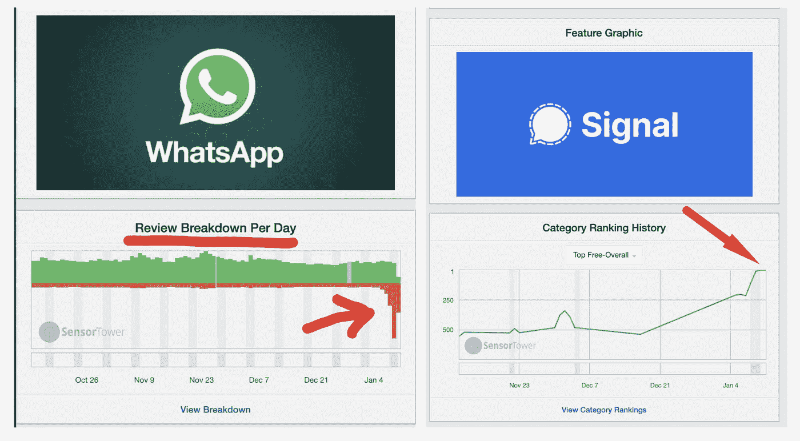
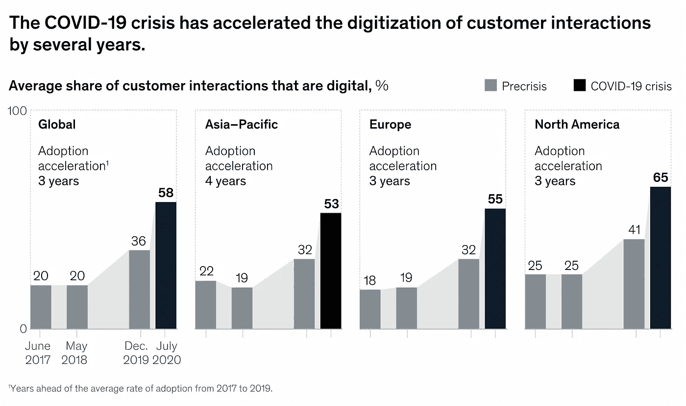
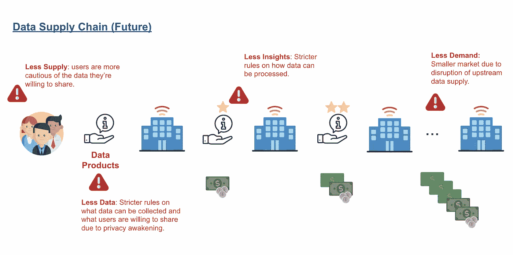
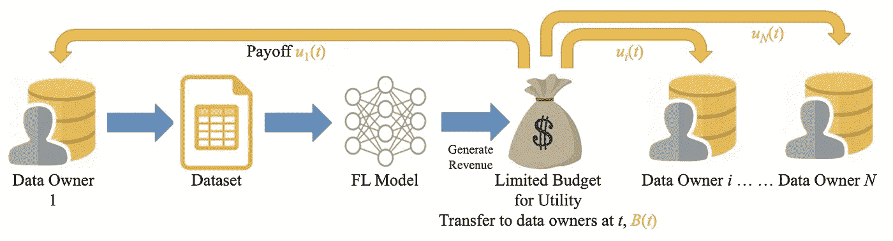
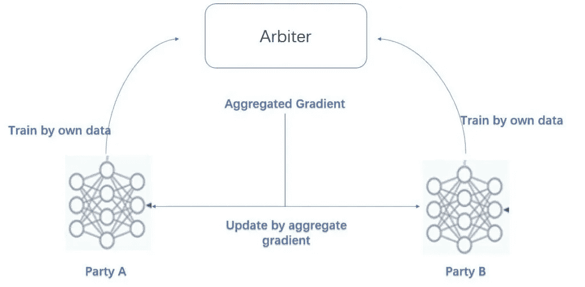

# 数据产品和经济 2.0

> 原文：<https://towardsdatascience.com/data-product-economy-2-0-a4263471fb56?source=collection_archive---------21----------------------->

## 重新思考数据产品及其商业模式

丹尼尔·利维斯·佩鲁西在 [Unsplash](https://unsplash.com/s/photos/abstract-oil-paiting?utm_source=unsplash&utm_medium=referral&utm_content=creditCopyText) 上的照片

**TD；DR** —两种趋势正在定义数据产品和生态系统的未来。在这篇文章中，我讨论了新兴的数据共享范式、激励结构和准协作算法如何让公司保持相关性、生存、跨越，更重要的是，培养可持续的数据生态系统。

AI 复生已经 10 年左右了；公司开始经营用户数据已经有几十年了；自从人们为公平与强者斗争以来，已经有几千年了。数据产品一直是不公平合同的经纪人、财富的分割者和社会动荡的催化剂。

**你可能会想:**嗯，这听起来很适合介绍一部政治小说，但是**作为一名企业高管、产品经理或科技企业家，我有什么错，从中能得到什么？由于两个定义未来的趋势，我们现在必须重新思考如何处理数据产品并采取行动。否则，企业将失去客户，与监管机构发生纠纷，利润率也会受损。作为一个社会，我们将继续被困在一个不公平的契约中。**

## 但是等等，什么是数据产品及其影响？

**数据产品**是一种产生现金的产品或服务——[通常体现在移动和桌面应用](/designing-data-products-b6b93edf3d23)——它与用户互动，在过程中收集数据，不断完善数据，并通过自动决策算法增强未来的服务。

**用户**可以是客户，也可以是员工。**数据**可以是从用户、运营、系统和供应商那里获取的信息；它还包括所有派生数据(即，通过结合用户和运营数据的客户细分数据)。**自动决策算法**是基于规则的基本分析和高级机器学习(ML)，它接收数据并输出用户可以看到并做出反应的东西。所有这三个要素必须协同工作，通过向用户提供更多服务或向其他人出售数据来为公司产生现金。

通过数据产品，我们创建了一个**“数据供应链”**，它建立在用户数据的丰富性、完整性和质量之上:

图 1 —数据供应链(今天)，作者的分析

与咖啡行业类似，用户作为数据生产者(咖啡豆农民)创建和提供数据。公司用数据产品收获用户数据，然后提炼再卖给下游的数据购买者。价值在整个数据供应链中产生、交换和流通。

## **为什么数据产品很重要？**

**拥有数据产品的公司占据主导地位。**在过去 10 年中，专注于数据产品或使用数据产品来补充其现有产品的公司已经占领了市场。

图 2— [最大公司的有形与无形资产](https://ipcloseup.com/2019/06/04/21-trillion-in-u-s-intangible-asset-value-is-84-of-sp-500-value-ip-rights-and-reputation-included/)

更重要的是，无形资产的增长超过了传统资产，如办公室、设备和人员。数据是品牌、专利、关系等无形资产的关键要素之一。

**数据产品创造价值飞轮。在顶级公司，数据产品不仅能产生现金，还能产生更多更好的数据。这使得公司能够复合增长的用户获取和活动，收入和无形资产。**

**数据产品带来弹性。**大多数公司(如果不是全部的话)都受到了 COVID 的影响。在短短几个月内，数据产品公司(蓝色)反弹并保持增长，而其他公司(红色)仍在受苦。

图 3-图 1 中公司的 S&P500 股票价格，从 COVID 开始，雅虎金融，截至 2020 年 12 月 30 日

## 是什么塑造了数据供应链的未来？

两个大趋势正在影响着企业在不久的将来将会(也必须)如何运作。一个是隐私，另一个是经济压力和新冠肺炎带来的加速数字化。这两种趋势都可能扰乱数据产品公司的运营方式，并为其他公司创造跨越式发展的机会。

**隐私觉醒。**全球最大的国家和市场正在实施越来越严格的隐私法。在欧盟，我们有 GDPR；在中国，我们有中华人民共和国网络安全法；在美国，我们有《加州消费者隐私法》(CCPA)；在加拿大，政府正在通过数字宪章实施法案([DCIA](https://www.ic.gc.ca/eic/site/062.nsf/eng/00119.html))——一旦通过，如果不遵守，公司将被罚款全球收入的 5%。

除了自上而下的隐私法规，普通用户对公司如何管理他们的数据更加了解和敏感。最近的 WhatsApp 数据隐私反弹强烈表明，人们对隐私的期望越来越高(也越来越困惑)。

图 4 —消费者对流行应用如何处理用户隐私的反应，2021 年 1 月 12 日— SensorTower

**COVID 捏推**。COVID 正在暂停我们的活动、交易和经济。许多公司正面临现金短缺。根据德勤的分析，没有政府的支持，这不会永远持续下去，许多公司可能只有[2-3 个月的现金跑道](https://www2.deloitte.com/content/dam/Deloitte/global/Documents/About-Deloitte/gx-COVID-19-managing-cash-flow-in-crisis.pdf)。因此，保存现金和发现新的机会来延长现金跑道成为当务之急。

半开玩笑地说， [COVID 已经取代 CTO](https://www.forbes.com/sites/peterhigh/2020/05/26/who-led-your-digital-transformation-your-cio-or-covid-19/?sh=423f4e855323)，成为全球数字化转型的最强冠军。这意味着公司正在更快地推出更多的数据产品。这不是好事吗？是的，但这也意味着公司在未来变得更加依赖数据产品。因此，公司必须做得正确，并适应新的期望。

图 5 — COVID 对数字化客户互动的影响，[麦肯锡 2020 年](https://www.mckinsey.com/business-functions/strategy-and-corporate-finance/our-insights/how-covid-19-has-pushed-companies-over-the-technology-tipping-point-and-transformed-business-forever)

**点点滴滴:**隐私和 COVID 趋势可能会影响数据供应链中的所有参与者。未来数据生态系统的工作方式将会非常不同。

图 6 —数据供应链的挑战(未来)，作者的分析

**未来会有什么不同？**首先，普通用户可能会对公司、数据产品以及他们共享的数据更加挑剔。这将限制推动数据生态系统其余部分的数据供应。其次，数据产品有新的隐私需求需要满足。这将需要重新设计和开发，以继续合法运营。最后，在某些情况下，由于隐私要求和他们过去收集的数据丢失，公司可能无法运行某些高性能算法。这意味着向下游数据消费者提供的产品和价值减少。

我们能做什么？从公司的角度来看，数据产品及其激励结构是控制服务、适应、保持相关性、竞争和跨越的两个因素。

## 数据产品 2.0 应该是什么样子？

当混乱隆隆作响时，机会就出现了。有三种**有前途的解决方案**，我将在本文中介绍，并在后续文章中分享更多细节。[如果你想一起探索更多，请继续关注 Medium](https://medium.com/@ianxiao) 或者在 [LinkedIn](https://www.linkedin.com/in/ianxiao/) 上联系我。

保护隐私。如果我们能够在更好地处理数据的同时遵守更严格的隐私要求，会怎么样？

遵守隐私条例是不容置疑的。但它经常与商业目标相冲突，并被视为创新的倒退。我相信有一种新的方式来实现这一点(而不是妥协的中间地带):我们可以使用隐私保护原则、数据工具和分析技术来允许公司运行传统用例，并探索新的创新方式，而不违背隐私承诺。 [Andrew Trask](https://www.linkedin.com/in/andrew-trask-3763ba15b/) 用一个医疗保健的例子很好地解释了它的工作原理。这开启了一个全新的应用领域。

**创建公平的(更)循环数据经济。**如果我们为创造更好、更多数据的用户付费呢？

简单来说，这意味着一种新的与用户分享利润的商业模式。类似于从储蓄账户获得利息或从投资中获得红利，利润分享安排可以创造一个透明、双赢和积极强化的数据生态系统。

作为数据所有者的个人获得了额外的收入流。公司、数据消费者获得更多更好的数据，并通过数据产品飞轮，实现比没有利润分享计划更高的经济价值。支付可以是现金、信用卡或其他形式的认可。

图 7— [杨](https://www.springer.com/gp/book/9783030630751)隐私保护范式下的利润分享模型

为用户的数据付费并不是一种新模式。忠诚产业已经发展出一种工作模式。机会在于采用类似的功能，并根据用户数据质量和影响来优化经济效益。数据利润分享模式将为公司竞争、创新，更重要的是，维持健康的数据生态系统开辟一条新的途径。

采用一种新的准协作方法来进行机器学习。为了实现利润分享结构，同时尊重生态系统参与者的隐私和专有数据资产，我们需要依赖一种新兴的协作算法，称为 [**【联邦学习】**](https://ai.googleblog.com/2017/04/federated-learning-collaborative.html) **(FL)** 。

图 8——涉及多家竞争中国银行的 FL 示例设计，[微众银行](https://www.fedai.org/cases/utilization-of-fate-in-anti-money-laundering-through-multiple-banks/)

FL 是一种新的计算和算法范式，它允许公司-合作伙伴和竞争对手-在他们没有(也不应该)访问的数据上训练他们的 ML 算法，并跟踪每个数据点对模型改进的贡献，以及最终的业务结果。

**迈向数据产品 2.0 的旅程值得投资吗？我们的未来仍在不可避免的变化中展开。让我们问自己一些尖锐的问题。**

## 数据产品 2.0 和商业模式的未来

*   如果用户可以从他们生成的数据中获得“数据利息”,就像投资在银行的钱一样，会怎么样？
*   如果人们对数据的兴趣是基于其质量和对消费者的影响而产生的，那会怎么样呢？
*   如果公司，甚至是竞争对手，可以在不侵犯隐私和暴露商业秘密的情况下共享数据，会怎么样？
*   如果政府使用市场驱动的方法和政策来鼓励正确使用和保护数据，会怎么样？
*   如果有了新的激励结构和联合学习，公司可以对数据资产进行整体估值，进行更好的会计核算，并在资产负债表上进行跟踪，情况会怎样？

我不知道这些问题的所有答案。我们作为商业和数据社区的集体，可以一起书写我们历史的下一个篇章。

让我们多想想这个。直到下一次。

GIPH

**喜欢你读的东西？**在[媒体](https://medium.com/@ianxiao)、 [LinkedIn](https://www.linkedin.com/in/ianxiao/) 或 [Twitter](https://twitter.com/ian_xxiao) 上关注我。还有，作为一名数据科学家，要不要学习商业思维和沟通技巧？看看我的“[对机器学习的影响](https://www.bizanalyticsbootcamp.com/influence-with-ml-digital)”指南。

以下是我的一些文章，你可能会感兴趣。

</data-science-is-boring-1d43473e353e>  </the-most-realistic-data-science-career-guide-d12c4af87cc8>  </build-full-stack-ml-12-hours-50c310fedd51>  </the-most-useful-ml-tools-2020-e41b54061c58> 