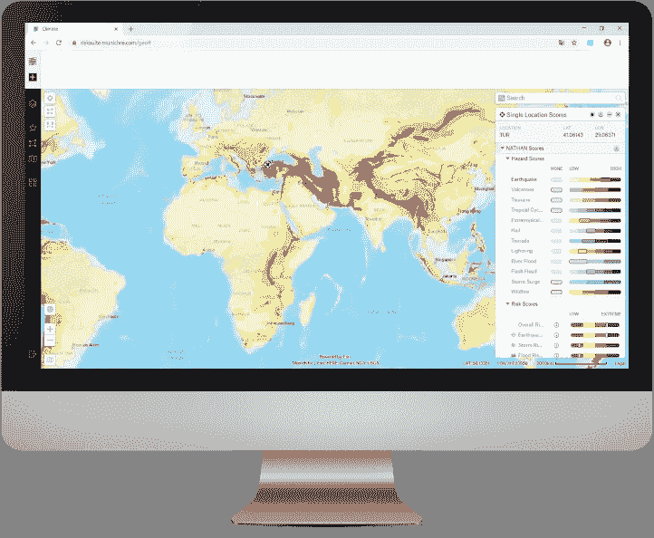
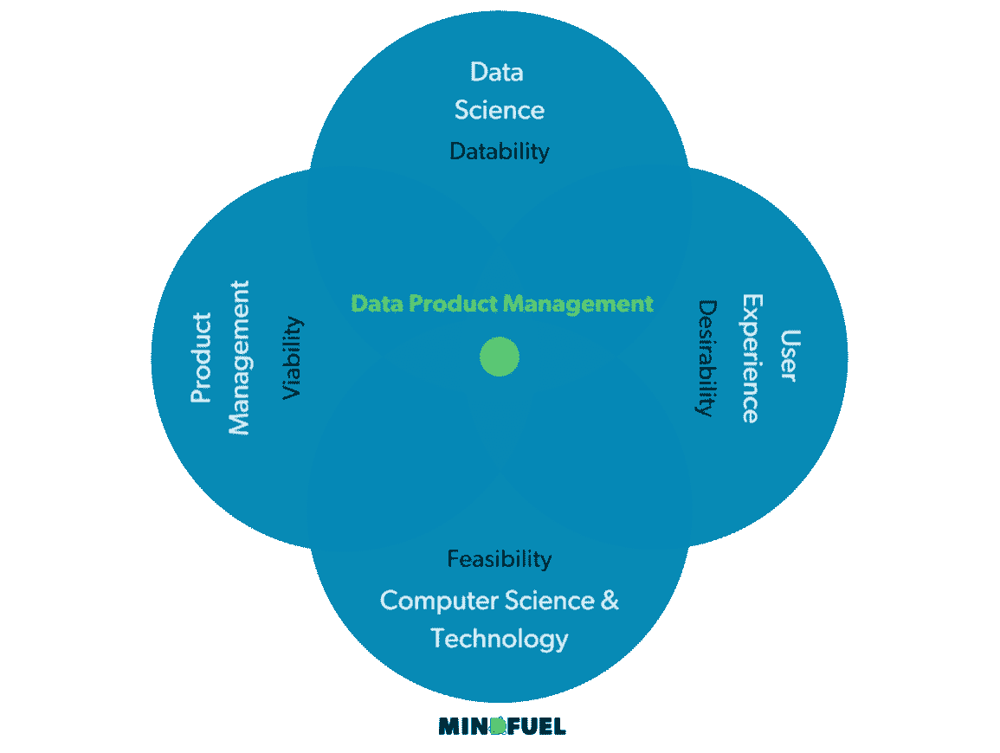

# 数据产品管理

> 原文：<https://towardsdatascience.com/data-product-management-ffa582f7e047?source=collection_archive---------6----------------------->

## 人工智能创造价值的缺失环节

***由 Nadiem von Heydebrand，CEO &联合创始人，***[*mind fuel*](https://www.mindfuel.ai/) ***和 Philipp Hartmann，主管 AI 战略，*** [*施戴*](https://www.appliedai.de/)

Ashkan Forouzani 在 [Unsplash](https://unsplash.com?utm_source=medium&utm_medium=referral) 上拍摄的照片

看看这些天人工智能和机器学习的应用，一个巨大的鸿沟似乎正在打开:一方面，大多数科技公司应用机器学习是常态。事实上，如果不使用机器学习，优步、Airbnb、Zalando 甚至抖音等公司的商业模式今天将不再有效。另一方面，在新冠肺炎疫情中，有一些大公司继续大量投资于数据和人工智能计划( [NewVantage Partners](https://www.newvantage.com/thoughtleadership) )，但只有少数公司报告他们的计划产生了重大的商业影响。大量已启动的 ML 项目仍然停留在 PoC 级别，无法达到投入生产的门槛—研究报告失败率在 80%到 90%之间。

这种在“传统”企业中缺乏影响力，失败项目占比高的原因是什么？当然，有各种各样的原因，例如，技能和人才的竞争，新技术的采用，当然，当你有一个完全数字化的产品而没有遗留的 it 系统时，更容易应用机器学习。但最重要的是，我们越来越频繁地观察到的一个主要原因是缺乏一种*AI*产品思维。许多人工智能计划忘记考虑一个计划为用户创造什么价值，因为人工智能具有内在的特征，使得在计划的早期阶段进行精确的规划相当困难。

这样的挑战针对当今团队中的两类人:

首先，**人工智能人员**目前大多具备技术技能，通常缺乏数字产品管理领域的知识及其流程和方法。

其次，**产品经理**需要了解数据产品的独特要求，以及机器学习功能是如何开发的，因为它们在某种程度上将成为未来任何数字产品的一部分。

我们认为，需要一个专门的学科和角色来使数据驱动的产品取得成功。我们称这个角色为*数据产品经理*。

**用户关心他的问题是否得到解决——而不是机器学习模型是否有 90%或 95%的准确率**

“传统”企业中的人工智能计划通常被组织为项目(T4)，即使目标是开发“数据产品”。它们很大程度上遵循与大型企业中的其他计划类似的结构:应该根据特定的预算约束和时间限制交付预定义的范围。当期望的产出产生时，该计划被认为是成功的。同样，如果一个模型能够以一定的准确度预测某事，机器学习项目通常被认为是成功的。

这有什么问题，为什么？来自数据产品管理领域的项目可能会把你诱入陷阱:许多数据计划和开发——以项目模式管理——承担着忘记用户的风险。当这种情况发生时，最终会导致组织难以真正将数据产品应用到他们的业务流程、产品或服务中。因此，最终完成的项目逐渐消失，没有创造任何业务成果，没有为用户或业务增加真正的价值，也没有促进组织的数据文化。

当然，把用户放在第一位的意识对于人工智能来说既不是新的也不是特定的。然而，人工智能的固有属性使得产品思维的使用成为绝对必须:

首先，在人工智能和人工智能的世界中，组织只能在开发阶段后判断产品或解决方案的全部潜在结果。通常，在开发阶段开始之前，他们只能部分地确定典型的项目参数，如事先规定的产出、预定的结束日期和固定的预算。因此，有了产品思维，计划过程反映的是产品的概念，使用产品发现方法和假设。

其次，AI 解决方案永远不会“完成”或“最终交付”。它们需要与产品生命周期相当的连续交付和运营。因此，组织需要建立一个专门的团队(或多个团队)来负责特定的人工智能产品——就像他们为常规产品所做的那样。该团队负责产品的持续开发及其在组织内的完全集成和采用。

第三，为了充分利用数据产品的价值，必须将它们集成到更大的生态系统中，例如数字产品或平台。将功能集成到整个生态系统中是数字产品管理中的典型任务。

综上所述，AI 和机器学习解决方案的开发应该被认为是“真正的产品”，才能取得成功。说到“产品”，它不仅包括向外部客户提供的服务，还包括内部产品或服务，即任何类型的旨在从数据中创造价值的计划。

**利用慕尼黑再保险公司位置风险情报平台的产品思维**

世界领先的再保险公司慕尼黑再保险公司的例子也清楚地表明了采用产品思维的好处。

为了提供全新的客户体验，风险管理合作伙伴，一个专门从事风险管理解决方案和服务的部门，Munich Re 推出了其独特的 SaaS 风险评估和管理解决方案，以解决公司因自然灾害和气候变化而面临的物理和金融风险。在 2019 年成功上市后，对数据产品生命周期管理的需求迅速成为焦点。通过实施定制的数据产品管理方法，风险管理合作伙伴在以现代方式进一步开发解决方案的同时，还处于持续产品运营的地位。整个产品团队学会了保持竞争优势，以及如何满足客户需求，同时保持高满意度。

慕尼黑再保险公司的位置风险情报/慕尼黑再保险公司许可([https://www . Munich Re . com/en/solutions/for-industry-clients/Risk-suite . html](https://www.munichre.com/en/solutions/for-industry-clients/risk-suite.html))

通过建立跨职能团队，数据产品经理、产品负责人、数据科学家和软件工程师作为一个团队，在过去 12 个月内显著增加了客户群，并在成功的合作中推动了客户和 Munich Re 的业务。从项目组织转变为产品组织并实施数据产品管理有助于风险管理合作伙伴持续发现新功能，并在真正基于数据的业务模式中交付客户成果。

**负责价值创造流程——数据产品经理的角色**

每当与数据科学团队合作时，很快就会发现:人工智能和人工智能学科是工程科学专业的一部分。数据科学家和 ML 工程师通常习惯于关注他们开发的解决方案的技术可行性。这种视角有时会阻碍对确保成功的其他因素的了解，例如，业务案例是否有说服力，或者用户或客户实际需要什么。

从业务角度和用户角度考虑解决方案是产品管理的全部内容。产品管理的口头禅一直是平衡三个维度，即*可行性、生存能力和合意性*。虽然每个维度需要不同的技能，包含不同的工具和方法，但它的组合通常会导致产品成功，从而产生业务成果。

将产品管理原则应用于数据产品，很明显生态系统需要产品经理的一个额外维度:数据能力。该维度满足了对数据领域渊博知识和技能的需求。可数据性的观点评估现有产品想法的数据潜力，并将确定的假设整合到上面解释的产品管理咒语中。因此，通过结合*的可行性、生存力、合意性和数据性*，数据产品可以被概念化、设计，并以适当和成功的方式实现。

数据产品管理人员的定义燃料组获得许可

**建立正确的团队，用产品思维解决人工智能产品**

所以，让我们建立一个未来的产品团队——一个跨职能的团队。为了能够为用户和客户创造价值，我们首先需要指定 AI 模型应该集成的环境:它是否会像数字产品或平台一样集成到另一个系统中？它是否会被部署到某个终端以供消费，例如以仪表板或技术服务的形式？它会作为微服务嵌入到各自的架构中吗？

让我们假设我们想要将它集成到一个数字产品中，这需要与负责的产品团队进行强有力的协作。这会导致以下团队设置:

● *数据产品经理*:他们在与数据产品团队密切合作的同时，通过在相关业务模型内调整业务案例假设，了解客户的需求和愿望，解释潜在的数据功能，从而在数字产品团队中搭建桥梁。

● *数据产品负责人*:数据产品负责人与数据科学团队一起负责数据产品的实现。他们拥有开发，并确保产品满足来自业务领域的所有需求。他们与数据产品经理密切合作，并与他紧密合作。

● *UX 设计师*:UX 设计师支持数据产品经理和数据产品负责人的责任团队，以结构化的方式了解客户的需求。他们创建客户洞察，测试和验证它们，并将其转化为清晰的技术需求和实现概念。在这一点上，重要的是要明白，为了满足用户对后期产品的期望，不仅仅是关于用户界面(前端)的视觉设计，而是关于整个用户体验。

● *数据科学家*:数据科学家摆弄数据。更具体地说，他们从组织内可用的大量数据中获得洞察力。利用他们出色的统计学知识，他们进行分析并发现数据中的模式和结构。他们可以验证和展示数据驱动的用例及假设。

● ML 工程师:ML 工程师实施人工智能系统。他们对整体解决方案负有技术责任，并管理 AI 产品的可扩展性、可再现性和整体质量。

● *数据工程师*:数据工程师与数据科学家和 ML 工程师密切合作，负责所谓的数据管道，从数据源提取数据并将其存储在适当的概念中。在大多数情况下，他们还拥有数据架构，并确保 AI 在可用技术栈上的技术可实现性。

● *DevOps 工程师*:devo PS 工程师搭建通向数字产品团队的技术桥梁。他们与其团队成员密切合作，负责集成部分，测试数据产品 end2end，并与数字产品的技术团队保持一致。

**你如何用产品思维触发创造人工智能产品的过程？**

从产出转向结果，从项目转向产品是一个巨大的进步。涉及到*变化*，高度*结构化*，流程操作*感。这是一种思维方式的转变，因此需要所有利益相关者的自律和一致性。如果你只是觉得有必要为你的人工智能产品开始一个产品思维，我们建议从三件简单的事情开始:*

1.  **命名并指定您想要生成**的*结果*:关于结果的讨论是正确的第一步。集思广益，讨论你希望在流程结束时看到什么样的实际结果，以及谁将从中受益。定义一个目标或 KPI，使其变得切实可行。
2.  **评估您的团队设置，重点关注活动**:每个产品都是不同的，每个用例都需要不同的技能。因此，团队总是有理论上定义的略微不同的角色。虽然角色可能是不同的，但是交付产品所需的活动是不同的，因此团队需要基于要覆盖的活动的数量来设计。在较小的产品中，活动由一个角色负责，例如，数据科学家负责 ML-工程师的活动，或者数据产品负责人负责数据产品经理的活动，每当产品扩展时，角色都需要拆分。
3.  **设计并引入数据产品生命周期过程**:真正的工作从数据产品推出并被用户或客户消费时开始。他们会提供反馈(如果你幸运的话)，这些反馈需要整合到你的开发过程中。你的生命周期管理的专业程度和你能建立的连续性将严重影响成果创造过程，从而影响接受者对它的看法。

当你通过现有的各种方法和工具实现成果创造的可操作性时，一种产品思维模式迟早会出现和建立——数据产品的成功将会增长。最重要的是，你的用户或顾客会为此感谢你。