# 自然语言处理中的数据表示

> 原文：<https://towardsdatascience.com/data-representation-in-nlp-cc9460f855a7?source=collection_archive---------21----------------------->

来源:图片由作者拍摄

## 通过 *n-grams* 、 *tf-idf* 的理论途径，一键编码，单词嵌入。以及预先训练好的模特带来的惊喜。

## 介绍

> 自然语言处理寻求将语言映射到能够被机器学习方法处理的捕获形态、词汇、句法、语义或话语特征的表示。
> 
> Kamath，J. Liu 和 Whitake 2019

在进入算法方法论之前，有必要介绍一下理论的要素。许多当前的方法基于容易忘记的基本原理，因为它们的使用不是直接的。

本节将介绍经典的 NLP 方法，如 N-grams (Broder 等人，1997 年)，tf-idf (Luhn 1957 年；Jones 1972)、一键编码(D. Harris 和 S. Harris 2012)和单词嵌入(Firth 1957 杰拉德·索尔顿 1962；g .索尔顿、黄和杨，1975 年；本吉奥等人，2003 年；Mikolov，Sutskever，Chen，G. Corrado 等，2013)。最后一个小节将处理预训练模型，特别是自变形金刚出现以来出现的模型(Vaswani 等人，2017 年)。

## N-grams

n 元语法指的是文本切割的粒度。当文本以记号的形式被切割时，它是由单个单词的集合的单个字母组成的。当文本被切割成几个词，两个，例如，这被称为二元等。

**举例**:

我是一名人工智能研究员，试图解释数据表示的 NLP 概念

*   **Unigram:** (I)、(am)、(an)、(AI)、(研究员)、(尝试)、(to)、(解释)、(NLP)、(概念)、(of)、(数据)、(表示)
*   **Bigram 或 2-grams: (** I，am)，(am，an)，(an，AI)，(AI，research)，(research，trying)，(trying，to)，(to，explain)，(explain，NLP)，(NLP，concepts)，(concepts，of)，(of，data)，(data，representation)
*   **三元组或三字组:** (I，am，an)，(am，an，AI)，(an，AI，research)，(AI，research，trying)，(research，trying，to)，(trying，to，explain)，(to，explain，NLP)，(explain，NLP，concepts)，(NLP，concepts，of)，(concepts，of，data)，(of，data，representation)

这些 n 元语法中的每一个都被分配一个存在概率 **P(w|h)** 其中 ***w*** 是下一个单词，而 ***h*** 是历史(这是 ***w*** 在语料库中出现的次数)。

如果 **P(这|这水是如此透明以致于)**或者*是句子中的下一个词 ***这水是如此透明以致于*** 人们将不得不计算 ***w*** 跟随 ***h*** 的次数除以 ***h*** 。情商。1 显示了这个概率的计算。*

*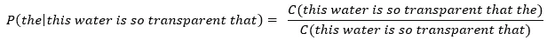*

*情商。1 下一个单词的概率*

*问题来自于统计每一次出现和每一种可能的变异所需的语料库的大小。历史 ***h*** 是一组可以注 ***w_1 的 ***N*** 字；w _ 2；w _ 3；…;w_N*** 。相关的概率因此被写成**P(w _ 1；w _ 2；w _ 3；…;w_N)** 。为了计算这个概率，我们必须使用*链概率定律*(等式。2:联合概率)。*

*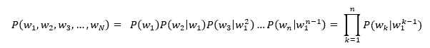*

*等式 2 联合概率*

*为了减少计算时间，需要将这个概率(近似值)减少到前面的几个字。*

*对于二元模型，概率减少到 **P(w|h) ~= P(w|w_1)** 其中 *w_1* 是前一个单词 *w* ，即:*

***P(这个|这个水是如此的透明以至于)～= P(这个|这个)***

*情商。3 给出了这种情况的概括。*

*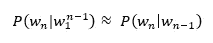*

*等式 3*

*二元模型的概率基于前一个词的假设被称为**马尔可夫假设**或**马尔可夫过程**。马尔可夫模型是一类**概率模型**，它允许我们预测事件或词语，而不必依赖于大量历史。*

*二元模型将基于前一个单词，三元模型基于前两个单词，等等。对 N-gram 的概括给出了基于 **N-1** 先前单词的模型。*

*情商。4 代表这个概率:*

*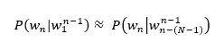*

*等式 4*

*等式 2 和等式 3 之间的差异由等式 2 示出。5*

*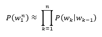*

*等式 5*

*接近这一概率的方法是使用**最大似然估计** (MLE)方法(Stigler 2007)。原理是统计语料库中的出现次数，并在 0 和 1 之间归一化。*

*在二元模型的情况下，我们可以写出等式 6。*

*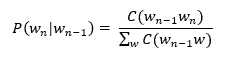*

*等式 6*

*这个等式的常见简化，但不是微不足道的简化，如(Daniel Jurafsky 和 J. H. Martin 2009Daniel Jurafsky 和 J. H. Martin 2020)，就是**以单词 ***w_n-1*** 开头的二元组数之和可以用**单词*****w _ n-1***(Eq。7).***

*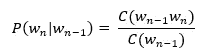*

*等式 7*

*情商。7 可以用与二元模型相同的假设(MLE 方法)推广到 N 元模型。简化是用 N 元语法的出现次数代替出现次数的总和(等式)。8).*

*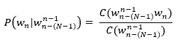*

*等式 8*

*情商。8 通过语料库称为序列的**相对频率。***

*要记住的要点是，N-gram 序列越高，语料库的大小就必须越大。由于**链或加入概率**，该序列被**减少**。该计数由语料库中找到的 N 元文法的总和**来近似。***

## *TF-IDF*

*词频(TF)。在 NLP 中开始研究的一种方法是将文本、非结构化数据转换成单词(记号)的集合——一个“单词包”或“BoW”(z . s . Harris 1954)。因此，单词在这个集合(这个包)中是独立的，并且可以被计数以确定它们出现的频率(术语频率-TF ),称为权重。诸如冠词或连接词等频繁出现的词在文档中有很强的重现性，这使得 TF 更加完美。一个简单的方法是删除这些所谓的“无意义的”停用词。通常优选的是(等式 9)通过文档中单词的总和来归一化单词权重。*

*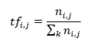*

*等式 9*

*其中 n_ij 表示要估计其 TF 的字，并且*

*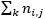*

*文档 k 中单词的总和。*

***逆文档频率(IDF)** 。第二步是计算一个称为逆文档频率(IDF)的术语。情商。10 是用来计算的。它是文档数量 N 与存在术语***df _ I****的语料库中的文档数量之比的对数(以 10 为底)。换句话说，IDF 确定了语料库的所有文档中的稀有词的权重。**

**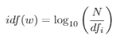**

**等式 10**

**TF-IDF。情商的乘法。9 和情商。10 允许我们获得项-频率-逆-文档-频率(TF-IDF ),它在等式中示出。11.**

**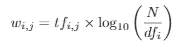**

**等式 11**

**情商。11 可以重写，用等式的比值代替项 ***tf_i，j*** 。9.结果如公式 12 所示。**

**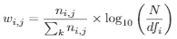**

**等式 12**

**IDF 部分非常重要，因为它允许纠正拼写错误。一般来说，如果一个单词拼写错误，如“example”而不是“example ”,其重要性与拼写正确的单词相同。TF-IDF 纠正了这些错误，因为拼写错误的单词的系数非常低。**

## **一键编码**

**另一种为机器表示文本的方式是创建一个名为“ **One-Hot encoding** ”的矩阵(D. Harris 和 S. Harris 2012Chollet 2017)。这个方法是每个单词的信息的二进制表示。有必要创建包含语料库的唯一单词的向量。然后，在文本的每个单词处，除了单词在单词向量中所处的位置之外，向量将被填充 0。因此，我们创建一个矩阵 ***n x m*** ，其中 ***n*** 是唯一单词的数量，而 ***m*** 是句子中单词的数量。**

**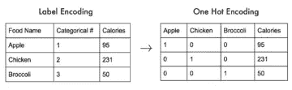**

**图 1:从标记数据到独热编码表示的转换表示(Chollet 2017)**

**图 1 示出了标签编码矩阵和独热编码变换之间的变换。食物名称列中的数据被投影到特征(列)中，当索引对应于该特征时，其内容是包含 0 和 1 的向量。然而，这种方法有一些缺点:**

*   **大向量:向量的大小是语料库中唯一词的数量或语料库中最重要的词的数量(例如:最重要的 10，000 个词)。**
*   **向量中的信息很少:向量是仅包含 0 和 1 的向量，其中索引对应于所考虑的单词(稀疏向量)。**
*   **原始表示:向量不依赖于对数据执行的机器学习。**
*   **缺少上下文:每个向量仅包含所考虑的单词的信息，该单词是向量中包含的唯一信息，因此独立于上下文和单词在上下文中的含义。**
*   **内存大小:在随机存取存储器(RAM)中存储这样的矩阵可能变得无法容纳。**

## **词向量**

**最后一种表示叫做词向量或词嵌入。这种表述来自对语言结构的研究(Z. S. Harris 1954)，并通过短语“*你应该知道它所保持的公司的一个单词*”(Firth 1957)而得到推广。从那时起，直觉导致了这样一种想法，即相似的单词应该在 n 维向量空间(其中 n 是任意数量的上下文单词)中投影出彼此非常接近的向量表示。**

**单词嵌入是单词在多维空间中作为实值(十进制)向量的表示或投影。这个多维空间包含计算相似度的特定单词(表 1)。单词嵌入的维数取决于多维空间的维数。维数通常设置为 300。与一位热编码的矩阵的维数相比，这个多维空间很小。**

**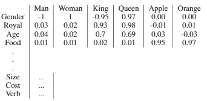**

**表 1:单词嵌入表示。n 维空间的值为 300。**

**表 1 显示了词向量的结构。该索引包括将用来计算特征相似性值的单词(300)。例如，性别指数为男性给出的值为 1，为女性给出的值为-1，为国王给出的值为-0.95，为女王给出的值为 0.97，这三个值对于上下文中的性别来说是接近和相反的。单词 Apple 和 Orange 的值为 0，因为这些单词没有性别区分。**

**这样，每个特征将获得与所选索引的相似性度量，这将给出十进制值的向量或压缩信息的向量(与独热编码矩阵相比)。**

**这种小维度的容量允许在更受限制的上下文中估计值，以便不会对新单词组合产生零概率。对三元组也进行了类似的工作(Jelinek 和 Mercer 1980Katz 1987)来演示没有粒度的较小上下文的相关性。**

**特征向量或单词向量表示与向量空间相关联的单词的不同方面。概率函数被表示为基于前一个词的下一个词的条件概率的乘积。它们是通过神经网络算法最大化称为对数似然的成本函数而获得的(Vail、Valavanis 和 Conrad 1959Box 和 Jenkins 1976)。**

**因此，从给定语料库中的数据计算或“学习”单词向量(Bengio et al. 2003)。词嵌入是密集向量，不像一热编码(稀疏向量——多由 0 组成)(荣 2016；Chollet 2017)。**

**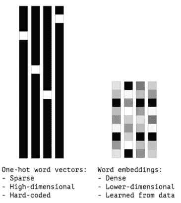**

**图 2:独热编码矩阵表示和单词嵌入的比较(Chollet 2017)**

**图 2 显示了前面两种方法在表示上的差异。这种可视化允许理解单词嵌入的密集方面。**

**将单词表示为向量也允许应用数学运算符。例如，单词嵌入可以加减——Eq 给出了典型的英语示例。13(Turney 2006；Vylomova 等人，2016 年)。**

> **国王-男人+女人=王后(方程式 13)**

**这个操作是更一般的操作 A : B :: C:？(Turney 2006)表明，通过简单的数学运算，向量的上下文允许预测下一个单词。实际上，单词嵌入是为每个应用程序计算的，因为每个用例都不同。因此，有必要调整将计算密集向量的权重的神经网络层(该层被称为嵌入)。**

**然而，单词嵌入有很强的约束。这是偏见。Bolukbasi 等人 2016 年在他们的文章中证明了存在一种自然偏差。这种区分将存在于每个单词之间的相似度的计算中，并且可以根据趋势来偏置模型。这些偏差是模型预训练的文本(语料库)中存在的固有偏差(Garg 等人 2018；布鲁内特等人 2019；赵等 2019；库马尔等人 2020；Papakyriakopoulos 等人 2020)。**

## **预训练模型或语言模型**

****在注意力机制** (Graves、Wayne 和 Danihelka，2014 年)之前，开发预训练模型是为了克服低数据量(或泛化)的问题。当数据量很低或者非常低(几个文档到几十个文档)时，模型不能从数据中学习足够的信息来生成它自己的(准确的)单词嵌入。因此，可以使用预先训练的模型，这些模型的词向量是在大型语料库(几千兆甚至兆兆字节的数据)上计算的。这些大型语料库允许计算语言模型，即包含足够特征(参数)的通才预训练模型，以便能够推断单词的结构和代表性。**

**这些预先训练的模型通常使用共现方法(确定序列中单词关联的数量)来计算(Bengio 等人，2003)。研究和行业中使用的最著名的预训练模型有:**

*   ****Word2vec** (2013)(米科洛夫、陈等 2013；Mikolov，Sutskever，Chen，G. S. Corrado 等，2013；Mikolov、Yih 和 Zweig 2013)，**
*   ****手套** (2014)(彭宁顿、索彻和 c .曼宁 2014)，**
*   ****fastText** (2016) (Joulin，Grave，Bojanowski，Douze 等人 2016；茹林、格雷夫、博雅诺夫斯基、米科洛夫 2016；Bojanowski 等人，2017 年)**
*   ****埃尔莫** (2018)(乔希、彼得斯、霍普金斯 2018；彼得斯等人，2018 年)**

**性能与注意机制相当的不太知名的模型是 ULMFit (Howard 和 Ruder 2018 可以用不同语言的文档进行训练)和 MultiFit (Eisenschlos 等人 2020-ulm fit 的多语言版本)。这两个模型都有由被称为长短期记忆的记忆模型构成的结构(LSTM —霍克雷特和施密德胡伯 1997)。**

****后注意机制**。注意过程的起源来自 Graves，Wayne 和 Danihelka (2014)在《神经图灵机》一文中的观点。这些机制的目标是再现人类大脑在面对信息时的功能，无论是视觉、声音还是书面信息。大脑并不关注整个图像、声音或书面信息。它聚焦于某些区域，注意机制就是基于这个原理。**

**Bahdanau、Cho 和 Bengio (2016)实现了注意力机制，以补偿所谓的 ***seq2seq*** 模型(Sutskever、Vinyals 和 Q. V. 2014)的刚性，这些模型基于 ***编码器-解码器*** 架构(Rumelhart，G. E. Hinton 和 R. J. Williams 1986 乐存 1987；布尔拉德和坎普 1988 年；杰弗里·e·辛顿和泽梅尔 1993)。这些模型由两个组合的神经网络组成。第一个用于解构输入并将其主要信息存储在瓶颈层中，第二个用于重构信息以生成模拟输入。这些方法的问题来自于**瓶颈**层，它在架构中的大小是固定的，不允许长期存储信息和依赖关系(长句子)。**

**有三种类型的注意机制。第一个 ***自我注意*** 程、董、拉帕塔 2016(也叫 ***内注意*** )在每一步对句子的一部分进行聚焦，以获得同一个句子的整体表征。接下来是 ***软关注*** (Bahdanau，Cho，and Bengio 2016K. Xu 等人 2016)，他们的目标是能够将整个句子或图像编码到位。优点是该模型简单且可微，但在计算方面非常昂贵。**

*****努力关注*** (Luong，Pham，and C. D. Manning 2015K. Xu et al. 2016)允许仅使用句子或图像的一部分，这被称为补丁。好处是只使用了**部分信息**，所以减少了推理时间。然而，由于这种局部性，模型必须使用更多的技术组合来训练，因为模型是不可区分的。**

**还有另外两种方法**全局和局部关注**。全局方法与软方法具有相同的行为，但局部方法使硬方法变得不同。**

**2017 年出现了**变形金刚** (Vaswani 等人 2017)，这是软方法的改进，允许在没有 **RNN** 的情况下做 *seq2seq* 。这种结构被称为**自我关注**，在 RNN 中没有序列比对。在变形金刚的基础上，还出现了**多头注意力**机构。这种方法使得并行创建几个注意机制并线性连接所有输出成为可能，就像所谓的**集合**模型。目标是每个头部可以专注于注意力的子空间，以增加模型的准确性。**

**基于变形金刚的预训练模型的非详尽列表:**

*   ****伯特** (2018)(德夫林*等人* 2018)**
*   ****GPT-2** (2019)(拉德福德等人 2019)**
*   **多语种的伯特 ⁴ (2019 年)**
*   ****罗伯塔** (2019) (Y .刘*等* 2019)**
*   ****多语言的 XLM** (2019 年)(兰普尔和康诺 2019 年)**
*   **福楼拜(V1–2019)(h . Le 等人 2020)**
*   **卡门贝干酪 (2020 年)(马丁等人，2020 年)**
*   ****XLM-R** (2020 年)(康诺等人 2020 年)**
*   ****极限**2020(胡等 2020)**
*   **GPT 三号(2020 年)(布朗等人，2020 年)**
*   ****开关变压器** (2021) (Fedus、Zoph 和 Shazeer 2021)**

**型号的准确列表可以在[拥抱面](https://huggingface.co/)上找到。变形金刚的问题是学习过程和推理时间非常短。为了纠正这一点，2017 年以来发布了不同的架构:LongFormers (Beltagy，M. E. Peters 和 Cohan 2020)，Fastformers (Kim 和 Awadalla 2020)，Reformers (Kitaev，Kaiser 和 Levskaya 2020)，Big Bird (Zaheer 等人 2021)。**

## **结论**

**通过这篇文章，我们回顾了 NLP 世界中不同的数据表示方法。我还介绍了预先训练的模型，当您拥有少量数据或要获得更精确的模型时，这些模型非常有用。NLP 环境的实际主导是注意机制方法，以变形金刚体系结构的形式出现。最广为人知和使用的预训练模型是 BERT，它除了用于谷歌搜索引擎之外，还用于日常生活。但是，许多辩论和建议，以及请愿书都是为了防止使用非常大的预训练语言模型，如 GPT-3 或现在的开关变压器(数万亿个参数)。人工智能世界中的一个重要浪潮是关于 Timnit Gebru 关于使用大型语言模型的危险的文章。**

## **参考**

**吴恩达在 Coursera 平台上的在线课程(MOOC) [单词表示的深度学习专业化](https://www.coursera.org/lecture/nlp-sequence-models/word-representation-6Oq70) —自然语言处理&单词嵌入部分期间展示的表格。
Lilian Weng 在博客上提供了一个极好的调查“ [Lil'Log](https://lilianweng.github.io/lil-log/2018/06/24/attention-attention.html) ”和[第二篇文章](https://lilianweng.github.io/lil-log/2020/04/07/the-transformer-family.html)
另一个资源是 Jay alam mar[*the illustrated transformer*](http://jalammar.github.io/illustrated-transformer/)
⁴[https://ai . Google blog . com/2020/08/language-agnostic-Bert-sentence . html](https://ai.googleblog.com/2020/08/language-agnostic-bert-sentence.html)
⁵[https://ai . Google blog . com/2008](https://ai.googleblog.com/2020/04/xtreme-massively-multilingual-multi.html)**

****文章****

*   **Bahdanau、Dzmitry、Kyunghyun Cho 和 Yoshua Bengio(2016 年)。*神经机器翻译通过共同学习对齐和翻译*。arXiv: [1409.0473](https://arxiv.org/abs/1409.0473)**
*   **Beltagy，Iz，Matthew E. Peters 和 Arman Cohan (2020)。 *Longformer:长文档转换器*。arXiv:2004.05150**
*   **Bengio，Yoshua 等人(2003 年 3 月)。*一个神经概率语言模型*。在:j .马赫。学习。第 3 号决议，第 1137-1155 页。刊号:1532–4435。**
*   **Bojanowski，Piotr 等人(2017 年)。*用子词信息丰富词向量*。《计算语言学协会汇刊》第 5 卷，第 135-146 页**
*   **博卢克巴斯、托尔加等人(2016 年)。男人对于电脑程序员就像女人对于家庭主妇一样？去除单词嵌入"。收录于:第 30 届国际神经信息处理系统会议录。乳头 16。西班牙巴塞罗那:柯伦联合公司，第 4356–4364 页。ISBN: 9781510838819。**
*   **h .和 y . Kamp(1988 年 9 月)。*多层感知器的自动关联和奇异值分解*。在:生物。cyber n . 59.4-5，第 291-294 页。刊号:0340–1200。**
*   **盒子，乔治。E.P .和 Gwilym M. Jenkins (1976 年)。时间序列分析:预测和控制。霍尔登日。**
*   **Broder，Andrei Z .等人(1997 年)。*网页的句法聚类*。计算机网络和 ISDN 系统 29.8。第六届国际万维网会议论文，第 1157-1166 页。刊号:0169–7552。**
*   **Brown，Tom B .等人(2020 年)。*语言模型是一次性学习者*。 [arXiv:2005.14165](https://arxiv.org/abs/2005.14165)**
*   **布鲁内特、马克-艾蒂安等人(2019 年 9 月)。*理解单词嵌入偏差的来源*。在:艾德。Kamalika Chaudhuri 和 Ruslan Salakhutdinov，第 97 卷。机器学习研究论文集。美国加州长滩:PMLR，第 803–811 页。**
*   **程、、、米雷拉·拉帕塔(2016)。*用于机器阅读的长短期记忆网络*。 [arXiv:1601.06733](https://arxiv.org/abs/1601.06733)**
*   **弗朗索瓦·乔莱(2017)。*用 Python 进行深度学习*。第一名。美国:曼宁出版公司 ISBN: 1617294438**
*   **Conneau，Alexis 等人(2020 年)。*大规模无监督跨语言表征学习*。 [arXiv:1911.02116](https://arxiv.org/abs/1911.02116)**
*   **Devlin，Jacob 等人(2019 年)。 *BERT:用于语言理解的深度双向转换器的预训练*。arXiv:1810.04805**
*   **艾森施洛斯、朱利安·马丁等人(2020 年)。 *MultiFiT:高效的多语言语言模型微调*。arXiv:1909 年。04761**
*   **Fedus，William，Barret Zoph 和 Noam Shazeer (2021 年)。*开关变压器:利用简单有效的稀疏性扩展到万亿参数模型*。arXiv:2101.03961 [cs。LG】。**
*   **弗斯博士(1957 年)。语言学理论概要，1930 年至 1955 年。网址:https://books.google.ca/books？id=T8LDtgAACAAJ。**
*   **加尔格、尼基尔等人(2018 年)。单词嵌入量化了 100 年来的性别和种族刻板印象。发表在:美国国家科学院院刊 115.16，e 3635–e 3644。刊号:0027–8424。DOI:10.1073/PNAS . 1720347115 . eprint:https://www .pnas。org/content/115/16/e 3635 . full . pdf . URL:https://www . PNAS . org/content/115/16/e 3635。**
*   **格雷夫斯、亚历克斯、格雷格·韦恩和伊沃·达尼埃尔卡(2014)。*神经图灵机*。arXiv:1410.5401 [cs。NE】。**
*   **哈里斯博士和哈里斯博士(2012 年)。*数字设计与计算机架构*。工程专业收藏。爱思唯尔科学。ISBN: 9780123944245。网址:https://books.google.ca/books？id=-DG18Nf7jLcC。**
*   **泽利格·哈里斯(1954)。*分布结构*。in:word 10.2–3，第 146–162 页。DOI:10.1080/00437956.1954。11659520.eprint:https : / / doi。org/10 . 1080/00437956 . 1954 . 11659520 . URL:https://doi . org/10.1080/00437956 . 1954 . 11659520。**
*   **辛顿，杰弗里 e 和理查德 s 泽梅尔(1993 年)。*自动编码器、最小描述长度和亥姆霍兹自由能*。第六届神经信息处理系统国际会议论文集。93 年的 NIPS。科罗拉多州丹佛市:摩根考夫曼出版公司，第 3-10 页。**
*   **Hochreiter、Sepp 和 Jürgen Schmidhuber (1997 年)。*长短期记忆*。摘自:神经计算 9.8，第 1735-1780 页。**
*   **霍华德、杰里米和塞巴斯蒂安·鲁德(2018)。用于文本分类的通用语言模型微调。arXiv:1801.06146 [cs。CL】。**
*   **胡，等(2020)。XTREME:一个评估跨语言通用化的大型多语言多任务基准。arXiv:2003.11080 [cs。CL】。**
*   **耶利内克，弗雷德和罗伯特 l .默瑟(1980)。*稀疏数据马尔可夫源参数的插值估计*。《模式识别实践研讨会论文集》。由…编辑作者:埃德扎德·s·盖尔塞马和拉维恩·卡纳尔。阿姆斯特丹:北荷兰，第 381–397 页。**
*   **卡伦·斯派尔克·琼斯(1972)。*术语特异性的统计解释及其在检索中的应用*。载于:文献杂志 28，第 11-21 页。**
*   **乔希、维杜尔、马修·彼得斯和马克·霍普金斯(2018)。*使用几十个部分注释的例子将解析器扩展到远处的领域*。arXiv:1805 .06556CL】。**
*   **Joulin、Armand、Edouard Grave、Piotr Bojanowski、Matthijs Douze 等人(2016 年 12 月)。 *FastText.zip: Com-pressing 文本分类模型*。**
*   **Joulin、Armand、Edouard Grave、Piotr Bojanowski 和 Tomas Mikolov (2016)。*高效文本分类的锦囊妙计*。arXiv:1607.01759 [cs。CL】。**
*   **朱拉夫斯基，丹和詹姆斯马丁(2020)。*言语和语言处理*(第三版。草稿)。英语(美国)。斯坦福大学网站。网址:https : / / web。斯坦福。edu/~茹拉夫斯基/SLP 3/(2020 年 3 月 11 日访问)。**
*   **朱拉夫斯基、丹尼尔和詹姆斯·马丁(2009 年)。*语音和语言处理*(第二版)。美国:普伦蒂斯霍尔有限公司国际标准书号:0131873210。**
*   **Kamath，u .，J. Liu 和 J. Whitaker (2019 年)。*NLP 和语音识别的深度学习*。斯普林格国际出版公司。ISBN: 9783030145965。网址:https://books.google.ca/books？id=8cmcDwAAQBAJ。**
*   **Kanis，Jakub 和 Lucie skorkovska(2010)。*通过信息检索性能的手段比较不同的词条化方法*。收录于:第 13 届国际文本、演讲和对话会议录。TSD 10 年。捷克共和国布尔诺:施普林格出版社，第 93-100 页。ISBN: 3642157599。**
*   **Katz，S. (1987 年)。*从语音识别器的语言模型组件的稀疏数据中估计概率*。摘自:IEEE 声学、语音和信号处理汇刊 35.3，第 400-401 页。DOI:10 .1109/TASSP.1987.1165125。**
*   **金英镇和哈尼哈桑阿瓦达拉(2020)。*快速成型器:高效的自然语言理解转换模型*。arXiv:2010.13382[cs。CL】。**
*   **基塔耶夫、尼基塔、祖卡斯·凯泽和安塞姆·列夫斯卡娅(2020)。*重整器:高效变压器*。arXiv:2001.04451 [cs。LG】。**
*   **Kumar，Vaibhav 等人(2020 年)。护士比外科医生更接近女性？减轻单词嵌入中性别偏见的近似性。arXiv:2006.01938 [cs。CL】。**
*   **Lample，Guillaume，Miguel Ballesteros 等人(2016 年)。*命名实体识别的神经架构*。In:CoRRabs/1603.01360。arXiv:1603.01360。**
*   **兰普尔、纪尧姆和亚历克西斯·康诺(2019)。*跨语言语言模型预训练*。arXiv:1901 .07291CL】。**
*   **乐，杭等(2020)。*福楼拜:法语无监督语言模型预训练*。arXiv:1912 .05372CL】。**
*   **Yann le Cun(1987 年 6 月)。*博士论文:Modeles connexionnistes de l ' apprentissage(联结主义学习模型)*。英语(美国)。居里大学(巴黎第六大学)。**
*   **刘，等(2019)。RoBERTa:稳健优化的 BERT 预训练方法。arXiv:1907.11692[cs。CL】。**
*   **卢恩，惠普(1957)。“文学信息机械化编码和搜索的统计方法”。摘自:IBM 研究与开发杂志 1.4，第 309–317 页。DOI:10.1147/rd.14.0309**
*   **Luong、Minh-Thang、Hieu Pham 和 Christopher D.Manning (2015 年)。基于注意力的神经机器翻译的有效方法。arXiv:1508.04025[cs。CL】。**
*   **马丁、路易斯等人(2020)。“卡门贝干酪:美味的法语模型”。《计算语言学协会第 58 届年会论文集》。DOI:10.18653/v1/2020 . ACL-main . 645 . URL:http://dx . DOI . org/10.18653/v1/2020 . ACL-main . 645**
*   **米科洛夫、托马斯、程凯等人(2013 年)。向量空间中单词表示的有效估计。arXiv:1301.3781 [cs。CL】。**
*   **米科洛夫、托马斯、伊利亚·苏茨基弗、程凯、格雷格·斯科拉多等人(2013 年)。“单词和短语的分布式表示及其组合性”。神经信息处理系统进展。由…编辑由 C. J. C. Burges 等人撰写，第 26 卷。CurranAssociates 公司，第 3111-3119 页。网址:https://proceedings . neur IPS . cc/Paper/2013/file/9aa 42 b 31882 EC 039965 f 3c 4923 ce 901 b—Paper . pdf**
*   **米科洛夫、托马斯、伊利亚·苏茨基弗、程凯、格雷格·科拉多等人(2013 年)。词和短语的分布式表示及其组合性。arXiv:1310.4546[cs。CL】。**
*   **Mikolov、Tomas、Wen-tau Yih 和 Geoffrey Zweig(2013 年 6 月)。“连续空格词表示法中的语言规则”。《计算语言学协会北美分会 2013 年会议记录:人类语言技术》。佐治亚州亚特兰大:计算语言学协会，第 746–751 页。网址:https://www . ACL web . org/prophet/N13–1090。**
*   **Papakyriakopoulos，Orestis 等人(2020 年)。“单词嵌入中的偏差”。摘自:2020 年公平、问责和透明会议论文集。胖*'20。西班牙巴塞罗那:计算机械协会，第 446–457 页。ISBN: 9781450369367。DOI:10.1145/3351095.3372843 . URL:https://DOI . org/10.1145/3351095.3372843。**
*   **彭宁顿、杰弗里、理查德·索彻和克里斯托弗·曼宁(2014 年 10 月)。“手套:单词表示的全局向量”。载于:2014 年自然语言处理经验方法会议录(EMNLP)。卡塔尔多哈:计算语言学协会，第 1532–1543 页。DOI:10.3115/v1/D14–1162。网址:https://www . ACL web . org/选集/D14-1162。**
*   **彼得斯，马修等人(2018 年 6 月)。“深层语境化的词语表达”。载于:计算语言学协会北美分会 2018 年会议录:人类语言技术，第 1 卷(长论文)。路易斯安那州新奥尔良:计算语言学协会，第 2227-2237 页。DOI:10.18653/v1/N18–1202。网址:https://www . ACL web . org/选集/N18-1202。皮雷、特尔莫、伊娃·施林格和丹·加雷特(2019)。多语伯特的多语水平如何？arXiv:1906.01502[cs。CL】。**
*   **拉德福德、亚历克等人(2019 年)。语言模型是无人监督的多任务学习者。**
*   **荣，辛(2016)。 *word2vec 参数学习讲解*。arXiv:1411.2738 [cs。CL】。**
*   **鲁梅尔哈特，丁顿和威廉姆斯(1986)。*通过错误传播学习内部表征*。并行分布式处理:认知微观结构的探索，第 1 卷:基础。美国麻省剑桥:麻省理工学院出版社，第 318–362 页。ISBN:026268053X。**
*   **Salton，g . a . Wong 和 c . s . Yang(1975 年 11 月)。“用于自动索引的向量空间模型”。在:Commun。ACM18.11，第 613-620 页。刊号:0001–0782。DOI:10.1145/361219.361220 . URL:https://DOI . org/10.1145/361219.361220。**
*   **杰拉德·索尔顿(1962)。*生成单词和文档关联的一些实验*。在:1962 年 12 月 4 日至 6 日，秋季联合计算机会议记录。AFIPS '62(秋季)。宾夕法尼亚州费城:计算机械协会，第 234-250 页。ISBN: 9781450378796。DOI:10.1145/1461518.1461544 . URL:https://DOI。org / 10。1145 /1461518.1461544.**
*   **斯蒂芬·斯蒂格勒(2007 年 11 月)。最大可能性的史诗故事。摘自:统计科学 22.4，第 598-620 页。刊号:0883–4237。DOI:10.1214/07- sts249。网址:http://dx . doi . org/10.1214/07-STS 249。**
*   **Sutskever、Ilya、Oriol Vinyals 和 Quoc V. Le (2014 年)。*用神经网络进行序列对序列学习*。arXiv:1409.3215 [cs。CL】。**
*   **彼得·特尼(2006 年 9 月)。*语义关系的相似性*。摘自:计算语言学 32.3，第 379-416 页。刊号:1530–9312。DOI:10.1162/coli . 2006 . 32 . 3 . 379 . URL:http://dx . DOI . org/10.1162/coli . 2006 . 32 . 3 . 379**
*   **Vail，S.V .，S. Valavanis 和 A.H. Conrad (1959)。*计量经济学:最大似然法简介*。经济学手册系列。麦格劳-希尔。网址:https://books.google.ca/books？id =ZRcYAAAAIAAJ。**
*   **Vaswani，Ashish 等人(2017 年)。你所需要的只是注意力。arXiv:1706.03762 [cs。CL】。**
*   **Vylomova，Ekaterina 等人(2016 年)。*Take and Take，Gaggleand Goose，Book and Read:评估向量差异对词汇关系学习的效用*。arXiv:1509.01692 [cs。CL】。**
*   **徐，开尔文等人(2016)。*展示、参与和讲述:视觉注意的神经图像字幕生成*。arXiv:1502.03044 [cs。LG】。**
*   **Zaheer，Manzil 等人(2021 年)。*大鸟:更长序列的变形金刚*。arXiv:2007.14062 [cs。LG】。**
*   **赵、解宇等(2019 年 6 月)。*语境化词语嵌入中的性别偏见*。载于:计算语言学协会北美分会 2019 年会议录:人类语言技术，第 1 卷(长短论文)。明尼苏达州明尼阿波利斯:计算语言学协会，第 629-634 页。DOI:10.18653/v1/N19–1064。网址:https://www . ACL web . org/选集/N19-1064。**