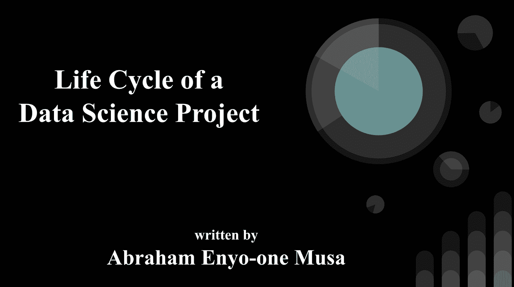
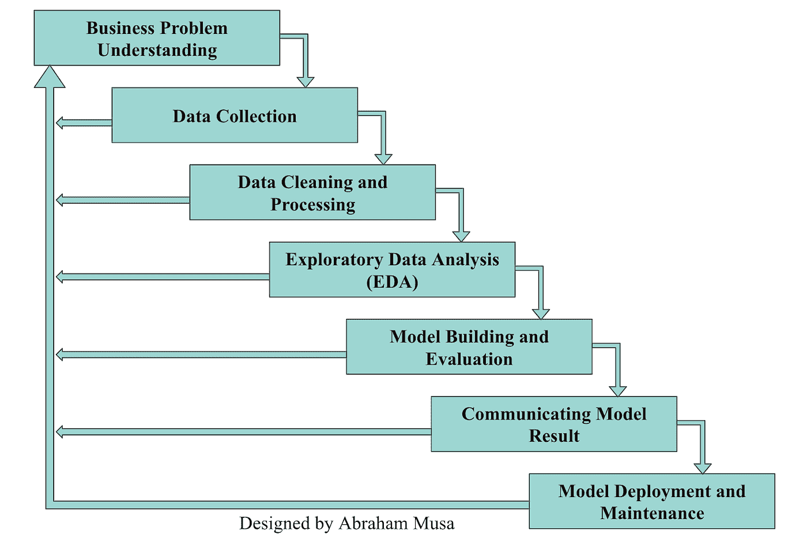

# 数据科学 101:数据科学项目的生命周期

> 原文：<https://towardsdatascience.com/data-science-101-life-cycle-of-a-data-science-project-86cbc4a2f7f0?source=collection_archive---------4----------------------->

我第一次听到数据科学这个词是在大学里，当时我的导师 Francisca Oladipo 教授和 Dayo Akinbami 选修了一门名为**“数据科学导论”的课程。**

在进入大学之前，我不知道在计算机科学领域选择什么职业道路(**因为我心里有几个选择**)。但是，我很高兴我参加了数据科学入门课程。我至少可以说，它激励我找到了一条更好的道路，并开始了数据科学生涯，我感谢我已经走了这么远。

虽然我不是这篇文章的主题，但我认为您了解我是如何进入数据科学领域的很好。我也希望用我的故事来激励你，如果我能走到这一步，你可以做得更多。请注意，我才刚刚开始，我的愿景是在未来几年内成为世界级的数据专家(以所有标准衡量)。

> 我写这篇文章的主要目的是揭开“**数据科学**这个词的神秘面纱，帮助个人和企业理解它的含义以及构建数据科学模型所涉及的不同阶段。在后续文章中，我将讨论基于数据科学的角色以及成为顶尖数据科学家所需的技能。

我知道[我们不能都成为数据科学家](/have-all-scientists-become-data-scientists-b6536d38ced1)。然而，如果这篇文章至少能帮助一个人找到进入数据科学的正确途径，就像数据科学课程激励我开始学习一样，那我的快乐就完整了。

让我们一起来解决这个问题。

# 什么是数据科学？

术语“数据科学”是当今互联网上最常见的流行语之一，但它往往是一个难以理解的概念。如果你请三位专家解释数据科学的含义，你很可能会得到四种不同的定义。

出于本文的目的，我更愿意坚持这个定义:

“数据科学是一个多学科的研究领域，它结合了编程技能、领域专长以及统计和数学知识，以从数据中提取有用的见解和知识”。从事数据科学的人被称为“**数据科学家**”。他们结合了广泛的技能和现代技术来分析从传感器、客户、智能手机、网络和其他来源收集的数据。

让我们稍微分解一下。你还记得当你在电子商务平台上浏览一个产品时，你最终会看到一条相关产品放在产品详情的下面，标题是***购买该商品的客户还购买了……***或***经常一起购买***？这是亚马逊等大型零售商使用的一项伟大的数据科学技术，用于发现商品之间的关联，并向新老客户交叉销售。

我认为数据科学是当今最令人兴奋的领域之一，有太多的原因让它成为几乎每个行业或领域的流行语。**其中一个主要原因是，每个组织都有一个数据宝库，可以提供巨大的好处**。第二个原因是数据科学是推动数字经济的变革性和无价的技术，就像石油推动工业经济一样。

如果操作正确，数据科学会产生有价值的见解并揭示趋势，企业可以利用这些见解和趋势进行战略规划、优化业务流程、做出更明智的决策、创造更多创新服务和产品等等。典型的数据科学生命周期包括几个阶段。在下一节中，我将向您展示不同的阶段以及每个阶段涉及的内容。

# 数据科学项目生命周期

许多组织和个人都在谈论数据科学项目和产品，但只有少数人了解构建数据科学产品或模型的步骤。到目前为止，我发现只有少数组织拥有适合数据科学的基础设施。大多数现代企业需要经历重大转型才能从数据科学中受益。

在本文的剩余部分，我将讨论构建数据科学模型或产品所需的不同步骤。每个组织都可以采用这种方法，不管他们所处的位置或规模如何。

# 业务问题理解

在开始收集数据和建立机器学习模型之前，你要做的第一件事是**定义和理解你试图解决的问题**。您需要能够将业务需求转化为数据科学问题和可行的步骤。实现这一点的一个好方法是，与您希望改善或优化其业务或流程的合适人员接触，并提出适当的问题。

我认为数据科学产品或模型不应该孤立存在。相反，他们应该帮助企业转变现有的业务运营，改善业务流程，或者确定客户评价差和销售差的原因和可能的解决方案，等等。因此，真正了解业务问题并评估您是否可以使用数据科学解决它是有帮助的。这是因为并不是所有的商业问题都可以用数据科学来解决。对业务问题的更好理解增加了您构建伟大的数据驱动产品的机会，这些产品可以对组织产生积极的影响。

# 数据收集

理解问题后的下一步是**收集正确的数据集**。数据收集是必不可少的，如果没有高质量的数据或收集数据的机制，构建一个好的模型几乎是不可能的。

根据我的研究和与几位数据科学专业人士的互动，我可以明确地说，许多组织收集不可靠、不完整的数据，他们事后做的一切都是一团糟。一些组织甚至不知道要收集哪种数据，也不知道数据存放在哪里。

我相信要收集的数据取决于您试图解决的业务问题。例如，用于客户信用风险分析的完美数据通常应该包括人口统计数据、贷款信息、还款数据、交易报表或电信数据。对于同样的问题，收集顾客身高、鞋码或裤长的数据是相当不合适的。

随着 web 抓取、云数据收集工具和 web APIs 等现代技术的出现；像 MongoDB、PostgreSQL 和 MySQL 这样的数据库系统；而像 SQL、Python、R、美汤、Scrapy、Spark、Apache、e.t.c 这样的工具，可以随时随地提取有价值的数据。

# 数据清理和处理

仅仅收集原始数据而不进行处理是不够的。就像纯金一样，纯原始数据几乎没有用处。在收集了适当的数据集之后，**您需要在继续下一步之前充分清理和处理数据**。

在一个理想的世界里，你更有可能收集非结构化的、不相关的和未经过滤的数据。如果你在没有数据处理和清理的情况下继续构建 ML 模型，你的分析结果肯定没有任何意义。就这么简单:**坏数据产生糟糕的模型**，不管你如何调整参数或者优化你的模型的超参数。在很大程度上，分析的准确性和有效性高度依赖于数据的质量。

作为一名数据科学家，我遇到过几种形式的数据问题，包括重复值和空值、不一致的数据类型、缺失数据、无效条目、不正确的格式等等，我必须在继续之前解决这些问题。

值得注意的是，大多数数据科学家的时间都花在了数据收集、清理和处理上。一些数据专业人士甚至认为，数据项目花费了 80%的时间。如果您想要构建出色的数据科学模型，您需要找到并解决数据集中的缺陷和不一致。尽管数据清理是痛苦而繁琐的，但只要你专注于最终目标，你就会从中受益。

# 探索性数据分析

此时，您已经有了丰富的数据。您已经能够清理和处理尽可能有组织的数据。是时候**深入检查所有的数据特征、数据属性，建立对数据的信心，获得对数据的直觉，进行健全性检查，找出如何处理每个特征。e.t.c** 这整个过程被称为探索性数据分析(EDA)——*数据科学中的常用词之一。*

EDA 涉及多种形式的分析，包括单变量分析、双变量分析、缺失值处理、异常值处理、变量转换、特征工程和相关性分析。一个有效的 EDA 策略提供了一个合适的基础，您需要从您的原始特性集创建更好的、高度可预测的和稳定的预测器。

我喜欢 EDA 的原因之一是，它帮助我向数据提出几个问题，更好地探索和可视化不同的数据集以识别模式，并揭示在 ML 生命周期的后续步骤中有用的有价值的见解。这也让我有了创新和分析的思维。

# 模型建立和评估

模型构建和评估阶段是您对数据进行实际建模的阶段。事实上，许多数据科学家认为在这个阶段“真正的奇迹发生了”。在这一阶段，你要做的第一件事就是把上一步清理过的数据集分成训练集和测试集。

您应该使用训练集来构建预测模型，并评估模型在看不见的数据点(测试集)上的性能。最大似然问题通常分为有监督的和无监督的。监督学习包括建立一个模型，该模型可以使用一组称为预测器的特征来准确预测目标变量。而无监督学习是一种自学习方法，其中模型必须找到所有类型的未知模式和所有预测器之间的关系。

您可以使用几个评估指标来检查您的模型工作得有多好，并且要使用的指标的选择取决于您试图解决的问题的类型。我不会用那些机器学习术语来烦你。也许，我很快会写一篇关于监督和非监督问题的一些常见评价指标的文章。

根据评估结果，您可能需要调整模型的参数，以确保它能够很好地概括，并且在暴露于以前看不到的数据时能够很好地工作。这个过程被称为超参数调优，我相信随着您构建更多的模型并使用多个参数值进行练习，您会越来越擅长这个过程。

# 传达模型结果

在构建和评估模型之后，您需要交流模型结果并向风险承担者展示您的发现。

> 根据我的经验，我发现高层管理人员对你用来建立模型的花哨算法或使用的超参数数量不感兴趣。他们主要感兴趣的是了解他们可以用你的模式做什么，以及它将如何推动他们的业务向前发展。

因此，每个数据科学家都需要有良好的演示和数据讲述技能，以展示模型如何帮助解决生命周期第一阶段中确定的业务问题。在你的演示幻灯片上使用复杂的措辞和公式不会让你走得太远。但是通过以精确和简洁的方式展示你的模型的真正价值，高管们会更容易采用这个模型。

# 模型部署和维护

沟通通常不是数据科学项目生命周期的最后一个阶段。一旦涉众对您的模型结果感到满意，下一步就是部署模型。**机器学习模型不会永远驻留在本地机器上**。它需要为组织创造价值，而使用该模型做出实际的、数据驱动的决策的唯一方法是将其交付给最终用户。我喜欢 Luigi Patruno 在这篇[文章](https://mlinproduction.com/deploying-machine-learning-models/)-“**没有机器学习模型是有用的，除非它被部署到生产中**。

我真的不喜欢模型部署过程，因为它有时会变得非常繁琐。此外，它涉及到数据科学家、商业专家、软件工程师和 it 团队之间的许多来回。在这一节中，我要提到的最后一件事是模型维护。当我第一次涉足数据科学时，我一直认为数据科学家可以构建一个模型，部署它，然后在模型永远工作的同时放松下来。**但是，没过多久我就发现，就像机器需要维护一样，机器学习模型也需要维护**。

“**部署一次，永远运行**”的实践是不好的，因为几个因素可能会随着时间的推移影响 ML 模型的预测能力。**新冠肺炎疫情是不可预测事件**的一个很好的例子。我期望所有的组织已经更新或者已经计划更新他们在疫情之前建立的所有 ML 模型，以捕捉在疫情期间暴露的新的客户模式和行为。一般来说，每个组织都应该有一个模型升级策略，用于不断更新他们的数据和重新训练他们的 ML 模型— **可能是 3、6 或 9 个月的间隔**。

# 摘要

在这篇文章中，我解释了数据科学的含义。之后，我描述了数据科学项目生命周期的不同阶段，包括业务问题理解、数据收集、数据清理和处理、探索性数据分析、模型构建和评估、模型交流、模型部署和评估。

我假设您现在已经了解了数据科学的工作原理以及构建数据科学模型所需的步骤。如果您有进一步的问题或需要更多的澄清，请不要犹豫，在下面留下您的评论。在我的后续文章中，我将讨论行业中不同的数据科学角色，以及成为顶尖数据科学家所需的技能。

***感谢阅读。你可以与你的朋友和网络分享这篇文章。***