# 数据科学——对 Kaggle“谷歌 Play 商店应用”数据集的综合分析

> 原文：<https://towardsdatascience.com/data-science-a-deep-analysis-on-google-play-store-apps-from-kaggle-8283bbc508b0?source=collection_archive---------15----------------------->

照片由[莫希·赛义德](https://www.pexels.com/@luckysam?utm_content=attributionCopyText&utm_medium=referral&utm_source=pexels)从[派克斯](https://www.pexels.com/photo/mobile-phone-samsung-edge-samsung-galaxy-s6-edge-plus-50614/?utm_content=attributionCopyText&utm_medium=referral&utm_source=pexels)拍摄

数据科学可以概括为五个步骤:捕获、维护、处理、分析和交流。首先，我们收集具有有意义的变量的数据，这些变量导致适当的类。然后清理数据，以便于计算机读取和处理建模。接下来，我们应用算法来训练模型，并使用从 Kaggle 数据集获取的数据来测试它，并分析模型的性能。然后，我们查看结果，并试图提取任何相关的学习或信息。

# 项目的目标

图片作者:Jonathan C.T. Kuo

我们的项目目标是通过查看应用程序信息及其评论来预测应用程序的安装数量。我们希望这个项目能够帮助应用开发者预测他们的安装数量，或者帮助投资者挑选下一个大的应用。公司可能会运行测试焦点小组，或者应用程序开发人员可能会收到测试人员的反馈，并获得一定数量的评论。我们利用这一点和一些关于应用程序的知识来预测它的成功。了解安装数量可以帮助开发人员和业务经理，因为他们可以预测利润。这个项目的结果可能会显示市场上应用程序评论的重要性，因为它可能是安装数量的决定因素之一。

# 原始表格

我们有两个来自 Kaggle 的应用评论数据集；一个是有信息的应用列表。它包含应用名称、类别、评级等信息。另一个是每个应用程序的评论列表，其中包含评论的特定内容是积极的、中立的还是消极的。不幸的是，我们不能直接使用这两个文件，因为它们没有连接。

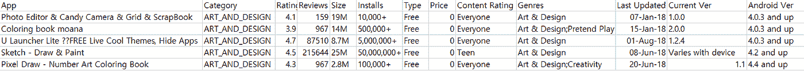

应用程序及其信息列表|图片由 Jonathan C.T. Kuo 提供

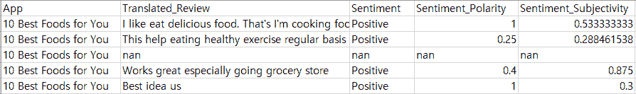

根据应用程序的评论列表

# 擦桌子

首先，我们分析了哪个信息栏与 app 的安装次数无关。这是凭常识做的。我们删除了大小、最后更新日期、当前版本和 android 版本，因为它们不是发布前影响安装数量的因素。此外，我们已经删除了评级和评论数量，因为它们显然与应用程序安装相关，并且在发布前不会被知道。然后，我们还修剪了所有不合适字符的数据。

我们通过对常见关键字进行分类，将类别和流派结合起来，并将关键类别列表添加到列中，以便每个应用的类别/流派属性可以表示为真或假。此外，我们收集了每个应用的评论情绪，并计算了正面、中性和负面百分比的总数。最后，我们将这三列与现有的应用程序列表进行了合并。

现在我们准备好测试了。

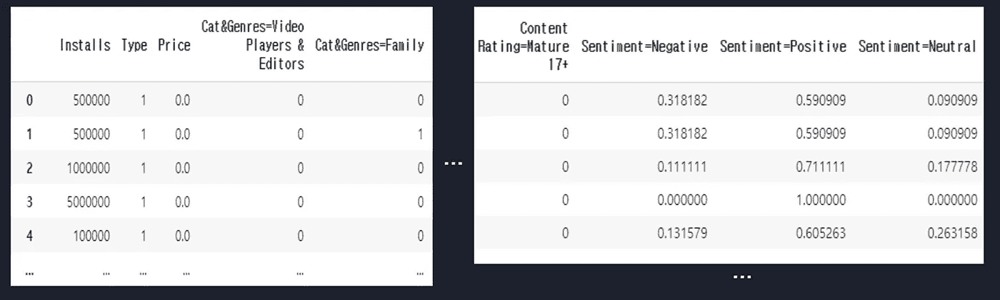

图片作者:Jonathan C.T. Kuo

# 第一个结果

该直方图显示了清除数据后决策树的性能。我们使用了 python sci-kit learn 实现的决策树，也就是 CART。CART 类似于 C4.5 之类的现有决策树，但它锁定了二元决策和信息增益。我们发现这些结果有点令人失望，所以我们决定尝试其他模型。所以我们也建立了一些人工神经网络。

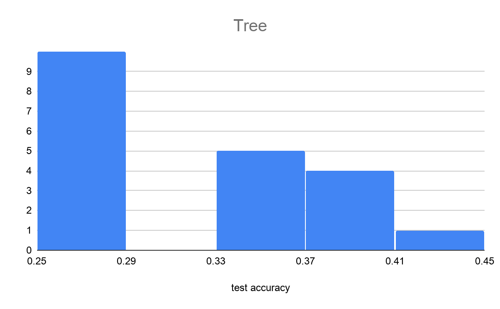

图片作者:Jonathan C.T. Kuo

我们可以看到，这些网络表现稍好，但仅略高于掷硬币。然而，我们仍然认为应该有可能超越这一点。

图片作者:Jonathan C.T. Kuo

我们知道这个数据包含了很多异常值。如果在训练集和测试集中没有足够的案例，离群值可能很难处理。该模型将无法预测如何解决这些情况。这就像你预测掷硬币总是正面，因为前两次都是正面。

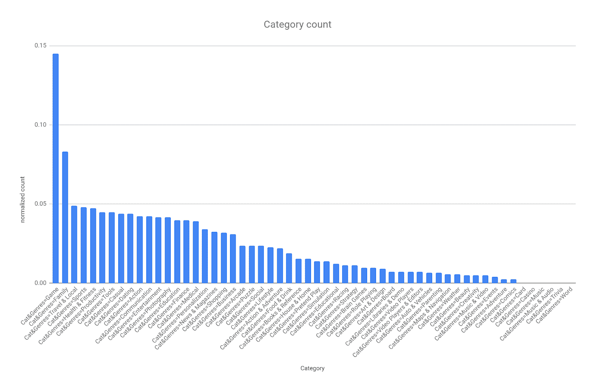

原始数据—类别计数|图片由 Jonathan C.T. Kuo 提供

对于类别属性，一些关键类别非常罕见，很少有应用程序拥有该特定类别，这成为一个离群值。

为了解决这个问题，我们删除了一些最不常用的类。

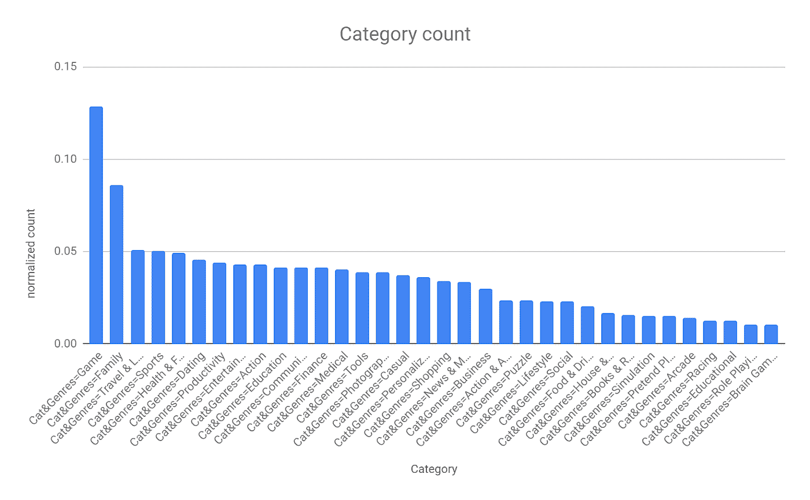

处理后的数据—类别计数|图片由 Jonathan C.T. Kuo 提供

看看安装数量的分布。我们可以看到，它们已被四舍五入，“安装数= 1000”非常小。这可能会给模型的训练带来问题。

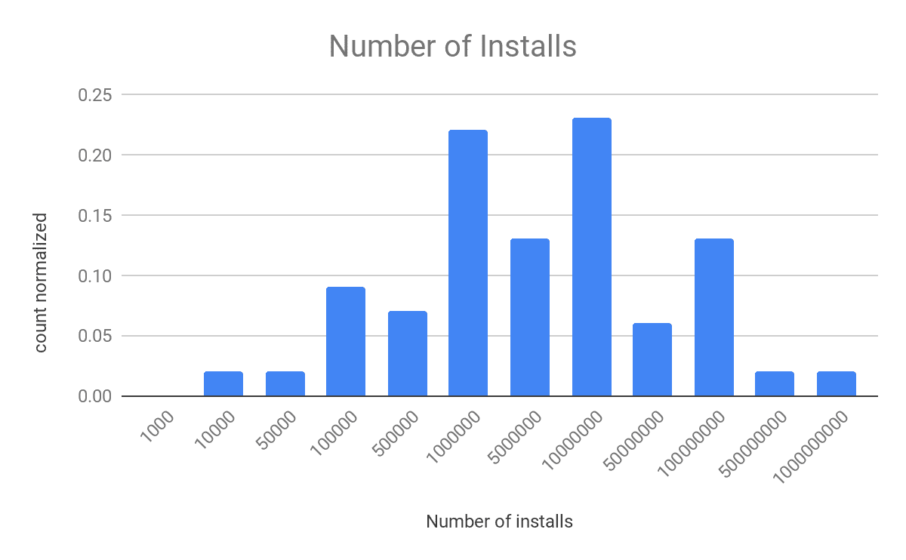

原创类|图片由 Jonathan C.T. Kuo 提供

为了改善这种情况，我们可以删除这些行，使数据更正常。我们也可以把这些类组合起来，这样就没有出现次数太少的类了。

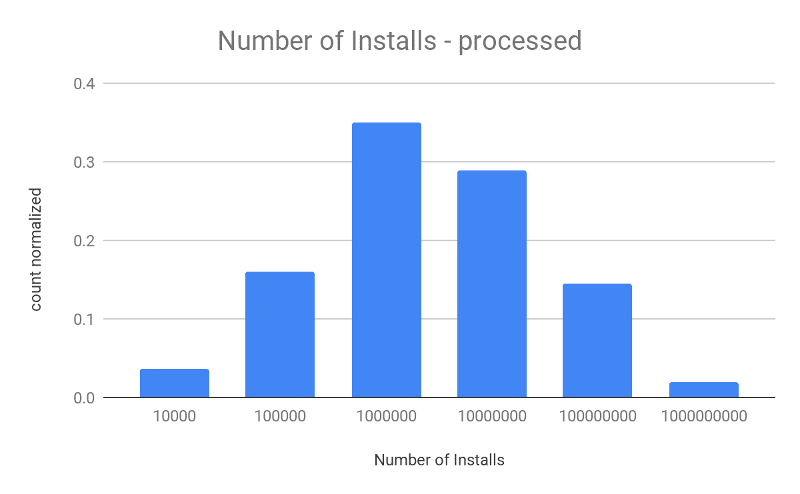

加工类|图片由 Jonathan C.T. Kuo 提供

我们可以对数据中的其他元素进行类似的处理，比如情感得分。

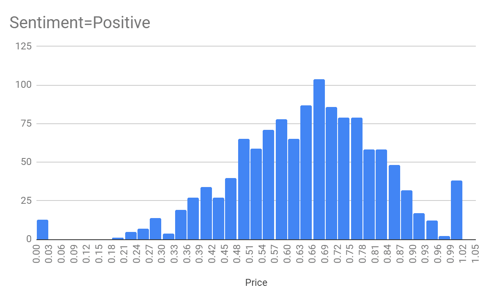

图片作者:Jonathan C.T. Kuo

请看我们在 0.2 处切断这些情绪分布的尾部

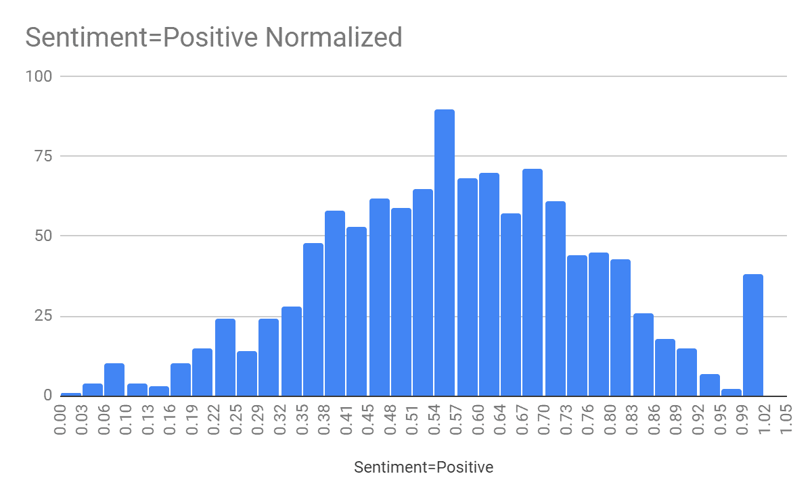

图片作者:Jonathan C.T. Kuo

我们对消极和中性也做同样的事情

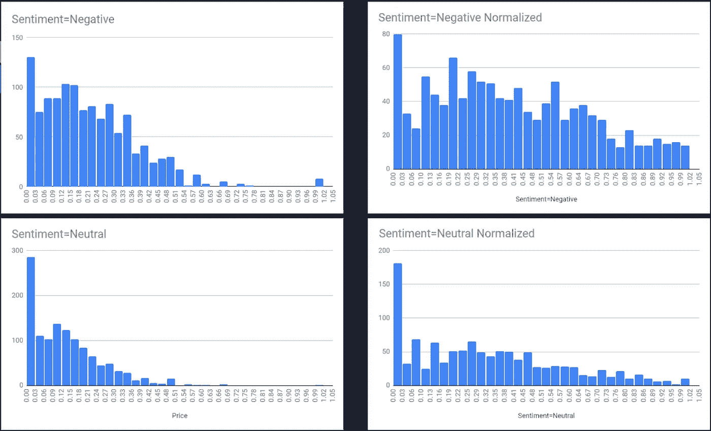

图片作者:Jonathan C.T. Kuo

即使在删除离群值之后，仍然可能有误导模型的列，因此我们应该尝试从剩余的列中搜索最佳的属性集。我们需要找出哪些列在预测数据时最有用，或者找出哪些最没用。然而，我们不想测试所有可能的组合。该策略基于在训练数据中建立几个简单的模型，并观察它们的有效性。

为了搜索一组好的列，我们首先尝试删除训练数据的最差属性。因此，从选择所有属性，我们建立模型，我们删除其中一个属性。从他们的分数中，我们可以发现什么属性最弱。然后，我们可以继续这个过程，首先删除先前选择的属性，然后搜索剩余的属性。我们还可以通过测试一个属性的每个子集来选择单个最有价值的属性，然后保留最有价值的列。然后，我们可以测试包含最有价值的列的 2 的所有子集。第一种方法是每次调用 drop 方法时，从所有属性中选择最差的属性进行删除。第二种方法是从零开始选择单个最佳属性，这种方法正好相反，称为增益法。我们还分离了一部分训练数据，用于稍后重新测试这些子集。

现在，一旦我们有了这些列表，也有几种不同的方法可以应用这些知识。我们可以取列表中定义的最好的 n 个属性。这种分级方法可以选择算法认为的最佳子集，但它可能不可概括，因为它是在自己的训练数据中构建的。我们还可以查看所有子集测试分数，以选择最佳子集。这四种方法:*排名增益、排名下降、最佳增益、*和*最佳下降、*都可以应用，看哪一种最有效。

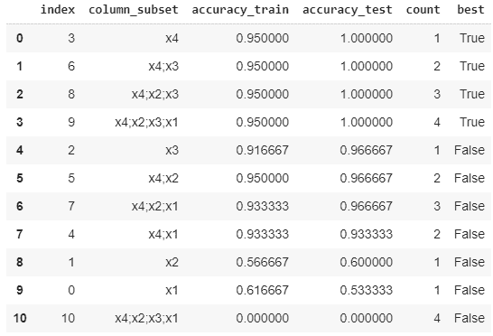

图片作者:Jonathan C.T. Kuo

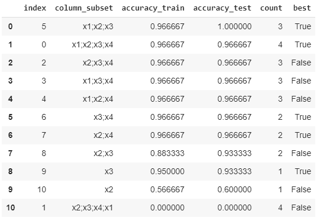

图片作者:Jonathan C.T. Kuo

该图显示，当我们移除异常值时，测试准确性似乎有所提高。例如，清理数据的最大准确度约为 51%，原始数据的最大准确度约为 42%。

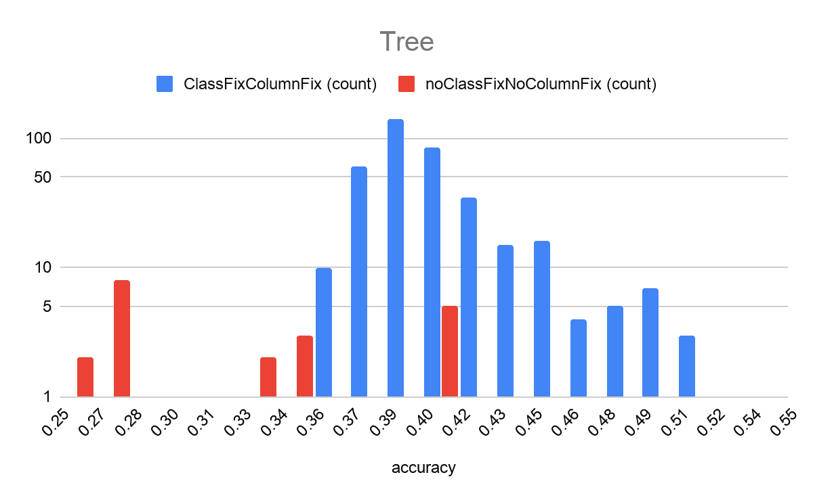

图片作者:Jonathan C.T. Kuo

网络模型也是如此，最大精度提高了 6%左右。

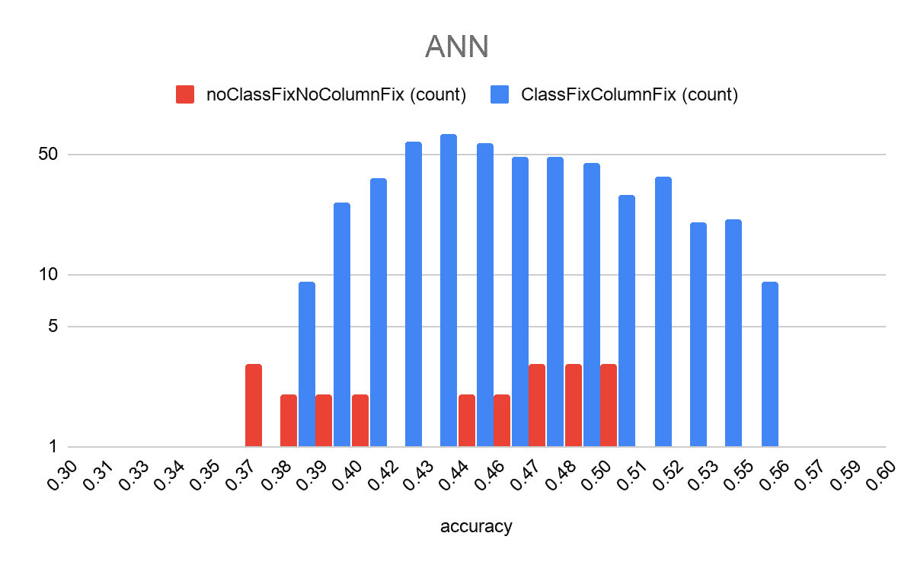

图片作者:Jonathan C.T. Kuo

然而，图表并没有真正显示真相。我们可以认为模型从回答选择题变成了判断题，因为我们减少了类别的数量。在多项选择中，随机猜测者的正确率预计为 25%，对或错，我们应该看到这一数字上升到 50%。例如，在我们之前的测试区域中，多数类包含 24%，所以多数猜测应该得到 24%，现在多数类是 35%。这意味着猜测多数类提高了 11%。由于对数据进行分类更容易，准确性应该会自动上升。

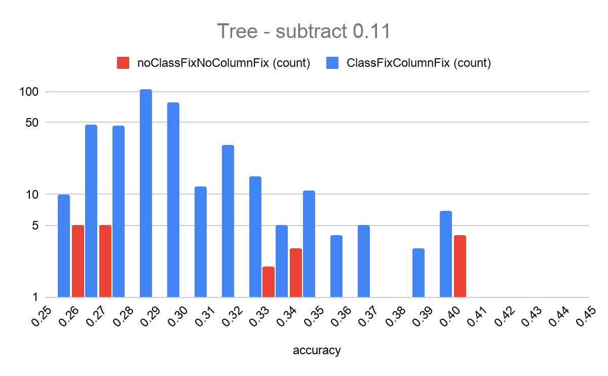

图片作者:Jonathan C.T. Kuo

如果我们减去 11%的清理数据的准确性，我们可以看到没有改善。更糟糕的是，我们的方法似乎降低了准确性。所以让我们看看哪里出错了。

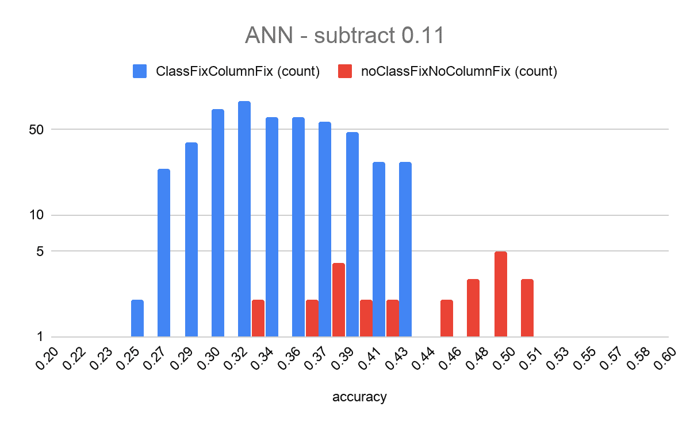

图片作者:Jonathan C.T. Kuo

在移除异常值之前，我们可以查看情绪得分，看看它是否与安装数量有关。从下面三个图表——正面、中性和负面情绪得分与安装的关系，我们可以看到每个图表都有数据聚类在一起。有人会说这是一种趋势。

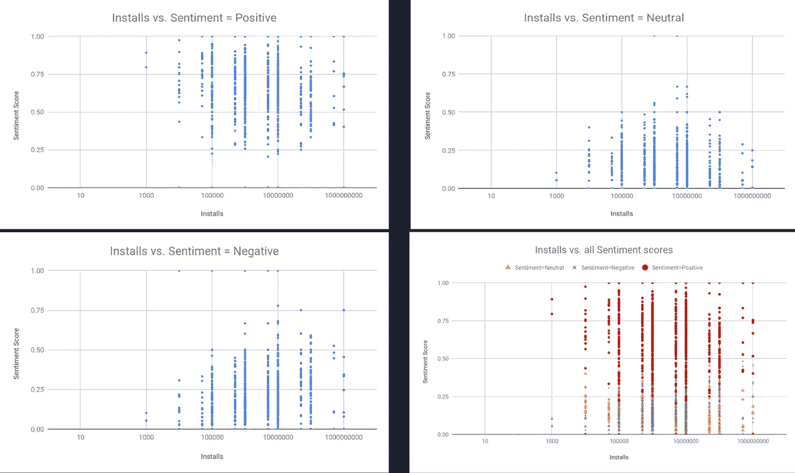

图片作者:Jonathan C.T. Kuo

现在，一旦我们剔除了异常值。数据点分布更加均匀，似乎完全没有趋势。这个结果背后有两个原因。首先，可能根本没有趋势显示情感分数和安装数量之间的关系。第二，当我们进行第二次数据清理过程时，我们可能会删除包含所有趋势的异常值。然而，如果异常值是唯一的趋势，那么这些就不应该被认为是趋势。

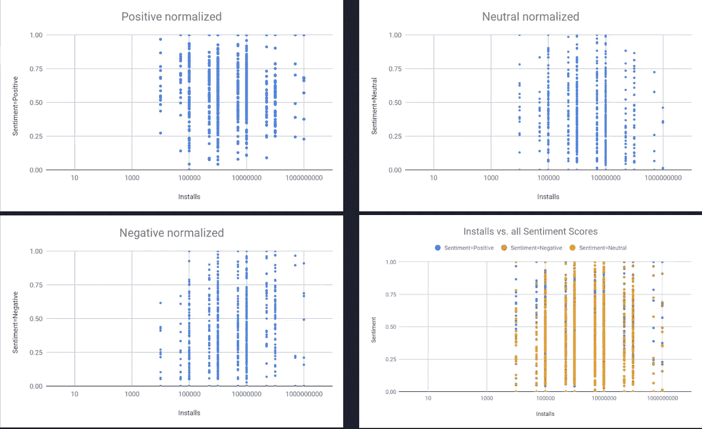

图片作者:Jonathan C.T. Kuo

然而，列的选择似乎有一些用处。我们可以看看这个由列归约算法发现的改进的图表。与此同时，大多数削减未能改善模型。然而，许多人成功地找到了改进模型的方法，并且在极端情况下达到了 10%。

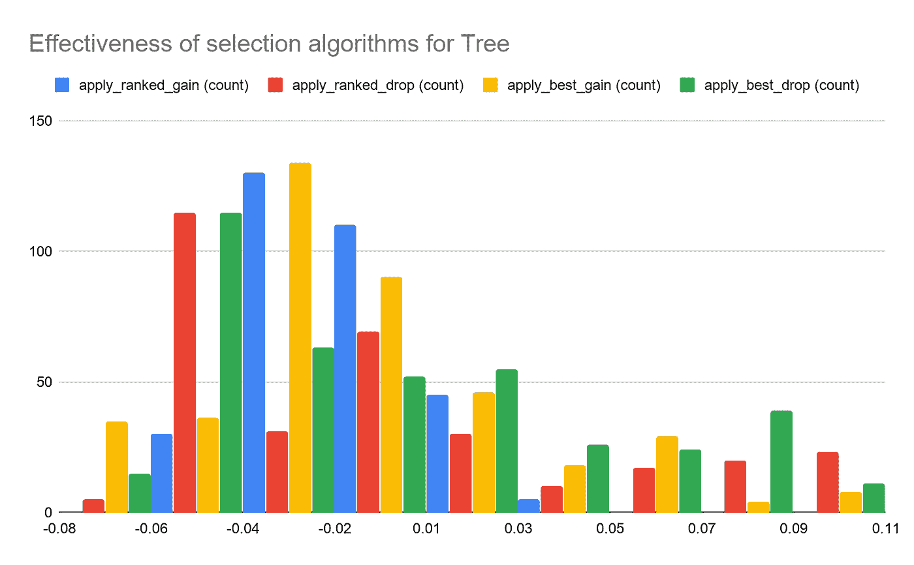

改善树木形象的有效性

我们可以看到它对神经网络有类似的影响。他们建议挑选列的最有效方法是使用 drop 方法中的最佳子集、gain 方法中的最佳子集以及 drop 方法中的排序选择。这似乎是发现的唯一改进方法。

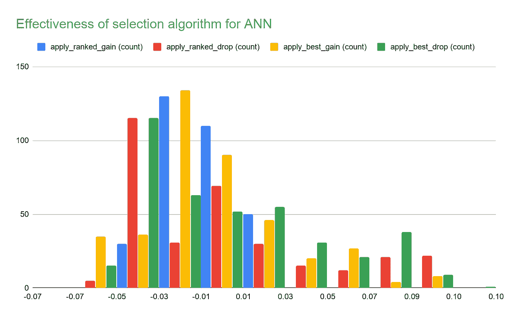

改善 ANN 形象的有效性

结论|图片由 Jonathan C.T. Kuo 提供

这个问题很复杂，因为似乎我们所做的一切都无法增加分数。这可能是因为人们并不真正知道他们想要什么，而且通常最好的产品，比如评论最好的产品，实际上做得并不好。我们可以从情绪图中看到，好评和安装之间似乎没有任何主要的相关性。这个项目本可以更成功，因为它早期关注的是回归问题，而数据在分组时可以变回数字。最后，我们对所有的类所能做的最好成绩是 56%的网络，最好的树是 42%。我们用缩减的类所能达到的最好结果是，用人工神经网络达到 62%，用树达到 52%。总的来说，达到 62%似乎是不成功的。这离多数猜测不远了。但是我们怀疑取得更好的结果并不容易；这些属性似乎都不能很好地预测安装情况。然而，称该项目彻底失败是不正确的。通过选择色谱柱，我们可以找到一些提高准确度的方法。相比之下，我们通过减少类的数量使问题变得更容易。它变得更加一致。对于那些寻求投资的人来说，一个更容易解决、成功率更高的问题将是一个更安全的赌注。

## 承认

我要感谢亚历克斯·麦克维和安德鲁·帕克为这个小组项目付出了很多努力。