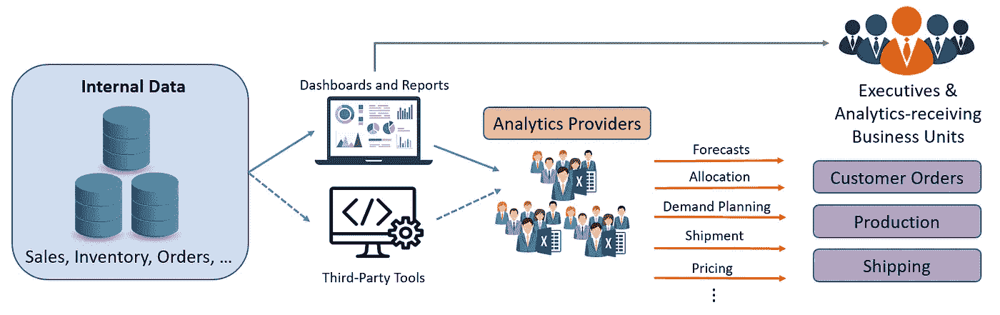
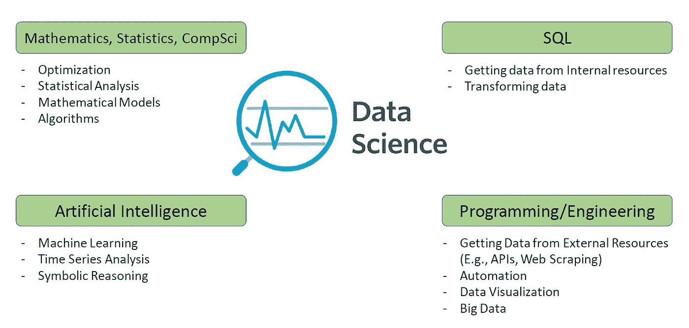

# 数据科学和创造性破坏

> 原文：<https://towardsdatascience.com/data-science-and-creative-destruction-dcfc32688709?source=collection_archive---------38----------------------->

## 意见

## 数据科学将如何改变非科技公司的结构

伦敦经济学院图书馆在 [Unsplash](https://unsplash.com?utm_source=medium&utm_medium=referral) 上拍摄的照片

所谓创造性破坏，我们指的是提高效率并导致替代或缩小企业规模的过程。例如，汽车的发明使得马车夫的工作过时了。整个马车夫行业几乎全军覆没。
请注意，这种流程的目的是提高效率，替换或裁员只是流程的副作用。例如，那些发明汽车的人在寻找更快更方便的交通方式。马车夫被消灭是一个副作用。

自从信息技术(It)成为大多数企业的必要组成部分以来，已经过去了大约 50 年。我们指的是它的普通用法；即一个部门，根据公司的规模和类型，拥有一个或多个职位，如软件开发、网站设计、网络管理、数据库管理和报告开发。

传统上，大中型非技术企业的分析部分或多或少属于以下模式(见下图):我们有一组内部(内部或云)数据库。报告开发人员在这些数据的基础上构建了一组报告。在某些情况下，第三方工具连接到这些内部数据库。然后，我们有一组非技术“分析师”，他们接收这些报告，并使用 Excel 文件为分析业务问题提供解决方案，如预测、需求规划、装运等。我们所说的“分析师”是指 IT 部门之外提供这类解决方案的任何非技术人员。

传统数据和分析(图片由作者提供)

这种传统的数据和分析方法效率非常低。
首先，这些“分析师”不懂 SQL，因此他们无法从内部资源获取数据，也无法转换数据。他们必须被信息技术填鸭式地提供数据。其次，他们不懂编程语言。因此，他们无法从外部资源获取数据(例如，抓取网站或使用 API)。出于同样的原因，他们无法实现解决方案的自动化，不得不一直依赖手动工作。
最后，也是最重要的一点，他们不具备为这些分析性业务问题提供最佳解决方案所需的理论知识。这些问题的最佳解决方案通常需要一种或多种技能的知识，例如优化算法、数学模型、统计分析和人工智能。

即使使用第三方工具来帮助他们提供更准确的解决方案，由于他们不知道这些工具(即算法)的内部工作原理，所提供的答案和过程仍然远非高效。这些工具被视为一个黑盒。他们提供数据，并获得输出，但是他们不能适当地调整它，而且通常涉及大量的手工工作。

出现的一个问题是“考虑到所有这些低效率，为什么这些非技术人员负责提供分析业务问题的解决方案？为什么精通技术的 IT 人员不提供这些解决方案？”
如果我们看看上面提到的传统 IT 角色(软件开发、网站设计等。)，我们看到实际上这些角色都不具备所需的理论知识来为分析业务问题提供最佳解决方案。换句话说，尽管 IT 人员是技术人员，但由于不具备所需的理论知识，他们无法为分析性业务问题提供解决方案。

但在过去十年中，数据科学的出现改变了游戏规则。
数据科学家是为分析业务问题提供高效解决方案的最佳人选:

*   他们拥有所需的理论知识(数学、统计学、人工智能……)。
*   他们懂 SQL，所以可以从内部资源获取数据，转换数据。
*   他们知道编程，所以他们可以从外部资源获取数据，也可以自动化他们的解决方案。

数据科学家简介(图片由作者提供)

数据科学正在引发一场范式转变。这是 It 中一个相当新的角色，它正在接管为分析性业务问题提供解决方案的角色；历史上由业务部门提供的东西，在 IT 部门之外，使用 Excel 文件或第三方工具，正如我们所讨论的，这是低效的。
因此，“分析师”(如上定义)的角色迟早会在非科技公司中消失(在科技公司中，他们从未存在过)。当然，我们仍然会有非技术性的角色，但是这些角色不会为分析性的业务问题提供解决方案。

虽然看起来很明显，数据科学家更适合为分析业务问题提供解决方案，但实际的转变一点也不容易。非科技公司长期以来都是这样运作的，也习惯了这种状态。这种结构性变化不是一夜之间发生的。另一个问题是，为了实现这种转变，您需要证明当前解决方案的低效性。但问题是，目前的解决方案大多是在本地存储的 Excel 文件中。这使得很难评估当前的解决方案。

尽管如此，这种变化迟早会发生。在一些非科技公司中，这种转变已经开始，其他公司必须向这种更高效的状态发展，否则，如果他们继续做过去几十年一直在做的事情，他们将会落后。