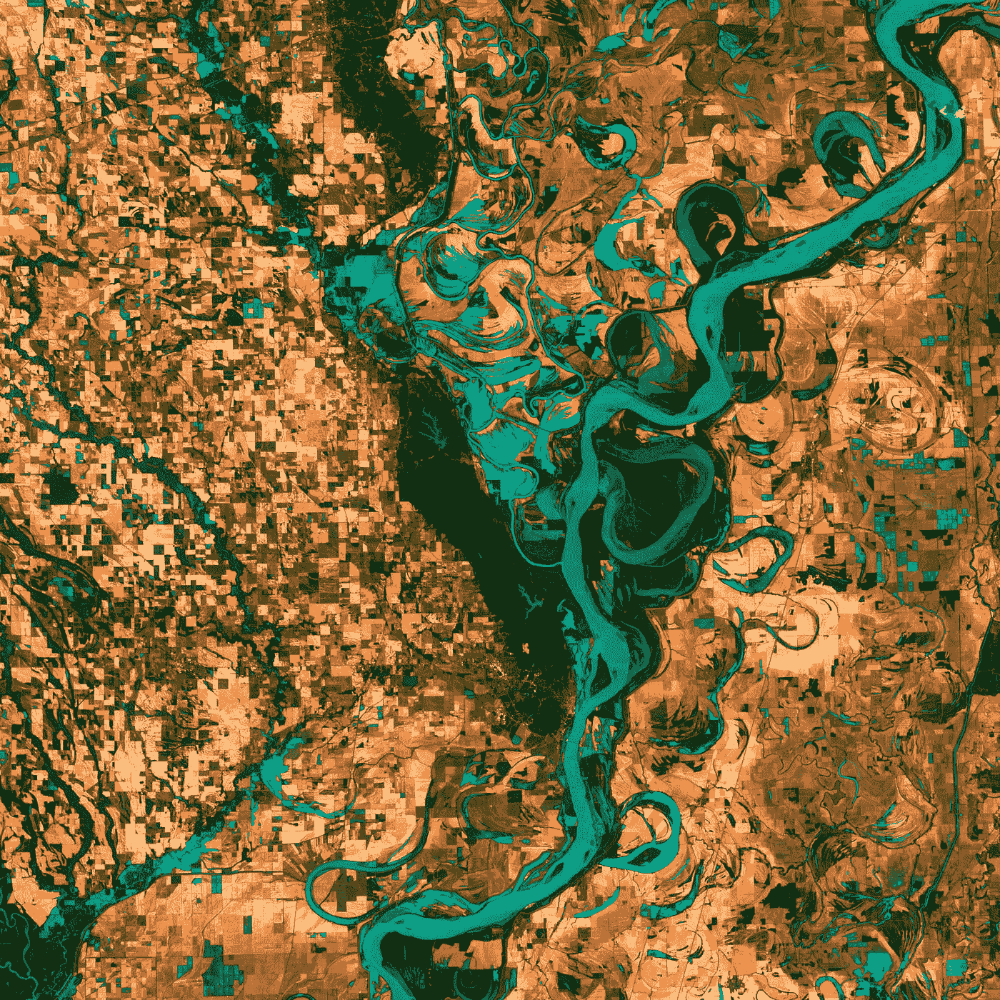

# CBAM 天气模式的数据科学和可视化

> 原文：<https://towardsdatascience.com/data-science-and-visualizations-of-weather-patterns-with-cbam-41ec6380ed97?source=collection_archive---------26----------------------->

## 了解如何使用数据科学可视化和 CBAM 解释大量天气模式


斯蒂芬·菲利普斯-Hostreviews.co.uk 在 [Unsplash](https://unsplash.com?utm_source=medium&utm_medium=referral) 上的照片

数据科学是 21 世纪最热门的领域之一。“数据”是所有大型公司用来获取最有利可图的投资的最有价值的资产。有了正确数量和质量的数据，几乎任何任务都可以完成，以获得进一步的支持和客户满意度。

虽然数据科学处理数据元素的分析和研究的大多数基本方面，但数据科学的一个更重要的概念是包括探索性数据分析(EDA)的研究。简而言之，EDA 或数据可视化在理解所涉及的所有数据元素的工作程序以及分析所构建的模型产生的结果方面起着至关重要的作用。

探索性数据分析(EDA)和数据可视化是对我们可用的数据进行统计、图形和图表分析的最有效方法之一。数据可视化在分析天气模式的大量数据元素时非常有用。收集的所有数据有助于我们探索当前的气候条件和天气模式。

要了解和学习有关可视化技术的更多信息，请随时查看下面的文章，该文章涵盖了您的数据科学项目需要考虑的八种最佳可视化方法。

</8-best-visualizations-to-consider-for-your-data-science-projects-b9ace21564a>  

# 了解 CBAM 模式:


照片由 [NASA](https://unsplash.com/@nasa?utm_source=medium&utm_medium=referral) 在 [Unsplash](https://unsplash.com?utm_source=medium&utm_medium=referral) 拍摄

天气预报最具革命性的成就之一是由 ClimaCell 公司发射的 CBAM。换句话说，CBAM 被称为 ClimaCell 的定制大气模型，它改变了天气预报的前景。CBAM 提供的两个技术优势是微型和按需。

由于使用更常规和传统的模型，大多数天气预测和预报方法几十年来没有太大变化。使用的信息量很少，这些传统方法没有充分利用技术的真正潜力，导致只能预测部分数字。随着 CBAM 的引入，新的建模能力达到了新的高度，并在天气建模方面取得了巨大的成功。

CBAM 不仅采用传统的数据源，还将它们与所有可用的数据相结合，以提供前所未有的准确性和可靠性，从而实现最佳、高质量的天气预报。使用这种模式实现高性能和高分辨率的最佳公司之一是 tomorrow.io。它经过微调，可以在任何特定区域实现全球最佳结果，如上图所示。

# 为什么使用数据科学和 CBAM？


艾萨克·史密斯在 [Unsplash](https://unsplash.com?utm_source=medium&utm_medium=referral) 上拍摄的照片

CBAM 模型使用该公司的[天气 API](https://www.tomorrow.io/weather-api/) 来实现这种高分辨率性能。在我们深入讨论这个主题和研究一些代码之前，让我们首先了解它的好处以及它与其他模型的不同之处。然后，我们将看一个如何在地图上可视化全球降水的实际演示。

CBAM 革命成功的原因如下:

1.  高分辨率分析:该模型几乎考虑了周围环境中的每一个细节，包括所有基本的地形元素。几乎没有其他模型像 CBAM 一样接近高分辨率分析的速度，这使它成为更高分辨率可视化的最佳选择。
2.  虽然市场上大多数其他型号最迟每六小时更新一次天气分析和报告，但 CBAM 的更新频率为几分钟。
3.  虽然大多数其他模型对其覆盖的地方有地理限制，但 CBAM 覆盖了整个区域，使其可以在全球范围内使用。它可以在任何时间任何地点运作。它可以覆盖一个风力发电厂到几乎整个次大陆。
4.  这种模式最显著的优势是它拥有的随需应变的能力。它是高度定制和灵活的，允许用户为特定领域和任何特定用例进行可定制的天气预报，例如在地图上可视化全球降水。
5.  这个模型拥有的最后一个但也是最重要的好处是能够在任何给定的时间点访问最好的及时数据和信息。凭借他们的技术、数据科学和可视化，以及天气预报方法，CBAM 从数以亿计的专有观测中获得了惊人的结果。

# 示例代码:



美国地质勘探局在 [Unsplash](https://unsplash.com?utm_source=medium&utm_medium=referral) 上拍摄的照片

现在让我们进行一次实际演示，演示如何在地图上显示全球降水量。明天的[天气 API](https://www.tomorrow.io/weather-api/) 和[天气数据目录](https://www.tomorrow.io/data-catalog/)可以用来改进任何给定的预测结果。在这个演示中，我们将利用 JavaScript 对模型进行编码。这三个文件，即谷歌地图，Mapbox GL JS 和传单 JS，用于此目的。Tomorrow.io API 地图切片旨在轻松集成常见的交互式地图库，例如。初始化 google maps 的示例代码如下:

```
// get your key from app.tomorrow.io/development/keys
const API_KEY = 'add your API key here';// pick the field (like temperature, precipitationIntensity or cloudCover)
const DATA_FIELD = 'precipitationIntensity';// set the ISO timestamp (now for all fields, up to 6 hour out for precipitationIntensity)
const TIMESTAMP = (new Date()).toISOString();// initialize the map
function initMap() {
  var map = new google.maps.Map(document.getElementById('map'), {
    zoom: 7,
    center: {
      lat: 42.355438,
      lng: -71.059914
    }
  });// inject the tile layer
  var imageMapType = new google.maps.ImageMapType({
    getTileUrl: function(coord, zoom) {
      if (zoom > 12) {
        return null;
      }return `[https://api.tomorrow.io/v4/map/tile/${zoom}/${coord.x}/${coord.y}/${DATA_FIELD}/${TIMESTAMP}.png?apikey=${API_KEY}`](https://api.tomorrow.io/v4/map/tile/${zoom}/${coord.x}/${coord.y}/${DATA_FIELD}/${TIMESTAMP}.png?apikey=${API_KEY}`);
    },
    tileSize: new google.maps.Size(256, 256)
  });map.overlayMapTypes.push(imageMapType);
}
```

该代码用于根据您的方便地点设置地图，您可以在这里测试并可视化您的结果。为了在不需要额外编码的情况下直接访问项目，tomorrow.io 也从 [JSFiddle](https://jsfiddle.net/user/Tomorrow_io/fiddles/) 页面提供了这项服务。你也可以在这里随意试验。该代码来自以下[网站](https://docs.tomorrow.io/recipes/visualize-global-precipitation-on-a-map)。

# 结论:


照片由 [v2osk](https://unsplash.com/@v2osk?utm_source=medium&utm_medium=referral) 在 [Unsplash](https://unsplash.com?utm_source=medium&utm_medium=referral) 上拍摄

数据科学和数据可视化是当今时代最重要的词汇。有了适量的数据和适当的训练方法，任何伟大的模型都可以实现。一个这样的模型充分利用了所有可用的数据，通过可视化实现了天气预测的最佳结果，这就是明天的 CBAM

您可以使用此模型来获得所需的分辨率、覆盖范围和参数，因为它是全局微调的。你可以通过这种模式实现更多，这是任何人改善生活体验的必备工具！如果你对这篇文章中提到的各点有任何疑问，请在下面的评论中告诉我。我会尽快给你回复。

看看我的其他一些文章，你可能会喜欢读！

</best-pc-builds-for-deep-learning-in-every-budget-ranges-3e83d1351a8> [## 在各种预算范围内，最适合深度学习的电脑

towardsdatascience.com](/best-pc-builds-for-deep-learning-in-every-budget-ranges-3e83d1351a8) </17-must-know-code-blocks-for-every-data-scientist-c39a607a844d>  </15-numpy-functionalities-that-every-data-scientist-must-know-f6d69072df68>  </7-best-ui-graphics-tools-for-python-developers-with-starter-codes-2e46c248b47c>  </15-numpy-functionalities-that-every-data-scientist-must-know-f6d69072df68>  

谢谢你们坚持到最后。我希望你们都喜欢这篇文章。祝大家有美好的一天！