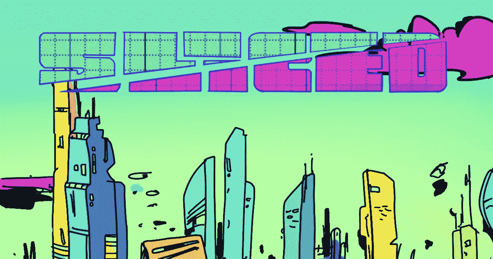

# 数据科学编码遇上电子竞技

> 原文：<https://towardsdatascience.com/data-science-coding-meets-esports-9439d3ecf91e?source=collection_archive---------32----------------------->

## [社区聚焦](https://towardsdatascience.com/tagged/community-spotlight)

## 通过模因和现场比赛建立社区

*在 Community Spotlight 系列中，TDS 编辑与数据科学社区成员畅谈有助于推动该领域发展的激动人心的计划。今天，我们很高兴地分享* [*埃利奥特·冈恩*](https://medium.com/u/aad1101621dd?source=post_page-----9439d3ecf91e--------------------------------) *与尼克·万和梅格·里斯达尔的对话，他们是* [*切片*](https://www.notion.so/SLICED-Show-c7bd26356e3a42279e2dfbafb0480073) *的创作者:一场激动人心的新现场编码比赛，“就像电视节目 Chopped 但不是数据科学”。*

图片由 SLICED 提供

***尼克万*** *是《刀削面》的联合主持人和联合创作人。他是肯德基的数据科学经理，在*[*Twitch*](https://twitch.tv/nickwan_datasci)*负责流式切片和其他数据科学内容。你可以跟着他上* [*抽动*](https://twitch.tv/nickwan_datasci) *和上* [*推特*](https://twitter.com/nickwan) *。*

***梅格·里斯达尔*** *是《刀削面》的联合主持人和联合创作人。她在*[*Kaggle*](https://www.kaggle.com/)*(一家谷歌公司)领导产品。她住在洛杉矶。你可以在*[*Twitter*](https://twitter.com/MeganRisdal)*和*[*LinkedIn*](https://www.linkedin.com/in/megan-risdal-4617812a/)*上找到她。*

## 如果我必须用三个词来总结 SLICED，那就是:好玩、热情和专业。我认为这种氛围是通过 SLICED 的美学、制作价值观和主持风格传达出来的。你能多谈谈这个项目是如何起源和发展的吗？

尼克:我在做这些被称为数据闪电战的事情，我会给自己 30 分钟的时间来浏览一个我从未见过的数据集，同时做一个演示，然后聊天会给我的演示打分。这是相当古怪和愚蠢的，但人们真的会进入它。我一直希望有这样一个版本，人们可以像在数据闪电战中那样有竞争力地创建数据科学工作。我想到了电子竞技是如何给视频游戏注入新的生命的，我想也许有机会给现有的黑客马拉松理念注入竞争的火焰。所以在 Meg 和我谈论了一会儿 SLICED 之后，我们从我的社区里找了四个人来参加一个 4 集的试播季，它非常受欢迎。

**Meg:** Nick 和我在一次圆桌聊天中开始讨论 SLICED 的早期概念。我们开了一个关于 Chopped 的玩笑，但是对于数据科学(我们都喜欢烹饪！)这个想法一直伴随着我们。我们想，为什么不试试呢？我们做到了！在我们发展这个想法的时候，这最终成为了一个很好的合作伙伴。我带来了我在 Kaggle 工作的许多经验(当然也是关于竞争数据科学和社区)，以及我的网络，用于建立宣传，招募参赛者，吸引观众和初始赞助商。

而且很高兴听到切片美学抢眼！在与我们的设计师, [Salt & Fog](https://www.instagram.com/saltandfog/) 的 Veronica Casson 合作时，我们在 SLICED 的品牌简介上花了很多心思。她做了出色的工作，帮助我们传达了一些我们希望是平易近人的，受欢迎的，充满乐趣的东西。在很大程度上，我们一直很有斗志，自己做了很多视频制作和社交媒体营销，这也是我们的巨大荣誉。不过最近，我们请来了托尼·佩莱瑞蒂为我们的剧集制作 YouTube 剪辑，这真的把事情带到了另一个层次。我们已经得到了很多关于制作的很好的反馈，并希望继续在这方面投资。

## 你认为 SLICED 是数据科学在线教育领域的一项创新举措吗？你如何将类似切片的东西放在现有内容旁边？

教育媒体往往有三个层次:教育内容(如操作指南或讲座)、教育娱乐(如比尔·奈或《地球星球》)和普通娱乐(如战斗机器人或《流言终结者》)。我的流被标记为寓教于乐。我个人并不认为这有直接的教育意义，因为我们并不是真的想要指导或教授任何东西，尽管有时它可能会以这种方式出现。我们没有简化切片(或我的任何流)上的任何概念；它真的不适合初学者。以美国宇航局发射火箭为例。他们是想教育人们天体物理学吗？不。不是说切片是把人送到他妈的太空的水平，但这是相似的。我们正在展示许多人在学习数据科学方面的劳动成果。在数据科学中这还不够。许多数据科学流旨在教育。像大卫·罗宾逊、朱莉娅·西尔格和格雷格·马修斯在疫情期间在 Twitch 上直播他的课程。有这些教育家，我根本不想步他们的后尘。

**Meg:** 正如 Nick 所说，SLICED 旨在为我们的观众和更广泛的数据科学社区带来乐趣和娱乐。它本身并不意味着直接的教育意义，但我希望它能激发人们发现数据科学的乐趣，这可能会激励他们想要学习新的东西。看到 SLICED 鼓励人们与我们的参赛者一起参与，在每周的挑战中一试身手，尝试他们在节目中看到的技术，写博客帖子(就像 Julia Silge 关于[在 tidymodels](https://juliasilge.com/blog/nyc-airbnb/) 中实施定制 RMSLE 指标的帖子)等，这真是太酷了。但是在一天结束时，让我兴奋的是社区建设和“做”(相对于学习)方面。

## 你认为切片是通过让观众观看专家的行动来弥合这一差距的一种方式吗？SLICED 是否有一个元目标，让学生学会如何学习或提出好问题？

对于生产级的专业数据科学来说，SLICED 并不是一个非常现实的设置(谢天谢地)。对于数据科学的新手来说，SLICED 更多的是一个机会，让他们看到专业的数据科学家是如何的不完美，没有记住每一个 API，等等。我们的参赛者现在非常清楚这可能是一次非常令人羞愧的经历！作为一个数据科学的新手，能够观察专家犯错误和迭代是非常非常有意义的。切片绝对提供了一个独特的机会来见证这一点。但我不会说有人应该指望通过观看该节目来学习如何做数据科学。对于那些确实想学习的人，我会鼓励他们参与 Kaggle，因为没有比实践更好的学习方法了。

**Nick:** 人们对我们这么说是因为它提供了一个了解合法行业专业人士流程的窗口。我们没有任何将切片教育化的目标，这只是一种乐趣，也是一种在新媒体中发展数据科学社区和文化的方式。对我们来说，社区远比教育重要。削球就像看人们打篮球或台球。在真实的游戏中你不会做这种事。切片是 trickshot 数据科学。它还以一种非常独特的方式向更多人介绍了 Kaggle。那真令人兴奋。我认为这很好，因为它利用现有的工具在数据科学领域创造新的东西。我们已经有了卡格尔和特维奇。两者并用，把它变成一个游戏节目，那些不了解 Kaggle 竞赛部分的人，现在他们可以接触到 Kaggle 上的其他竞赛。最终，我们希望看到更多的人在 Kaggle 上进行直播比赛。还有更多的开创性的事情要发生。有趣和有创造力的人可以通过看到这些平台的这些维度而受到启发，并真正用它做一些令人兴奋的事情。

## 比赛结束一天后，节目会对每位参赛者的笔记本进行预演。你能分享更多关于观看专家讲述过程的价值吗？

**梅格:**在直播节目中，尼克和我只能猜测为什么有人会以他们的方式做决定或处理问题。只有当你听到他们走过他们的方法时，你才能理解他们完整的思维过程。看到我们的选手在两集之间密切关注彼此的方式，这非常酷。不仅在赛后直播中，而且在使用[#切片标签](https://twitter.com/search?q=%23SLICED&src=typed_query&f=live)的 Twitter 上，在[尼克的不和](https://www.notion.so/Discord-2e92c1ad842746b9a731efce37cabcad)中，在博客帖子中，以及在参赛者自己的流中，都有很多对话。许多参赛者，如杰西·莫斯蒂帕克和大卫·罗宾逊，分享了他们的错误，以及如果有更多的时间和后见之明，他们会如何以不同的方式处理事情。在节目本身之外还有很多学习在进行，这也是 SLICED 的萌芽社区如此伟大的另一个原因！

尼克:上一季我们在这一集就这么做了。现在是四个人而不是两个人，在这一集里没有足够的时间深入了解每件事。有些看 SLICED 的人想要深度潜水。参赛选手非常愿意演练他们的代码。所以这是一个好的，幸福的婚姻，这是一件容易的事。从参赛者的角度来看，即使是他们也有更好的想法来表达他们第二天想要表达的东西，而不是现在。所以这既是一个时间/务实的事情，但也是他们有时间放松后更好更简洁的事情。

## 这个节目有特定的目标观众吗？你认为初学者和更高级的程序员在观看它的过程中有什么不同吗？

**尼克:**我们的特定目标受众是了解数据科学的人。无论是刚起步的人，还是在行业内摸爬滚打多年的人。如果他们了解数据科学，我们希望他们喜欢它。我们的观众被我和 Meg 以及我们参赛者的社区所驱使。我敢说看 SLICED 的人有一半会来，因为他们知道有一个人在编码。30-35%的人可能会来，因为他们看到他们尊敬的人在 Twitter 上宣传这部剧(使用 [#SLICED](https://twitter.com/search?q=%23SLICED&src=typed_query&f=live) ！).剩下的 15%左右可能是当前的，现有的切片常客。这些人中的许多人不一定是我的其他流的常客。这很酷！

**Meg:** 爸爸妈妈也欢迎聊天(数据科学家与否)！但说真的，我不希望 SLICED 变得如此具有竞争力，以至于成为一个不受欢迎的利基市场。很明显，它的核心仍然是有竞争力的，我们希望忠于这一现实，但我们希望熟悉数据科学的每个人都感到有趣和兴奋。作为一项比赛(或者说一项运动)，我们希望让人们每周都关注比赛，并参与到比赛的进程中来，这真的很有意义。但与此同时，我们希望它对那些只能偶尔去看一场演出的人来说是娱乐性和趣味性的。

## 有没有什么让你惊讶的事情？

尼克:社区。在试播季的时候很意外。在试播首映之前，我的最高观看人数是 80 人左右。所以打破那个记录是令人兴奋的。每周都有超过 50 人出现，这很令人惊讶。统计数据显示，我们平均每晚约有 100 人，有些地方会有 200 人。数据科学在内容方面可能非常枯燥。它并不总是视觉上令人兴奋，通常也不是关于数据科学内容背后的个性。切片提供了更多视觉刺激和突出数据科学传播者的机会。我认为这是人们每周不断出现的部分原因。

**梅格:**每周的电视剧都是让我惊喜的东西！这是真实的，每一集都不一样。排行榜的变动，紧张的技术难题，非常接近的分数，参赛者没有完全阅读文档(总是阅读文档！).这一切都以一种我们想写也写不出来的方式进行着。切片才是真正的真人秀！

现场直播期间有多少人参与 Kaggle，这也让我大吃一惊。尼克和我最初猜测我们可能会得到 2 或 3 人，这是一种方式了。事实上，我们只是打算将 Kaggle 用作我们的评分基础设施，但该平台已经成为切片社区的核心部分。每周我们都会看到更多的人加入进来。我们甚至看到人们在推特上分享他们在剧集之间玩着玩着。令人兴奋的是，人们真的对这个节目的额外维度产生了共鸣，因为它使 SLICED 的体验和社区更加丰富。

你可以在我们的网站和这个 [Twitter 帖子](https://twitter.com/MeganRisdal/status/1415063071928639491?s=20)中找到《切片》第一季的所有数据集。

## 你在第二季的什么地方看到了切片？你对下一步有什么设想吗？

梅格:我希望《切片》第一季能产生足够的宣传，在我们准备第二季的时候，真的能建立很多认知和期待。我们很乐意招募更多的人，既包括现有的参与者，也包括刚刚了解这个节目的新人。总的来说，我们想用和试播第一季一样的方式来处理第二季:我们学到了很多关于什么有效，什么无效，并做出了改进。我想在第一季结束后采用同样的方法来发展这部剧，因为它真的是关于如何为我们的观众、社区和参赛者创造最佳体验。

我还半开玩笑地说，当这部剧跳过鲨鱼的时候，我会做切片衍生剧和圣诞特辑。但说真的，我很想做一些专注于数据科学更小众领域的一次性剧集，比如 NLP 或计算机视觉。这将允许参赛者以更少的时间投入参与，让我们展示不同领域的专业知识，让我们对实验想法进行概念测试，以孵化整个赛季。如果你有什么想法，请随时给我和尼克在 Twitter 上或者在 [Discord](https://www.notion.so/Discord-2e92c1ad842746b9a731efce37cabcad) 发消息！我也很想做一集烹饪片。实际上尼克和我会在洛杉矶亲自剁碎。

**尼克:**对于《切片》第二季，我们还没有开始谈论它。我们只需要熬过第一季，然后回到白板前想出接下来的步骤。在我的频道上，我们希望在切片季结束后举行一次虚拟会议，所以这是我最直接的任务。下一季，我们希望在生产方面更上一层楼。看到我们已经能够做的事情以及人们对它的良好反应是很有趣的。我们肯定还没有到达可能的边缘。我们才刚刚开始。我们已经讨论了如何改进这个节目的想法。比如面对面切片或者在会议上切片。如果 SLICED 会像野火一样蔓延，就像 TED 演讲中的 TEDx 一样。在那里概念变成了它自己的。我在 Twitter 上看到一些人在考虑开始一场竞争性的数据清理比赛，切片式的。这是我喜欢看到的东西——切片不仅仅是我们的节目，而是许多不同风格的数据科学内容的开始。

## 有兴趣的读者如何参与进来？

**梅格:**我也希望看到更多的人和我们的选手一起在 Kaggle 上竞争！看到我们社区的热情真的很令人兴奋。也请在 Twitter 上分享你的 [#SLICED](https://twitter.com/search?q=%23SLICED&src=typed_query&f=live) 经历！我们希望看到这个节目如何激励你，以及你学到了什么，创造了什么。

尼克:看看我们的[概念网站](https://www.notion.so/SLICED-Show-c7bd26356e3a42279e2dfbafb0480073)，那里有很多关于如何成为参赛者、注册成为实习生或赞助我们的信息。但老实说，最好的参与方式是在 Twitch 上观看我们的节目！

好奇想了解更多关于切片的知识吗？这里有两篇关于数据科学的帖子，分享了作者在竞赛中的经历。

*   "[观看#SLICED 的三个理由:实时数据科学竞赛](/three-reasons-to-watch-sliced-a-real-time-data-science-competition-8d5212ccf988)"(2021 年 6 月， *TDS* ): [Jin Hyun Cheong 博士](https://medium.com/u/ed25f2e73793?source=post_page-----9439d3ecf91e--------------------------------)分享了观看数据科学家现场解决新数据集如何既有教育意义又有娱乐性。
*   "[用 Python 预测桌游评分](/predicting-board-game-ratings-with-python-60c9de9ee067)"(2021 年 6 月，*TDS*):[Barrett Studdard](https://medium.com/u/4f34db0b270c?source=post_page-----9439d3ecf91e--------------------------------)分解出切片第 1 周的解决方案。