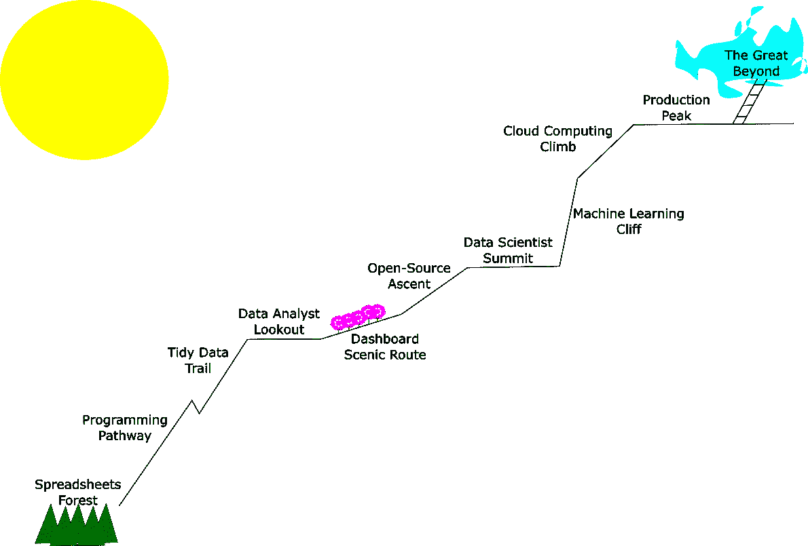

# 面向专业人士的数据科学课程

> 原文：<https://towardsdatascience.com/data-science-curriculum-for-professionals-46d131675602?source=collection_archive---------9----------------------->

## 从电子表格 Gnome 到人工智能向导的完整路线图

按作者分列的数字

如果你最终决定走从 Excel 复制粘贴到可复制数据科学的道路，那么你需要知道最佳路线。好消息是，有大量的免费资源可以让你到达那里，还有令人敬畏的在线社区可以帮助你。坏消息是，选择利用哪些资源可能会变得非常困难。这是一个没有废话的指南，你可以毫不后悔地遵循，这样你就可以花更少的时间担心这条小路，而花更多的时间徒步旅行。这是基于我从一个从未上过统计课的可再生能源项目工程师到一个主要数据平台的负责人的经历。

# **你在这里**

在这个旅程的起点，你会发现一群受过教育的人出于需要而不是激情进行数据分析。他们被训练成工程师和商业分析师，他们挑选最简单的软件来运行他们的方程式。电子表格很漂亮，因为它们非常直观。你可以通过方程式的每一步，从字面上看到并隐喻性地感受到这些数字。构建主电子表格是一个私密的过程。(不信我？当有人向你展示他们的新模板时，试着批评他们的配色方案。)然而，一旦从原型转向全面的数据分析，电子表格很快就会达到极限。一旦你遇到一个需要花一整天来修复的循环引用，当你需要打开大文件时，开始计划你的休息室，或者花一周时间试图重新创建一个别人完成的分析，是时候继续前进了。在您旅程的第一步，您希望删除电子表格的手动步骤，加快它们的速度，并使公式更容易跟踪。你想开始编程。

## 第一次跋涉:选择一种编程语言

你现在面临着一生中最重要的决定。大多数有抱负的数据科学家从未跨越这个巨大的障碍。你打算先学什么编程语言？为了减少你的焦虑，你应该知道没有错误的答案；这就像在一只小狗和一辆新车(或者对你们中的一些人来说是一只猫和一辆摩托车)之间做出选择。虽然有大量的编程语言可供选择，但此时我只推荐两种:Python 和 r。

你可以花几个月的时间阅读关于哪一个更好的文章，但他们最终说的都是一样的。所以，给自己省点负担，让这成为你最后一次纠结这个话题。这个指南是严肃的，记得吗？我会直截了当地告诉你。

如果你要和任何人合作，而他们已经做出了选择；选择相同的语言。那样生活会更轻松。假设您正在为您的团队开辟这条道路(这很棒)，我可能会推荐您选择 r。该语言是专门为使非计算机程序员的生活更容易而设计的，学习社区令人难以置信。更重要的是，RStudio IDE(集成开发环境；编辑代码的地方)，比使用 Python 更容易上手。(对于任何在大学使用过 Matlab 的人来说，这感觉就像在使用 Matlab。)也就是说，Python 是软件工程师更流行的语言，当你开始构建机器学习应用程序时，它在“真实世界”中使用得更多一些。

我个人开始自学 Python 来进行普通的计算机编程，并陷入了许多令人沮丧的事情中(比如该死的 PATH 变量)，这使得开始时进展缓慢。当我开始学习数据科学时，我转到了 R，并且非常享受这种体验。最近，我钻研了 Python 的数据科学包，现在经常在两者之间来回切换(这是一件令人惊讶的容易的事情)。

如果你想给这个话题更多一点公正，你应该读一下这篇文章，这篇文章深入了更多的细节。然后，你应该挑一个开始。

## 第二次跋涉:基本的统计数据和整洁的数据

一旦你选择了一种语言，你需要选择 IDE 和学习材料。如果你选择 R，使用 RStudio，阅读加勒特·格罗勒蒙德和哈德利·威克姆的《数据科学的 R》(通常缩写为 R4DS)。如果您选择了 Python，请下载 JupyterLab(使用 Anaconda)并阅读 Jake VanderPlas 的“Python 数据科学手册”。这两本书都可以在网上免费获得。

这两本书都将带你从完全的新手到超越电子表格的能力，使你能够处理各种各样的项目。所以，去做吧。举一个让你非常沮丧的数据分析过程(也许是不得不将数据从一堆 CSV 复制到一个模板中，也许是需要一堆电子表格并在它们之间复制/粘贴数据的过程，等等。)并编写一个 R/Python 脚本来帮您完成。当你遇到困难时，向社区寻求支持。

推动我前进的最大一步是理解整洁数据的概念。出于这个原因，我推荐阅读 Hadley Wickham 的“整洁数据”一文，并在您的代码中使用它的原则。

此外，到目前为止，做任何数据分析最有趣的部分是创建令人敬畏的可视化。确保你花了很多时间玩你的情节。这就是你如何让别人觉得你的代码比他们的电子表格更好。

最后，既然你现在正在做更深入的数据分析，回顾一下公司统计的原理可能是有益的。我推荐大卫·斯皮格尔哈特的《统计学的艺术》。这是一本非教科书，讲述了统计数学背后的思维模式，它更适用于编程人员，而不是深入数学本身。

# 第一个目的地

你成功了！通过这些非常简单的步骤，你现在可以称自己为数据分析师了。现在，您可以在 Excel 中做任何事情，甚至更多。分析数据现在相当快，你自动化了枯燥的东西，你有更多的乐趣来制作图表。对许多人来说，这是你想去的最远的地方。然而，接下来的几个步骤将会看起来非常诱人…如果你以前觉得很有趣，那就等到你制作第一个仪表板的时候吧。

## 第三次旅行:仪表盘

看看闪亮的 R 画廊([https://shiny.rstudio.com/gallery/](https://shiny.rstudio.com/gallery/))。或者对你来说，看看 Dash Enterprise App Gallery(【https://dash-gallery.plotly.host/Portal/】T2)这些是仪表板，在这里你可以将所有数据分析的结果合并到一个位置，这样你的业务领导就可以对你的工作感到敬畏，并根据数据做出明智的决策。(挺好听的口头禅，对吧？)更进一步，仪表板可以是 web 应用程序，允许团队的其他成员通过 GUI(图形用户界面)运行您的代码。有没有一款软件是你的团队目前正在使用的，但却让你抓狂？你可以重新创建它，但是只做你想做的事情，而不做其他事情，这样会大大减少你的点击次数。这个程序的输出可以是一个漂亮的 PDF 报告。

长话短说，仪表板是兴奋剂。你想掌握制作这些。从你的一个分析开始，把它的结果变成一个仪表板，然后在此基础上继续发展。对 R 使用 Shiny 包，对 Python 使用 Dash 包。有大量的文档可以帮助您，包括 Hadley Wickham 的《掌握 Shiny》一书，但与基础数据科学书籍不同，我不建议您从头到尾阅读它们。当你不确定如何做某件事的时候，就去编码并使用它们来帮助你。同样，学习社区是你的朋友。

## 第四次旅行:包，GitHub，开源，环境

既然你的同事已经被你的仪表盘迷住了，并且羡慕你的自动化脚本，你就需要开始合作了。首先，你可能会通过电子邮件或文件共享与他人共享你的代码，以便在他们的计算机上运行。类似地，每次开始新的分析，你可能会复制上一次的分析，并开始到处修改，以适应新的数据。每个人都是这样开始的，但是很快就变得一团糟。另外，您希望有一种更好的方法来跟踪代码的变更，并让其他人共同编辑它。要处理所有这些，您需要将代码转换成一个包，放在 GitHub 上。然后，每个人都可以访问代码，你甚至可以让它开源，让你与世界合作。

学习如何做到这一点的最佳资源是 Hadley Wickham 的“R Packages”和官方的 Python 打包文档([https://packaging.python.org/overview/](https://packaging.python.org/overview/))。GitHub 的指南也是学习如何使用他们的平台(【https://guides.github.com/】T2)的绝佳资源。

你第一次为你的团队开发一个应用，管理本地环境会给你带来很多挫折。我的意思是，每个人的计算机都将安装不同的文件，并且操作系统中的细微差别会迫使在他们的“环境”中运行的代码的行为与你的不同。这是一件很难理解的事情，并且偏重于计算机科学而不是基础数据科学。我尽可能地避免学习环境管理，但是一旦我学了，我的生活就轻松多了。无论是主动还是被迫，你都需要自己去学习。我从来没有找到一个很好的资源来学习这个，所以我在这里做了一个，推荐你阅读。

# 第二目的地

现在，您已经将数据分析技能提升到了一个新的高度。您可以为开源代码做出贡献，并且您现在已经具备了解决同事问题的必要技能。你可以领导一个高效的数据分析师团队。有了这些力量，你就在寻找真正推动商业价值的方法，所以高管们再也不能忽视你的工作了。

## 第五次旅行:高级统计和机器学习

如果你想真正开始为你的公司创造价值，你需要超越简单的线性回归和计算平均值。你需要开始钻研高级统计和(buzz-word-alert！)机器学习。这是一次比较陡峭的跋涉。盲目尝试开源的机器学习模型是可能的，但这有点像玩火。你应该真正明白你在做什么，否则计算机会试图颠覆你的动机，让你变得疯狂。我不是说你必须理解进入每个模型的所有数学，但是你应该对数学试图完成的事情感到舒服。你还想开始从数据中收集更大的推论，识别出你用外行的眼光错过的模式。你应该学习更多统计学的细微差别，以确保你能负责任地得出结论。这确实是关于大国需要大国责任的部分。学好这些工具，你就能做好事。

最好的机器学习资源是 Coursera 上的机器学习课程，由斯坦福大学教授、机器学习名人吴恩达教授。你可以在 github 上找到用 Python 和 R 而不是 Octave(他在课程中使用的编程语言)写的作业。接下来的另一门精彩课程是麻省理工学院深度学习导论(6。S191)类。这是一门麻省理工学院的课程，每年结束后都会向公众开放。本课程使用 Python 和一个名为 TensorFlow 的包。(注意，深度学习是机器学习的一种，是人工智能的一种。你所说的部分取决于你想给谁留下深刻印象。)

Coursera 上一个很棒的上层统计学课程是约翰霍普金斯大学的“统计推断”(使用 R)或者密歇根大学的“使用 Python 的推断统计分析”。

## 第六次旅行:云计算、数据管道

在某种程度上，本地托管您的所有进程不再有意义。这可能是因为需要大量的计算能力，需要将大量来源的数据聚合到一个位置，或者需要连续运行的应用程序而不是一次性的分析。在这种情况下，您将转向云计算，这意味着您必须找到一种方法将数据放入云中。此时，您可能会从数据分析师/科学家转型为数据工程师。这里面有很多东西，其中大部分是特定于云托管提供商的。为了避免这种情况，你可以使用 RStudio Cloud 之类的东西，它会为你做所有这些麻烦的事情。否则，你将需要温习许多计算机科学概念，如分区、复制和网络。

为了更深入地介绍云服务，我写了这篇文章。其他一些有用的资源是谷歌云实验室(或亚马逊、微软等类似的材料。)和 Martin Kleppmann 的《设计数据密集型应用程序》一书。

对于任何希望利用云的处理能力，但不希望实际托管应用程序的人来说，你绝对应该看看 Google Colab 笔记本。这些使你能够在云上运行 Jupyter 笔记本电脑，而不是在你自己的电脑上运行，不需要复杂的设置。它非常适合共享代码，而不必处理本地环境问题。

# 第三目的地

你到达了数据科学的圣地。你可以申请的一些头衔是生产数据科学家或机器学习工程师。你现在已经具备了为大型科技公司工作所需的技能，但你在行业中拥有的专业知识让你有别于标准的数据科学家，这让你的才能非常有吸引力。利用这一点来清楚地给你的公司带来价值，这样你的价值就会得到赏识。

# 来世

接下来有无数条路可供你选择。你可以深入研究神经网络和开源人工智能库，将人工智能世界带入你的行业。或者，你可以集中精力进行前端编码，学习 javascript、HTML 和 CSS，将你已经开始构建的网络应用提升到下一个水平。或者你可以掌握数据信息图和设计，以便更好地交流你的分析结果。或者你可以做无数其他的事情。既然你已经学会了如何在云中进行数据科学，天空不再是你的极限。