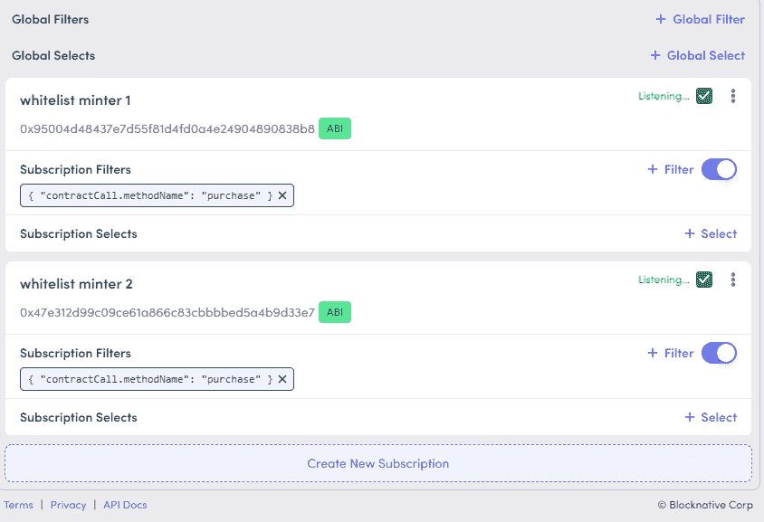
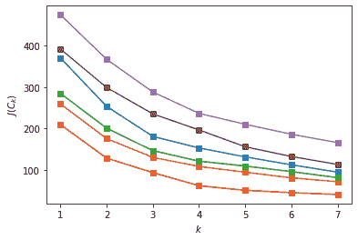
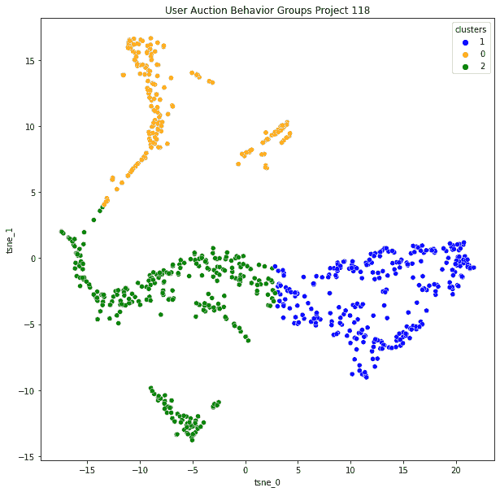
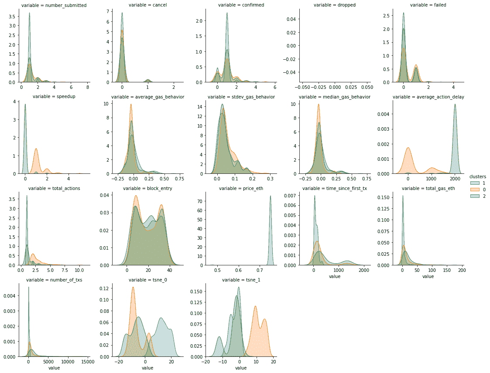
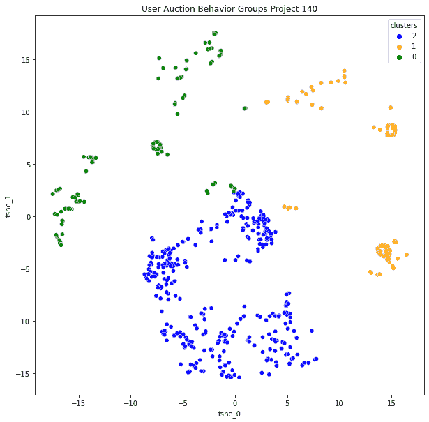
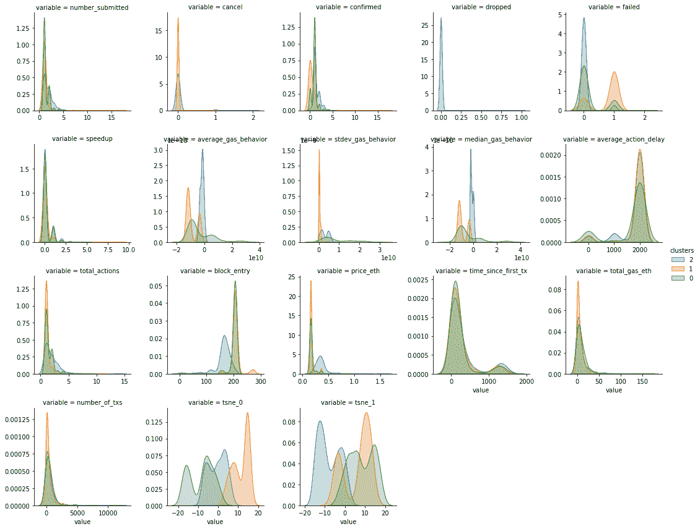
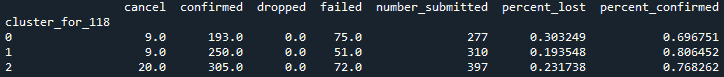
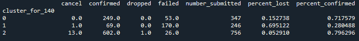

# 数据科学推动 UX 研究，改善 NFT 拍卖体验

> 原文：<https://towardsdatascience.com/data-science-driven-ux-research-to-improve-nft-auction-experience-e9dde1fb3d1d?source=collection_archive---------35----------------------->

## 当我在 artblocks.io 平台上参与 NFT 拍卖时，我利用 mempool 来获得用户行为和情绪的更好代理

用户体验(UX)描述了人们在与系统或服务交互时的感受，包括可用性、设计、营销、可访问性、性能、舒适性和实用性。唐·诺曼曾经说过，

> *“万物皆有个性；一切都发出情感信号。即使这不是设计者的意图，浏览网站的人也会推断个性和体验情感。糟糕的网站有着可怕的个性，并向用户灌输可怕的情绪状态，通常是在不知不觉中。我们需要设计一些东西——产品、网站、服务——来传达我们想要的个性和情感。”*

以太坊的性格是极其高深莫测，容易被误解的人。更糟糕的是，大多数用户在使用你的界面或钱包时，甚至不认为这是与以太坊的互动。如果你曾经参加过艺术街区拍卖的实时聊天，你会注意到，拍卖一结束，至少有十几个人抱怨说，他们没有得到一个薄荷糖是 Metamask 的错。我认为在过去的一年中，以太坊上的许多 dapps 的 UX 在产品交互和交易的可解释性方面都有了很大的提高。在很大程度上，dapps 不会在你签署交易后就给你留下一个 loading spinner。

即使 dapps 的设计在不断改进，我也不确定 UX 的研究已经深入到什么程度了。当我看到关于各种协议的数据分析或研究时，用户大多被视为同质的。随着我看到的 Uniswap V3 流动性提供商和 Rabbithole Questers 的一些分析，这种情况有所改变，但即使是这些人也仍然非常关注刚刚确认的链上交易。从我自己的经验来看，大多数的情绪和行为怪癖都发生在我提交、等待、加速或取消交易的时候。对于某些应用程序，用户可能会在提交交易后离开，去做其他事情。但对于像 art block auctions 这样的产品，他们会留在附近，直到确认发生，可能会检查任何他们可以更新的东西，并伴有复合焦虑。

我认为，通过开始更多地利用内存池，我们可以更好地理解用户行为和摩擦。[内存池](https://compassmining.io/education/what-is-a-mempool/)是节点临时存储未确认事务的地方。这意味着如果您提交、加速或取消交易，那么这些操作将首先显示在 mempool 中。需要注意的是，来自 mempool 的数据并不存储在节点中，所以不能像查询已确认的事务那样查询历史数据。从这里，您可以看到他们提交了几笔交易，交易速度加快了很多倍，但远没有达到所需的油价，最终在 20 个街区后看到了确认。我相信这是用户体验和他们在整个过程中可能感受到的情绪的一个很好的代理。如果我们了解不同的用户群体在这个周期中的行为，我们就可以找出如何补充他们的决策或缓解他们的焦虑。据我所知，几乎只有以太坊基金会、所有核心开发人员和一些钱包团队出于 UX 的原因利用 mempool 数据。

**UX 研究论文:**通过观察一段时间以来用户通过拍卖的行为以及他们的钱包历史，我们可以开始为不同的用户群体提供行为特征。从这里，我们可以确定要尝试和缓解的主要问题。我们将使用 [Blocknative](https://www.blocknative.com/) 获取一个月的 Artblocks 拍卖数据，并使用 [Dune 查询](https://dune.xyz/)对这些地址的历史进行分层。

这篇文章将比我以前的一些文章更具技术性，因为我相信这项工作可以而且应该相当容易地推广。*我想强调的是，我的背景不是 UX 研究，我纯粹是在试验我认为隐秘的 UX 研究可能会是什么样子。*

# 数据来源和预处理所有拍卖数据

*如果您对技术方面不感兴趣，请跳到下一节特性工程*

# Blocknative 和 Mempool 数据流

使用 Blocknative 的 Mempool explorer，您可以过滤提交给特定合同或来自特定钱包的交易。在我的例子中，我想听 Artblock 的 NFT 合同的白名单中的 minter 合同。你可以在这里找到我使用的[流，如果你想使用完全相同的设置，可以把它保存下来。](https://tinyurl.com/yftus9h2)

您可以使用下面的查询[在其子图](https://thegraph.com/legacy-explorer/subgraph/artblocks/art-blocks)中找到白名单中的 minter 地址:

```
{
  contracts(first: 2) {
    id
    mintWhitelisted
  }
}
```

获得所有购买的订阅过滤器有三个步骤:

1.  使用“创建新订阅”按钮添加新地址
2.  点击地址旁边的“ABI”按钮添加 ABI。在我的例子中，我只需要“购买”功能。

```
{
    "inputs": [
      {
        "internalType": "uint256",
        "name": "_projectId",
        "type": "uint256"
      }
    ],
    "name": "purchase",
    "outputs": [
      {
        "internalType": "uint256",
        "name": "_tokenId",
        "type": "uint256"
      }
    ],
    "stateMutability": "payable",
    "type": "function"
  }
```

1.  为`methodName`匹配`purchase`添加过滤器(确保不要使用全局过滤器)

最后，您的设置应该如下所示:



为了存储这些数据，我创建了一个 ngrok/express 端点来存储在本地运行的 SQLite 数据库中。我已经创建了一个 [GitHub 模板，包含复制这个设置的步骤](https://github.com/andrewhong5297/blocknative_stream_to_sql)。这里要记住的最重要的一点可能是，在 Blocknative account 页面中将 POST 端点作为 webhook 添加时，您需要将它作为 ngrok URL 的一部分。

# 关键预处理功能

**多个交易哈希**

当您加速或取消一个事务时，原始的事务散列将被新的事务替换。这意味着，如果您想在整个生命周期中跟踪用户的事务，您需要将新的事务散列与原始事务散列进行协调。假设您将一个事务加速了五倍，您将总共有六个散列(原始散列+五个新散列)。我通过获得一个从`tx_hash`到新的`replaceHash`的字典映射来解决这个问题，然后递归替换。

```
replaceHashKeys = dict(zip(auctions["replaceHash"],auctions["tx_hash"])) #assign tx_hash based on replacements, just to keep consistency. 
replaceHashKeys.pop("none") #remove none keydef recursive_tx_search(key):
    if key in replaceHashKeys:
        return recursive_tx_search(replaceHashKeys[key])
    else:
        return keyauctions["tx_hash"] = auctions["tx_hash"].apply(lambda x: recursive_tx_search(x))
```

**区块编号问题**

被丢弃的事务的`blocknumber`为 0，所以为了处理这个问题，我用`timestamp`按升序对我的数据帧进行了排序，然后做了一个反向填充，这样 0 将被它被丢弃的正确的`blocknumber`所替换。这是对特征工程的重要修正。

```
auctions = auctions.sort_values(by="timestamp",ascending=True)
auctions["blocknumber"] = auctions["blocknumber"].replace(to_replace=0, method='bfill') #deal with dropped txs that show as blocknumber 0
```

**在主要拍卖期之外处理薄荷糖**

对于大多数项目，艺术家会在拍卖向公众开放之前铸造一些作品。有些项目不会马上销售一空，所以在拍卖开始几天后，你还会得到薄荷糖。我的分析集中在关键的拍卖时段，主要是前 30 分钟。为了去掉上面的两个薄荷案例，我基于`blocknumber`去除了异常值。

```
to_remove_indicies = []
for project in list(set(auctions["projectId"])):
    auction_spec = auctions[auctions["projectId"]==project]
    all_times = pd.Series(list(set(auction_spec.blocknumber)))
    to_remove_blocktimes = all_times[(np.abs(stats.zscore(all_times)) > 2.5)]
    if len(to_remove_blocktimes)==0:
        break
    to_remove_indicies.extend(auction_spec.index[auction_spec['blocknumber'].isin(to_remove_blocktimes)].tolist())
auctions.drop(index=to_remove_indicies, inplace=True)
```

**增加荷兰拍卖价格**

对于数据集中除项目 118 之外的所有项目，使用了荷兰拍卖价格格式。我使用一个 [dune 查询](https://dune.xyz/queries/113834)获取薄荷价格数据，然后将它合并到数据集上。在拍卖期间，我必须对有 mempool 操作但没有确认的块使用向前和向后填充。

```
auction_prices = pd.read_csv(r'artblock_auctions_analytics/datasets/dune_auction_prices.csv', index_col=0)
auctions = pd.merge(auctions,auction_prices, how="left", left_on=["projectId","blocknumber"],right_on=["projectId","blocknumber"])
auctions.sort_values(by=["projectId","blocknumber"], ascending=True, inplace=True)
auctions["price_eth"].fillna(method="ffill", inplace=True)
auctions["price_eth"].fillna(method="bfill", inplace=True)
```

# 每次拍卖的特征工程

如果你对技术方面的内容不感兴趣，只需阅读粗体部分，跳过其余部分。

在数据科学中，要素是从更大的数据集中计算出来的变量，用作某种模型或算法的输入。所有特征在`preprocess_auction`函数中计算，并在每个拍卖中计算*,而不是将所有拍卖组合成一个特征集。*

**第一组特性是交易状态的总和**，是一个简单的`pivot_table`函数:

*   `number_submitted`:提交交易总数
*   `cancel`:以取消结束的交易数
*   `failed`:以失败告终的交易计数
*   `dropped`:以丢弃结束的交易数
*   `confirmed`:已确认结束的交易数

我前面提到，由于各种问题，一些数据没有被捕获用于拍卖，这些交易从数据集中删除。

**下一组特征包括它们的气体行为。**这里的关键概念是捕捉他们的交易天然气与每区块平均确认天然气的距离(移动 1 个区块)。然后，我们可以为整个拍卖中汽油价格距离的平均值、中值和标准差创建特征。有一堆转置和索引重置来使`blocknumber`列按正确的顺序排列，但重要的函数是`fill_pending_values_gas`，它向前填充捕获的动作之间的汽油价格。这意味着，如果我在`blocknumber` 1000 使用 0.05 ETH 的 gas 放入一个事务，并且我的下一个操作直到`blocknumber` 1005 才加速到 0.1 ETH gas，那么这个函数将用 0.05 ETH 填充 1000-1005 之间的块。

```
def fill_pending_values_gas(x):
    first = x.first_valid_index()
    last = x.last_valid_index()
    x.loc[first:last] = x.loc[first:last].fillna(method="ffill")
    return x
```

**第三组功能是计算拍卖中采取行动的总数和频率。**这里，我们从每个块的总操作(加速)的枢纽开始，通过一些特殊的计算来获得每个事务的第一个挂起实例:

```
get_first_pending = df[df["status"]=="pending"] #first submitted 
get_first_pending = get_first_pending.drop_duplicates(subset=["tx_hash","status"], keep="first")
auctions_time_data = pd.concat([get_first_pending,df[df["status"]=="speedup"]], axis=0)
time_action = auctions_time_data.pivot_table(index=["sender","tx_hash"], columns="blocknumber",values="status",aggfunc="count") \
                    .reindex(set(df["blocknumber"]), axis=1, fill_value=np.nan)
```

从这里开始，我们分三步到达`average_action_delay`:

1.  我们计算每个块的动作数量(是的，有些人在同一个块中多次加速事务)
2.  我们丢弃没有动作的块，然后取剩余块号之间的差。我们为每个块采取的每个额外动作加 0。
3.  取差值和加零的平均值，得到`average_action_delay`

```
def get_actions_diff(row):
    row = row.dropna().reset_index()
    actions_diff_nominal =list(row["blocknumber"].diff(1).fillna(0))

    #take the blocks with muliple actions and subtract one, then sum up. 
    zeros_to_add = sum([ actions - 1 if actions > 1 else 0 for actions in row[row.columns[1]]])
    actions_diff_nominal.extend(list(np.zeros(int(zeros_to_add))))
    actions_diff = np.mean(actions_diff_nominal)
    if (actions_diff==0) and (zeros_to_add==0):
        return 2000 #meaning they never took another action
    else:
        return actions_diff
```

`total_actions`要简单得多，因为它只是整个枢轴上的动作的总和。

```
time_action["total_actions"] = time_action.iloc[:,:-1].sum(axis=1)
```

**最后一个与时间相关的特征是** `block_entry`，这是一个重要的特征，因为引入了荷兰式拍卖。从本质上来说，这跟踪了从一开始事务是在哪个块上提交的。

```
get_first_pending["block_entry"] =   get_first_pending["blocknumber"] - get_first_pending["blocknumber"].min()entry_pivot = get_first_pending.pivot_table(index="sender",values="block_entry",aggfunc="min")
```

`price_eth`也被添加为一个特性，它与`block_entry`点相关联。

**最后一组特征基于 Dune 查询，特别是自第一次交易以来的天数、交易中使用的总气体量以及交易总数。**为了获得正确格式的地址数组，在读入 SQL 数据后，我使用了下面一行代码:

```
all_users = list(set(auctions["sender"].apply(lambda x: x.replace('0x','\\x'))))
all_users_string = "('" + "'),('".join(all_users) + "')"
```

对此的 dune 查询相当简单。我把地址串粘贴在`VALUES`下，做了一些 cte 得到我想要的特性。在最后的`SELECT`中，我还试图添加每个地址的 en。你可以在这里找到查询:[https://dune.xyz/queries/96523](https://dune.xyz/queries/96523)

最后，我们只合并每个钱包的活动天数、总用气量和交易总数数据。

```
auctions_all_df = pd.merge(auctions_all_df,wh,on="sender",how="left")
auctions_all_df.set_index(["sender","ens"],inplace=True)
```

*完成所有这些后，我们终于准备好运行一些有趣的无监督学习算法，并尝试验证我们对用户组的假设。*

# 聚类和可视化用户组

在我开始这个项目之前，我期望看到以下用户组出现在数据中:

*   **定了就忘:**这里应该有两类人，一类人定了一个很高气的交易，一类人定了一个一般/低气的交易，然后剩下的拍卖都不碰。
*   **加速:**这里也应该有两类人，一类是经常加速并直接将交易更新为气价因素的人，另一类是经常加速但气价基本不变的人。

我对验证这些组非常感兴趣，看看每个组有多大，看看在许多拍卖过程中是否有用户在组之间移动。最简单的方法是使用无监督的机器学习，根据所有特征的可变性来识别用户组的聚类。从本质上讲，这就像观察一个州的收入分布，然后根据不同的收入集中程度、地理坐标和年龄将其分割成子分布。请注意，这不是宁滨，在那里分布被分割成相等的范围-而是基于整个范围内的观测密度来计算的。我们将采取的方法被称为“无监督的”，因为我们的数据集没有任何现有的标签，而不是像回归那样有一个预测值，可以被验证为正确或错误。

我决定使用的算法叫做 [k-means](https://stanford.edu/~cpiech/cs221/handouts/kmeans.html) ，其中 k 代表你期望识别的聚类数。每个集群都有一个“质心”，就像一个圆心。有多种方法可以计算出多少个聚类是最优的，我使用的两种方法是肘点和轮廓分数。这两种提问方式都很奇特，

> *“每个额外的聚类是否有助于增加聚类的密度(计算为聚类中各点到质心的平均距离)并保持聚类之间足够的间隔(两个聚类之间没有重叠)？”*

我发现，在保持高轮廓分数(大约 0.55)的同时，3 个集群在大多数惯性改进方面是最佳的。



本次分析使用了 6 次拍卖

选择了集群之后，我们希望能够可视化并验证它们的存在。有超过 15 个变量，所以我们需要减少维数来绘制它。降维通常依赖于主成分分析或 t-SNE 算法，在我们的例子中，我选择了 t-SNE 算法。不要太担心理解这一部分，这些算法本质上捕捉所有特征的方差，以给我们 X 和 Y 分量，最大化点彼此之间的传播。

**让我们看看 8 月 4 日的项目 118，LeWitt 发电机发电机:**



这些是使用 KDE 计算的每个变量的聚类子分布。这些颜色与上面集群中的颜色相匹配。

在查看了每个变量的子分布和一些数据示例之后，我能够对集群进行分类。橙色集群是速度最快的一组，同时平均提交的天然气交易量也略低。蓝色和绿色簇表现出彼此相似的行为，但是蓝色簇中的地址通常比绿色簇中的地址具有更少的历史。

纵观全局，似乎最初关于“加速”和“设置高和设置低”分别产生两组的假设是错误的。相反，我们有一个“加速”组(橙色)和一个“一劳永逸”组(蓝色和绿色在行为上是一样的)。我认为“一劳永逸”组中的新钱包(蓝色)和旧钱包(绿色)可能在实际用户中有很多重叠，用户只是创建了新钱包来竞标更多的薄荷糖。基于他们的不耐烦和低于平均水平的油价,“加速”群体在我看来要么是缺乏经验，要么是比其他用户更贪婪。*令我惊讶的是，提速组在所有投标人中所占的比例更小，因为我原本预计提速组将占投标人的 60-70 %,而不是 30%。*

**现在，这项用户行为研究真正有趣的地方是将项目 118(设定价格为 0.75 ETH)与项目 140(荷兰拍卖，价格从 1.559 ETH 降至 159 ETH)进行比较。**

**这是项目 140 的分组，8 月 21 日的良好振动:**



我们可以看到，现在大多数聚类可变性来自于`block_entry`、`price_eth`和所有的`gas_behavior`特征。这与项目 118 的主要变量有很大的不同。在 118 中，设定价格意味着人们以相当均匀的分布进入拍卖(剩下的数量似乎并不重要)，而“加速”组则无休止地采取行动——可能非常焦虑。

在项目 140 中，我们在`average_action_delay`或`total_actions`中没有看到相同的行动差异，相反，我们看到可能是同一个“加速”组在很晚的阶段进入区块，并设定远低于平均水平的天然气价格，如在`average_gas_behavior`中所见。绿色集群可能代表比橙色集群更有经验的用户，但是他们的行为仍然在橙色和蓝色之间转换。如果我试着将这一点映射到 118 中的集群，我相信“加速”组现在是“贪婪”组(橙色),它进入较晚，出价较低。“一劳永逸”的群体很好地映射到“早抢”群体(绿色和蓝色)，他们都表现出很好的耐心和足够的天然气投标安全网。

我称 Orange group 为“贪婪”不仅仅是因为他们的行为，还因为他们的交易失败率。

对于项目 118，失败率属于“加速”组，而“一劳永逸”组的失败率在 10-15%以内。



percent_lost takes(取消+放弃+失败)/ number_submitted

对于项目 140,“贪婪”集群的失败率约为 69%,而“早期抢占”集群的失败率约为 5-15%。



总的来说，我对此的理解是，这个群体的坏习惯被放大了——在我看来，我们在焦虑→贪婪之间做了权衡。这可能使拍卖压力较小，但最终导致更多用户感到不安(由于失败的薄荷糖)。

*我确信可以进行更细致的分析，根据工厂/策划/游乐场或艺术家本身进一步细分拍卖。随着社区的不断发展，这只会变得更加有趣和复杂，情绪在单次拍卖和未来的拍卖中都会发挥更大的作用。*

*这项对多个拍卖的研究帮助我们验证了我们的假设，了解了用户群的比例，并了解了用户的好或坏行为是如何随着时间(和其他参数)而变化的。现在我们需要将它插入到产品周期流程的其余部分。*

# 我们将何去何从:

我选择 Artblocks 拍卖而不是混合平台的原因是因为我想寻找一个界面和项目类型的可变性最受控制的地方。这应该给了我们相当一致的用户和行为类型。

这只是 UX 研究周期的开始，所以理想情况下，我们可以继续以下步骤:

1.  使用无监督的机器学习算法来识别用户群(集群)，并查看有多少人在进入拍卖时犯了“错误”。*这是我们今天讨论的步骤。*
2.  创建一个新的用户界面，例如竞价屏幕上的[直方图视图，或者显示大多数人通常何时进入/拥挤拍卖以及价格的历史数据。向用户提供当前和历史背景的任何东西，尤其是那些来自速度集群的用户。](https://twitter.com/andrewhong5297/status/1423020670825504768)
3.  对于每次拍卖，通过创建的算法运行内存池/钱包数据，以查看用户组是否发生了变化，以及特定用户是否“学会”以不同的方式参与拍卖(即，他们是否在用户组之间移动)。*我认为，如果做得好，这一步可以发现最大的价值。使用 ENS 或其他标识符来帮助补充这一分组也将有极大的帮助*
4.  根据结果，继续迭代用户界面和设计。您还可以运行更明智的 A/B 测试，因为您甚至可以根据用户的最后一个集群(或者对新用户使用标签传播)做出有根据的猜测，从而确定要显示哪些屏幕。

**荷兰拍卖式的变化也是第二步的一个例子，我们能够看到用户行为的明显转变。**虽然这种 A/B 测试通常侧重于提高参与度或转化率，但我们在这里针对用户的学习和改进能力进行了优化。如果在多平台环境中迭代，这可能会变得更加健壮，这样我们就可以在生态系统级别上研究某人是如何学习的(甚至可以用兔子数据和用户简档进行补充)。由于我的 Artblocks 用户研究都是基于公开来源的数据，它可以被任何其他拍卖/销售平台复制和补充。 **Crypto 可能是第一个拥有同步透明的用户组和 UX 研究的行业，应用于产品和学术界。** Nansen wallet 标签已经向这一目标迈进了一步，但当来自不同产品的团队从不同方面和方法建立这一目标时，情况就不同了。

我最终的设想是使用数据建立以下用户角色(其中包含子组/级别):

*   我想买一辆 Fidenza，所以我可以通过私人销售购买，自己在拍卖会上出价，在 prtyDAO 竞价拍卖中出价，或者用 [fractional.art](https://fractional.art/) 购买其中的一小部分
*   总的来说，我喜欢 Fidenza，所以我会买 NFTX Fidenza 索引令牌或在 [fractional.art](https://fractional.art/) 策划的一篮子 NFT 艺术作品
*   我已经是一名收藏家了，所以我想用我已经拥有的一套精选的 NFT 和 ERC20s 交换或竞标 Fidenza(使用 genie-xyz 交换)。
*   我喜欢通过最初的造币厂和二级市场购买的热潮，并大量参与像 Artblocks live mints 这样的拍卖。

我希望你觉得这个项目有趣和/或有帮助，我从中获得了很多乐趣。感谢 Blocknative 的人们为我牵线搭桥，感谢 Artblocks 的社区回答了我的许多拍卖问题。和往常一样，如果你有任何问题或想法，请随时联系我们！

你可以在这里找到包含所有数据和脚本的 GitHub repo。这个脚本可能有点难读，因为我还在重构和清理它。当我分析八月的最后几次拍卖的新模式时，这里的脚本和一些分析可能会更新。

*本帖首次发表于*[*ath . mirror . XYZ*](https://ath.mirror.xyz/l_-4fQ08cpxUZpn9V9S5R27wfKvNgdnrXlZAWZWvdlg)*，请务必订阅并关注我的*[*Twitter*](https://twitter.com/andrewhong5297)*以获取我的最新加密和数据科学内容。*